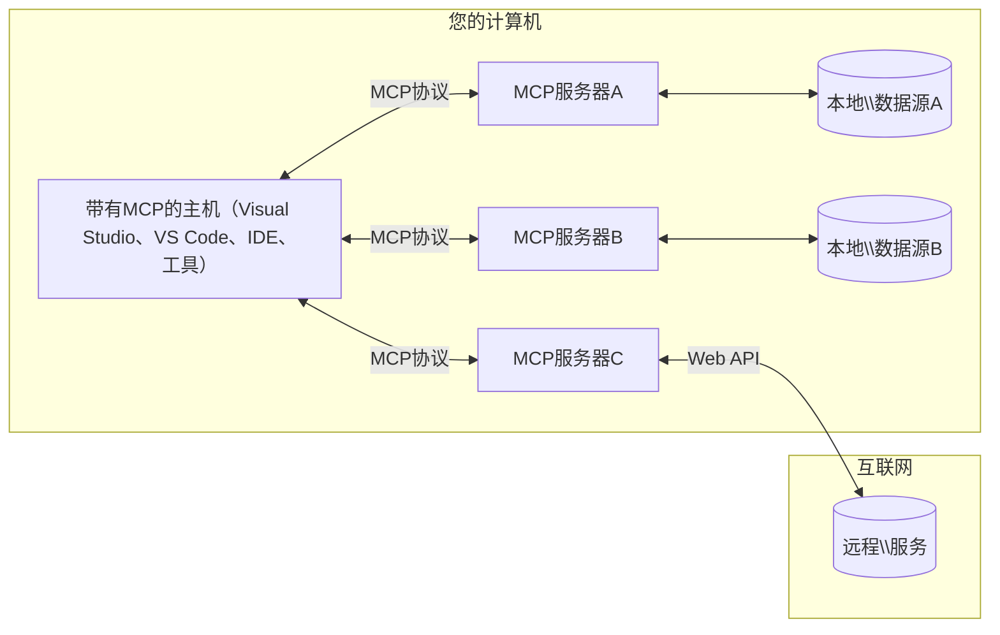

# MCP核心概念：掌握AI集成的模型上下文协议

[](https://youtu.be/earDzWGtE84)

_(点击上方图片观看本课视频)_

[模型上下文协议（Model Context Protocol，MCP）](https://github.com/modelcontextprotocol) 是一个强大且标准化的框架，优化了大型语言模型（LLM）与外部工具、应用程序和数据源之间的通信。
本指南将引导您了解MCP的核心概念。您将学习其客户端-服务器架构、关键组件、通信机制以及实现最佳实践。

- <strong>明确的用户同意</strong>：所有数据访问和操作均需在执行前获得明确的用户批准。用户必须清楚知道将访问哪些数据、将执行哪些操作，并对权限和授权进行细粒度控制。

- <strong>数据隐私保护</strong>：仅在明确同意下暴露用户数据，且在整个交互生命周期中必须通过强有力的访问控制加以保护。实现必须防止未经授权的数据传输，保持严格的隐私边界。

- <strong>工具执行安全</strong>：每次工具调用都必须经过用户明确同意，用户应清楚工具功能、参数及潜在影响。必须建立强健的安全边界，防止意外、不安全或恶意的工具执行。

- <strong>传输层安全</strong>：所有通信通道应采用适当的加密和认证机制。远程连接应实施安全传输协议和正确的凭证管理。

#### 实现指南：

- <strong>权限管理</strong>：实现细粒度权限系统，允许用户控制可访问的服务器、工具和资源
- <strong>认证与授权</strong>：使用安全认证方法（OAuth、API密钥）并正确管理令牌及其过期
- <strong>输入验证</strong>：根据定义的模式验证所有参数和数据输入，防止注入攻击
- <strong>审计日志</strong>：保持全面操作日志用于安全监控和合规

## 概述

本课程探讨构建模型上下文协议（MCP）生态系统的基础架构和组件。您将了解到客户端-服务器架构、关键组件及驱动MCP交互的通信机制。

## 关键学习目标

在本课程结束时，您将能：

- 理解MCP的客户端-服务器架构。
- 明确主机、客户端和服务器的角色和职责。
- 分析使MCP成为灵活集成层的核心特性。
- 学习信息如何在MCP生态系统中流动。
- 通过.NET、Java、Python和JavaScript代码示例获得实用见解。

## MCP架构：深入解析

MCP生态系统基于客户端-服务器模型构建。该模块化结构允许AI应用程序高效地与工具、数据库、API和上下文资源交互。让我们分解该架构的核心组件。

MCP核心遵循客户端-服务器架构，主机应用可连接多个服务器：



- **MCP主机**：如VSCode、Claude Desktop、IDE或想通过MCP访问数据的AI工具程序
- **MCP客户端**：与服务器保持一对一连接的协议客户端
- **MCP服务器**：轻量级程序，通过标准化模型上下文协议暴露特定能力
- <strong>本地数据源</strong>：您计算机上的文件、数据库和服务，MCP服务器可安全访问
- <strong>远程服务</strong>：通过互联网可访问的外部系统，MCP服务器可通过API连接

MCP协议是一个采用基于日期版本控制（格式为YYYY-MM-DD）的不断演进的标准。当前协议版本为<strong>2025-11-25</strong>。您可查看最新版本的[协议规范](https://modelcontextprotocol.io/specification/2025-11-25/)

> **展望未来：** 2026年5月发布了下一版本规范<strong>2026-07-28</strong>的候选版本，计划于2026年7月28日正式发布。该版本使协议在传输层无状态（移除`initialize`握手和会话ID），规范了扩展框架，且废弃了Roots、Sampling与Logging，采用更新模式。详情见[ MCP变化点：2026-07-28发布候选版](./mcp-2026-07-28-release-candidate.md)。

### 1. 主机（Hosts）

在模型上下文协议（MCP）中，<strong>主机</strong>是AI应用程序，它是用户与协议交互的主要接口。主机通过为每个服务器连接创建专用MCP客户端，协调并管理到多个MCP服务器的连接。主机示例如下：

- **AI应用程序**：Claude Desktop、Visual Studio Code、Claude Code
- <strong>开发环境</strong>：集成了MCP的IDE和代码编辑器
- <strong>定制应用</strong>：专用的AI代理和工具

<strong>主机</strong>是协调AI模型交互的应用。它们：

- **编排AI模型**：执行或与LLM交互，生成响应并协调AI工作流
- <strong>管理客户端连接</strong>：为每个MCP服务器连接创建并维护一个MCP客户端
- <strong>控制用户界面</strong>：处理会话流、用户交互和响应展示
- <strong>执行安全控制</strong>：控制权限、安全限制和认证
- <strong>处理用户同意</strong>：管理数据共享和工具执行的用户批准


### 2. 客户端（Clients）

<strong>客户端</strong>是核心组件，保持主机与MCP服务器之间的专用一对一连接。每个MCP客户端由主机实例化以连接特定服务器，确保有序且安全的通信渠道。多个客户端使主机能同时连接多个服务器。

<strong>客户端</strong>是主机应用内的连接器组件。它们：

- <strong>协议通信</strong>：通过JSON-RPC 2.0向服务器发送请求，包括提示和指令
- <strong>能力协商</strong>：初始化时与服务器协商支持的功能和协议版本
- <strong>工具执行</strong>：管理模型发起的工具执行请求和响应处理
- <strong>实时更新</strong>：处理服务器的通知和实时更新
- <strong>响应处理</strong>：处理和格式化服务器响应以供用户展示

### 3. 服务器（Servers）

<strong>服务器</strong>是向MCP客户端提供上下文、工具和功能的程序。它们可以本地运行（与主机同一台机器）或远程运行（外部平台），负责处理客户端请求并提供结构化响应。服务器通过标准化的模型上下文协议暴露特定功能。

<strong>服务器</strong>是提供上下文和能力的服务。它们：

- <strong>功能注册</strong>：注册并向客户端暴露可用的原语（资源、提示、工具）
- <strong>请求处理</strong>：接收并执行客户端发起的工具调用、资源请求和提示请求
- <strong>上下文提供</strong>：提供上下文信息和数据以增强模型响应
- <strong>状态管理</strong>：维护会话状态并在需要时处理有状态交互
- <strong>实时通知</strong>：向连接客户端发送能力变化和更新通知

任何人均可开发服务器，以专门功能扩展模型能力，支持本地及远程部署。

### 4. 服务器原语（Server Primitives）

在模型上下文协议（MCP）中，服务器提供三类核心<strong>原语</strong>，定义了客户端、主机和语言模型之间丰富交互的基本构建块。这些原语指定了通过协议可用的上下文信息类型和动作。

MCP服务器可暴露以下三类核心原语中的任意组合：

#### 资源（Resources）

<strong>资源</strong>是为AI应用提供上下文信息的数据源。它们代表可提升模型理解和决策的静态或动态内容：

- <strong>上下文数据</strong>：供AI模型使用的结构化信息和上下文
- <strong>知识库</strong>：文档库、文章、手册和研究论文
- <strong>本地数据源</strong>：文件、数据库和本地系统信息
- <strong>外部数据</strong>：API响应、网络服务和远程系统数据
- <strong>动态内容</strong>：基于外部条件实时更新的数据

资源通过URI标识，支持通过`resources/list`发现和通过`resources/read`检索：

```text
file://documents/project-spec.md
database://production/users/schema
api://weather/current
```

#### 提示（Prompts）

<strong>提示</strong>是可重用的模板，有助于结构化与语言模型的交互。它们提供标准化的交互模式和模板化工作流：

- <strong>基于模板的交互</strong>：预先结构化的消息和对话启动器
- <strong>工作流模板</strong>：常见任务和交互的标准化序列
- <strong>少样本示例</strong>：用于模型指令的示例模板
- <strong>系统提示</strong>：定义模型行为和上下文的基础提示
- <strong>动态模板</strong>：基于参数可适应特定上下文的提示

提示支持变量替换，可通过`prompts/list`发现，通过`prompts/get`获取：

```markdown
Generate a {{task_type}} for {{product}} targeting {{audience}} with the following requirements: {{requirements}}
```

#### 工具（Tools）

<strong>工具</strong>是AI模型可调用以执行特定操作的可执行函数。它们是MCP生态系统中的“动词”，使模型能够与外部系统交互：

- <strong>可执行函数</strong>：模型可用特定参数调用的离散操作
- <strong>外部系统集成</strong>：API调用、数据库查询、文件操作、计算
- <strong>唯一标识</strong>：每个工具拥有独特名称、描述和参数模式
- **结构化输入/输出**：工具接受验证参数并返回结构化、类型化响应
- <strong>执行能力</strong>：使模型能执行真实世界操作并获取实时数据

工具采用JSON Schema定义参数验证，支持通过`tools/list`发现，并通过`tools/call`调用。工具还能包含用于更好UI展示的<strong>图标</strong>等附加元数据。

<strong>工具注释</strong>：支持行为注释（如`readOnlyHint`、`destructiveHint`），描述工具是否只读或破坏性，帮助客户端做出执行决策。

工具定义示例：

```typescript
server.tool(
  "search_products", 
  {
    query: z.string().describe("Search query for products"),
    category: z.string().optional().describe("Product category filter"),
    max_results: z.number().default(10).describe("Maximum results to return")
  }, 
  async (params) => {
    // 执行搜索并返回结构化结果
    return await productService.search(params);
  }
);
```

## 客户端原语

在模型上下文协议（MCP）中，<strong>客户端</strong>可暴露原语，使服务器能够向主机应用请求额外能力。这些客户端侧的原语支持更丰富、更交互的服务器实现，可访问AI模型能力和用户交互。

### 采样（Sampling）

> **废弃通知：** `2026-07-28`发布候选版标志采样被废弃，推荐直接集成LLM提供商API。该功能在`2025-11-25`版本及废弃后至少一年内仍可使用，但新设计应采用替代方案。详见[ MCP变化点：2026-07-28发布候选版](./mcp-2026-07-28-release-candidate.md)。

<strong>采样</strong>允许服务器从客户端的AI应用请求语言模型完成。该原语使服务器能不嵌入自身模型依赖而访问LLM能力：

- <strong>模型无关访问</strong>：服务器可请求完成，无需包含LLM SDK或管理模型访问
- **服务器发起AI**：服务器可自主使用客户端模型生成内容
- **递归LLM交互**：支持服务器需要AI辅助处理的复杂场景
- <strong>动态内容生成</strong>：使服务器利用主机模型创建上下文响应
- <strong>工具调用支持</strong>：服务器可通过`tools`和`toolChoice`参数使客户端模型在采样时调用工具

采样通过`sampling/complete`方法发起，服务器向客户端发送完成请求。

### 根（Roots）

> **废弃通知：** `2026-07-28`发布候选版标志根被废弃，推荐使用工具参数、资源URI或服务器配置替代。该功能在`2025-11-25`版本及废弃后至少一年内仍可使用。详见[ MCP变化点：2026-07-28发布候选版](./mcp-2026-07-28-release-candidate.md)。

<strong>根</strong>为客户端提供了一种标准化方式，向服务器暴露文件系统边界，帮助服务器了解其可访问的目录和文件：

- <strong>文件系统边界</strong>：定义服务器在文件系统中操作的边界
- <strong>访问控制</strong>：帮助服务器了解其拥有权限访问的目录和文件
- <strong>动态更新</strong>：客户端可在根列表变更时通知服务器
- **基于URI标识**：根使用`file://` URI标识可访问的目录和文件

根通过`roots/list`方法发现，客户端在根列表变更时发送`notifications/roots/list_changed`通知。

### 诱导（Elicitation）

<strong>诱导</strong>使服务器能够通过客户端界面请求用户提供额外信息或确认：

- <strong>用户输入请求</strong>：服务器在需要工具执行时请求更多信息
- <strong>确认对话框</strong>：请求用户批准敏感或重要操作
- <strong>交互式工作流</strong>：使服务器能创建分步骤的用户交互
- <strong>动态参数收集</strong>：在工具执行期间收集缺失或可选参数

诱导请求通过`elicitation/request`方法发起，通过客户端界面收集用户输入。

**URL模式诱导**：服务器还可请求基于URL的用户交互，允许服务器引导用户访问外部网页以进行认证、确认或数据输入。

### 日志记录


> **弃用通知：** `2026-07-28` 版本候选标记Logging为弃用，推荐使用 `stderr` 作为stdio传输方式和OpenTelemetry进行结构化可观测性。它会在 `2025-11-25` 版本及任何弃用后至少一年内继续有效。详情请参见 [MCP变更：2026-07-28 版本候选](./mcp-2026-07-28-release-candidate.md)。

**Logging** 允许服务器向客户端发送结构化日志消息，便于调试、监控和运行时可见性：

- <strong>调试支持</strong>：使服务器能够提供详细的执行日志以进行故障排除
- <strong>运行监控</strong>：向客户端发送状态更新和性能指标
- <strong>错误报告</strong>：提供详细的错误上下文和诊断信息
- <strong>审计跟踪</strong>：创建服务器操作和决策的全面日志

Logging 消息发送给客户端，以提供对服务器操作的透明度并促进调试。

## MCP中的信息流

模型上下文协议（MCP）定义了主机、客户端、服务器和模型之间结构化的信息流。理解此流程有助于澄清用户请求如何被处理，以及外部工具和数据如何集成到模型响应中。

- <strong>主机发起连接</strong>  
  主机应用（例如IDE或聊天界面）通过STDIO、WebSocket或其他支持的传输方式建立与MCP服务器的连接。

- <strong>功能协商</strong>  
  客户端（嵌入在主机中）和服务器交换关于其支持的功能、工具、资源和协议版本的信息，确保双方理解会话可用的能力。

- <strong>用户请求</strong>  
  用户与主机进行交互（例如输入提示或命令）。主机收集此输入并传递给客户端处理。

- <strong>资源或工具使用</strong>  
  - 客户端可能向服务器请求额外上下文或资源（如文件、数据库条目或知识库文章）以丰富模型理解。
  - 如果模型判断需要调用工具（例如获取数据、执行计算或调用API），客户端发送工具调用请求给服务器，指定工具名称和参数。

- <strong>服务器执行</strong>  
  服务器接收资源或工具请求，执行必要操作（如运行函数、查询数据库或检索文件），并以结构化格式将结果返回给客户端。

- <strong>响应生成</strong>  
  客户端将服务器响应（资源数据、工具输出等）集成到进行中的模型交互中。模型利用这些信息生成全面且语境相关的响应。

- <strong>结果呈现</strong>  
  主机从客户端接收最终输出并呈现给用户，通常包括模型生成的文本以及任何工具执行或资源查询的结果。

此流程使MCP能够通过无缝连接模型与外部工具和数据源，支持先进、交互式和语境感知的AI应用。

## 协议架构与层级

MCP由两个不同的架构层组成，共同提供完整的通信框架：

### 数据层

<strong>数据层</strong> 使用 **JSON-RPC 2.0** 作为基础实现核心MCP协议。该层定义消息结构、语义和交互模式：

#### 核心组件：

- **JSON-RPC 2.0 协议**：所有通信使用标准化的JSON-RPC 2.0消息格式进行方法调用、响应和通知
- <strong>生命周期管理</strong>：处理客户端和服务器之间的连接初始化、功能协商和会话终止
- <strong>服务器原语</strong>：使服务器通过工具、资源和提示提供核心功能
- <strong>客户端原语</strong>：使服务器能够请求LLM采样、引导用户输入并发送日志消息
- <strong>实时通知</strong>：支持无需轮询的异步通知实现动态更新

#### 关键特性：

- <strong>协议版本协商</strong>：使用基于日期的版本控制（YYYY-MM-DD）确保兼容性
- <strong>功能发现</strong>：客户端和服务器在初始化时交换支持的功能信息
- <strong>有状态会话</strong>：维护多个交互间的连接状态以保证上下文连续性

### 传输层

<strong>传输层</strong> 管理MCP参与者之间的通信通道、消息分帧和认证：

#### 支持的传输机制：

1. **STDIO传输**：
   - 使用标准输入/输出流进行进程间直接通信
   - 适用于同一台机器上的本地进程，无网络开销
   - 常用于本地MCP服务器实现

2. **可流式HTTP传输**：
   - 使用HTTP POST实现客户端到服务器的消息传输  
   - 可选使用服务器发送事件（SSE）实现服务器对客户端的流式传输
   - 支持跨网络的远程服务器通信
   - 支持标准HTTP认证（Bearer令牌、API密钥、自定义头）
   - MCP推荐使用OAuth进行安全的基于令牌认证

#### 传输抽象：

传输层对通信细节进行抽象，使数据层能够统一使用JSON-RPC 2.0消息格式。该抽象允许应用程序无缝切换本地和远程服务器。

### 安全考量

MCP实现必须遵守若干关键安全原则，确保协议所有操作的安全、可信和可靠交互：

- <strong>用户同意与控制</strong>：必须在访问任何数据或执行操作前取得用户明确同意。用户应能清楚控制共享的数据和授权的操作，提供直观的UI以审查和批准活动。

- <strong>数据隐私</strong>：用户数据仅在明确同意下暴露，必须通过适当的访问控制保护。MCP实施必须防止未经授权的数据传输，确保交互全程隐私得到维护。

- <strong>工具安全</strong>：调用任何工具前必须获得用户明确同意。用户应清楚了解每个工具的功能，并严格执行安全边界，防止意外或不安全的工具执行。

遵循这些安全原则，MCP确保在实现强大AI集成能力的同时，维护用户信任、隐私和安全。

## 代码示例：关键组件

以下列出多个流行编程语言的代码示例，演示如何实现关键的MCP服务器组件和工具。

### .NET示例：创建带工具的简单MCP服务器

下面是一个实用的.NET代码示例，展示如何实现带有自定义工具的简单MCP服务器。示例演示了如何定义和注册工具、处理请求以及使用模型上下文协议连接服务器。

```csharp
using System;
using System.Threading.Tasks;
using ModelContextProtocol.Server;
using ModelContextProtocol.Server.Transport;
using ModelContextProtocol.Server.Tools;

public class WeatherServer
{
    public static async Task Main(string[] args)
    {
        // Create an MCP server
        var server = new McpServer(
            name: "Weather MCP Server",
            version: "1.0.0"
        );
        
        // Register our custom weather tool
        server.AddTool<string, WeatherData>("weatherTool", 
            description: "Gets current weather for a location",
            execute: async (location) => {
                // Call weather API (simplified)
                var weatherData = await GetWeatherDataAsync(location);
                return weatherData;
            });
        
        // Connect the server using stdio transport
        var transport = new StdioServerTransport();
        await server.ConnectAsync(transport);
        
        Console.WriteLine("Weather MCP Server started");
        
        // Keep the server running until process is terminated
        await Task.Delay(-1);
    }
    
    private static async Task<WeatherData> GetWeatherDataAsync(string location)
    {
        // This would normally call a weather API
        // Simplified for demonstration
        await Task.Delay(100); // Simulate API call
        return new WeatherData { 
            Temperature = 72.5,
            Conditions = "Sunny",
            Location = location
        };
    }
}

public class WeatherData
{
    public double Temperature { get; set; }
    public string Conditions { get; set; }
    public string Location { get; set; }
}
```

### Java示例：MCP服务器组件

此示例展示了与上面的.NET示例相同的MCP服务器和工具注册，但用Java实现。

```java
import io.modelcontextprotocol.server.McpServer;
import io.modelcontextprotocol.server.McpToolDefinition;
import io.modelcontextprotocol.server.transport.StdioServerTransport;
import io.modelcontextprotocol.server.tool.ToolExecutionContext;
import io.modelcontextprotocol.server.tool.ToolResponse;

public class WeatherMcpServer {
    public static void main(String[] args) throws Exception {
        // 创建一个 MCP 服务器
        McpServer server = McpServer.builder()
            .name("Weather MCP Server")
            .version("1.0.0")
            .build();
            
        // 注册天气工具
        server.registerTool(McpToolDefinition.builder("weatherTool")
            .description("Gets current weather for a location")
            .parameter("location", String.class)
            .execute((ToolExecutionContext ctx) -> {
                String location = ctx.getParameter("location", String.class);
                
                // 获取天气数据（简化版）
                WeatherData data = getWeatherData(location);
                
                // 返回格式化的响应
                return ToolResponse.content(
                    String.format("Temperature: %.1f°F, Conditions: %s, Location: %s", 
                    data.getTemperature(), 
                    data.getConditions(), 
                    data.getLocation())
                );
            })
            .build());
        
        // 使用 stdio 传输连接服务器
        try (StdioServerTransport transport = new StdioServerTransport()) {
            server.connect(transport);
            System.out.println("Weather MCP Server started");
            // 保持服务器运行直到进程终止
            Thread.currentThread().join();
        }
    }
    
    private static WeatherData getWeatherData(String location) {
        // 实现将调用天气 API
        // 为示例目的简化处理
        return new WeatherData(72.5, "Sunny", location);
    }
}

class WeatherData {
    private double temperature;
    private String conditions;
    private String location;
    
    public WeatherData(double temperature, String conditions, String location) {
        this.temperature = temperature;
        this.conditions = conditions;
        this.location = location;
    }
    
    public double getTemperature() {
        return temperature;
    }
    
    public String getConditions() {
        return conditions;
    }
    
    public String getLocation() {
        return location;
    }
}
```

### Python示例：构建MCP服务器

此示例使用fastmcp，请确保先安装它：

```python
pip install fastmcp
```
代码示例：

```python
#!/usr/bin/env python3
import asyncio
from fastmcp import FastMCP
from fastmcp.transports.stdio import serve_stdio

# 创建一个 FastMCP 服务器
mcp = FastMCP(
    name="Weather MCP Server",
    version="1.0.0"
)

@mcp.tool()
def get_weather(location: str) -> dict:
    """Gets current weather for a location."""
    return {
        "temperature": 72.5,
        "conditions": "Sunny",
        "location": location
    }

# 使用类的替代方法
class WeatherTools:
    @mcp.tool()
    def forecast(self, location: str, days: int = 1) -> dict:
        """Gets weather forecast for a location for the specified number of days."""
        return {
            "location": location,
            "forecast": [
                {"day": i+1, "temperature": 70 + i, "conditions": "Partly Cloudy"}
                for i in range(days)
            ]
        }

# 注册类工具
weather_tools = WeatherTools()

# 启动服务器
if __name__ == "__main__":
    asyncio.run(serve_stdio(mcp))
```

### JavaScript示例：创建MCP服务器

此示例展示了JavaScript中MCP服务器的创建及如何注册两个与天气相关的工具。

```javascript
// 使用官方的模型上下文协议 SDK
import { McpServer } from "@modelcontextprotocol/sdk/server/mcp.js";
import { StdioServerTransport } from "@modelcontextprotocol/sdk/server/stdio.js";
import { z } from "zod"; // 用于参数验证

// 创建一个 MCP 服务器
const server = new McpServer({
  name: "Weather MCP Server",
  version: "1.0.0"
});

// 定义一个天气工具
server.tool(
  "weatherTool",
  {
    location: z.string().describe("The location to get weather for")
  },
  async ({ location }) => {
    // 这通常会调用天气 API
    // 为演示简化
    const weatherData = await getWeatherData(location);
    
    return {
      content: [
        { 
          type: "text", 
          text: `Temperature: ${weatherData.temperature}°F, Conditions: ${weatherData.conditions}, Location: ${weatherData.location}` 
        }
      ]
    };
  }
);

// 定义一个预报工具
server.tool(
  "forecastTool",
  {
    location: z.string(),
    days: z.number().default(3).describe("Number of days for forecast")
  },
  async ({ location, days }) => {
    // 这通常会调用天气 API
    // 为演示简化
    const forecast = await getForecastData(location, days);
    
    return {
      content: [
        { 
          type: "text", 
          text: `${days}-day forecast for ${location}: ${JSON.stringify(forecast)}` 
        }
      ]
    };
  }
);

// 辅助函数
async function getWeatherData(location) {
  // 模拟 API 调用
  return {
    temperature: 72.5,
    conditions: "Sunny",
    location: location
  };
}

async function getForecastData(location, days) {
  // 模拟 API 调用
  return Array.from({ length: days }, (_, i) => ({
    day: i + 1,
    temperature: 70 + Math.floor(Math.random() * 10),
    conditions: i % 2 === 0 ? "Sunny" : "Partly Cloudy"
  }));
}

// 使用 stdio 传输连接服务器
const transport = new StdioServerTransport();
server.connect(transport).catch(console.error);

console.log("Weather MCP Server started");
```

该JavaScript示例演示了如何使用模型上下文协议SDK创建MCP服务器。它展示了如何注册名为`weatherTool`和`forecastTool`的两个工具，并通过`StdioServerTransport`使其对MCP客户端可用。

## 安全与授权

MCP包含若干内置概念和机制，用于管理协议中的安全和授权：

1. <strong>工具权限控制</strong>：  
  客户端可指定模型在会话期间允许使用的工具，确保只有明确授权的工具可用，降低非预期或不安全操作的风险。权限可根据用户偏好、组织策略或交互上下文动态配置。

2. <strong>认证</strong>：  
  服务器可要求认证以授予工具、资源或敏感操作的访问权限，可能涉及API密钥、OAuth令牌或其他认证方案。适当认证确保只有可信客户端和用户可调用服务器端功能。

3. <strong>验证</strong>：  
  所有工具调用均强制参数验证。每个工具定义其参数的预期类型、格式和限制，服务器据此验证请求，防止错误或恶意输入影响工具实现，保障操作完整性。

4. <strong>速率限制</strong>：  
  为防止滥用并确保公平使用服务器资源，MCP服务器可对工具调用和资源访问实现速率限制。速率限制可按用户、会话或全局施加，帮助抵御拒绝服务攻击或过度资源消耗。

通过结合这些机制，MCP为语言模型与外部工具和数据源的集成提供安全基础，同时赋予用户和开发者细粒度的访问和使用控制。

## 协议消息与通信流程

MCP通信使用结构化的<strong>JSON-RPC 2.0</strong>消息，促进主机、客户端和服务器之间清晰可靠的交互。协议定义不同操作类型的特定消息模式：

### 核心消息类型：

#### <strong>初始化消息</strong>
- **`initialize` 请求**：建立连接并协商协议版本和功能
- **`initialize` 响应**：确认支持的功能和服务器信息  
- **`notifications/initialized`**：表示初始化完成，且会话准备就绪

#### <strong>发现消息</strong>
- **`tools/list` 请求**：发现服务器可用的工具
- **`resources/list` 请求**：列出可用资源（数据源）
- **`prompts/list` 请求**：获取可用的提示模板

#### <strong>执行消息</strong>  
- **`tools/call` 请求**：使用提供的参数执行指定工具
- **`resources/read` 请求**：检索特定资源的内容
- **`prompts/get` 请求**：获取带可选参数的提示模板

#### <strong>客户端消息</strong>
- **`sampling/complete` 请求**：服务器请求客户端执行LLM完成
- **`elicitation/request`**：服务器请求客户端界面引导用户输入
- **Logging消息**：服务器向客户端发送结构化日志消息

#### <strong>通知消息</strong>
- **`notifications/tools/list_changed`**：服务器通知客户端工具列表发生变化
- **`notifications/resources/list_changed`**：服务器通知客户端资源列表发生变化  
- **`notifications/prompts/list_changed`**：服务器通知客户端提示列表发生变化

### 消息结构：

所有MCP消息遵循JSON-RPC 2.0格式：
- <strong>请求消息</strong>：包含 `id`、`method` 和可选的 `params`
- <strong>响应消息</strong>：包含 `id` 和 `result` 或 `error`  
- <strong>通知消息</strong>：包含 `method` 和可选的 `params`（无 `id`，不期待响应）

这种结构化通信保证可靠、可追踪且可扩展的交互，支持实时更新、工具链和健壮的错误处理等高级场景。

### 任务（实验性）

> **展望未来：** `2026-07-28` 版本候选将任务（Tasks）从实验核心规范毕业，成为专用任务扩展，生命周期重新设计（`tasks/get`，`tasks/update`，`tasks/cancel`；移除`tasks/list`）。如果您基于下面描述的实验API构建，请计划迁移。详情请参见 [MCP变更：2026-07-28 版本候选](./mcp-2026-07-28-release-candidate.md)。

<strong>任务</strong> 是一项实验功能，提供持久执行包装器，支持对MCP请求的延迟结果检索及状态跟踪：

- <strong>长时间运行操作</strong>：跟踪耗时计算、工作流自动化和批处理
- <strong>延迟结果</strong>：轮询任务状态，操作完成后检索结果
- <strong>状态跟踪</strong>：通过定义的生命周期状态监控任务进展
- <strong>多步骤操作</strong>：支持跨多个交互的复杂工作流

任务包装标准MCP请求，实现不能立即完成操作的异步执行模式。

## 关键要点

- <strong>架构</strong>：MCP采用客户端-服务器架构，主机管理多个客户端与服务器的连接
- <strong>参与者</strong>：生态包含主机（AI应用）、客户端（协议连接器）和服务器（能力提供者）
- <strong>传输机制</strong>：通信支持STDIO（本地）和可流式HTTP带可选SSE（远程）
- <strong>核心原语</strong>：服务器公开工具（可执行函数）、资源（数据源）和提示（模板）
- <strong>客户端原语</strong>：服务器可请求采样（支持工具调动的LLM完成）、引导（包括URL模式的用户输入）、根目录（文件系统边界）和日志
- <strong>实验特性</strong>：任务为长时间运行操作提供持久执行包装器
- <strong>协议基础</strong>：基于JSON-RPC 2.0且采用基于日期的版本控制（当前版本：2025-11-25）
- <strong>实时能力</strong>：支持动态更新和实时同步的通知
- <strong>安全优先</strong>：明确用户同意、数据隐私保护和安全传输为核心要求

## 练习

设计一个在您的领域中有用的简单MCP工具。定义：
1. 工具名称
2. 接受的参数
3. 返回的输出
4. 模型如何使用此工具解决用户问题


---

## 接下来

下一章：[第2章：安全](../02-Security/README.md)


想知道 `2025-11-25` 之后会有什么变化吗？请阅读 [MCP 有什么变化：2026-07-28 发行候选版本](./mcp-2026-07-28-release-candidate.md)。

---

<!-- CO-OP TRANSLATOR DISCLAIMER START -->
**免责声明**：
本文件由 AI 翻译服务 [Co-op Translator](https://github.com/Azure/co-op-translator) 翻译完成。尽管我们力求准确，但请注意，自动翻译可能包含错误或不准确之处。原始语言版文件应视为权威来源。对于重要信息，建议使用专业人工翻译。我们对因使用本翻译而产生的任何误解或误释不承担责任。
<!-- CO-OP TRANSLATOR DISCLAIMER END -->