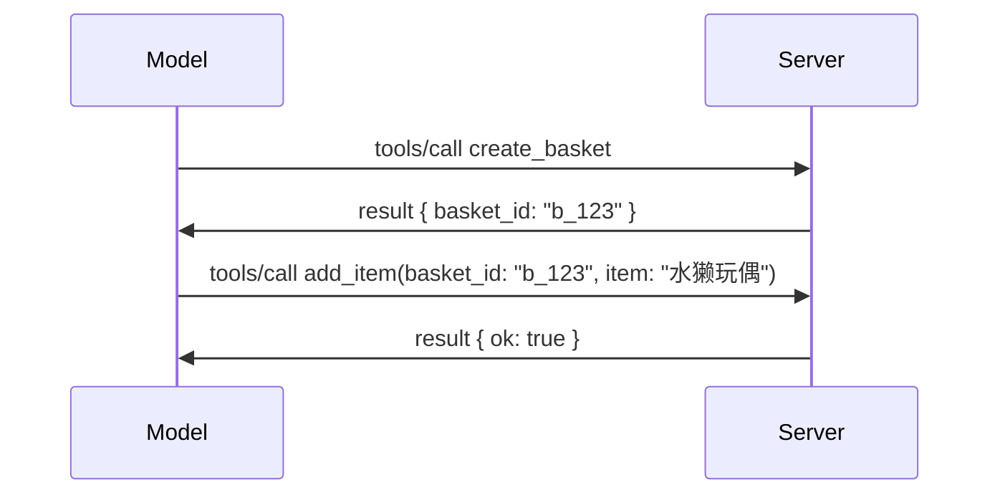

# MCP 变化内容：2026-07-28 规格发布候选版

> **状态：** 发布候选版。撰写本文时，`2026-07-28` 规格尚未定稿。它于 2026 年 5 月 21 日公布，计划于 2026 年 7 月 28 日发布。本课所有内容皆描述发布候选版；请在根据它构建前，查阅[草案规格](https://modelcontextprotocol.io/specification/draft)及其[changelog](https://modelcontextprotocol.io/specification/draft/changelog)了解最新状态。本课程其他部分基于当前稳定版本 **MCP 规格 2025-11-25** 编写，`2026-07-28` 发布后会更新。

## 概览

`2026-07-28` 是 MCP 自发布以来最大的一次修订。六个规格增强提案（SEP）移除了协议层会话，使 MCP 在传输层无状态，扩展成为一等且有版本机制的功能，并标记本课程早先学过的几个特性（Roots、Sampling、Logging）为废弃，符合新的生命周期策略。本课总结了变化内容、其重要性，以及对你已针对 `2025-11-25` 编写代码的影响。

来源：[2026-07-28 MCP 规格发布候选版](https://blog.modelcontextprotocol.io/posts/2026-07-28-release-candidate/)（Model Context Protocol 博客，作者 David Soria Parra 和 Den Delimarsky）。

## 学习目标

本课结束时，你将能够：

- 解释 MCP 为什么转向无状态协议核心以及它为横向扩展部署解决了什么问题。
- 描述 `initialize`/`initialized` 握手以及 `Mcp-Session-Id` 头如何被替代。
- 识别新的 `Mcp-Method` 和 `Mcp-Name` 头以及缓存元数据 `ttlMs`/`cacheScope`。
- 了解扩展框架及本次发布包含的两大扩展：MCP Apps 和 Tasks。
- 列出硬化 OAuth 2.0 / OIDC 对齐的六个授权 SEP。
- 识别哪些核心特性（Roots、Sampling、Logging）现为废弃状态，以及实际含义。
- 解释工具的全 JSON Schema 2020-12 支持的变化。

## 无状态协议

主要变化：MCP 在协议层变为无状态。

### 之前（2025-11-25）：会话让你只能固定使用一个服务器实例

通过 Streamable HTTP 调用工具以 `initialize` 握手开始。服务器返回带有一个 `Mcp-Session-Id` 头，每个后续请求都必须带上它：

```http
POST /mcp HTTP/1.1
Mcp-Session-Id: 1868a90c-3a3f-4f5b
Content-Type: application/json

{"jsonrpc":"2.0","id":2,"method":"tools/call",
 "params":{"name":"search","arguments":{"q":"otters"}}}
```

会话绑定至发出它的服务器实例，横向扩展部署需要负载均衡器上的<strong>粘性路由</strong>，以及实例间的<strong>共享会话存储</strong>。

### 之后（2026-07-28）：每个请求均自包含

```http
POST /mcp HTTP/1.1
MCP-Protocol-Version: 2026-07-28
Mcp-Method: tools/call
Mcp-Name: search
Content-Type: application/json

{"jsonrpc":"2.0","id":1,"method":"tools/call",
 "params":{"name":"search","arguments":{"q":"otters"},
           "_meta":{"io.modelcontextprotocol/clientInfo":{"name":"my-app","version":"1.0"}}}}
```

任何服务器实例都能处理该请求。关键变化：

- **移除 `initialize`/`initialized` 握手**（[SEP-2575](https://github.com/modelcontextprotocol/modelcontextprotocol/pull/2575)）。协议版本、客户端信息和客户端能力转入每个请求的 `_meta`。新增 `server/discover` 方法，客户端可按需提前获取服务器能力。
- **移除 `Mcp-Session-Id` 头和协议级会话**（[SEP-2567](https://github.com/modelcontextprotocol/modelcontextprotocol/pull/2567)）。协议层不再需要粘性路由和共享会话存储。

### 无状态协议，状态型应用

移除协议层会话不意味着服务器不能有状态。推荐的模式与 HTTP API 一致：在一次工具调用中生成显式句柄（如 `basket_id`、`browser_id`），模型在后续调用中以普通参数传回该句柄。



这样状态对模型来说是显式且合理的，而不是隐藏在传输元数据中，且任何服务器实例都能处理任何调用。

### 服务器向客户端请求，重构

即使是无状态协议，服务器仍需在调用中途向客户端请求内容（例如，引导提示）的方式：

- <strong>服务器发起的请求只能在服务器处理客户端请求时发出</strong>（[SEP-2260](https://github.com/modelcontextprotocol/modelcontextprotocol/pull/2260)）——从建议变成强制。不会无端打断用户。
- <strong>多轮请求</strong>（[SEP-2322](https://github.com/modelcontextprotocol/modelcontextprotocol/pull/2322)）替代持续持有 SSE 流。服务器返回 `InputRequiredResult`：

  ```json
  {
    "resultType": "inputRequired",
    "inputRequests": {
      "confirm": {
        "type": "elicitation",
        "message": "Delete 3 files?",
        "schema": { "type": "boolean" }
      }
    },
    "requestState": "eyJzdGVwIjoxLCJmaWxlcyI6WyJhIiwiYiIsImMiXX0="
  }
  ```

  客户端收集用户答复，并附带回显的 `requestState` 重发原调用。任何服务器实例都可以处理重试请求，因为所有信息都在载荷中。

### 可路由、可缓存、可追踪

三个小改动让无状态流量更易运维：

- **Streamable HTTP 请求必须带有 `Mcp-Method` 和 `Mcp-Name` 头**（[SEP-2243](https://github.com/modelcontextprotocol/modelcontextprotocol/pull/2243)），负载均衡器、网关和限流器可据此路由，无需解析 JSON 体。头和体不一致的请求会被服务器拒绝。
- **`tools/list` 和资源读取结果带有 `ttlMs` 和 `cacheScope`**（[SEP-2549](https://github.com/modelcontextprotocol/modelcontextprotocol/pull/2549)），基于 HTTP 的 `Cache-Control`。客户端知晓结果新鲜时长和是否可跨用户共享，无需长时间 SSE 流监听变更。
- **文档说明了 `_meta` 中的 W3C Trace Context 传播机制**（[SEP-414](https://github.com/modelcontextprotocol/modelcontextprotocol/pull/414)），规范了 `traceparent`、`tracestate` 和 `baggage` 键名，使分布式追踪可透过客户端 SDK、MCP 服务器和下游系统，在 [OpenTelemetry](https://opentelemetry.io/) 兼容后端追踪调用链。

## 扩展成为一等公民

扩展在 `2025-11-25` 版本是非正式的。[SEP-2133](https://github.com/modelcontextprotocol/modelcontextprotocol/pull/2133) 规范了它们：

- 扩展通过反向 DNS ID 识别。
- 客户端和服务器能力通过 `extensions` 映射协商。
- 它们独立存在于各自的 `ext-*` 仓库，由受托维护者管理，版本独立于核心规格。
- SEP 流程中新建扩展轨道，支持从实验性到正式逐步稳定。

本版本发布了两个正式扩展。

### MCP 应用：服务器渲染的用户界面

[MCP Apps](https://blog.modelcontextprotocol.io/posts/2026-01-26-mcp-apps/)（[SEP-1865](https://github.com/modelcontextprotocol/modelcontextprotocol/pull/1865)）让服务器发布交互式 HTML 界面，宿主在沙箱 iframe 中渲染。工具预声明界面模板，宿主可预取、缓存并进行安全审查。你已在[第 15 课：MCP 应用](../03-GettingStarted/15-mcp-apps/README.md)学习了相关基础——现作为扩展框架中的正式扩展，而非实验核心特性。

### 任务成为扩展

任务在 `2025-11-25` 以实验核心特性形式发布。生产使用暴露出足够多重设计需求，正确归属是扩展：[Tasks 扩展](https://github.com/modelcontextprotocol/modelcontextprotocol/pull/2663)围绕无状态模型重塑生命周期——服务器能用任务句柄回答 `tools/call`，客户端用 `tasks/get`、`tasks/update` 和 `tasks/cancel` 推动任务。任务创建由服务器控制：客户端启用扩展，服务器决定调用是否作为任务执行。因无法安全地按会话范围限定，`tasks/list` 被彻底移除。

> **迁移提示：** 如果你实现了实验性的 `2025-11-25` 任务 API，需要迁移到新扩展生命周期——它不兼容旧版本。

## 授权安全加固

六个 SEP 强化了[授权规格](https://modelcontextprotocol.io/specification/draft/basic/authorization)，更紧密对齐实际 OAuth 2.0 / OpenID Connect 部署：

| SEP | 变更 |
|---|---|
| [SEP-2468](https://github.com/modelcontextprotocol/modelcontextprotocol/pull/2468) | 客户端必须根据 [RFC 9207](https://www.rfc-editor.org/rfc/rfc9207) 验证授权响应中的 `iss` 参数，以防范 MCP 单客户端多服务器模式中常见的混淆攻击。未来版本将要求拒绝无 `iss` 响应。 |
| [SEP-837](https://github.com/modelcontextprotocol/modelcontextprotocol/pull/837) | 客户端在动态客户端注册时声明其 OpenID Connect `application_type`，避免授权服务器将桌面/CLI 客户端默认设为 `"web"` 并拒绝其 localhost 重定向 URI。 |
| [SEP-2352](https://github.com/modelcontextprotocol/modelcontextprotocol/pull/2352) | 客户端将注册凭据绑定到发出授权服务器的 `issuer`，并在资源迁移授权服务器时重新注册。 |
| [SEP-2207](https://github.com/modelcontextprotocol/modelcontextprotocol/pull/2207) | 说明如何从 OpenID Connect 风格授权服务器请求刷新令牌。 |
| [SEP-2350](https://github.com/modelcontextprotocol/modelcontextprotocol/pull/2350) | 明确提升授权期间的作用域累积逻辑。 |
| [SEP-2351](https://github.com/modelcontextprotocol/modelcontextprotocol/pull/2351) | 明确 `.well-known` 发现后缀说明。 |

如果你今天搭建 MCP 授权服务器，请立即在授权响应中提供 `iss` ——详见[02-Security](../02-Security/README.md) 中针对当前授权的指导。

## Roots、Sampling 和 Logging 已废弃

根据新[特性生命周期策略](https://github.com/modelcontextprotocol/modelcontextprotocol/pull/2577)（[SEP-2577](https://github.com/modelcontextprotocol/modelcontextprotocol/pull/2577)），你在[核心概念](./README.md#roots)学过的三个核心客户端原语，现移至<strong>废弃</strong>状态：

| 特性 | 推荐替代方案 |
|---|---|
| Roots | 工具参数、资源 URI 或服务器配置 |
| Sampling | 直接与 LLM 提供商 API 集成 |
| Logging | stdio 传输使用 `stderr`；结构化可观测性使用 OpenTelemetry |

这些是<strong>仅标注为废弃</strong>：方法、类型和能力标记在本版本及其发行后一年内的任何规格版本中继续有效。正式移除任一功能需另行 SEP 批准——因此你现有的[Sampling](../03-GettingStarted/14-sampling/README.md) 示例仍无影响，但新服务器应优先采用替代方案。

## 工具的完整 JSON Schema 2020-12 支持

工具的 `inputSchema` 和 `outputSchema` 升级到完整 [JSON Schema 2020-12](https://json-schema.org/draft/2020-12)（[SEP-2106](https://github.com/modelcontextprotocol/modelcontextprotocol/pull/2106)）：

- 输入模式保持 `type: "object"` 根约束，新增组合支持（`oneOf`、`anyOf`、`allOf`）、条件和引用（`$ref`、`$defs`）。
- 输出模式无限制，`structuredContent` 现在可以是任意 JSON 值，而非仅对象。
- 实现不得自动解析外部 `$ref` URI，应限制模式深度和校验时长（防范服务端验证模式时的拒绝服务攻击）。

此外，缺失资源的错误代码由 MCP 自定义的 `-32002` 变更为 JSON-RPC 标准的 `-32602` （参数无效）（[SEP-2164](https://github.com/modelcontextprotocol/modelcontextprotocol/pull/2164)）。如果客户端依据字面值 `-32002` 匹配错误，需要更新。

## 协议未来演进

本版本包含破坏性变更，MCP 维护者不打算将其常态化。三个治理 SEP 力图防止重复：

- <strong>特性生命周期策略</strong> 提供每个特性从激活→废弃→移除的路径，废弃和可最早移除间至少十二个月。
- <strong>扩展框架</strong> 让新能力作为可选扩展发布，并在稳定后（如果有）才进入核心规格。

- 一个标准轨道SEP在匹配的场景出现在[一致性套件](https://github.com/modelcontextprotocol/conformance)中之前，无法达到最终状态（[SEP-2484](https://github.com/modelcontextprotocol/modelcontextprotocol/pull/2484)）— 该套件也是[SDK等级系统](https://github.com/modelcontextprotocol/modelcontextprotocol/pull/1777)用于对官方SDK评分的套件。

## 发布时间线和验证

- 发布候选版于2026年5月21日冻结。
- 最终规范计划于2026年7月28日发布。
- 两者之间的十周窗口让SDK维护者和客户端实现者能够针对真实工作负载验证更改；根据[SDK等级系统](https://modelcontextprotocol.io/docs/sdk)，期望一级SDK在此期间内发布支持。
- 在[草案规范](https://modelcontextprotocol.io/specification/draft)及其[changelog](https://modelcontextprotocol.io/specification/draft/changelog)中跟踪完整的变更集。

## 本课程的意义

到目前为止你在本课程中所学的内容，目标版本为<strong>2025-11-25</strong>，这是直到`2026-07-28`发布前的当前稳定规范。具体来说：

- **Sessions和`initialize`握手**（在[核心概念](./README.md)和[课程6：HTTP流](../03-GettingStarted/06-http-streaming/README.md)中讲解）仍然按现有文档工作，但升级到兼容`2026-07-28`的SDK后，预计会被上述无状态请求模型替代。
- <strong>采样和根</strong>（同样在[核心概念](./README.md)中讲解）仍然完全可用，但已被废弃 — 新设计应优先采用上述替代方案。
- **实验性的Tasks功能**，如果你使用过，需要迁移到Tasks扩展的新生命周期。
- **MCP应用**（[课程15](../03-GettingStarted/15-mcp-apps/README.md)）在实际中不受影响；它仅仅转移到了正式的扩展框架下。

## 补充资源

- [2026-07-28 MCP规范发布候选版（博客文章）](https://blog.modelcontextprotocol.io/posts/2026-07-28-release-candidate/)
- [MCP传输的未来](https://blog.modelcontextprotocol.io/posts/2025-12-19-mcp-transport-future/)
- [MCP草案规范](https://modelcontextprotocol.io/specification/draft)
- [MCP草案更新日志](https://modelcontextprotocol.io/specification/draft/changelog)
- [SEP指南](https://modelcontextprotocol.io/community/sep-guidelines)
- [MCP SDK等级系统](https://modelcontextprotocol.io/docs/sdk)

## 下一步

返回[核心概念](./README.md)或继续到[安全](../02-Security/README.md)查看今天的`2025-11-25`指导如何映射到未来版本。

---

<!-- CO-OP TRANSLATOR DISCLAIMER START -->
**免责声明**：
本文件由 AI 翻译服务 [Co-op Translator](https://github.com/Azure/co-op-translator) 翻译完成。尽管我们力求准确，但请注意，自动翻译可能包含错误或不准确之处。原始语言版文件应视为权威来源。对于重要信息，建议使用专业人工翻译。我们对因使用本翻译而产生的任何误解或误释不承担责任。
<!-- CO-OP TRANSLATOR DISCLAIMER END -->