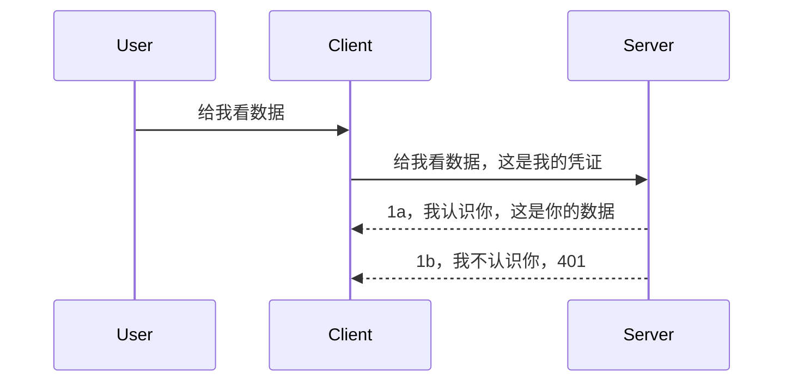

# 简单身份验证

MCP SDK 支持使用 OAuth 2.1，公平地说，这个过程相当复杂，涉及身份验证服务器、资源服务器、提交凭据、获取代码、用代码换取承载令牌，直到最终获得资源数据等概念。如果你不熟悉 OAuth，这本是一个很棒的实现方案，那么先从一些基础的身份验证开始，并逐步构建更好更安全的方案是个不错的主意。这就是本章存在的原因，带你深入理解更高级的身份验证。

## 身份验证，我们指的是什么？

身份验证是 authentication 和 authorization 的缩写。我们的目标是完成两件事情：

- **Authentication** ：这是确定是否允许某人进入我们“房子”的过程，也就是确认他们有权“在此”，即访问我们 MCP 服务器功能所在的资源服务器的过程。
- **Authorization** ：这是确认用户是否应当访问他们请求的具体资源的过程，例如这些订单、这些产品，或者他们是否有权限读取内容但不能删除，作为另一种示例。

## 凭据：我们如何告诉系统我们是谁

大多数 Web 开发者习惯于向服务器提供凭据，通常是一个秘密，用来表明他们是否被允许访问（即身份验证）。这个凭据通常是用户名和密码的 base64 编码形式，或者唯一标识某个用户的 API 密钥。

这通常通过一个名为 "Authorization" 的头部发送，格式如下：

```json
{ "Authorization": "secret123" }
```

这通常被称为基本身份验证（basic authentication）。整体流程如下：



理解了流程之后，我们如何实现呢？大多数 Web 服务器都有中间件（middleware）这个概念，它是请求部分执行的代码，可以验证凭据，如果凭据有效就放行请求。如果请求没有有效凭据，则返回身份验证错误。来看一个实现示例：

**Python**

```python
class AuthMiddleware(BaseHTTPMiddleware):
    async def dispatch(self, request, call_next):

        has_header = request.headers.get("Authorization")
        if not has_header:
            print("-> Missing Authorization header!")
            return Response(status_code=401, content="Unauthorized")

        if not valid_token(has_header):
            print("-> Invalid token!")
            return Response(status_code=403, content="Forbidden")

        print("Valid token, proceeding...")
       
        response = await call_next(request)
        # 添加任何客户头或以某种方式更改响应
        return response


starlette_app.add_middleware(CustomHeaderMiddleware)
```

这里我们：

- 创建了一个名为 `AuthMiddleware` 的中间件，其 `dispatch` 方法被 Web 服务器调用。
- 把中间件添加到 Web 服务器：

    ```python
    starlette_app.add_middleware(AuthMiddleware)
    ```

- 编写了验证逻辑，检查是否存在 Authorization 头部及其秘密是否有效：

    ```python
    has_header = request.headers.get("Authorization")
    if not has_header:
        print("-> Missing Authorization header!")
        return Response(status_code=401, content="Unauthorized")

    if not valid_token(has_header):
        print("-> Invalid token!")
        return Response(status_code=403, content="Forbidden")
    ```

    如果秘密存在且有效，则通过调用 `call_next` 放行请求并返回响应。

    ```python
    response = await call_next(request)
    # 添加任何客户标头或以某种方式更改响应
    return response
    ```

工作原理是：当有 Web 请求发送到服务器时，中间件被调用，根据实现要么放行请求，要么返回错误，说明客户端不允许继续操作。

**TypeScript**

在这里，我们使用流行的 Express 框架创建了一个中间件，在请求到达 MCP Server 之前拦截它。代码如下：

```typescript
function isValid(secret) {
    return secret === "secret123";
}

app.use((req, res, next) => {
    // 1. 有授权头吗？
    if(!req.headers["Authorization"]) {
        res.status(401).send('Unauthorized');
    }
    
    let token = req.headers["Authorization"];

    // 2. 检查有效性。
    if(!isValid(token)) {
        res.status(403).send('Forbidden');
    }

   
    console.log('Middleware executed');
    // 3. 将请求传递到请求管道中的下一步。
    next();
});
```

该代码中：

1. 首先检查是否存在 Authorization 头部，如果没有，发送 401 错误。
2. 确保凭据/令牌有效，否则发送 403 错误。
3. 最后将请求继续传递，返回请求的资源。

## 练习：实现身份验证

现在让我们应用所学尝试实现身份验证，计划如下：

服务器

- 创建一个 Web 服务器和 MCP 实例。
- 为服务器实现中间件。

客户端

- 通过头部发送带凭证的 Web 请求。

### -1- 创建 Web 服务器和 MCP 实例

> **前瞻:** 下方的 TypeScript 示例根据 **MCP 规范 2025-11-25** 通过 `mcp-session-id` 键维护 HTTP 传输映射 `transports`。`2026-07-28` 版本候选移除了 `initialize` 握手和会话 ID，因此该每会话传输映射将被无状态且自包含的请求所替代。详情见 [MCP 的变更：2026-07-28 版本候选](../../01-CoreConcepts/mcp-2026-07-28-release-candidate.md)。

第一步，我们需要创建 Web 服务器实例和 MCP Server。

**Python**

这里创建一个 MCP 服务器实例，创建一个 starlette Web 应用，并通过 uvicorn 托管它。

```python
# 创建MCP服务器

app = FastMCP(
    name="MCP Resource Server",
    instructions="Resource Server that validates tokens via Authorization Server introspection",
    host=settings["host"],
    port=settings["port"],
    debug=True
)

# 创建starlette网络应用
starlette_app = app.streamable_http_app()

# 通过uvicorn提供应用服务
async def run(starlette_app):
    import uvicorn
    config = uvicorn.Config(
            starlette_app,
            host=app.settings.host,
            port=app.settings.port,
            log_level=app.settings.log_level.lower(),
        )
    server = uvicorn.Server(config)
    await server.serve()

run(starlette_app)
```

代码中：

- 创建 MCP Server。
- 从 MCP Server 构造 starlette Web 应用，`app.streamable_http_app()`。
- 使用 uvicorn 托管并服务 Web 应用 `server.serve()`。

**TypeScript**

这里创建一个 MCP Server 实例。

```typescript
const server = new McpServer({
      name: "example-server",
      version: "1.0.0"
    });

    // ... 设置服务器资源、工具和提示 ...
```

这个 MCP Server 的创建需要放在我们的 POST /mcp 路由定义中，所以我们将上面代码移到这里：

```typescript
import express from "express";
import { randomUUID } from "node:crypto";
import { McpServer } from "@modelcontextprotocol/sdk/server/mcp.js";
import { StreamableHTTPServerTransport } from "@modelcontextprotocol/sdk/server/streamableHttp.js";
import { isInitializeRequest } from "@modelcontextprotocol/sdk/types.js"

const app = express();
app.use(express.json());

// 用于按会话ID存储传输的映射
const transports: { [sessionId: string]: StreamableHTTPServerTransport } = {};

// 处理客户端到服务器的POST请求
app.post('/mcp', async (req, res) => {
  // 检查是否存在会话ID
  const sessionId = req.headers['mcp-session-id'] as string | undefined;
  let transport: StreamableHTTPServerTransport;

  if (sessionId && transports[sessionId]) {
    // 重用现有传输
    transport = transports[sessionId];
  } else if (!sessionId && isInitializeRequest(req.body)) {
    // 新的初始化请求
    transport = new StreamableHTTPServerTransport({
      sessionIdGenerator: () => randomUUID(),
      onsessioninitialized: (sessionId) => {
        // 按会话ID存储传输
        transports[sessionId] = transport;
      },
      // DNS重绑定保护默认禁用以保持向后兼容性。如果您在本地运行此服务器
      // 请确保设置：
      // enableDnsRebindingProtection: true,
      // allowedHosts: ['127.0.0.1'],
    });

    // 关闭时清理传输
    transport.onclose = () => {
      if (transport.sessionId) {
        delete transports[transport.sessionId];
      }
    };
    const server = new McpServer({
      name: "example-server",
      version: "1.0.0"
    });

    // ... 设置服务器资源、工具和提示 ...

    // 连接到MCP服务器
    await server.connect(transport);
  } else {
    // 无效请求
    res.status(400).json({
      jsonrpc: '2.0',
      error: {
        code: -32000,
        message: 'Bad Request: No valid session ID provided',
      },
      id: null,
    });
    return;
  }

  // 处理请求
  await transport.handleRequest(req, res, req.body);
});

// 可重用的GET和DELETE请求处理程序
const handleSessionRequest = async (req: express.Request, res: express.Response) => {
  const sessionId = req.headers['mcp-session-id'] as string | undefined;
  if (!sessionId || !transports[sessionId]) {
    res.status(400).send('Invalid or missing session ID');
    return;
  }
  
  const transport = transports[sessionId];
  await transport.handleRequest(req, res);
};

// 处理通过SSE进行的服务器到客户端通知的GET请求
app.get('/mcp', handleSessionRequest);

// 处理会话终止的DELETE请求
app.delete('/mcp', handleSessionRequest);

app.listen(3000);
```

这样你会看到 MCP Server 创建是在 `app.post("/mcp")` 里面。

接下来我们创建中间件以验证传入凭据。

### -2- 为服务器实现中间件

下面进入中间件部分。我们将创建一个中间件，检查 `Authorization` 头部中的凭证并验证它。如果接受则请求继续执行（例如列出工具、读取资源或执行客户端请求的 MCP 功能）。

**Python**

创建中间件需要继承 `BaseHTTPMiddleware` 类，有两个重要参数：

- 请求参数 `request`，我们从中读取头信息。
- `call_next` 回调，如果客户端凭据被接受，我们调用它。

先处理缺失 `Authorization` 头部的情况：

```python
has_header = request.headers.get("Authorization")

# 没有头部，返回401错误，否则继续。
if not has_header:
    print("-> Missing Authorization header!")
    return Response(status_code=401, content="Unauthorized")
```

这里发送 401 未授权消息，因为客户端身份验证失败。

如果提交了凭据，我们验证其有效性：

```python
 if not valid_token(has_header):
    print("-> Invalid token!")
    return Response(status_code=403, content="Forbidden")
```

上面发送了 403 禁止访问消息。下面是完整的中间件代码，包括上述所有逻辑：

```python
class AuthMiddleware(BaseHTTPMiddleware):
    async def dispatch(self, request, call_next):

        has_header = request.headers.get("Authorization")
        if not has_header:
            print("-> Missing Authorization header!")
            return Response(status_code=401, content="Unauthorized")

        if not valid_token(has_header):
            print("-> Invalid token!")
            return Response(status_code=403, content="Forbidden")

        print("Valid token, proceeding...")
        print(f"-> Received {request.method} {request.url}")
        response = await call_next(request)
        response.headers['Custom'] = 'Example'
        return response

```

很好，那么 `valid_token` 函数呢？代码如下：

```python
# 不要用于生产环境 - 需要改进！！
def valid_token(token: str) -> bool:
    # 删除 "Bearer " 前缀
    if token.startswith("Bearer "):
        token = token[7:]
        return token == "secret-token"
    return False
```

这个函数显然还可以改进。

重要：你绝不应该把秘密写死在代码里。理想情况下，应从数据源或身份服务提供者（IDP）获取比较值，或者更好由 IDP 进行验证。

**TypeScript**

使用 Express 实现时，我们调用 `use` 方法，接收中间件函数。

我们需要：

- 访问请求变量，检查 `Authorization` 中传递的凭证。
- 验证凭证，若有效允许请求继续，执行客户的 MCP 请求（如列出工具、读资源或其他 MCP 相关功能）。

这里我们检查是否存在 Authorization 头部，不存在则阻止请求：

```typescript
if(!req.headers["authorization"]) {
    res.status(401).send('Unauthorized');
    return;
}
```

头部缺失时，返回 401。

接着检查凭证有效性，无效时返回不同的消息阻止请求：

```typescript
if(!isValid(token)) {
    res.status(403).send('Forbidden');
    return;
} 
```

注意这里返回 403 错误。

完整代码如下：

```typescript
app.use((req, res, next) => {
    console.log('Request received:', req.method, req.url, req.headers);
    console.log('Headers:', req.headers["authorization"]);
    if(!req.headers["authorization"]) {
        res.status(401).send('Unauthorized');
        return;
    }
    
    let token = req.headers["authorization"];

    if(!isValid(token)) {
        res.status(403).send('Forbidden');
        return;
    }  

    console.log('Middleware executed');
    next();
});
```

我们已配置服务器中间件，验证客户端发送的凭证。那么客户端部分怎么办呢？

### -3- 通过头部发送带凭据的 Web 请求

确保客户端通过头部传递凭据。我们将使用 MCP 客户端实现这一点，接下来看看怎么做。

**Python**

客户端需要带上凭证的头部，如下：

```python
# 不要硬编码该值，至少应将其保存在环境变量或更安全的存储中
token = "secret-token"

async with streamablehttp_client(
        url = f"http://localhost:{port}/mcp",
        headers = {"Authorization": f"Bearer {token}"}
    ) as (
        read_stream,
        write_stream,
        session_callback,
    ):
        async with ClientSession(
            read_stream,
            write_stream
        ) as session:
            await session.initialize()
      
            # 待办，你希望在客户端完成的操作，例如列出工具、调用工具等。
```

注意我们是这么填充 `headers` 属性的：`headers = {"Authorization": f"Bearer {token}"}`。

**TypeScript**

我们分两步实现：

1. 用凭证填充配置对象。
2. 把配置对象传给传输层。

```typescript

// 不要像这里显示的那样硬编码值。至少将其作为环境变量，并在开发模式下使用类似 dotenv 的东西。
let token = "secret123"

// 定义一个客户端传输选项对象
let options: StreamableHTTPClientTransportOptions = {
  sessionId: sessionId,
  requestInit: {
    headers: {
      "Authorization": "secret123"
    }
  }
};

// 将选项对象传递给传输层
async function main() {
   const transport = new StreamableHTTPClientTransport(
      new URL(serverUrl),
      options
   );
```

这里你看到我们是创建了一个 `options` 对象，把头部放在了 `requestInit` 属性下。

重要：如何进一步改进？当前实现存在一定风险，至少需要 HTTPS，否则凭据可能被窃取。你需要一个系统能方便地撤销令牌，并进行额外检查，比如请求发自何处、请求频率（防机器人行为）等，总之有很多安全考量。

总体来说，对于非常简单的 API，若不希望任何未认证的调用，这是一个不错的起点。

话虽如此，让我们尝试使用标准化格式 JSON Web Token（JWT，又称 JOT 令牌）来加强安全。

## JSON Web 令牌，JWT

我们正在尝试改进发送简单凭据的做法。那么采用 JWT 的直接改进有哪些？

- <strong>安全改进</strong>。基本验证中，用户名和密码（或 API key）是反复 base64 编码发送的，风险较高。JWT 中，你先发送用户名和密码拿到一个令牌，且令牌有过期时间。JWT 方便使用基于角色、范围和权限的细粒度访问控制。
- <strong>无状态和可扩展性</strong>。JWT 是自包含的，携带所有用户信息，无需服务器端会话存储。令牌能在本地验证。
- <strong>互操作性和联合身份验证</strong>。JWT 是 Open ID Connect 的核心，用于 Entra ID、Google Identity、Auth0 等身份提供方，也支持单点登录等企业级功能。
- <strong>模块化和灵活性</strong>。JWT 也可用于 API 网关如 Azure API Management、NGINX 等 ，支持用户认证和服务间通信场景，包括仿冒和委托。
- <strong>性能和缓存</strong>。JWT 解码后可缓存，减少解析需求。对高流量应用来说，提高吞吐率，减轻基础设施负载。
- <strong>高级特性</strong>。支持服务端有效性检查（introspection）和撤销（revocation）。

有了这些好处，来看看我们如何将实现提升到新水平。

## 将基本身份验证转为 JWT

我们需要做的主要改动是：

- **学习构造 JWT 令牌**，让它能从客户端发送到服务器。
- **验证 JWT 令牌**，若有效，允许客户端访问资源。
- <strong>安全存储令牌</strong>，我们如何存储令牌。
- <strong>保护路由</strong>，保护路由和具体 MCP 功能。
- <strong>添加刷新令牌</strong>，确保短期令牌加长效刷新令牌，支持获取新令牌，且有刷新端点和旋转策略。

### -1- 构造 JWT 令牌

JWT 令牌包含以下部分：

- **header**，使用的算法和令牌类型。
- **payload**，声明，如 sub（代表令牌的用户或实体，认证场景通常是用户 ID）、exp（过期时间）、role（角色）。
- **signature**，使用秘密或私钥签名。

我们需要构造 header、payload 并编码令牌。

**Python**

```python

import jwt
import jwt
from jwt.exceptions import ExpiredSignatureError, InvalidTokenError
import datetime

# 用于签署 JWT 的密钥
secret_key = 'your-secret-key'

header = {
    "alg": "HS256",
    "typ": "JWT"
}

# 用户信息及其声明和过期时间
payload = {
    "sub": "1234567890",               # 主题（用户ID）
    "name": "User Userson",                # 自定义声明
    "admin": True,                     # 自定义声明
    "iat": datetime.datetime.utcnow(),# 签发时间
    "exp": datetime.datetime.utcnow() + datetime.timedelta(hours=1)  # 过期时间
}

# 编码它
encoded_jwt = jwt.encode(payload, secret_key, algorithm="HS256", headers=header)
```

以上代码：

- 定义了 header，算法是 HS256，类型是 JWT。
- 构造了 payload，包含主题（用户 ID）、用户名、角色、签发时间和过期时间，实现了前面提到的时限特性。

**TypeScript**

我们需要一些依赖库帮助构造 JWT 令牌。

依赖

```sh

npm install jsonwebtoken
npm install --save-dev @types/jsonwebtoken
```

有了依赖，创建 header 和 payload，然后生成编码令牌：

```typescript
import jwt from 'jsonwebtoken';

const secretKey = 'your-secret-key'; // 在生产环境中使用环境变量

// 定义负载
const payload = {
  sub: '1234567890',
  name: 'User usersson',
  admin: true,
  iat: Math.floor(Date.now() / 1000), // 签发时间
  exp: Math.floor(Date.now() / 1000) + 60 * 60 // 1小时后过期
};

// 定义头部（可选，jsonwebtoken 会设置默认值）
const header = {
  alg: 'HS256',
  typ: 'JWT'
};

// 创建令牌
const token = jwt.sign(payload, secretKey, {
  algorithm: 'HS256',
  header: header
});

console.log('JWT:', token);
```

令牌特征：

使用 HS256 签名
有效期 1 小时
包含 sub、name、admin、iat、exp 等声明

### -2- 验证令牌

我们还需验证令牌，这在服务器端完成，确保客户端传递的是有效的令牌。可做多项验证，包括结构和有效性检查，还建议检查用户是否在系统中等。

验证令牌步骤是先解码，再开始校验有效性：

**Python**

```python

# 解码并验证 JWT
try:
    decoded = jwt.decode(token, secret_key, algorithms=["HS256"])
    print("✅ Token is valid.")
    print("Decoded claims:")
    for key, value in decoded.items():
        print(f"  {key}: {value}")
except ExpiredSignatureError:
    print("❌ Token has expired.")
except InvalidTokenError as e:
    print(f"❌ Invalid token: {e}")

```


在这段代码中，我们调用 `jwt.decode`，使用 token、密钥和选定的算法作为输入。注意我们使用了 try-catch 结构，因为验证失败会导致抛出错误。

**TypeScript**

这里我们需要调用 `jwt.verify` 来获取一个已解码的 token 版本，以便进一步分析。如果此调用失败，意味着 token 的结构不正确或者它已经无效。

```typescript

try {
  const decoded = jwt.verify(token, secretKey);
  console.log('Decoded Payload:', decoded);
} catch (err) {
  console.error('Token verification failed:', err);
}
```

注意：如前所述，我们应执行额外检查，确保此 token 指向我们系统中的某个用户，并确保该用户拥有它声称的权限。

接下来，让我们来看一下基于角色的访问控制，也称为 RBAC。

## 添加基于角色的访问控制

其核心思想是为不同角色表达不同权限。例如，我们假设管理员拥有所有权限，普通用户拥有读写权限，访客只能读取权限。因此，这里列出一些可能的权限等级：

- Admin.Write 
- User.Read
- Guest.Read

下面我们看看如何通过中间件实现这种控制。中间件可以为单一路由添加，也可以为所有路由添加。

**Python**

```python
from starlette.middleware.base import BaseHTTPMiddleware
from starlette.responses import JSONResponse
import jwt

# 不要像这样在代码中包含密钥，这仅用于演示目的。请从安全的位置读取它。
SECRET_KEY = "your-secret-key" # 将其放入环境变量中
REQUIRED_PERMISSION = "User.Read"

class JWTPermissionMiddleware(BaseHTTPMiddleware):
    async def dispatch(self, request, call_next):
        auth_header = request.headers.get("Authorization")
        if not auth_header or not auth_header.startswith("Bearer "):
            return JSONResponse({"error": "Missing or invalid Authorization header"}, status_code=401)

        token = auth_header.split(" ")[1]
        try:
            decoded = jwt.decode(token, SECRET_KEY, algorithms=["HS256"])
        except jwt.ExpiredSignatureError:
            return JSONResponse({"error": "Token expired"}, status_code=401)
        except jwt.InvalidTokenError:
            return JSONResponse({"error": "Invalid token"}, status_code=401)

        permissions = decoded.get("permissions", [])
        if REQUIRED_PERMISSION not in permissions:
            return JSONResponse({"error": "Permission denied"}, status_code=403)

        request.state.user = decoded
        return await call_next(request)


```

有几种不同的方法来添加以下中间件：

```python

# 选项 1：在构造 starlette 应用时添加中间件
middleware = [
    Middleware(JWTPermissionMiddleware)
]

app = Starlette(routes=routes, middleware=middleware)

# 选项 2：在 starlette 应用构造完成后添加中间件
starlette_app.add_middleware(JWTPermissionMiddleware)

# 选项 3：为每个路由添加中间件
routes = [
    Route(
        "/mcp",
        endpoint=..., # 处理函数
        middleware=[Middleware(JWTPermissionMiddleware)]
    )
]
```

**TypeScript**

我们可以使用 `app.use` 来添加一个会对所有请求运行的中间件。

```typescript
app.use((req, res, next) => {
    console.log('Request received:', req.method, req.url, req.headers);
    console.log('Headers:', req.headers["authorization"]);

    // 1. 检查是否已发送授权头

    if(!req.headers["authorization"]) {
        res.status(401).send('Unauthorized');
        return;
    }
    
    let token = req.headers["authorization"];

    // 2. 检查令牌是否有效
    if(!isValid(token)) {
        res.status(403).send('Forbidden');
        return;
    }  

    // 3. 检查令牌用户是否存在于我们的系统中
    if(!isExistingUser(token)) {
        res.status(403).send('Forbidden');
        console.log("User does not exist");
        return;
    }
    console.log("User exists");

    // 4. 验证令牌是否具有正确的权限
    if(!hasScopes(token, ["User.Read"])){
        res.status(403).send('Forbidden - insufficient scopes');
    }

    console.log("User has required scopes");

    console.log('Middleware executed');
    next();
});

```

我们可以让中间件完成许多事情，并且中间件应该做的有：

1. 检查是否存在 authorization 头部
2. 检查 token 是否有效，我们调用了 `isValid` 方法，这个方法用于检测 JWT token 的完整性和有效性。
3. 验证用户是否存在于我们的系统中，我们应检查此项。

   ```typescript
    // 数据库中的用户
   const users = [
     "user1",
     "User usersson",
   ]

   function isExistingUser(token) {
     let decodedToken = verifyToken(token);

     // 待办，检查用户是否存在于数据库中
     return users.includes(decodedToken?.name || "");
   }
   ```

   上面，我们创建了一个非常简单的 `users` 列表，显然这应存储在数据库中。

4. 此外，我们还应检查 token 是否拥有正确的权限。

   ```typescript
   if(!hasScopes(token, ["User.Read"])){
        res.status(403).send('Forbidden - insufficient scopes');
   }
   ```

   上面中间件的代码中，我们检查 token 是否包含 User.Read 权限，如果没有，则返回 403 错误。下面是 `hasScopes` 辅助方法。

   ```typescript
   function hasScopes(scope: string, requiredScopes: string[]) {
     let decodedToken = verifyToken(scope);
    return requiredScopes.every(scope => decodedToken?.scopes.includes(scope));
  }
   ```

Have a think which additional checks you should be doing, but these are the absolute minimum of checks you should be doing.

Using Express as a web framework is a common choice. There are helpers library when you use JWT so you can write less code.

- `express-jwt`, helper library that provides a middleware that helps decode your token.
- `express-jwt-permissions`, this provides a middleware `guard` that helps check if a certain permission is on the token.

Here's what these libraries can look like when used:

```typescript
const express = require('express');
const jwt = require('express-jwt');
const guard = require('express-jwt-permissions')();

const app = express();
const secretKey = 'your-secret-key'; // put this in env variable

// Decode JWT and attach to req.user
app.use(jwt({ secret: secretKey, algorithms: ['HS256'] }));

// Check for User.Read permission
app.use(guard.check('User.Read'));

// multiple permissions
// app.use(guard.check(['User.Read', 'Admin.Access']));

app.get('/protected', (req, res) => {
  res.json({ message: `Welcome ${req.user.name}` });
});

// Error handler
app.use((err, req, res, next) => {
  if (err.code === 'permission_denied') {
    return res.status(403).send('Forbidden');
  }
  next(err);
});

```

现在你已经看到中间件如何同时用于身份验证和授权，那么 MCP 呢，它是否改变了我们的认证方式？让我们在下一节找出答案。

### -3- 向 MCP 添加 RBAC

到目前为止你已经看到如何通过中间件添加 RBAC，然而对于 MCP，没有简单的方法添加每个 MCP 功能的 RBAC，那我们怎么办？我们只能添加这样的代码，检查客户端是否有权调用特定工具：

你有几种不同选择来实现每个功能的 RBAC，下面是一些方式：

- 为每个需要检查权限级别的工具、资源、提示添加检查。

   **python**

   ```python
   @tool()
   def delete_product(id: int):
      try:
          check_permissions(role="Admin.Write", request)
      catch:
        pass # 客户端授权失败，抛出授权错误
   ```

   **typescript**

   ```typescript
   server.registerTool(
    "delete-product",
    {
      title: Delete a product",
      description: "Deletes a product",
      inputSchema: { id: z.number() }
    },
    async ({ id }) => {
      
      try {
        checkPermissions("Admin.Write", request);
        // 待办，发送ID到productService和远程入口
      } catch(Exception e) {
        console.log("Authorization error, you're not allowed");  
      }

      return {
        content: [{ type: "text", text: `Deletected product with id ${id}` }]
      };
    }
   );
   ```


- 使用高级服务器方法和请求处理函数，尽量减少需要检查权限的地方数量。

   **Python**

   ```python
   
   tool_permission = {
      "create_product": ["User.Write", "Admin.Write"],
      "delete_product": ["Admin.Write"]
   }

   def has_permission(user_permissions, required_permissions) -> bool:
      # user_permissions: 用户拥有的权限列表
      # required_permissions: 工具所需的权限列表
      return any(perm in user_permissions for perm in required_permissions)

   @server.call_tool()
   async def handle_call_tool(
     name: str, arguments: dict[str, str] | None
   ) -> list[types.TextContent]:
    # 假设 request.user.permissions 是用户的权限列表
     user_permissions = request.user.permissions
     required_permissions = tool_permission.get(name, [])
     if not has_permission(user_permissions, required_permissions):
        # 抛出错误 "您没有权限调用工具 {name}"
        raise Exception(f"You don't have permission to call tool {name}")
     # 继续并调用工具
     # ...
   ```   
   

   **TypeScript**

   ```typescript
   function hasPermission(userPermissions: string[], requiredPermissions: string[]): boolean {
       if (!Array.isArray(userPermissions) || !Array.isArray(requiredPermissions)) return false;
       // 如果用户至少拥有一个所需权限，则返回真
       
       return requiredPermissions.some(perm => userPermissions.includes(perm));
   }
  
   server.setRequestHandler(CallToolRequestSchema, async (request) => {
      const { params: { name } } = request;
  
      let permissions = request.user.permissions;
  
      if (!hasPermission(permissions, toolPermissions[name])) {
         return new Error(`You don't have permission to call ${name}`);
      }
  
      // 继续..
   });
   ```

   注意，你需要确保中间件将解码的 token 分配给请求的 user 属性，这样上述代码才能简化。

### 总结

现在我们讨论了如何一般性地添加 RBAC 支持，尤其是针对 MCP，接下来是自己动手实现安全机制，确保你理解所讲的概念。

## 任务 1：使用基础认证构建 MCP 服务器和 MCP 客户端

这里你将使用之前学到的通过头部发送凭据的知识。

## 解决方案 1

[解决方案 1](./code/basic/README.md)

## 任务 2：升级任务 1 的解决方案使用 JWT

采用第一个解决方案，但这次我们来改进它。

不再使用基础认证，而是使用 JWT。

## 解决方案 2

[解决方案 2](./solution/jwt-solution/README.md)

## 挑战

根据“向 MCP 添加 RBAC”章节描述，为每个工具添加 RBAC。

## 总结

希望你在本章学到了很多，从没有安全，到基础安全，再到 JWT 以及如何将其添加到 MCP。

我们已经用自定义 JWT 建立了坚实的基础，但随着规模增长，我们正向基于标准的身份模型转变。采用像 Entra 或 Keycloak 这样的 IdP，可以将令牌的签发、验证和生命周期管理交由可信平台处理 —— 让我们可以专注于应用逻辑和用户体验。

为此，我们准备了更[高级的 Entra 章节](../../05-AdvancedTopics/mcp-security-entra/README.md)

## 接下来是什么

- 下一步：[设置 MCP 主机](../12-mcp-hosts/README.md)

---

<!-- CO-OP TRANSLATOR DISCLAIMER START -->
**免责声明**：
本文件由 AI 翻译服务 [Co-op Translator](https://github.com/Azure/co-op-translator) 翻译完成。尽管我们力求准确，但请注意，自动翻译可能包含错误或不准确之处。原始语言版文件应视为权威来源。对于重要信息，建议使用专业人工翻译。我们对因使用本翻译而产生的任何误解或误释不承担责任。
<!-- CO-OP TRANSLATOR DISCLAIMER END -->