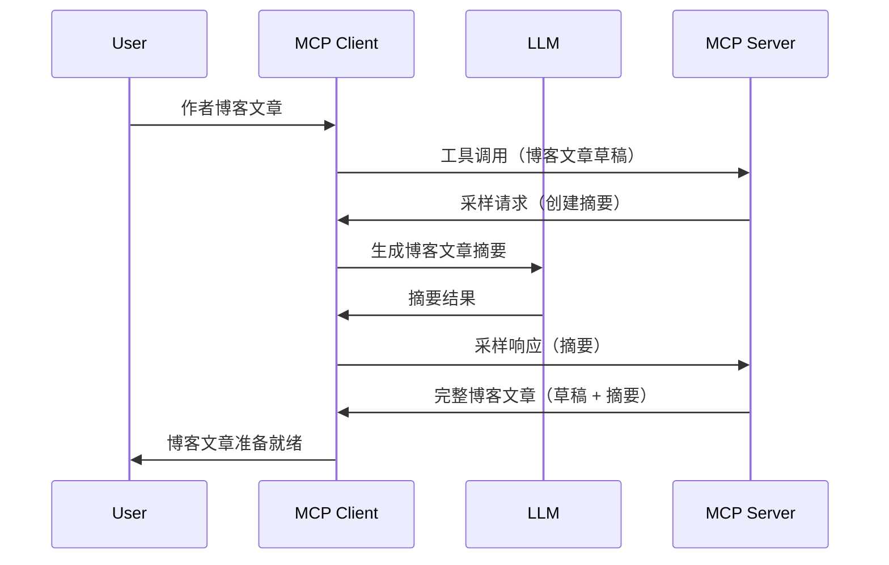

# 采样 - 将功能委托给客户端

> **弃用通知：** `2026-07-28` MCP 规范发布候选版本标记采样为弃用，建议改为直接集成 LLM 提供商 API。采样在 `2025-11-25` 版本及任何正式弃用后至少一年内仍然有效，因此本课程内容依然有效 — 但新的服务器设计应评估替代方案。详情参见 [MCP 的变化：2026-07-28 发布候选版本](../../01-CoreConcepts/mcp-2026-07-28-release-candidate.md)。

有时，您需要 MCP 客户端和 MCP 服务器协作以实现共同目标。可能出现服务器需要客户端上的 LLM 帮助的情况。针对这种情况，采样是您应该使用的功能。

让我们探讨一些用例以及如何构建涉及采样的解决方案。

## 概览

本课程聚焦讲解何时何地使用采样以及如何配置采样。

## 学习目标

在本章节中，我们将：

- 解释什么是采样以及何时使用。
- 展示如何在 MCP 中配置采样。
- 提供采样应用示例。

## 什么是采样，为什么使用它？

采样是一项高级功能，工作原理如下：



### 采样请求

好的，现在我们对一个可信的场景有了大致了解，接下来谈谈服务器发送给客户端的采样请求。下面是该请求的 JSON-RPC 格式示例：

```json
{
  "jsonrpc": "2.0",
  "id": 1,
  "method": "sampling/createMessage",
  "params": {
    "messages": [
      {
        "role": "user",
        "content": {
          "type": "text",
          "text": "Create a blog post summary of the following blog post: <BLOG POST>"
        }
      }
    ],
    "modelPreferences": {
      "hints": [
        {
          "name": "claude-3-sonnet"
        }
      ],
      "intelligencePriority": 0.8,
      "speedPriority": 0.5
    },
    "systemPrompt": "You are a helpful assistant.",
    "maxTokens": 100
  }
}
```

这里有几点值得说明：

- prompt，在 content -> text 下，是我们的提示，指示 LLM 总结博客文章内容。

- **modelPreferences**。这一部分只是偏好，建议使用何种配置与 LLM 交互。用户可选择接受这些建议或进行更改。本例中，推荐了模型选用及速度和智能优先级。
- **systemPrompt**，这是您的常规系统提示，用来赋予 LLM 个性并包含指导指令。
- **maxTokens**，这是用于说明为该任务推荐使用多少令牌的属性。

### 采样响应

此响应是 MCP 客户端调用 LLM 后等待响应，再构造的消息，最后发回 MCP 服务器。其 JSON-RPC 格式可能如下：

```json
{
  "jsonrpc": "2.0",
  "id": 1,
  "result": {
    "role": "assistant",
    "content": {
      "type": "text",
      "text": "Here's your abstract <ABSTRACT>"
    },
    "model": "gpt-5",
    "stopReason": "endTurn"
  }
}
```

请注意，响应是我们请求的博客文章摘要。还要留意使用的 `model` 并非我们请求的，而是“gpt-5”替代了“claude-3-sonnet”。这演示了用户可以改变使用的模型，采样请求只是建议。

好了，理解了主流程及“博客文章创作 + 摘要”这类常用任务后，我们来看看如何让它运行起来。

### 消息类型

采样消息不限于文本，也可以发送图片和音频。下面是 JSON-RPC 的不同表现形式：

<strong>文本</strong>

```json
{
  "type": "text",
  "text": "The message content"
}
```

<strong>图片内容</strong>

```json
{
  "type": "image",
  "data": "base64-encoded-image-data",
  "mimeType": "image/jpeg"
}
```

<strong>音频内容</strong>

```json
{
  "type": "audio",
  "data": "base64-encoded-audio-data",
  "mimeType": "audio/wav"
}
```

> 注意：有关采样的详细信息，请参阅[官方文档](https://modelcontextprotocol.io/specification/2025-11-25/client/sampling)

## 如何在客户端配置采样

> 注意：如果您只在构建服务器，这里无需做太多配置。

在客户端，您需要按如下方式指定此功能：

```json
{
  "capabilities": {
    "sampling": {}
  }
}
```

初始化时您的客户端会自动拾取这项配置，连接服务器。

## 采样实战示例 - 创建博客文章

让我们一起编写采样服务器，需要做如下步骤：

1. 在服务器上创建工具。
1. 该工具应创建采样请求。
1. 工具等待客户端对采样请求的答复。
1. 然后生成工具结果。

代码逐步演示如下：

### -1- 创建工具

**python**

```python
@mcp.tool()
async def create_blog(title: str, content: str, ctx: Context[ServerSession, None]) -> str:
    """Create a blog post and generate a summary"""

```

### -2- 创建采样请求

扩展您的工具，添加以下代码：

**python**

```python
post = BlogPost(
        id=len(posts) + 1,
        title=title,
        content=content,
        abstract=""
    )

prompt = f"Create an abstract of the following blog post: title: {title} and draft: {content} "

result = await ctx.session.create_message(
        messages=[
            SamplingMessage(
                role="user",
                content=TextContent(type="text", text=prompt),
            )
        ],
        max_tokens=100,
)

```

### -3- 等待响应并返回响应

**python**

```python
post.abstract = result.content.text

posts.append(post)

# 返回完整的产品
return json.dumps({
    "id": post.title,
    "abstract": post.abstract
})
```

### -4- 完整代码

**python**

```python
from starlette.applications import Starlette
from starlette.routing import Mount, Host

from mcp.server.fastmcp import Context, FastMCP

from mcp.server.session import ServerSession
from mcp.types import SamplingMessage, TextContent

import json


from uuid import uuid4
from typing import List
from pydantic import BaseModel


mcp = FastMCP("Blog post generator")

# app = FastAPI()

posts = []

class BlogPost(BaseModel):
    id: int
    title: str
    content: str
    abstract: str

posts: List[BlogPost] = []

@mcp.tool()
async def create_blog(title: str, content: str, ctx: Context[ServerSession, None]) -> str:
    """Create a blog post and generate a summary"""

    post = BlogPost(
        id=len(posts) + 1,
        title=title,
        content=content,
        abstract=""
    )

    prompt = f"Create an abstract of the following blog post: title: {title} and draft: {content} "

    result = await ctx.session.create_message(
        messages=[
            SamplingMessage(
                role="user",
                content=TextContent(type="text", text=prompt),
            )
        ],
        max_tokens=100,
    )

    post.abstract = result.content.text

    posts.append(post)

    # 返回完整的博客文章
    return json.dumps({
        "id": post.title,
        "abstract": post.abstract
    })

if __name__ == "__main__":
    print("Starting server...")
    # mcp.run()
    mcp.run(transport="streamable-http")

# 使用以下命令运行应用程序：python server.py
```

### -5- 在 Visual Studio Code 中测试

在 Visual Studio Code 中测试，步骤如下：

1. 在终端启动服务器
1. 将其添加到 *mcp.json*（并确保已启动），如下示例：

   ```json
   "servers": {
      "blog-server": {
        "type": "http",
        "url": "http://localhost:8000/mcp"
      }
   }
   ```

1. 输入提示：

   ```text
   create a blog post named "Where Python comes from", the content is "Python is actually named after Monty Python Flying Circus"
   ```

1. 允许采样操作。首次测试时会弹出额外对话框需要确认，之后会显示正常的工具运行询问对话框。

1. 查看结果。您可以在 GitHub Copilot Chat 中看到漂亮的渲染结果，也可以查看原始 JSON 响应。

<strong>附加说明</strong>。Visual Studio Code 工具对采样支持良好。您可以通过以下步骤配置已安装服务器的采样访问权限：

1. 进入扩展部分。
1. 在 “MCP SERVERS - INSTALLED” 区域选择您安装的服务器的齿轮图标。
1 选择 “Configure Model Access”，您可以选择 GitHub Copilot 在执行采样时被允许使用的模型。您也可选择 “Show Sampling requests” 查看最近的所有采样请求。

## 任务

本任务中，您将构建一个稍有不同的采样，用于生成产品描述。情境如下：

<strong>情境</strong>：电商后台工作人员需要帮助，编写产品描述耗时过长。因此，您需构建一个解决方案，可调用名为 "create_product" 的工具，参数包括 "title" 和 "keywords"，该工具应输出完整产品，其中 "description" 字段由客户端的 LLM 填充。

提示：利用前面学到的内容，使用采样请求构建此服务器及其工具。

## 解决方案

[解决方案](./solution/README.md)

## 关键要点

采样是一项强大功能，当服务器需要 LLM 协助时，允许服务器将任务委托给客户端。

## 下一步

- [第4章 - 实践实现](../../04-PracticalImplementation/README.md)

---

<!-- CO-OP TRANSLATOR DISCLAIMER START -->
**免责声明**：
本文件由 AI 翻译服务 [Co-op Translator](https://github.com/Azure/co-op-translator) 翻译完成。尽管我们力求准确，但请注意，自动翻译可能包含错误或不准确之处。原始语言版文件应视为权威来源。对于重要信息，建议使用专业人工翻译。我们对因使用本翻译而产生的任何误解或误释不承担责任。
<!-- CO-OP TRANSLATOR DISCLAIMER END -->