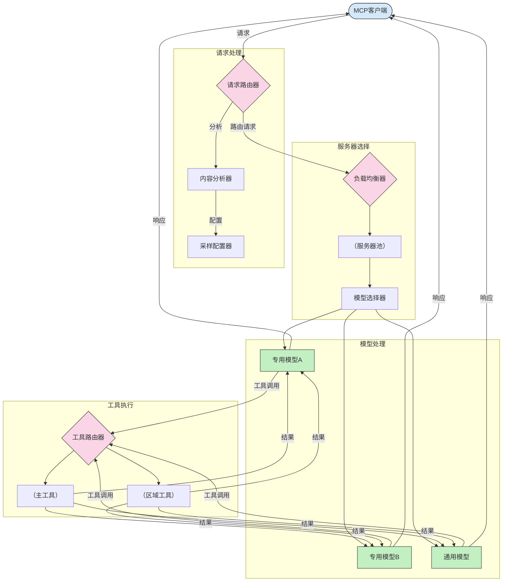

# 模型上下文协议中的路由

路由对于将请求导向 MCP 生态系统中适当的模型、工具或服务至关重要。

## 介绍

模型上下文协议（MCP）中的路由涉及根据内容类型、用户上下文和系统负载等各种标准，将请求引导到最合适的模型或服务。这确保了高效的处理和资源的最佳利用。

## 学习目标

本课结束时，您将能够：

- 了解 MCP 中路由的原理。
- 实现基于内容的路由，将请求导向专门化的服务。
- 应用智能负载均衡策略以优化资源利用。
- 基于请求上下文实现动态工具路由。

## 基于内容的路由

基于内容的路由根据请求的内容将请求导向专门的服务。例如，代码生成相关的请求可路由到专用的代码模型，而创意写作请求则可发送到创意写作模型。

让我们看看不同编程语言中的示例实现。

<details>
<summary>.NET</summary>

```csharp
// .NET Example: Content-based routing in MCP
public class ContentBasedRouter
{
    private readonly Dictionary<string, McpClient> _specializedClients;
    private readonly RoutingClassifier _classifier;
    
    public ContentBasedRouter()
    {
        // Initialize specialized clients for different domains
        _specializedClients = new Dictionary<string, McpClient>
        {
            ["code"] = new McpClient("https://code-specialized-mcp.com"),
            ["creative"] = new McpClient("https://creative-specialized-mcp.com"),
            ["scientific"] = new McpClient("https://scientific-specialized-mcp.com"),
            ["general"] = new McpClient("https://general-mcp.com")
        };
        
        // Initialize content classifier
        _classifier = new RoutingClassifier();
    }
    
    public async Task<McpResponse> RouteAndProcessAsync(string prompt, IDictionary<string, object> parameters = null)
    {
        // Classify the prompt to determine the best specialized service
        string category = await _classifier.ClassifyPromptAsync(prompt);
        
        // Get the appropriate client or fall back to general
        var client = _specializedClients.ContainsKey(category) 
            ? _specializedClients[category] 
            : _specializedClients["general"];
            
        Console.WriteLine($"Routing request to {category} specialized service");
        
        // Send request to the selected service
        return await client.SendPromptAsync(prompt, parameters);
    }
    
    // Simple classifier for routing decisions
    private class RoutingClassifier
    {
        public Task<string> ClassifyPromptAsync(string prompt)
        {
            prompt = prompt.ToLowerInvariant();
            
            if (prompt.Contains("code") || prompt.Contains("function") || 
                prompt.Contains("program") || prompt.Contains("algorithm"))
            {
                return Task.FromResult("code");
            }
            
            if (prompt.Contains("story") || prompt.Contains("creative") || 
                prompt.Contains("imagine") || prompt.Contains("design"))
            {
                return Task.FromResult("creative");
            }
            
            if (prompt.Contains("science") || prompt.Contains("research") || 
                prompt.Contains("analyze") || prompt.Contains("study"))
            {
                return Task.FromResult("scientific");
            }
            
            return Task.FromResult("general");
        }
    }
}
```

在上述代码中，我们：

- 创建了一个 `ContentBasedRouter` 类，根据提示的内容进行路由。
- 初始化了针对不同领域（代码、创意、科学、通用）的专门客户端。
- 实现了一个简单的分类器，确定提示的类别并将请求路由到相应的专门服务。
- 使用回退机制，将请求路由到通用服务（如果没有可用的专门服务）。
- 实现了异步处理以高效处理请求。
- 使用字典将内容类别映射到专门的 MCP 客户端。
- 实现了简单分类器来分析提示并返回相应类别。
- 使用专门客户端发送请求并接收响应。
- 处理提示不匹配任何专门类别的情况，将请求路由到通用服务。

</details>

## 智能负载均衡

负载均衡优化资源利用并确保 MCP 服务的高可用性。实现负载均衡的方法有多种，例如轮询、加权响应时间或内容感知策略。

让我们看下面的示例实现，使用了以下策略：

- <strong>轮询</strong>：将请求均匀分配到可用的服务器。
- <strong>加权响应时间</strong>：根据平均响应时间将请求路由到服务器。
- <strong>内容感知</strong>：基于请求内容将请求路由到专门服务器。

<details>
<summary>Java</summary>

```java
// Java示例：MCP服务器的智能负载均衡
public class McpLoadBalancer {
    private final List<McpServerNode> serverNodes;
    private final LoadBalancingStrategy strategy;
    
    public McpLoadBalancer(List<McpServerNode> nodes, LoadBalancingStrategy strategy) {
        this.serverNodes = new ArrayList<>(nodes);
        this.strategy = strategy;
    }
    
    public McpResponse processRequest(McpRequest request) {
        // 根据策略选择最佳服务器
        McpServerNode selectedNode = strategy.selectNode(serverNodes, request);
        
        try {
            // 将请求路由到所选节点
            return selectedNode.processRequest(request);
        } catch (Exception e) {
            // 处理失败 - 实现重试或降级逻辑
            System.err.println("Error processing request on node " + selectedNode.getId() + ": " + e.getMessage());
            
            // 标记节点为可能不健康
            selectedNode.recordFailure();
            
            // 尝试下一个最佳节点作为备用
            List<McpServerNode> remainingNodes = new ArrayList<>(serverNodes);
            remainingNodes.remove(selectedNode);
            
            if (!remainingNodes.isEmpty()) {
                McpServerNode fallbackNode = strategy.selectNode(remainingNodes, request);
                return fallbackNode.processRequest(request);
            } else {
                throw new RuntimeException("All MCP server nodes failed to process the request");
            }
        }
    }
    
    // 节点健康检查任务
    public void startHealthChecks(Duration interval) {
        ScheduledExecutorService scheduler = Executors.newScheduledThreadPool(1);
        scheduler.scheduleAtFixedRate(() -> {
            for (McpServerNode node : serverNodes) {
                try {
                    boolean isHealthy = node.checkHealth();
                    System.out.println("Node " + node.getId() + " health status: " + 
                                      (isHealthy ? "HEALTHY" : "UNHEALTHY"));
                } catch (Exception e) {
                    System.err.println("Health check failed for node " + node.getId());
                    node.setHealthy(false);
                }
            }
        }, 0, interval.toMillis(), TimeUnit.MILLISECONDS);
    }
    
    // 负载均衡策略接口
    public interface LoadBalancingStrategy {
        McpServerNode selectNode(List<McpServerNode> nodes, McpRequest request);
    }
    
    // 轮询策略
    public static class RoundRobinStrategy implements LoadBalancingStrategy {
        private AtomicInteger counter = new AtomicInteger(0);
        
        @Override
        public McpServerNode selectNode(List<McpServerNode> nodes, McpRequest request) {
            List<McpServerNode> healthyNodes = nodes.stream()
                .filter(McpServerNode::isHealthy)
                .collect(Collectors.toList());
            
            if (healthyNodes.isEmpty()) {
                throw new RuntimeException("No healthy nodes available");
            }
            
            int index = counter.getAndIncrement() % healthyNodes.size();
            return healthyNodes.get(index);
        }
    }
    
    // 加权响应时间策略
    public static class ResponseTimeStrategy implements LoadBalancingStrategy {
        @Override
        public McpServerNode selectNode(List<McpServerNode> nodes, McpRequest request) {
            return nodes.stream()
                .filter(McpServerNode::isHealthy)
                .min(Comparator.comparing(McpServerNode::getAverageResponseTime))
                .orElseThrow(() -> new RuntimeException("No healthy nodes available"));
        }
    }
    
    // 内容感知策略
    public static class ContentAwareStrategy implements LoadBalancingStrategy {
        @Override
        public McpServerNode selectNode(List<McpServerNode> nodes, McpRequest request) {
            // 确定请求特征
            boolean isCodeRequest = request.getPrompt().contains("code") || 
                                   request.getAllowedTools().contains("codeInterpreter");
            
            boolean isCreativeRequest = request.getPrompt().contains("creative") || 
                                       request.getPrompt().contains("story");
            
            // 查找专用节点
            Optional<McpServerNode> specializedNode = nodes.stream()
                .filter(McpServerNode::isHealthy)
                .filter(node -> {
                    if (isCodeRequest && node.getSpecialization().equals("code")) {
                        return true;
                    }
                    if (isCreativeRequest && node.getSpecialization().equals("creative")) {
                        return true;
                    }
                    return false;
                })
                .findFirst();
            
            // 返回专用节点或负载最轻节点
            return specializedNode.orElse(
                nodes.stream()
                    .filter(McpServerNode::isHealthy)
                    .min(Comparator.comparing(McpServerNode::getCurrentLoad))
                    .orElseThrow(() -> new RuntimeException("No healthy nodes available"))
            );
        }
    }
}
```

在上述代码中，我们：

- 创建了一个 `McpLoadBalancer` 类，管理 MCP 服务器节点列表并根据选定的负载均衡策略进行路由。
- 实现了不同的负载均衡策略：`RoundRobinStrategy`、`ResponseTimeStrategy` 和 `ContentAwareStrategy`。
- 使用 `ScheduledExecutorService` 定期检查服务器节点健康状态。
- 实现健康检查机制，根据节点对健康检查的响应将其标记为健康或不健康。
- 处理请求时包含错误处理和回退逻辑以保障高可用性。
- 使用 `McpServerNode` 类表示各个 MCP 服务器节点，包括其健康状态、平均响应时间和当前负载。
- 实现了 `McpRequest` 类，封装请求详情如提示和允许的工具。
- 使用 Java 流操作根据健康状态和专门化筛选和选择节点。

</details>

## 动态工具路由

工具路由确保工具调用根据上下文导向最合适的服务。例如，天气工具调用可能根据用户位置路由到区域端点，或者计算器工具可能需要使用特定版本的 API。

让我们看一个示例实现，演示基于请求分析、区域端点和版本支持的动态工具路由。

<details>
<summary>Python</summary>

```python
# Python 示例：基于请求分析的动态工具路由
class McpToolRouter:
    def __init__(self):
        # 注册可用的工具端点
        self.tool_endpoints = {
            "weatherTool": "https://weather-service.example.com/api",
            "calculatorTool": "https://calculator-service.example.com/compute",
            "databaseTool": "https://database-service.example.com/query",
            "searchTool": "https://search-service.example.com/search"
        }
        
        # 用于全球分发的区域端点
        self.regional_endpoints = {
            "us": {
                "weatherTool": "https://us-west.weather-service.example.com/api",
                "searchTool": "https://us.search-service.example.com/search"
            },
            "europe": {
                "weatherTool": "https://eu.weather-service.example.com/api",
                "searchTool": "https://eu.search-service.example.com/search"
            },
            "asia": {
                "weatherTool": "https://asia.weather-service.example.com/api",
                "searchTool": "https://asia.search-service.example.com/search"
            }
        }
        
        # 支持工具版本控制
        self.tool_versions = {
            "weatherTool": {
                "default": "v2",
                "v1": "https://weather-service.example.com/api/v1",
                "v2": "https://weather-service.example.com/api/v2",
                "beta": "https://weather-service.example.com/api/beta"
            }
        }
    
    async def route_tool_request(self, tool_name, parameters, user_context=None):
        """Route a tool request to the appropriate endpoint based on context"""
        endpoint = self._select_endpoint(tool_name, parameters, user_context)
        
        if not endpoint:
            raise ValueError(f"No endpoint available for tool: {tool_name}")
        
        # 对选定端点执行实际请求
        return await self._execute_tool_request(endpoint, tool_name, parameters)
    
    def _select_endpoint(self, tool_name, parameters, user_context=None):
        """Select the most appropriate endpoint based on context"""
        # 来自注册表的基础端点
        if tool_name not in self.tool_endpoints:
            return None
            
        base_endpoint = self.tool_endpoints[tool_name]
        
        # 检查是否需要使用特定工具版本
        if tool_name in self.tool_versions:
            version_info = self.tool_versions[tool_name]
            
            # 使用指定版本或默认版本
            requested_version = parameters.get("_version", version_info["default"])
            if requested_version in version_info:
                base_endpoint = version_info[requested_version]
        
        # 如果已知用户区域，则检查区域路由
        if user_context and "region" in user_context:
            user_region = user_context["region"]
            
            if user_region in self.regional_endpoints:
                regional_tools = self.regional_endpoints[user_region]
                
                if tool_name in regional_tools:
                    # 使用特定区域的端点
                    return regional_tools[tool_name]
        
        # 检查数据驻留要求
        if user_context and "data_residency" in user_context:
            # 这将实现确保数据留在指定司法管辖区的逻辑
            pass
        
        # 检查基于延迟的路由
        if user_context and "latency_sensitive" in user_context and user_context["latency_sensitive"]:
            # 这将实现选择最低延迟端点的逻辑
            pass
            
        return base_endpoint
        
    async def _execute_tool_request(self, endpoint, tool_name, parameters):
        """Execute the actual tool request to the selected endpoint"""
        try:
            async with aiohttp.ClientSession() as session:
                async with session.post(
                    endpoint,
                    json={"toolName": tool_name, "parameters": parameters},
                    headers={"Content-Type": "application/json"}
                ) as response:
                    if response.status == 200:
                        result = await response.json()
                        return result
                    else:
                        error_text = await response.text()
                        raise Exception(f"Tool execution failed: {error_text}")
        except Exception as e:
            # 实现重试逻辑或备选策略
            print(f"Error executing tool {tool_name} at {endpoint}: {str(e)}")
            raise
```

在上述代码中，我们：

- 创建了一个 `McpToolRouter` 类，根据请求分析、区域端点和版本支持管理工具路由。
- 注册可用的工具端点和全球分布的区域端点。
- 实现动态路由逻辑，根据用户上下文（例如区域和数据驻留要求）选择合适端点。
- 实现工具的版本支持，允许用户指定想要使用的工具版本。
- 使用异步 HTTP 请求执行工具调用并处理响应。

</details>

## MCP 中的采样与路由架构

采样是模型上下文协议（MCP）的关键组成部分，允许高效的请求处理和路由。它涉及分析传入请求，以根据内容类型、用户上下文和系统负载等各种标准确定最合适处理的模型或服务。

采样与路由可以结合创建一个健壮的架构，优化资源利用并确保高可用性。采样过程可用于请求分类，而路由则将请求引导到合适的模型或服务。

下图展示了采样与路由如何在完整的 MCP 架构中协同工作：



## 接下来是什么

- [5.6 采样](../mcp-sampling/README.md)

---

<!-- CO-OP TRANSLATOR DISCLAIMER START -->
**免责声明**：
本文件由 AI 翻译服务 [Co-op Translator](https://github.com/Azure/co-op-translator) 翻译完成。尽管我们力求准确，但请注意，自动翻译可能包含错误或不准确之处。原始语言版文件应视为权威来源。对于重要信息，建议使用专业人工翻译。我们对因使用本翻译而产生的任何误解或误释不承担责任。
<!-- CO-OP TRANSLATOR DISCLAIMER END -->