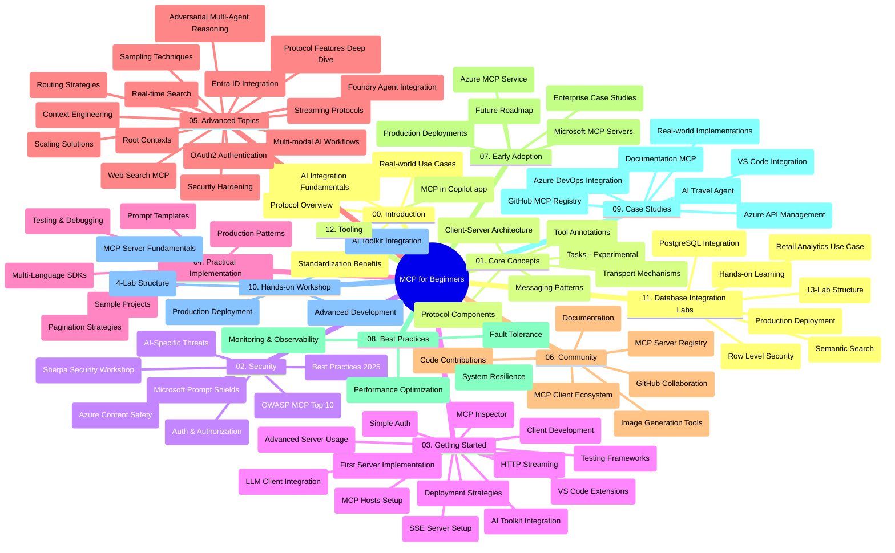

# 初学者模型上下文协议（MCP）学习指南

本学习指南提供了“初学者模型上下文协议（MCP）”课程的仓库结构和内容概览。使用本指南可以高效导航仓库，并充分利用可用资源。

## 仓库概览

模型上下文协议（MCP）是 AI 模型与客户端应用之间交互的标准化框架。最初由 Anthropic 创建，现由更广泛的 MCP 社区通过官方 GitHub 组织维护。本仓库提供了涵盖 C#、Java、JavaScript、Python 和 TypeScript 的实操代码示例的综合课程，面向 AI 开发者、系统架构师和软件工程师。

## 可视化课程地图

## 仓库结构

仓库分为十二个主要部分，每个部分侧重 MCP 的不同方面：

1. **介绍 (00-Introduction/)**
   - 模型上下文协议概述
   - AI 流水线中标准化的重要性
   - 实际用例和优势

2. **核心概念 (01-CoreConcepts/)**
   - 客户端-服务器架构
   - 关键协议组件
   - MCP 中的消息模式
   - 前瞻性内容：[MCP 变化：2026-07-28 发行候选](./01-CoreConcepts/mcp-2026-07-28-release-candidate.md) — 无状态协议核心、扩展框架，以及预期在下一版本规范中废弃 Roots/Sampling/Logging

3. **安全 (02-Security/)**
   - MCP 系统中的安全威胁
   - 实现安全性的最佳实践
   - 身份验证和授权策略
   - <strong>全面的安全文档</strong>：
     - MCP 2025 年安全最佳实践
     - Azure 内容安全实施指南
     - MCP 安全控制与技术
     - MCP 最佳实践快速参考
   - <strong>关键安全主题</strong>：
     - 提示注入与工具中毒攻击
     - 会话劫持与信任代理问题
     - 令牌透传漏洞
     - 过度权限与访问控制
     - AI 组件供应链安全
     - Microsoft 提示防护集成

4. **入门指南 (03-GettingStarted/)**
   - 环境设置和配置
   - 创建基础 MCP 服务器和客户端
   - 与现有应用集成
   - 包含内容：
     - 第一个服务器实现
     - 客户端开发
     - LLM 客户端集成
     - VS Code 集成
     - 服务器发送事件（SSE）服务器
     - 高级服务器使用
     - HTTP 流式传输
     - AI 工具包集成
     - 测试策略
     - 部署指南

5. **实操实现 (04-PracticalImplementation/)**
   - 跨不同编程语言使用 SDK
   - 调试、测试与验证技术
   - 编写可复用的提示模板和工作流程
   - 具实施示例的项目范例

6. **高级主题 (05-AdvancedTopics/)**
   - 上下文工程技术
   - Foundry 代理集成
   - 多模态 AI 工作流
   - OAuth2 身份验证演示
   - 实时搜索能力
   - 实时流式传输
   - Root 上下文实现
   - 路由策略
   - 采样技术
   - 扩展方案
   - 安全考量
   - Entra ID 安全集成
   - 网络搜索集成
   - 对抗多代理推理（辩论模式）

7. **社区贡献 (06-CommunityContributions/)**
   - 如何贡献代码和文档
   - 通过 GitHub 合作
   - 社区驱动的增强与反馈
   - 使用多种 MCP 客户端（Claude Desktop、Cline、VSCode）
   - 使用包含图像生成的热门 MCP 服务器

8. **早期采用经验 (07-LessonsfromEarlyAdoption/)**
   - 真实世界实现与成功案例
   - 构建和部署基于 MCP 的解决方案
   - 趋势与未来路线图
   - **Microsoft MCP 服务器指南**：全面介绍 10 个生产就绪的 Microsoft MCP 服务器，包括：
     - Microsoft Learn Docs MCP 服务器
     - Azure MCP 服务器（15+ 专用连接器）
     - GitHub MCP 服务器
     - Azure DevOps MCP 服务器
     - MarkItDown MCP 服务器
     - SQL Server MCP 服务器
     - Playwright MCP 服务器
     - Dev Box MCP 服务器
     - Microsoft Foundry MCP 服务器
     - Microsoft 365 Agents Toolkit MCP 服务器

9. **最佳实践 (08-BestPractices/)**
   - 性能调优和优化
   - 设计容错 MCP 系统
   - 测试与弹性策略

10. **案例研究 (09-CaseStudy/)**
    - <strong>七个全面的案例研究</strong>，展示 MCP 在多样场景下的灵活性：
    - **Azure AI 旅游代理**：使用 Azure OpenAI 和 AI Search 的多代理编排
    - **Azure DevOps 集成**：自动化工作流处理 YouTube 数据更新
    - <strong>实时文档检索</strong>：Python 控制台客户端支持流式 HTTP
    - <strong>互动学习计划生成器</strong>：基于 Chainlit 的网页应用与对话式 AI
    - <strong>编辑器内文档</strong>：VS Code 集成 GitHub Copilot 工作流
    - **Azure API 管理**：企业级 API 集成及 MCP 服务器创建
    - **GitHub MCP 注册表**：生态系统开发与代理集成平台
    - 涉及企业集成、开发者生产力和生态系统开发的实施示例

11. **实操工作坊 (10-StreamliningAIWorkflowsBuildingAnMCPServerWithAIToolkit/)**
    - 结合 MCP 和 AI 工具包的全面实操工作坊
    - 构建智能应用实现 AI 模型与实际工具桥接
    - 涵盖基础知识、定制服务器开发和生产部署策略的实用模块
    - <strong>实验室结构</strong>：
      - 实验室 1：MCP 服务器基础
      - 实验室 2：高级 MCP 服务器开发
      - 实验室 3：AI 工具包集成
      - 实验室 4：生产部署与扩展
    - 基于实验的学习方式，配有逐步指导

12. **MCP 服务器数据库集成实验室 (11-MCPServerHandsOnLabs/)**
    - **全面的 13 个实验室学习路径**，学习构建生产就绪的集成 PostgreSQL 的 MCP 服务器
    - <strong>真实零售分析应用示例</strong>，使用 Zava Retail 用例
    - <strong>企业级模式</strong>，包括行级安全（RLS）、语义搜索和多租户数据访问
    - <strong>完整实验室结构</strong>：
      - **实验室 00-03：基础** - 介绍、架构、安全和环境设置
      - **实验室 04-06：构建 MCP 服务器** - 数据库设计、服务器实现和工具开发
      - **实验室 07-09：高级功能** - 语义搜索、测试与调试、VS Code 集成
      - **实验室 10-12：生产和最佳实践** - 部署、监控、优化
    - <strong>涵盖技术</strong>：FastMCP 框架、PostgreSQL、Azure OpenAI、Azure 容器应用、应用洞察
    - <strong>学习成果</strong>：生产就绪 MCP 服务器、数据库集成模式、AI 驱动分析、企业安全

13. **工具 (12-tooling/)**
    - 学习如何在 Copilot 应用和其他工具中使用 MCP

## 附加资源

仓库包含支持资源：

- <strong>图片文件夹</strong>：包含课程中使用的图表和插图
- <strong>翻译</strong>：文档的多语言支持与自动翻译
- **官方 MCP 资源**：
  - [MCP 文档](https://modelcontextprotocol.io/)
  - [MCP 规范](https://spec.modelcontextprotocol.io/)
  - [MCP GitHub 仓库](https://github.com/modelcontextprotocol)

## 如何使用本仓库

1. <strong>按顺序学习</strong>：按章节顺序（00 到 11）学习，获得结构化的学习体验。
2. <strong>语言专注</strong>：若只对特定编程语言感兴趣，请浏览 samples 目录查看对应语言的实现。
3. <strong>实践实现</strong>：从“入门指南”章节开始，搭建环境，创建第一个 MCP 服务器和客户端。
4. <strong>高级探索</strong>：掌握基础后，深入高级主题拓展知识。
5. <strong>社区参与</strong>：通过 GitHub 讨论和 Discord 频道加入 MCP 社区，连接专家与开发者。

## MCP 客户端与工具

课程涵盖多种 MCP 客户端和工具：

1. <strong>官方客户端</strong>：
   - Visual Studio Code
   - VS Code 中的 MCP
   - Claude Desktop
   - VSCode 中的 Claude
   - Claude API

2. <strong>社区客户端</strong>：
   - Cline（终端版）
   - Cursor（代码编辑器）
   - ChatMCP
   - Windsurf

3. **MCP 管理工具**：
   - MCP CLI
   - MCP Manager
   - MCP Linker
   - MCP Router

## 热门 MCP 服务器

仓库介绍了多种 MCP 服务器，包括：

1. **官方 Microsoft MCP 服务器**：
   - Microsoft Learn Docs MCP 服务器
   - Azure MCP 服务器（15+ 专用连接器）
   - GitHub MCP 服务器
   - Azure DevOps MCP 服务器
   - MarkItDown MCP 服务器
   - SQL Server MCP 服务器
   - Playwright MCP 服务器
   - Dev Box MCP 服务器
   - Microsoft Foundry MCP 服务器
   - Microsoft 365 Agents Toolkit MCP 服务器

2. <strong>官方参考服务器</strong>：
   - 文件系统
   - Fetch
   - Memory
   - Sequential Thinking

3. <strong>图像生成</strong>：
   - Azure OpenAI DALL-E 3
   - Stable Diffusion WebUI
   - Replicate

4. <strong>开发工具</strong>：
   - Git MCP
   - Terminal Control
   - Code Assistant

5. <strong>专项服务器</strong>：
   - Salesforce
   - Microsoft Teams
   - Jira & Confluence

## 贡献

欢迎社区贡献。请参阅社区贡献部分，了解如何有效为 MCP 生态系统做出贡献。

----

*本学习指南最后更新于 2026 年 2 月 5 日，反映了最新的 MCP 规范 2025-11-25，并提供了该日期的仓库概览。仓库内容可能在此日期之后更新。*

*补充说明（2026 年 7 月 2 日）：新增了关于 `2026-07-28` MCP 规范发行候选的课程，位于 [01-CoreConcepts](./01-CoreConcepts/mcp-2026-07-28-release-candidate.md)；课程基线保持为 2025-11-25，直到新规范发布。*

---

<!-- CO-OP TRANSLATOR DISCLAIMER START -->
**免责声明**：
本文件由 AI 翻译服务 [Co-op Translator](https://github.com/Azure/co-op-translator) 翻译完成。尽管我们力求准确，但请注意，自动翻译可能包含错误或不准确之处。原始语言版文件应视为权威来源。对于重要信息，建议使用专业人工翻译。我们对因使用本翻译而产生的任何误解或误释不承担责任。
<!-- CO-OP TRANSLATOR DISCLAIMER END -->