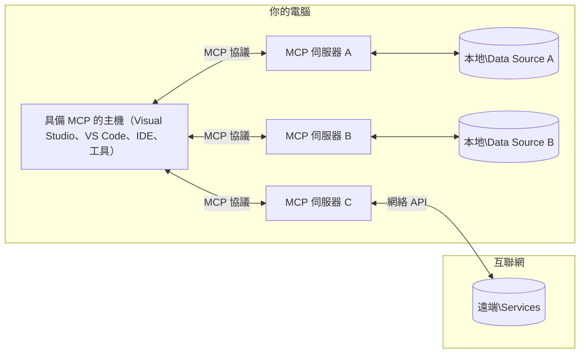

# MCP 核心概念：掌握 AI 集成的模型上下文協議

[](https://youtu.be/earDzWGtE84)

_(點擊上方圖片觀看本課程影片)_

[模型上下文協議 (Model Context Protocol, MCP)](https://github.com/modelcontextprotocol)是一個強大且標準化的框架，優化大型語言模型(LLMs)與外部工具、應用程式及資料來源間的溝通。 
本指南將帶領你了解 MCP 的核心概念，包括其客戶端-伺服器架構、基本組件、通訊機制和實作最佳實務。

- <strong>明確用戶同意</strong>：所有資料存取與操作皆需用戶明確批准後方可執行。用戶必須清楚知曉資料將被存取的內容及執行的動作，且能細緻控制權限與授權。

- <strong>資料隱私保護</strong>：用戶資料僅在明確同意下公開，且必須在整個互動生命週期中受到嚴格存取控制保護。實作必須防止未授權的資料傳輸並維持嚴密的隱私界限。

- <strong>工具執行安全</strong>：每次工具調用皆需用戶明確同意，且用戶需充分理解工具功能、參數與潛在影響。強健的安全邊界須防止非預期、不安全或惡意的工具執行。

- <strong>傳輸層安全</strong>：所有通訊管道應使用適當的加密與驗證機制。遠端連線需實施安全傳輸協定與妥善的憑證管理。

#### 實作指引：

- <strong>權限管理</strong>：實作細粒度權限系統，讓用戶能控制可存取的伺服器、工具及資源
- <strong>驗證與授權</strong>：使用安全的驗證方法（OAuth、API 金鑰），並妥善管理與過期令牌
- <strong>輸入驗證</strong>：依定義的結構驗證所有參數及資料輸入，以防止注入攻擊
- <strong>稽核日誌</strong>：維護全面的操作日誌，用於安全監控與合規

## 概述

本課程探討構成模型上下文協議(MCP)生態系統的基礎架構與組件。你將了解客戶端-伺服器架構、關鍵組件及推動 MCP 互動的通訊機制。

## 主要學習目標

完成本課程後，你將能：

- 了解 MCP 的客戶端-伺服器架構。
- 辨識主機、客戶端及伺服器的角色與責任。
- 分析使 MCP 成為靈活整合層的核心特性。
- 學習 MCP 生態系統內資訊的流動方式。
- 通過 .NET、Java、Python 和 JavaScript 的程式碼示例獲得實務見解。

## MCP 架構：深入探討

MCP 生態系統建立於客戶端-伺服器模型。這種模組化結構使 AI 應用能有效率地與工具、資料庫、API 及上下文資源互動。讓我們將此架構拆解為核心組件。

MCP 核心採用客戶端-伺服器架構，主機應用程式可以連接至多個伺服器：



- **MCP 主機**：例如 VSCode、Claude Desktop、IDE 或希望透過 MCP 存取資料的 AI 工具
- **MCP 客戶端**：與伺服器維持一對一連接的協議客戶端
- **MCP 伺服器**：輕量級程式，透過標準化的模型上下文協議提供特定功能
- <strong>本地資料來源</strong>：你的電腦檔案、資料庫及服務，MCP 伺服器可以安全存取
- <strong>遠端服務</strong>：網路上的外部系統，MCP 伺服器可透過 API 連接

MCP 協議為不斷演進的標準，採取日期版本號(YYYY-MM-DD 格式)。目前協議版本為 **2025-11-25**，你可以參考最新的[協議規範](https://modelcontextprotocol.io/specification/2025-11-25/)。

> <strong>展望未來：</strong>下一版本規範 **2026-07-28** 的發行候選版於 2026 年 5 月發布，預定於 2026 年 7 月 28 日發行。該版本將協議變為傳輸層無狀態（移除 `initialize` 握手與會話 ID）、正式化擴充框架，並棄用 Roots、Sampling 與 Logging，改用更新型態。完整變更請參見 [MCP 的變化：2026-07-28 發行候選版](./mcp-2026-07-28-release-candidate.md)。

### 1. 主機 (Hosts)

在模型上下文協議(MCP)中，<strong>主機</strong>是作為用戶與協議互動的主要介面之 AI 應用。主機透過為每個伺服器連接建立專用 MCP 客戶端來協調與管理多個 MCP 伺服器的連線。主機示例包含：

- **AI 應用**：Claude Desktop、Visual Studio Code、Claude Code
- <strong>開發環境</strong>：具 MCP 整合的 IDE 及程式編輯器
- <strong>自訂應用</strong>：專門打造的 AI 代理與工具

<strong>主機</strong>為統籌 AI 模型互動的應用程式。其職責為：

- **編排 AI 模型**：執行或互動大型語言模型以產生回應並協調 AI 工作流程
- <strong>管理客戶端連線</strong>：為每個 MCP 伺服器連線建立並維護 MCP 客戶端
- <strong>控制使用者介面</strong>：處理對話流程、用戶互動與回應呈現
- <strong>執行安全管控</strong>：控制權限、安全限制與驗證
- <strong>管理用戶同意</strong>：處理用戶對資料共享與工具執行的批准


### 2. 客戶端 (Clients)

<strong>客戶端</strong>是維持主機與 MCP 伺服器之間專屬一對一連線的關鍵組件。每個 MCP 客戶端由主機實例化，連接至特定 MCP 伺服器，保障通訊的組織性與安全性。多數客戶端允許主機同時連接多個伺服器。

<strong>客戶端</strong>為主機應用內的連接組件。其職責為：

- <strong>協議通訊</strong>：向伺服器發送 JSON-RPC 2.0 請求，包含提示與指令
- <strong>功能協商</strong>：於初始化時與伺服器協商支持之特性與協議版本
- <strong>工具執行</strong>：管理模型的工具執行請求並處理回應
- <strong>即時更新</strong>：處理伺服器通知及即時訊息
- <strong>回應處理</strong>：處理並格式化伺服器回應供使用者顯示

### 3. 伺服器 (Servers)

<strong>伺服器</strong>為提供上下文、工具及功能給 MCP 客戶端的程式。伺服器可在本地（與主機同機）或遠端（外部平台）執行，負責處理客戶端請求並提供結構化回應。伺服器透過標準化的模型上下文協議揭露特定功能。

<strong>伺服器</strong>作為提供上下文與功能的服務。其職責為：

- <strong>功能註冊</strong>：註冊並向客戶端揭露可用的原語(資源、提示、工具)
- <strong>請求處理</strong>：接收並執行客戶端的工具調用、資源請求及提示要求
- <strong>上下文提供</strong>：提供上下文資訊及資料以強化模型回應
- <strong>狀態管理</strong>：維護會話狀態並在需要時處理有狀態互動
- <strong>即時通知</strong>：向連接的客戶端發送關於能力變更與更新的通知

伺服器可以由任何人開發，以透過專門功能擴展模型能力，並支援本地及遠端部署情境。

### 4. 伺服器原語 (Server Primitives)

MCP 伺服器提供三種核心 <strong>原語</strong>，定義了客戶端、主機與語言模型間豐富互動的基本構建要素。這些原語規範了透過協議能取得的上下文資訊類型及可執行的動作。

MCP 伺服器可揭露下列任意組合的三種核心原語：

#### 資源 (Resources) 

<strong>資源</strong>為為 AI 應用提供上下文資訊的資料來源。它們代表靜態或動態內容，有助增強模型理解與決策：

- <strong>上下文資料</strong>：供 AI 模型使用的結構化資訊與上下文
- <strong>知識庫</strong>：文件庫、文章、手冊與研究論文
- <strong>本地資料來源</strong>：檔案、資料庫及本地系統資訊
- <strong>外部資料</strong>：API 回應、網頁服務及遠端系統資料
- <strong>動態內容</strong>：根據外部條件即時更新的資料

資源以 URI 辨識，支援通過 `resources/list` 探索並使用 `resources/read` 取得：

```text
file://documents/project-spec.md
database://production/users/schema
api://weather/current
```

#### 提示 (Prompts)

<strong>提示</strong>為可重複使用的範本，有助於結構化與語言模型的互動。它們提供標準化的互動模式與範本化工作流程：

- <strong>範本互動</strong>：預先結構化的訊息與對話開場白
- <strong>工作流程範本</strong>：常見任務與互動的標準化序列
- <strong>少量示例</strong>：用於模型指令的示例型範本
- <strong>系統提示</strong>：定義模型行為與上下文的基礎提示
- <strong>動態範本</strong>：可根據特定上下文調整的參數化提示

提示支援變數替換，可透過 `prompts/list` 探索並用 `prompts/get` 取得：

```markdown
Generate a {{task_type}} for {{product}} targeting {{audience}} with the following requirements: {{requirements}}
```

#### 工具 (Tools)

<strong>工具</strong>為 AI 模型可調用來執行特定動作的可執行函數。它們代表 MCP 生態系統中的「動詞」，使模型得以與外部系統互動：

- <strong>可執行函數</strong>：模型可用特定參數調用的離散操作
- <strong>外部系統整合</strong>：API 呼叫、資料庫查詢、檔案操作、計算
- <strong>獨特身份</strong>：每個工具擁有獨特名稱、描述與參數結構
- <strong>結構化輸入輸出</strong>：工具接受驗證參數並返回結構化、有型別的回應
- <strong>動作能力</strong>：讓模型得以執行現實操作並取得即時資料

工具以 JSON Schema 定義參數驗證，可通過 `tools/list` 探索並以 `tools/call` 執行。工具也可包含 <strong>圖示</strong> 作為額外元資料以強化 UI 呈現。

<strong>工具註解</strong>：工具支援行為註解（如 `readOnlyHint`、`destructiveHint`）描述工具是否為唯讀或具破壞性，有助客戶端做出明智的執行決策。

工具定義範例：

```typescript
server.tool(
  "search_products", 
  {
    query: z.string().describe("Search query for products"),
    category: z.string().optional().describe("Product category filter"),
    max_results: z.number().default(10).describe("Maximum results to return")
  }, 
  async (params) => {
    // 執行搜尋並返回結構化結果
    return await productService.search(params);
  }
);
```

## 客戶端原語 (Client Primitives)

在模型上下文協議(MCP)中，<strong>客戶端</strong>可揭露原語，允許伺服器向主機應用請求額外功能。這些客戶端端的原語支援更豐富、更互動的伺服器實作，能存取 AI 模型功能與用戶互動。

### 取樣 (Sampling)

> **棄用通知：**`2026-07-28` 發行候選版標示取樣功能將逐步棄用，改以直接整合大型語言模型供應商 API。它仍在 `2025-11-25` 版本及棄用起後至少一年內可用，但新設計應優先使用替代模式。詳情參見 [MCP 的變化：2026-07-28 發行候選版](./mcp-2026-07-28-release-candidate.md)。

<strong>取樣</strong>允許伺服器向客戶端的 AI 應用請求語言模型的完成。此原語允許伺服器無需內建模型依賴即可使用 LLM 的功能：

- <strong>模型無依賴存取</strong>：伺服器可不帶入 LLM SDK 或管理模型存取，即可請求完成
- **伺服器啟動 AI**：允許伺服器自主使用客戶端模型生成內容
- **遞迴 LLM 互動**：支援伺服器在複雜場景中需求 AI 協助處理
- <strong>動態內容生成</strong>：允許伺服器利用主機模型產生上下文相關回應
- <strong>工具調用支援</strong>：伺服器可包含 `tools` 與 `toolChoice` 參數，讓客戶端模型在取樣時調用工具

取樣透過 `sampling/complete` 方法啟動，伺服器向客戶端發送完成請求。

### Roots

> **棄用通知：**`2026-07-28` 發行候選版標示 Roots 將逐步棄用，改為工具參數、資源 URI 或伺服器配置。它仍在 `2025-11-25` 版本及棄用起後至少一年內可用。詳情見 [MCP 的變化：2026-07-28 發行候選版](./mcp-2026-07-28-release-candidate.md)。

**Roots** 提供一種標準化方式，讓客戶端向伺服器揭露檔案系統邊界，幫助伺服器理解可操作的目錄與檔案範圍：

- <strong>檔案系統邊界</strong>：定義伺服器可在檔案系統操作的邊界
- <strong>存取控制</strong>：幫助伺服器了解其可存取的目錄與檔案權限
- <strong>動態更新</strong>：當 Roots 列表改變時，客戶端可通知伺服器
- **URI 識別**：Roots 使用 `file://` URI 辨識可訪問目錄和檔案

Roots 通過 `roots/list` 方法發現，並於 Roots 變更時由客戶端發送 `notifications/roots/list_changed`。

### 引導收集 (Elicitation)  

<strong>引導收集</strong>允許伺服器通過客戶端介面向用戶請求額外資訊或確認：

- <strong>用戶輸入請求</strong>：伺服器可在執行工具時請求所需的額外資訊
- <strong>確認對話框</strong>：請用戶批准敏感或重要操作
- <strong>互動式工作流程</strong>：允許伺服器創建逐步用戶互動流程
- <strong>動態參數收集</strong>：在工具執行時收集遺漏或可選參數

引導收集請求使用 `elicitation/request` 方法透過客戶端介面收集用戶輸入。

**URL 模式引導**：伺服器亦可請求基於 URL 的用戶互動，將用戶導向外部網頁進行驗證、確認或資料輸入。

### 記錄 (Logging)


> **棄用通知：** `2026-07-28` 發行候選版本標記 Logging 為棄用，建議改用 stdio 連接埠的 `stderr` 以及結構化觀測的 OpenTelemetry。該功能在 `2025-11-25` 和任何棄用後至少一年內仍會繼續運作。詳見 [MCP 變更內容：2026-07-28 發行候選版本](./mcp-2026-07-28-release-candidate.md)。

**Logging** 允許伺服器向用戶端傳送結構化的日誌訊息，用於除錯、監控及營運可見性：

- <strong>除錯支援</strong>：使伺服器能提供詳細的執行日誌以便故障排除
- <strong>營運監控</strong>：向用戶端傳送狀態更新和效能指標
- <strong>錯誤回報</strong>：提供詳細錯誤上下文與診斷資訊
- <strong>審計追蹤</strong>：建立伺服器操作與決策的完整日誌

日誌訊息會傳送給用戶端，以提供伺服器操作的透明度，並促進除錯。

## MCP 中的信息流

模型上下文協定（MCP）定義了主機、用戶端、伺服器與模型之間結構化的信息流。了解此流程有助於釐清使用者請求如何被處理，以及外部工具和資料如何整合到模型回應中。

- <strong>主機發起連線</strong>  
  主機應用程式（如 IDE 或聊天介面）建立與 MCP 伺服器的連線，通常透過 STDIO、WebSocket 或其他支援的傳輸方式。

- <strong>功能協商</strong>  
  客戶端（內嵌於主機中）與伺服器交換其支援的功能、工具、資源和協定版本資訊，確保雙方了解會話中可用的功能。

- <strong>使用者請求</strong>  
  使用者與主機互動（例如輸入提示或指令）。主機收集此輸入並傳遞給客戶端處理。

- <strong>資源或工具使用</strong>  
  - 客戶端可能從伺服器請求額外的上下文或資源（例如檔案、資料庫條目或知識庫文章）以豐富模型的理解。
  - 若模型判定需要使用工具（例如擷取資料、執行計算或呼叫 API），客戶端會向伺服器發送工具調用請求，指明工具名稱與參數。

- <strong>伺服器執行</strong>  
  伺服器接收資源或工具請求，執行必要的操作（如運行函式、查詢資料庫或擷取檔案），並以結構化格式將結果返回給客戶端。

- <strong>回應生成</strong>  
  客戶端整合伺服器的回應（資源資料、工具輸出等）到持續的模型互動中。模型利用這些資訊產生全面且具上下文相關性的回應。

- <strong>結果呈現</strong>  
  主機接收來自客戶端的最終輸出並呈現給使用者，通常包括模型產生的文字及任何工具執行或資源查詢的結果。

此流程使 MCP 能支援高階、互動式且具上下文感知的 AI 應用程式，透過無縫連接模型與外部工具和資料來源。

## 協定架構與層次

MCP 由兩個不同的架構層合作組成，提供完整的通訊框架：

### 資料層

<strong>資料層</strong> 以 **JSON-RPC 2.0** 為基礎實現 MCP 核心協定。此層定義訊息結構、語義以及互動模式：

#### 核心元件：

- **JSON-RPC 2.0 協定**：所有通訊皆使用標準化的 JSON-RPC 2.0 訊息格式進行方法呼叫、回應及通知
- <strong>生命週期管理</strong>：管理客戶端與伺服器間的連線初始化、功能協商與會話終止
- <strong>伺服器原語</strong>：使伺服器能透過工具、資源及提示提供核心功能
- <strong>客戶端原語</strong>：使伺服器可請求大型語言模型採樣、引導使用者輸入、並傳送日誌訊息
- <strong>即時通知</strong>：支援非同步通知以實現動態更新而不需輪詢

#### 主要特點：

- <strong>協定版本協商</strong>：使用基於日期的版本控制（YYYY-MM-DD）以確保相容性
- <strong>功能發現</strong>：客戶端與伺服器在初始化階段交換所支援功能信息
- <strong>有狀態會話</strong>：跨多次互動維持連線狀態以確保持續上下文

### 傳輸層

<strong>傳輸層</strong> 負責 MCP 參與者之間的通訊通道、訊息構框及身份驗證：

#### 支援的傳輸機制：

1. **STDIO 傳輸**：
   - 使用標準輸入/輸出串流進行直接進程通訊
   - 適用於同機器上的本地進程，無網路負擔
   - 常用於本地 MCP 伺服器實現

2. **可串流 HTTP 傳輸**：
   - 客戶端到伺服器訊息使用 HTTP POST
   - 伺服器到客戶端串流可選擇使用 Server-Sent Events (SSE)
   - 允許跨網路進行遠端伺服器通訊
   - 支援標準 HTTP 認證（承載權杖、API 金鑰、自訂標頭）
   - MCP 推薦使用 OAuth 進行安全的基於權杖認證

#### 傳輸抽象：

傳輸層對資料層通訊細節進行抽象，允許所有傳輸機制皆使用相同的 JSON-RPC 2.0 訊息格式。此抽象使應用能無縫切換本地與遠端伺服器。

### 安全考量

MCP 實作必須遵守多項關鍵安全原則，以確保協定操作的安全、可信與受保護的互動：

- <strong>用戶同意與控制</strong>：必須取得用戶明確同意，方可存取資料或執行操作。用戶需明確掌握共享的資料與授權的動作，且介面設計須直覺且友善以便審查批准活動。

- <strong>資料隱私</strong>：用戶資料僅能在明確許可下曝光，且必須由適當存取控制保護。MCP 實作需防範未授權資料傳輸，確保整個互動過程中的隱私安全。

- <strong>工具安全</strong>：調用工具前，必須取得用戶明確同意。用戶應清楚了解每個工具的功能，且必須強制執行嚴格安全邊界，以防止非預期或不安全的工具執行。

遵循這些安全原則，MCP 確保用戶信任、隱私及安全於所有協定互動中獲得維護，同時啟用強大的 AI 整合功能。

## 程式碼範例：關鍵元件

以下為數種流行程式語言的程式碼範例，說明如何實作 MCP 伺服器主要元件和工具。

### .NET 範例：建立簡易 MCP 伺服器與工具

以下是一個實用的 .NET 程式碼範例，展示如何實作一個簡單 MCP 伺服器與自訂工具。範例示範如何定義與註冊工具、處理請求，以及使用模型上下文協定連接伺服器。

```csharp
using System;
using System.Threading.Tasks;
using ModelContextProtocol.Server;
using ModelContextProtocol.Server.Transport;
using ModelContextProtocol.Server.Tools;

public class WeatherServer
{
    public static async Task Main(string[] args)
    {
        // Create an MCP server
        var server = new McpServer(
            name: "Weather MCP Server",
            version: "1.0.0"
        );
        
        // Register our custom weather tool
        server.AddTool<string, WeatherData>("weatherTool", 
            description: "Gets current weather for a location",
            execute: async (location) => {
                // Call weather API (simplified)
                var weatherData = await GetWeatherDataAsync(location);
                return weatherData;
            });
        
        // Connect the server using stdio transport
        var transport = new StdioServerTransport();
        await server.ConnectAsync(transport);
        
        Console.WriteLine("Weather MCP Server started");
        
        // Keep the server running until process is terminated
        await Task.Delay(-1);
    }
    
    private static async Task<WeatherData> GetWeatherDataAsync(string location)
    {
        // This would normally call a weather API
        // Simplified for demonstration
        await Task.Delay(100); // Simulate API call
        return new WeatherData { 
            Temperature = 72.5,
            Conditions = "Sunny",
            Location = location
        };
    }
}

public class WeatherData
{
    public double Temperature { get; set; }
    public string Conditions { get; set; }
    public string Location { get; set; }
}
```

### Java 範例：MCP 伺服器元件

此範例示範與上方 .NET 範例相同的 MCP 伺服器與工具註冊，但以 Java 實作。

```java
import io.modelcontextprotocol.server.McpServer;
import io.modelcontextprotocol.server.McpToolDefinition;
import io.modelcontextprotocol.server.transport.StdioServerTransport;
import io.modelcontextprotocol.server.tool.ToolExecutionContext;
import io.modelcontextprotocol.server.tool.ToolResponse;

public class WeatherMcpServer {
    public static void main(String[] args) throws Exception {
        // 建立一個 MCP 伺服器
        McpServer server = McpServer.builder()
            .name("Weather MCP Server")
            .version("1.0.0")
            .build();
            
        // 註冊一個天氣工具
        server.registerTool(McpToolDefinition.builder("weatherTool")
            .description("Gets current weather for a location")
            .parameter("location", String.class)
            .execute((ToolExecutionContext ctx) -> {
                String location = ctx.getParameter("location", String.class);
                
                // 獲取天氣數據（簡化版）
                WeatherData data = getWeatherData(location);
                
                // 回傳格式化回應
                return ToolResponse.content(
                    String.format("Temperature: %.1f°F, Conditions: %s, Location: %s", 
                    data.getTemperature(), 
                    data.getConditions(), 
                    data.getLocation())
                );
            })
            .build());
        
        // 使用 stdio 傳輸連接伺服器
        try (StdioServerTransport transport = new StdioServerTransport()) {
            server.connect(transport);
            System.out.println("Weather MCP Server started");
            // 保持伺服器運行直到程序終止
            Thread.currentThread().join();
        }
    }
    
    private static WeatherData getWeatherData(String location) {
        // 實作會呼叫天氣 API
        // 為示例目的而簡化
        return new WeatherData(72.5, "Sunny", location);
    }
}

class WeatherData {
    private double temperature;
    private String conditions;
    private String location;
    
    public WeatherData(double temperature, String conditions, String location) {
        this.temperature = temperature;
        this.conditions = conditions;
        this.location = location;
    }
    
    public double getTemperature() {
        return temperature;
    }
    
    public String getConditions() {
        return conditions;
    }
    
    public String getLocation() {
        return location;
    }
}
```

### Python 範例：建置 MCP 伺服器

此範例使用 fastmcp，請先確保安裝：

```python
pip install fastmcp
```
 程式碼範例：

```python
#!/usr/bin/env python3
import asyncio
from fastmcp import FastMCP
from fastmcp.transports.stdio import serve_stdio

# 建立 FastMCP 伺服器
mcp = FastMCP(
    name="Weather MCP Server",
    version="1.0.0"
)

@mcp.tool()
def get_weather(location: str) -> dict:
    """Gets current weather for a location."""
    return {
        "temperature": 72.5,
        "conditions": "Sunny",
        "location": location
    }

# 使用類別的替代方法
class WeatherTools:
    @mcp.tool()
    def forecast(self, location: str, days: int = 1) -> dict:
        """Gets weather forecast for a location for the specified number of days."""
        return {
            "location": location,
            "forecast": [
                {"day": i+1, "temperature": 70 + i, "conditions": "Partly Cloudy"}
                for i in range(days)
            ]
        }

# 註冊類別工具
weather_tools = WeatherTools()

# 啟動伺服器
if __name__ == "__main__":
    asyncio.run(serve_stdio(mcp))
```

### JavaScript 範例：建立 MCP 伺服器

此範例展示在 JavaScript 建立 MCP 伺服器以及如何註冊兩個與天氣相關的工具。

```javascript
// 使用官方的模型上下文協議 SDK
import { McpServer } from "@modelcontextprotocol/sdk/server/mcp.js";
import { StdioServerTransport } from "@modelcontextprotocol/sdk/server/stdio.js";
import { z } from "zod"; // 用於參數驗證

// 創建一個 MCP 伺服器
const server = new McpServer({
  name: "Weather MCP Server",
  version: "1.0.0"
});

// 定義一個天氣工具
server.tool(
  "weatherTool",
  {
    location: z.string().describe("The location to get weather for")
  },
  async ({ location }) => {
    // 一般來說這會調用天氣 API
    // 為示範而簡化
    const weatherData = await getWeatherData(location);
    
    return {
      content: [
        { 
          type: "text", 
          text: `Temperature: ${weatherData.temperature}°F, Conditions: ${weatherData.conditions}, Location: ${weatherData.location}` 
        }
      ]
    };
  }
);

// 定義一個預報工具
server.tool(
  "forecastTool",
  {
    location: z.string(),
    days: z.number().default(3).describe("Number of days for forecast")
  },
  async ({ location, days }) => {
    // 一般來說這會調用天氣 API
    // 為示範而簡化
    const forecast = await getForecastData(location, days);
    
    return {
      content: [
        { 
          type: "text", 
          text: `${days}-day forecast for ${location}: ${JSON.stringify(forecast)}` 
        }
      ]
    };
  }
);

// 輔助函數
async function getWeatherData(location) {
  // 模擬 API 調用
  return {
    temperature: 72.5,
    conditions: "Sunny",
    location: location
  };
}

async function getForecastData(location, days) {
  // 模擬 API 調用
  return Array.from({ length: days }, (_, i) => ({
    day: i + 1,
    temperature: 70 + Math.floor(Math.random() * 10),
    conditions: i % 2 === 0 ? "Sunny" : "Partly Cloudy"
  }));
}

// 使用 stdio 傳輸連接伺服器
const transport = new StdioServerTransport();
server.connect(transport).catch(console.error);

console.log("Weather MCP Server started");
```

此 JavaScript 範例示範如何透過模型上下文協定 SDK 建立 MCP 伺服器。展示如何註冊名為 `weatherTool` 與 `forecastTool` 的兩個工具，並透過 `StdioServerTransport` 使其可供 MCP 用戶端使用。

## 安全與授權

MCP 包含多個內建概念與機制，以在整個協定中管理安全與授權：

1. <strong>工具權限控制</strong>：  
  用戶端可指定模型於會話期間可用的工具，確保僅授權的工具可被存取，減少非預期或不安全操作之風險。權限可根據用戶偏好、組織政策或互動上下文動態配置。

2. <strong>身份驗證</strong>：  
  伺服器可要求於授予工具、資源或敏感操作存取權前進行身份驗證。可能涉及 API 金鑰、OAuth 權杖或其他驗證機制。正確的身份驗證確保只有受信任的用戶端和使用者可呼叫伺服端功能。

3. <strong>驗證</strong>：  
  對所有工具調用執行參數驗證。每個工具定義預期參數的類型、格式及限制，伺服器按照此規則驗證進入請求，防止格式錯誤或惡意輸入觸及工具實作，維護操作完整性。

4. <strong>速率限制</strong>：  
  為防止濫用並確保公平使用伺服器資源，MCP 伺服器可對工具呼叫和資源存取實施速率限制。速率限制可按用戶、會話或全局設定，有助防範服務阻斷攻擊或過度資源消耗。

藉由結合這些機制，MCP 為語言模型與外部工具和資料來源整合提供安全基礎，同時給予用戶和開發者細緻的存取和使用控制。

## 協定訊息與通訊流程

MCP 通訊使用結構化的 **JSON-RPC 2.0** 訊息，促進主機、用戶端與伺服器間的清晰且可靠互動。協定定義了不同操作的特定訊息模式：

### 核心訊息類型：

#### <strong>初始化訊息</strong>
- **`initialize` 請求**：建立連線並協商協定版本與功能
- **`initialize` 回應**：確認支援功能與伺服器資訊  
- **`notifications/initialized`**：表示初始化完成，會話準備就緒

#### <strong>發現訊息</strong>
- **`tools/list` 請求**：發現伺服器上可用工具
- **`resources/list` 請求**：列出可用資源（資料來源）
- **`prompts/list` 請求**：取得可用提示模板

#### <strong>執行訊息</strong>  
- **`tools/call` 請求**：執行指定工具並提供參數
- **`resources/read` 請求**：擷取特定資源的內容
- **`prompts/get` 請求**：取得提示模板並可選參數

#### <strong>用戶端訊息</strong>
- **`sampling/complete` 請求**：伺服器請求用戶端從大型語言模型完成採樣
- **`elicitation/request`**：伺服器透過用戶端介面請求使用者輸入
- **Logging 訊息**：伺服器向用戶端發送結構化日誌訊息

#### <strong>通知訊息</strong>
- **`notifications/tools/list_changed`**：伺服器通知用戶端工具列表變更
- **`notifications/resources/list_changed`**：伺服器通知用戶端資源列表變更  
- **`notifications/prompts/list_changed`**：伺服器通知用戶端提示列表變更

### 訊息結構：

所有 MCP 訊息皆遵守 JSON-RPC 2.0 格式：
- <strong>請求訊息</strong>：包含 `id`、`method` 與可選 `params`
- <strong>回應訊息</strong>：包含 `id` 並有 `result` 或 `error`  
- <strong>通知訊息</strong>：包含 `method` 與可選 `params`（無 `id`，不需回應）

此結構化通訊確保可靠、可追蹤且可擴充的互動，支援即時更新、工具串接與強健錯誤處理等進階場景。

### Tasks（實驗性）

> **展望未來：** `2026-07-28` 發行候選版本將 Tasks 從實驗核心規範移出，獨立為專門的 Tasks 擴充，生命周期重新設計（`tasks/get`、`tasks/update`、`tasks/cancel`；移除 `tasks/list`）。若您依照下述實驗 API 構建，請規劃遷移。詳見 [MCP 變更內容：2026-07-28 發行候選版本](./mcp-2026-07-28-release-candidate.md)。

**Tasks** 是一項實驗功能，提供可耐久執行的包裝，允許 MCP 請求延遲結果檢索與狀態追蹤：

- <strong>長時間執行操作</strong>：追蹤耗費資源的計算、工作流程自動化與批次處理
- <strong>延遲結果</strong>：輪詢任務狀態，操作完成時擷取結果
- <strong>狀態追蹤</strong>：監控任務進度及生命週期狀態
- <strong>多步驟操作</strong>：支援跨多次互動的複雜工作流程

Tasks 對標準 MCP 請求進行包裝，使無法即時完成操作能採用非同步執行模式。

## 主要摘要

- <strong>架構</strong>：MCP 採用客戶端-伺服器架構，主機管理多重用戶端連線至伺服器
- <strong>參與者</strong>：包含主機（AI 應用程式）、用戶端（協定連接器）與伺服器（功能提供者）
- <strong>傳輸機制</strong>：支援 STDIO（本地）及帶 SSE 選項的可串流 HTTP（遠端）
- <strong>核心原語</strong>：伺服器公開工具（可執行函式）、資源（資料來源）及提示（模板）
- <strong>用戶端原語</strong>：伺服器可請求採樣（支援工具呼叫的大型語言模型完成）、引導（用戶輸入含 URL 模式）、根目錄（檔案系統邊界）及日誌
- <strong>實驗性功能</strong>：Tasks 提供長時間執行操作的耐久執行封裝
- <strong>協定基礎</strong>：建立於 JSON-RPC 2.0 及基於日期的版本控管（目前版本：2025-11-25）
- <strong>即時能力</strong>：支援動態更新與即時同步的通知
- <strong>安全為首</strong>：明確用戶同意、資料隱私保護與安全傳輸為核心需求

## 練習

設計一個在您領域中有用的簡單 MCP 工具。定義：
1. 工具名稱
2. 工具所接受的參數
3. 工具會回傳的輸出
4. 模型如何使用此工具解決用戶問題


---

## 下一步

下一章：[第二章：安全](../02-Security/README.md)


好奇 `2025-11-25` 之後會有什麼嗎？請閱讀 [MCP 的變更：2026-07-28 發行候選版本](./mcp-2026-07-28-release-candidate.md)。

---

<!-- CO-OP TRANSLATOR DISCLAIMER START -->
**免責聲明**：
本文件由 AI 翻譯服務 [Co-op Translator](https://github.com/Azure/co-op-translator) 翻譯而成。雖然我們致力於確保準確性，但請注意，機器自動翻譯可能包含錯誤或不準確之處。原始文件的母語版本應被視為權威來源。對於重要資訊，建議進行專業人工翻譯。我們不對因使用本翻譯而產生的任何誤解或誤釋承擔責任。
<!-- CO-OP TRANSLATOR DISCLAIMER END -->