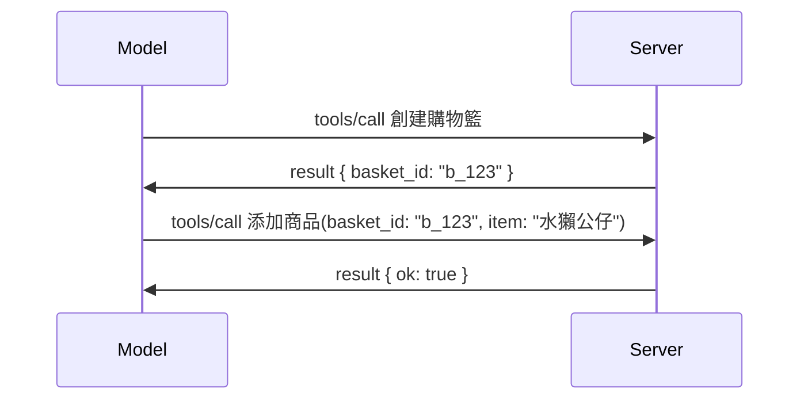

# MCP 有什麼改變：2026-07-28 發行候選版

> **狀態：** 發行候選版。`2026-07-28` 規範在撰寫時尚未定案。該規範於 2026 年 5 月 21 日宣布，預定於 2026 年 7 月 28 日發行。本課程說明的內容皆基於發行候選版；在依規範開發前，請查閱[草案規範](https://modelcontextprotocol.io/specification/draft)及其[變更記錄](https://modelcontextprotocol.io/specification/draft/changelog)以獲取最新進度。本課程其餘內容基於現行穩定版本 **MCP 規範 2025-11-25**，在 `2026-07-28` 發佈後將進行更新。

## 概覽

`2026-07-28` 是 MCP 啟動以來最大幅度的修訂。六個規範增強提案（SEP）移除協議層的會話機制，讓 MCP 在傳輸層變為無狀態，擴充機制成為首要、可版本管理的機制，而你在本課程早先已學到的多項功能（Roots、Sampling、Logging）在新的生命週期政策下被標示為已棄用。此課程總結了改動內容、其重要性以及對你基於 `2025-11-25` 撰寫的程式碼有何影響。

來源：[The 2026-07-28 MCP Specification Release Candidate](https://blog.modelcontextprotocol.io/posts/2026-07-28-release-candidate/)（Model Context Protocol 部落格，David Soria Parra 與 Den Delimarsky 著）。

## 學習目標

完成本課程後，你能夠：

- 解釋 MCP 為何朝無狀態協議核心轉變，以及此做法解決了水平擴展部署的什麼問題。
- 描述 `initialize`/`initialized` 握手及 `Mcp-Session-Id` 標頭如何被取代。
- 了解新的 `Mcp-Method` 與 `Mcp-Name` 標頭，以及 `ttlMs`/`cacheScope` 緩存元資料。
- 認識擴充架構與本次發行隨附的兩個擴充：MCP Apps 與 Tasks。
- 列出六個加強 OAuth 2.0 / OIDC 對齊的授權 SEP。
- 辨識哪些核心功能（Roots、Sampling、Logging）現已棄用，以及實務上的意義。
- 解釋工具 `inputSchema`/`outputSchema` 採用完整 JSON Schema 2020-12 的變更。

## 無狀態協議

重點改動：MCP 在協議層變為無狀態。

### 之前（2025-11-25）：會話綁定在某一伺服器實例上

透過 Streamable HTTP 呼叫工具時會開始一個 `initialize` 握手，伺服器回應一個 `Mcp-Session-Id` 標頭，後續所有請求都必須攜帶：

```http
POST /mcp HTTP/1.1
Mcp-Session-Id: 1868a90c-3a3f-4f5b
Content-Type: application/json

{"jsonrpc":"2.0","id":2,"method":"tools/call",
 "params":{"name":"search","arguments":{"q":"otters"}}}
```

因為會話綁定於發行會話 ID 的伺服器實例，水平擴展佈署必須在負載平衡器上配置 <strong>黏性路由</strong>，且實例間需有 <strong>共享會話存儲</strong>。

### 之後（2026-07-28）：每個請求都是自包含的

```http
POST /mcp HTTP/1.1
MCP-Protocol-Version: 2026-07-28
Mcp-Method: tools/call
Mcp-Name: search
Content-Type: application/json

{"jsonrpc":"2.0","id":1,"method":"tools/call",
 "params":{"name":"search","arguments":{"q":"otters"},
           "_meta":{"io.modelcontextprotocol/clientInfo":{"name":"my-app","version":"1.0"}}}}
```

任何伺服器實例都能處理此請求。關鍵改動有：

- **移除 `initialize`/`initialized` 握手**（[SEP-2575](https://github.com/modelcontextprotocol/modelcontextprotocol/pull/2575)）。協議版本、客戶端資訊及功能移入每個請求的 `_meta`。新增 `server/discover` 方法讓客戶端在需要時先取得伺服器功能。
- **移除 `Mcp-Session-Id` 標頭及協議層會話**（[SEP-2567](https://github.com/modelcontextprotocol/modelcontextprotocol/pull/2567)）。協議層不再需要黏性路由及共享會話存儲。

### 無狀態協議，有狀態應用

移除協議層會話不代表伺服器不能是有狀態的。建議模式與 HTTP API 一向相同：從一次工具呼叫中制定顯式句柄（例如 `basket_id`、`browser_id`），模型於後續呼叫中將該句柄作為普通參數傳回。



此舉使狀態對模型可見且合理，而非隱藏在傳輸元資料中，且允許任一伺服器實例處理任一呼叫。

### 伺服器到客戶端請求，重構

無狀態協議仍需伺服器在呼叫中途向客戶端請求（例如誘導輸入提示）的方式：

- <strong>伺服器主導的請求只能在伺服器積極處理客戶端請求時發出</strong>（[SEP-2260](https://github.com/modelcontextprotocol/modelcontextprotocol/pull/2260)）— 以前是建議，現在成為必要。使用者不會無故收到提示。
- <strong>多回合請求</strong>（[SEP-2322](https://github.com/modelcontextprotocol/modelcontextprotocol/pull/2322)）取代長時間保持 SSE 流。伺服器返回 `InputRequiredResult`：

  ```json
  {
    "resultType": "inputRequired",
    "inputRequests": {
      "confirm": {
        "type": "elicitation",
        "message": "Delete 3 files?",
        "schema": { "type": "boolean" }
      }
    },
    "requestState": "eyJzdGVwIjoxLCJmaWxlcyI6WyJhIiwiYiIsImMiXX0="
  }
  ```

  客戶端收集答案後，重新提出帶有 `inputResponses` 及回音 `requestState` 的原始呼叫。所有伺服器實例皆可接手重試，因為所需資訊全部包含在負載中。

### 可路由、可緩存、可追蹤

三個小改動讓無狀態流量更易於操作：

- **Streamable HTTP 必須帶 `Mcp-Method` 和 `Mcp-Name` 標頭**（[SEP-2243](https://github.com/modelcontextprotocol/modelcontextprotocol/pull/2243)），讓負載平衡器、網關及速率限制器能以操作路由，而無需檢視 JSON 主體。標頭與主體不一致的請求將遭拒。
- **`tools/list` 和資源讀取結果帶有 `ttlMs` 與 `cacheScope`**（[SEP-2549](https://github.com/modelcontextprotocol/modelcontextprotocol/pull/2549)），仿 HTTP `Cache-Control`。客戶端得知列表結果的有效期限及是否可跨用戶共享，無需長時間 SSE 流更新。
- **在 `_meta` 中記錄 W3C Trace Context 傳播**（[SEP-414](https://github.com/modelcontextprotocol/modelcontextprotocol/pull/414)），規範 `traceparent`、`tracestate` 與 `baggage` 標記名稱，使分散式追蹤能跨客戶端 SDK、MCP 伺服器與下游系統在 [OpenTelemetry](https://opentelemetry.io/) 相容平台追蹤呼叫。

## 擴充成為首要機制

擴充在 `2025-11-25` 是非正式存在。[SEP-2133](https://github.com/modelcontextprotocol/modelcontextprotocol/pull/2133) 正式化它們：

- 擴充透過反向 DNS ID 辨識。
- 客戶端與伺服器功能的 `extensions` 映射中協商。
- 擴充放在自己的 `ext-*` 倉庫，有授權維護者，版本獨立於核心規範。
- SEP 流程中新增擴充軌道，讓它們得以從實驗走向正式。

本次發行隨附兩個正式擴充。

### MCP Apps：伺服器呈現的使用者界面

[MCP Apps](https://blog.modelcontextprotocol.io/posts/2026-01-26-mcp-apps/)（[SEP-1865](https://github.com/modelcontextprotocol/modelcontextprotocol/pull/1865)）讓伺服器可發送交互式 HTML 介面，主機在沙盒 iframe 中呈現。工具預先宣告 UI 範本，主機能事先快取、緩存並進行安全審查後再執行。你已在[課程 15：MCP Apps](../03-GettingStarted/15-mcp-apps/README.md)學過其基礎 — 在擴充框架內，MCP Apps 現正式成為擴充，而非實驗性核心功能。

### Tasks 正式成為擴充

Tasks 在 `2025-11-25` 作為實驗性核心功能發佈。產品化使用帶來巨大改造，因此其適合放在擴充中：[Tasks 擴充](https://github.com/modelcontextprotocol/modelcontextprotocol/pull/2663)圍繞無狀態模型重新塑造生命週期 — 伺服器能用工具呼叫回應以任務句柄，客戶端用 `tasks/get`、`tasks/update` 與 `tasks/cancel` 推動它進展。任務創建由伺服器主導：客戶端宣告擴充，伺服器判斷何時以任務方式運行呼叫。因為不能安全限定範圍，`tasks/list` 被完全移除。

> **遷移提醒：** 若你實作過實驗性 `2025-11-25` Tasks API，需要改用新擴充生命週期 — 舊版不相容。

## 授權加強

六個 SEP 強化[授權規範](https://modelcontextprotocol.io/specification/draft/basic/authorization)，使其更貼近真實世界 OAuth 2.0 / OpenID Connect 佈署：

| SEP | 變更 |
|---|---|
| [SEP-2468](https://github.com/modelcontextprotocol/modelcontextprotocol/pull/2468) | 客戶端必須依 [RFC 9207](https://www.rfc-editor.org/rfc/rfc9207) 驗證授權回應的 `iss` 參數，以降低 MCP 單一客戶端、多伺服器模式中常見的混淆攻擊。未來版本將強制拒絕缺少 `iss` 的回應。 |
| [SEP-837](https://github.com/modelcontextprotocol/modelcontextprotocol/pull/837) | 客戶端於動態客戶端註冊時宣告 OpenID Connect `application_type`，避免授權伺服器將桌面/CLI 用戶端誤認為 `"web"`，並拒絕其 localhost 重導 URI。 |
| [SEP-2352](https://github.com/modelcontextprotocol/modelcontextprotocol/pull/2352) | 客戶端將已註冊證書綁定至發行授權伺服器的 `issuer`，並在資源在授權伺服器間遷移時重新註冊。 |
| [SEP-2207](https://github.com/modelcontextprotocol/modelcontextprotocol/pull/2207) | 文件化如何向 OpenID Connect 類型授權伺服器請求更新令牌。 |
| [SEP-2350](https://github.com/modelcontextprotocol/modelcontextprotocol/pull/2350) | 釐清權限提升（step-up authorization）期間的範圍累積。 |
| [SEP-2351](https://github.com/modelcontextprotocol/modelcontextprotocol/pull/2351) | 釐清 `.well-known` 發現字尾。 |

若你現正打造 MCP 授權伺服器，請現在開始在授權回應中提供 `iss` — 詳見當前授權指引 [02-Security](../02-Security/README.md)。

## Roots、Sampling 與 Logging 被棄用

根據新的[功能生命週期政策](https://github.com/modelcontextprotocol/modelcontextprotocol/pull/2577)（[SEP-2577](https://github.com/modelcontextprotocol/modelcontextprotocol/pull/2577)），你在[核心概念](./README.md#roots)學到的三個核心用戶端原語被標示為 <strong>棄用</strong>：

| 功能 | 建議替代方案 |
|---|---|
| Roots | 工具參數、資源 URI 或伺服器設定 |
| Sampling | 直接整合 LLM 供應商 API |
| Logging | stdio 傳輸用 `stderr`；結構化可觀察性則用 OpenTelemetry |

這些僅是 <strong>註解式棄用</strong>：方法、型別和能力標記在此版本及一年內每個規範版本皆繼續有效。全面移除須另行提出 SEP，依生命週期政策審議 — 因此你現行的 [Sampling](../03-GettingStarted/14-sampling/README.md) 範例不會壞掉，但新伺服器應首選上述替代作法。

## 工具採用完整 JSON Schema 2020-12

工具的 `inputSchema` 與 `outputSchema` 採用完整版 [JSON Schema 2020-12](https://json-schema.org/draft/2020-12)（[SEP-2106](https://github.com/modelcontextprotocol/modelcontextprotocol/pull/2106)）：

- 輸入結構保持 `type: "object"` 根約束，但允許使用組合 (`oneOf`、`anyOf`、`allOf`)、條件語句與引用 (`$ref`、`$defs`)。
- 輸出結構不受限制，`structuredContent` 可為任何 JSON 值，不限於物件。
- 實作時不應自動展開外部 `$ref` URI，且應限制結構深度及驗證時間（防禦服務拒絕攻擊的考量，若在伺服器端驗證結構）。

另外，資源缺失錯誤碼由 MCP 自訂的 `-32002` 改為 JSON-RPC 標準的 `-32602`（參數無效）（[SEP-2164](https://github.com/modelcontextprotocol/modelcontextprotocol/pull/2164)）。若你的用戶端以字面碼 `-32002` 作匹配，請更新對應邏輯。

## 協議未來的演進方向

本次發行包含破壞性變更，MCP 維護者不打算將此視為常態。三個治理 SEP 旨在預防重蹈覆轍：

- <strong>功能生命週期政策</strong>，為每項功能設定「啟用→棄用→移除」路徑，棄用與最早可移除時間至少間隔十二個月。
- <strong>擴充框架</strong>，讓新功能以自選擴充形式發佈，先行穩定後（如果有）才納入核心規範。

- 一個標準軌跡 SEP 在匹配的情境落實於 [conformance suite](https://github.com/modelcontextprotocol/conformance) ([SEP-2484](https://github.com/modelcontextprotocol/modelcontextprotocol/pull/2484)) 之前，不得再達到最終狀態 — 這套也是[SDK 分級系統](https://github.com/modelcontextprotocol/modelcontextprotocol/pull/1777) 評核官方 SDK 的套件。

## 發佈時間表和驗證

- 發行候選版本已於2026年5月21日鎖定。
- 最終規範預計於2026年7月28日發佈。
- 兩者間十週的期間讓 SDK 維護者和客戶端實作者能針對真實工作負載驗證改動；根據[SDK 分級系統](https://modelcontextprotocol.io/docs/sdk)，期望 Tier 1 SDK 在此期間提供支援。
- 請在 [草案規範](https://modelcontextprotocol.io/specification/draft) 和其 [變更日誌](https://modelcontextprotocol.io/specification/draft/changelog) 跟蹤完整的變更集。

## 這對本課程的意義

到目前為止你所學的內容都對應於 **2025-11-25**，該版本將會是穩定規範直到 `2026-07-28` 發佈。具體來說：

- **Sessions 與 `initialize` 握手** （涵蓋於[核心概念](./README.md)和[第6課：HTTP 串流](../03-GettingStarted/06-http-streaming/README.md)）仍依現有文件運作，但當你升級至相容`2026-07-28`的 SDK 後，預期會被上述無狀態請求模型取代。
- <strong>取樣與根節點</strong>（同樣涵蓋於[核心概念](./README.md)）仍完全正常運作，但已被棄用 — 新設計應優先採用上述替代模式。
- **實驗性的 Tasks 功能**，如果你曾使用過，將需遷移至 Tasks 擴展的新生命週期。
- **MCP 應用程式**（[第15課](../03-GettingStarted/15-mcp-apps/README.md)）實際上不受影響；它僅是移至正式的擴展框架下。

## 額外資源

- [2026-07-28 MCP 規範發行候選版本（部落格文章）](https://blog.modelcontextprotocol.io/posts/2026-07-28-release-candidate/)
- [MCP 傳輸未來展望](https://blog.modelcontextprotocol.io/posts/2025-12-19-mcp-transport-future/)
- [MCP 草案規範](https://modelcontextprotocol.io/specification/draft)
- [MCP 草案變更日誌](https://modelcontextprotocol.io/specification/draft/changelog)
- [SEP 指南](https://modelcontextprotocol.io/community/sep-guidelines)
- [MCP SDK 分級系統](https://modelcontextprotocol.io/docs/sdk)

## 接下來的步驟

回到 [核心概念](./README.md) 或繼續往 [安全性](../02-Security/README.md) 頁面，看看現有的 `2025-11-25` 指引如何映射到即將到來的版本。

---

<!-- CO-OP TRANSLATOR DISCLAIMER START -->
**免責聲明**：
本文件由 AI 翻譯服務 [Co-op Translator](https://github.com/Azure/co-op-translator) 翻譯而成。雖然我們致力於確保準確性，但請注意，機器自動翻譯可能包含錯誤或不準確之處。原始文件的母語版本應被視為權威來源。對於重要資訊，建議進行專業人工翻譯。我們不對因使用本翻譯而產生的任何誤解或誤釋承擔責任。
<!-- CO-OP TRANSLATOR DISCLAIMER END -->