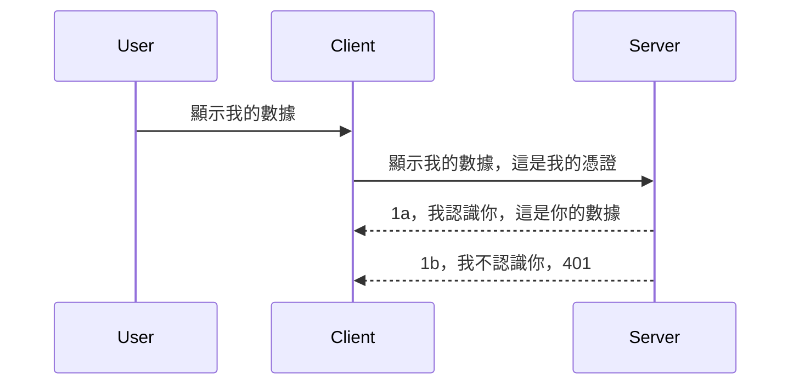

# 簡易認證

MCP SDK 支援使用 OAuth 2.1，說實話，這是一個相當複雜的流程，涉及身份驗證伺服器、資源伺服器、提交憑證、取得授權碼，再用授權碼換取承載權杖，直到最終取得資源資料。如果你不熟悉 OAuth（這其實是很值得實作的），建議一開始用一些基本的認證方式，然後慢慢增強安全性。所以本章旨在幫你打好基礎，再逐步進階到更高階的認證方法。

## 認證，我們在說什麼？

認證是 authentication 和 authorization 的統稱。我們需要做兩件事：

- **身份驗證（Authentication）**，就是確認我們是否允許一個人進入我們的家，也就是確認他們有權限「在這裡」，也就是能存取我們 MCP Server 上的資源伺服器。
- **授權（Authorization）**，則是判斷使用者是否有權限取用他們請求的特定資源，例如這些訂單或這些產品，或者是否只能讀取內容但不能刪除（只是舉例）。

## 憑證：我們如何告訴系統我們是誰

大多數網頁開發者習慣提供給伺服器一組憑證，通常是一組秘密，可用於表明他們是否被允許在這裡（身份驗證）。此憑證通常是經 Base64 編碼的使用者名稱和密碼，或者是唯一標識某特定使用者的 API 金鑰。

這通常是以名為 "Authorization" 的標頭傳送，像這樣：

```json
{ "Authorization": "secret123" }
```

這通常稱為基本認證。整個流程大致如下：



了解整個流程後，我們該如何實作？多數網路伺服器提供 middleware 的機制，即在請求處理過程中運行一段程式碼，能驗證憑證，若憑證有效則讓請求繼續，否則回傳認證錯誤。我們來看看如何實作：

**Python**

```python
class AuthMiddleware(BaseHTTPMiddleware):
    async def dispatch(self, request, call_next):

        has_header = request.headers.get("Authorization")
        if not has_header:
            print("-> Missing Authorization header!")
            return Response(status_code=401, content="Unauthorized")

        if not valid_token(has_header):
            print("-> Invalid token!")
            return Response(status_code=403, content="Forbidden")

        print("Valid token, proceeding...")
       
        response = await call_next(request)
        # 添加任何自訂標頭或以某種方式更改回應
        return response


starlette_app.add_middleware(CustomHeaderMiddleware)
```

這裡我們：

- 創建一個名為 `AuthMiddleware` 的中介軟體，其 `dispatch` 方法由網頁伺服器調用。
- 將該中介軟體加入到網頁伺服器：

    ```python
    starlette_app.add_middleware(AuthMiddleware)
    ```

- 編寫驗證邏輯，檢查是否存在 Authorization 標頭且秘密是否有效：

    ```python
    has_header = request.headers.get("Authorization")
    if not has_header:
        print("-> Missing Authorization header!")
        return Response(status_code=401, content="Unauthorized")

    if not valid_token(has_header):
        print("-> Invalid token!")
        return Response(status_code=403, content="Forbidden")
    ```

若秘密存在且有效，就呼叫 `call_next` 讓請求繼續，並回傳回應。

    ```python
    response = await call_next(request)
    # 添加任何客戶標頭或以某種方式更改回應內容
    return response
    ```

運作原理是，當有網路請求送到伺服器時，這中介軟體會被觸發，根據實作內容會允許請求持續或是回傳錯誤，表示客戶端沒有權限繼續。

**TypeScript**

這裡我們用流行的 Express 框架建立中介軟體，在請求到達 MCP Server 前攔截請求。程式碼如下：

```typescript
function isValid(secret) {
    return secret === "secret123";
}

app.use((req, res, next) => {
    // 1. 是否有授權標頭？
    if(!req.headers["Authorization"]) {
        res.status(401).send('Unauthorized');
    }
    
    let token = req.headers["Authorization"];

    // 2. 驗證有效性。
    if(!isValid(token)) {
        res.status(403).send('Forbidden');
    }

   
    console.log('Middleware executed');
    // 3. 將請求傳遞到請求流程的下一步。
    next();
});
```

程式中我們做了：

1. 檢查 Authorization 標頭是否存在，如無則回 401 錯誤。
2. 確認憑證/權杖有效性，無效則回 403 錯誤。
3. 最後讓請求繼續執行並回傳所需資源。

## 練習：實作身分驗證

讓我們用所學知識來嘗試實作。計劃如下：

伺服器端

- 建立網頁伺服器與 MCP 實例。
- 為伺服器實作一個中介軟體。

用戶端

- 以標頭傳遞憑證發出網路請求。

### -1- 建立網頁伺服器與 MCP 實例

> <strong>展望未來：</strong>下面 TypeScript 範例依據 **MCP 規範 2025-11-25**，使用以 `mcp-session-id` 為鍵的 `transports` Map 追蹤 HTTP 傳輸。在 2026-07-28 RC 版本將取消初始化握手與會話 ID，改用無狀態、全自包含的請求，故此每會話傳輸映射也將消失。詳見 [MCP 變更內容：2026-07-28 發行候選版](../../01-CoreConcepts/mcp-2026-07-28-release-candidate.md)。

首先，我們需要建立網頁伺服器實例與 MCP Server。

**Python**

這裡我們建立 MCP 伺服器實例，並用 starlette 建立網頁 App，再用 uvicorn 主機化。

```python
# 建立 MCP 伺服器

app = FastMCP(
    name="MCP Resource Server",
    instructions="Resource Server that validates tokens via Authorization Server introspection",
    host=settings["host"],
    port=settings["port"],
    debug=True
)

# 建立 starlette 網頁應用程式
starlette_app = app.streamable_http_app()

# 透過 uvicorn 提供應用程式服務
async def run(starlette_app):
    import uvicorn
    config = uvicorn.Config(
            starlette_app,
            host=app.settings.host,
            port=app.settings.port,
            log_level=app.settings.log_level.lower(),
        )
    server = uvicorn.Server(config)
    await server.serve()

run(starlette_app)
```

這段程式包含：

- 建立 MCP Server。
- 從 MCP Server 建構 starlette 網頁應用，使用 `app.streamable_http_app()`。
- 用 uvicorn 主機與服務此網頁應用，`server.serve()`。

**TypeScript**

這裡我們創建 MCP Server 實例。

```typescript
const server = new McpServer({
      name: "example-server",
      version: "1.0.0"
    });

    // ... 設置伺服器資源、工具及提示 ...
```

這個 MCP Server 的建立，需要放在 POST /mcp 路由定義中，所以下面將上述程式移動：

```typescript
import express from "express";
import { randomUUID } from "node:crypto";
import { McpServer } from "@modelcontextprotocol/sdk/server/mcp.js";
import { StreamableHTTPServerTransport } from "@modelcontextprotocol/sdk/server/streamableHttp.js";
import { isInitializeRequest } from "@modelcontextprotocol/sdk/types.js"

const app = express();
app.use(express.json());

// 儲存以會話ID區分的傳輸映射
const transports: { [sessionId: string]: StreamableHTTPServerTransport } = {};

// 處理客戶端至服務器的POST請求
app.post('/mcp', async (req, res) => {
  // 檢查是否已存在會話ID
  const sessionId = req.headers['mcp-session-id'] as string | undefined;
  let transport: StreamableHTTPServerTransport;

  if (sessionId && transports[sessionId]) {
    // 重用現有的傳輸
    transport = transports[sessionId];
  } else if (!sessionId && isInitializeRequest(req.body)) {
    // 新的初始化請求
    transport = new StreamableHTTPServerTransport({
      sessionIdGenerator: () => randomUUID(),
      onsessioninitialized: (sessionId) => {
        // 根據會話ID儲存傳輸
        transports[sessionId] = transport;
      },
      // 預設情況下為了向後相容性，DNS重綁定保護是關閉的。如果你在本地運行這個服務器，
      // 請確保設置：
      // enableDnsRebindingProtection: true,
      // allowedHosts: ['127.0.0.1'],
    });

    // 傳輸關閉時清理資源
    transport.onclose = () => {
      if (transport.sessionId) {
        delete transports[transport.sessionId];
      }
    };
    const server = new McpServer({
      name: "example-server",
      version: "1.0.0"
    });

    // ... 設置服務器資源、工具和提示 ...

    // 連接至MCP服務器
    await server.connect(transport);
  } else {
    // 無效請求
    res.status(400).json({
      jsonrpc: '2.0',
      error: {
        code: -32000,
        message: 'Bad Request: No valid session ID provided',
      },
      id: null,
    });
    return;
  }

  // 處理請求
  await transport.handleRequest(req, res, req.body);
});

// 可重用的GET和DELETE請求處理器
const handleSessionRequest = async (req: express.Request, res: express.Response) => {
  const sessionId = req.headers['mcp-session-id'] as string | undefined;
  if (!sessionId || !transports[sessionId]) {
    res.status(400).send('Invalid or missing session ID');
    return;
  }
  
  const transport = transports[sessionId];
  await transport.handleRequest(req, res);
};

// 處理用於服務器至客戶端通知的GET請求（透過SSE）
app.get('/mcp', handleSessionRequest);

// 處理用於終止會話的DELETE請求
app.delete('/mcp', handleSessionRequest);

app.listen(3000);
```

你會發現 MCP Server 建立被移動至 `app.post("/mcp")` 裡面了。

接著進入下一步，實作中介軟體來驗證傳入憑證。

### -2- 為伺服器實作中介軟體

接下來是中介軟體部分，我們會建立一個中介軟體，尋找 `Authorization` 標頭裡的憑證並驗證。若合格則請求會繼續執行（例如列出工具、讀取資源或該 MCP 功能）。

**Python**

建立中介軟體需繼承 `BaseHTTPMiddleware` 類別。兩個重要參數：

- 請求物件 `request`，用於讀取標頭資訊。
- `call_next` Callback，當接受憑證時要調用此讓請求繼續。

首先處理如果缺少 `Authorization` 標頭時：

```python
has_header = request.headers.get("Authorization")

# 無標頭，返回401，否則繼續。
if not has_header:
    print("-> Missing Authorization header!")
    return Response(status_code=401, content="Unauthorized")
```

這裡送出 401 未授權訊息，因為客戶端驗證失敗。

接著如果有提交憑證，我們要驗證其有效性：

```python
 if not valid_token(has_header):
    print("-> Invalid token!")
    return Response(status_code=403, content="Forbidden")
```

注意上面回傳了 403 禁止訊息。以下是一個完整的中介軟體範例：

```python
class AuthMiddleware(BaseHTTPMiddleware):
    async def dispatch(self, request, call_next):

        has_header = request.headers.get("Authorization")
        if not has_header:
            print("-> Missing Authorization header!")
            return Response(status_code=401, content="Unauthorized")

        if not valid_token(has_header):
            print("-> Invalid token!")
            return Response(status_code=403, content="Forbidden")

        print("Valid token, proceeding...")
        print(f"-> Received {request.method} {request.url}")
        response = await call_next(request)
        response.headers['Custom'] = 'Example'
        return response

```

很好，那 `valid_token` 函數呢？看下方：

```python
# 唔好用喺生產環境 - 要改善佢 !!
def valid_token(token: str) -> bool:
    # 移除 "Bearer " 前綴
    if token.startswith("Bearer "):
        token = token[7:]
        return token == "secret-token"
    return False
```

顯然還有改進空間。

重要提示：你絕不該直接在程式碼中寫入這類秘密，理想作法是從資料來源或身份提供者（IDP）取值，或者更好讓 IDP 進行驗證。

**TypeScript**

用 Express 實作時，需呼叫 `use` 方法，傳入中介軟體函式。

我們需要：

- 操作請求變數，檢查 `Authorization` 欄位傳入的憑證。
- 驗證憑證，如合法則讓請求繼續執行並讓 MCP 請求執行（舉例列出工具、讀取資源或其他 MCP 功能）。

這裡先檢查是否有 `Authorization` 標頭，沒有就阻擋請求：

```typescript
if(!req.headers["authorization"]) {
    res.status(401).send('Unauthorized');
    return;
}
```

如未送出標頭，會收到 401 錯誤。

接著檢查憑證是否有效，若無效同樣阻擋請求，不過錯誤略為不同：

```typescript
if(!isValid(token)) {
    res.status(403).send('Forbidden');
    return;
} 
```

可看到會收到 403 錯誤。

下面是完整程式：

```typescript
app.use((req, res, next) => {
    console.log('Request received:', req.method, req.url, req.headers);
    console.log('Headers:', req.headers["authorization"]);
    if(!req.headers["authorization"]) {
        res.status(401).send('Unauthorized');
        return;
    }
    
    let token = req.headers["authorization"];

    if(!isValid(token)) {
        res.status(403).send('Forbidden');
        return;
    }  

    console.log('Middleware executed');
    next();
});
```

我們已設置網頁伺服器以接受此中介軟體來驗證客戶端可能送來的憑證。那客戶端該怎麼做呢？

### -3- 用標頭帶著憑證送出網頁請求

我們要確保客戶端帶著憑證經由標頭送出。由於我們會用 MCP Client 來做，需弄清楚如何操作。

**Python**

客戶端需帶入一個包含憑證的標頭，如下：

```python
# 唔好硬編碼呢個值，最少要放喺環境變量或者更安全嘅儲存位置
token = "secret-token"

async with streamablehttp_client(
        url = f"http://localhost:{port}/mcp",
        headers = {"Authorization": f"Bearer {token}"}
    ) as (
        read_stream,
        write_stream,
        session_callback,
    ):
        async with ClientSession(
            read_stream,
            write_stream
        ) as session:
            await session.initialize()
      
            # 待辦，喺客戶端想做啲乜，例如列出工具、呼叫工具等等
```

注意我們如何填寫 `headers`：`headers = {"Authorization": f"Bearer {token}"}`。

**TypeScript**

可分成兩步：

1. 將憑證放入設定物件。
2. 把設定物件傳給傳輸模組。

```typescript

// 唔好似呢度咁硬編碼數值，最少應該放喺環境變量，並用 dotenv（喺開發模式）之類嘅工具。
let token = "secret123"

// 定義一個客戶端傳輸選項對象
let options: StreamableHTTPClientTransportOptions = {
  sessionId: sessionId,
  requestInit: {
    headers: {
      "Authorization": "secret123"
    }
  }
};

// 將選項對象傳入傳輸層
async function main() {
   const transport = new StreamableHTTPClientTransport(
      new URL(serverUrl),
      options
   );
```

上面可看到，建立了 `options` 物件，把標頭放在 `requestInit` 屬性下。

重要：那怎麼改進？現實中，光是這樣傳憑證風險還是很大，除非至少用 HTTPS。即使如此，憑證還是可能被竊取，因此需要能撤銷權杖的機制，並加上地理位置檢查、請求頻率異常（機器人行為）、總之還有許多要考慮的安全議題。

不過對於簡單的 API，如果你只想禁止未驗證用戶呼叫接口，這種方式還算是個不錯的起點。

不過接下來我們試著用標準格式來強化安全性，如 JSON Web Token，稱為 JWT 或「JOT」權杖。

## JSON Web Token，JWT

我們想從簡易憑證提升，那用 JWT 最大的改進是什麼呢？

- <strong>安全性提升</strong>。傳統基本認證裡，你一再傳送使用者密碼或 API Key，有風險。用 JWT，你先認證並取得代幣，且代幣有時效限制會過期。JWT 也便於細粒度控制角色、範圍與權限。
- <strong>無狀態與擴展性</strong>。JWT 本身攜帶所有使用者資訊，不需伺服器端保存會話，且可在本地驗證代幣。
- <strong>互通性與聯邦身份</strong>。JWT 是 OpenID Connect 核心部分，並用於已知身份提供者如 Entra ID、Google Identity 和 Auth0，支持單一登入等企業級功能。
- <strong>模組化與彈性</strong>。JWT 也能用於 API Gateway 例如 Azure API Management、NGINX 等，支持用戶身份認證與伺服器間通訊，包括代擬與委派場景。
- <strong>效能與快取</strong>。解析後的 JWT 可快取，降低重複解析負擔，對高流量應用提高吞吐量，減輕基礎設施負載。
- <strong>進階功能</strong>。亦支持代幣內省（伺服器檢驗有效性）及撤銷（令代幣失效）。

這麼多優點，就讓我們看看如何升級程式碼。

## 將基本認證改成使用 JWT

大方向我們需做改變：

- **學習如何構造 JWT 代幣**，以便客戶端送給伺服器。
- **驗證 JWT 代幣**，並授權合法代幣使用者取得資源。
- <strong>安全存放代幣</strong>，代幣如何儲存。
- <strong>保護路由</strong>，保護路由與特定 MCP 功能。
- <strong>增加刷新權杖</strong>，保持短期代幣並產生長期刷新權杖用來拿新代幣，實作刷新端點與旋轉策略。

### -1- 構造 JWT 代幣

JWT 代幣組成：

- <strong>標頭</strong>，包括用的演算法與代幣類型。
- <strong>負載</strong>，聲明，例如 sub（代幣代表的使用者或實體，在認證場景通常為使用者 ID）、exp（過期時間）、role（角色）。
- <strong>簽名</strong>，透過秘密或私鑰簽署。

我們需要構造標頭、負載並編碼成代幣。

**Python**

```python

import jwt
import jwt
from jwt.exceptions import ExpiredSignatureError, InvalidTokenError
import datetime

# 用於簽署 JWT 的密鑰
secret_key = 'your-secret-key'

header = {
    "alg": "HS256",
    "typ": "JWT"
}

# 用戶信息及其聲明和過期時間
payload = {
    "sub": "1234567890",               # 主體（用戶 ID）
    "name": "User Userson",                # 自定義聲明
    "admin": True,                     # 自定義聲明
    "iat": datetime.datetime.utcnow(),# 簽發時間
    "exp": datetime.datetime.utcnow() + datetime.timedelta(hours=1)  # 過期時間
}

# 編碼它
encoded_jwt = jwt.encode(payload, secret_key, algorithm="HS256", headers=header)
```

上述程式碼中，我們：

- 用 HS256 演算法與 JWT 類型定義了標頭。
- 建構了包含主體（使用者 ID）、使用者名稱、角色、發行時間與到期時間的負載，實現了前述「有時效限制」的特性。

**TypeScript**

這裡需要一些套件來幫助製作 JWT 代幣。

套件

```sh

npm install jsonwebtoken
npm install --save-dev @types/jsonwebtoken
```

有了套件後，讓我們創建標頭、負載並編碼代幣。

```typescript
import jwt from 'jsonwebtoken';

const secretKey = 'your-secret-key'; // 在生產環境中使用環境變數

// 定義負載
const payload = {
  sub: '1234567890',
  name: 'User usersson',
  admin: true,
  iat: Math.floor(Date.now() / 1000), // 發行時間
  exp: Math.floor(Date.now() / 1000) + 60 * 60 // 1小時後過期
};

// 定義標頭（可選，jsonwebtoken 設置默認值）
const header = {
  alg: 'HS256',
  typ: 'JWT'
};

// 創建令牌
const token = jwt.sign(payload, secretKey, {
  algorithm: 'HS256',
  header: header
});

console.log('JWT:', token);
```

該代幣：

用 HS256 簽署
有效期 1 小時
包含 sub、name、admin、iat 與 exp 聲明。

### -2- 驗證代幣

我們還需要驗證代幣，這通常在伺服器端進行，以確保客戶端送來的物件有效。我們會檢查結構與有效期限，也建議增加其他驗證，例如確認用戶是否存在於系統等等。

驗證代幣先需解碼並讀取內容，然後開始逐項驗證：

**Python**

```python

# 解碼並驗證 JWT
try:
    decoded = jwt.decode(token, secret_key, algorithms=["HS256"])
    print("✅ Token is valid.")
    print("Decoded claims:")
    for key, value in decoded.items():
        print(f"  {key}: {value}")
except ExpiredSignatureError:
    print("❌ Token has expired.")
except InvalidTokenError as e:
    print(f"❌ Invalid token: {e}")

```


在這段程式碼中，我們使用 token、密鑰和所選算法作為輸入呼叫 `jwt.decode`。請注意我們使用 try-catch 結構，因為驗證失敗會引發錯誤。

**TypeScript**

在這裡，我們需要呼叫 `jwt.verify` 來獲得可進一步分析的 token 解碼版本。如果此呼叫失敗，表示 token 的結構不正確或已不再有效。

```typescript

try {
  const decoded = jwt.verify(token, secretKey);
  console.log('Decoded Payload:', decoded);
} catch (err) {
  console.error('Token verification failed:', err);
}
```

注意：如前所述，我們應該執行額外檢查以確保此 token 指向系統中的用戶，並確保該用戶擁有其聲稱的權限。

接下來，讓我們看看基於角色的訪問控制，也稱為 RBAC。

## 新增基於角色的訪問控制

這個概念是我們想表達不同角色擁有不同的權限。例如，我們假設管理員可以做所有事情，普通用戶可以讀寫，訪客只能閱讀。因此，這裡有一些可能的權限級別：

- Admin.Write 
- User.Read
- Guest.Read

讓我們看看如何使用中介軟體實現這種控制。中介軟體可以針對每個路由添加，也可以針對所有路由添加。

**Python**

```python
from starlette.middleware.base import BaseHTTPMiddleware
from starlette.responses import JSONResponse
import jwt

# 不要將密鑰放在代碼中，這僅用於演示目的。請從安全的地方讀取它。
SECRET_KEY = "your-secret-key" # 放入環境變量中
REQUIRED_PERMISSION = "User.Read"

class JWTPermissionMiddleware(BaseHTTPMiddleware):
    async def dispatch(self, request, call_next):
        auth_header = request.headers.get("Authorization")
        if not auth_header or not auth_header.startswith("Bearer "):
            return JSONResponse({"error": "Missing or invalid Authorization header"}, status_code=401)

        token = auth_header.split(" ")[1]
        try:
            decoded = jwt.decode(token, SECRET_KEY, algorithms=["HS256"])
        except jwt.ExpiredSignatureError:
            return JSONResponse({"error": "Token expired"}, status_code=401)
        except jwt.InvalidTokenError:
            return JSONResponse({"error": "Invalid token"}, status_code=401)

        permissions = decoded.get("permissions", [])
        if REQUIRED_PERMISSION not in permissions:
            return JSONResponse({"error": "Permission denied"}, status_code=403)

        request.state.user = decoded
        return await call_next(request)


```

有幾種不同的方法可以像下面這樣添加中介軟體：

```python

# 替代 1：在構造 starlette 應用時添加中介軟件
middleware = [
    Middleware(JWTPermissionMiddleware)
]

app = Starlette(routes=routes, middleware=middleware)

# 替代 2：在 starlette 應用已構造後添加中介軟件
starlette_app.add_middleware(JWTPermissionMiddleware)

# 替代 3：為每個路由添加中介軟件
routes = [
    Route(
        "/mcp",
        endpoint=..., # 處理程序
        middleware=[Middleware(JWTPermissionMiddleware)]
    )
]
```

**TypeScript**

我們可以使用 `app.use` 和一個會對所有請求運行的中介軟體。

```typescript
app.use((req, res, next) => {
    console.log('Request received:', req.method, req.url, req.headers);
    console.log('Headers:', req.headers["authorization"]);

    // 1. 檢查是否已傳送授權標頭

    if(!req.headers["authorization"]) {
        res.status(401).send('Unauthorized');
        return;
    }
    
    let token = req.headers["authorization"];

    // 2. 檢查憑證是否有效
    if(!isValid(token)) {
        res.status(403).send('Forbidden');
        return;
    }  

    // 3. 檢查憑證用戶是否存在於我們系統中
    if(!isExistingUser(token)) {
        res.status(403).send('Forbidden');
        console.log("User does not exist");
        return;
    }
    console.log("User exists");

    // 4. 驗證憑證是否擁有正確的權限
    if(!hasScopes(token, ["User.Read"])){
        res.status(403).send('Forbidden - insufficient scopes');
    }

    console.log("User has required scopes");

    console.log('Middleware executed');
    next();
});

```

有很多事情我們可以讓中介軟體去做，且中介軟體應該去做的，包括：

1. 檢查授權標頭是否存在
2. 檢查 token 是否有效，我們呼叫了 `isValid`，這是我們寫的一個方法來檢查 JWT token 的完整性和有效性。
3. 驗證該用戶是否存在於我們的系統中，這是我們應該檢查的。

   ```typescript
    // 資料庫中的用戶
   const users = [
     "user1",
     "User usersson",
   ]

   function isExistingUser(token) {
     let decodedToken = verifyToken(token);

     // 待辦，檢查用戶是否存在於資料庫中
     return users.includes(decodedToken?.name || "");
   }
   ```

   如上，我們建立了一個非常簡單的 `users` 清單，理論上這應該在資料庫中。

4. 此外，我們還應該檢查 token 是否具備正確的權限。

   ```typescript
   if(!hasScopes(token, ["User.Read"])){
        res.status(403).send('Forbidden - insufficient scopes');
   }
   ```

   在上述中介軟體程式碼中，我們檢查 token 是否包含 User.Read 權限，如果沒有則回傳 403 錯誤。下方是 `hasScopes` 輔助方法。

   ```typescript
   function hasScopes(scope: string, requiredScopes: string[]) {
     let decodedToken = verifyToken(scope);
    return requiredScopes.every(scope => decodedToken?.scopes.includes(scope));
  }
   ```

Have a think which additional checks you should be doing, but these are the absolute minimum of checks you should be doing.

Using Express as a web framework is a common choice. There are helpers library when you use JWT so you can write less code.

- `express-jwt`, helper library that provides a middleware that helps decode your token.
- `express-jwt-permissions`, this provides a middleware `guard` that helps check if a certain permission is on the token.

Here's what these libraries can look like when used:

```typescript
const express = require('express');
const jwt = require('express-jwt');
const guard = require('express-jwt-permissions')();

const app = express();
const secretKey = 'your-secret-key'; // put this in env variable

// Decode JWT and attach to req.user
app.use(jwt({ secret: secretKey, algorithms: ['HS256'] }));

// Check for User.Read permission
app.use(guard.check('User.Read'));

// multiple permissions
// app.use(guard.check(['User.Read', 'Admin.Access']));

app.get('/protected', (req, res) => {
  res.json({ message: `Welcome ${req.user.name}` });
});

// Error handler
app.use((err, req, res, next) => {
  if (err.code === 'permission_denied') {
    return res.status(403).send('Forbidden');
  }
  next(err);
});

```

現在你已看到如何利用中介軟體來做身份驗證和授權，那 MCP 呢？它會改變我們做身份驗證的方式嗎？讓我們在下一節找出答案。

### -3- 為 MCP 新增 RBAC

到目前為止，你已看到如何透過中介軟體新增 RBAC，但對於 MCP 並沒有簡單的方式可以針對每個 MCP 功能新增 RBAC，那我們該怎麼做呢？我們只能加入像這樣的程式碼，檢查客戶端是否有權調用特定的工具：

你有幾種完成針對每個功能 RBAC 的選擇，以下是一些：

- 針對每個需要檢查權限等級的工具、資源、提示新增檢查。

   **python**

   ```python
   @tool()
   def delete_product(id: int):
      try:
          check_permissions(role="Admin.Write", request)
      catch:
        pass # 用戶端授權失敗，引發授權錯誤
   ```

   **typescript**

   ```typescript
   server.registerTool(
    "delete-product",
    {
      title: Delete a product",
      description: "Deletes a product",
      inputSchema: { id: z.number() }
    },
    async ({ id }) => {
      
      try {
        checkPermissions("Admin.Write", request);
        // 待辦，將 ID 發送到 productService 和遠端入口
      } catch(Exception e) {
        console.log("Authorization error, you're not allowed");  
      }

      return {
        content: [{ type: "text", text: `Deletected product with id ${id}` }]
      };
    }
   );
   ```


- 使用進階伺服器方法和請求處理程序，以最小化必須檢查的地方數量。

   **Python**

   ```python
   
   tool_permission = {
      "create_product": ["User.Write", "Admin.Write"],
      "delete_product": ["Admin.Write"]
   }

   def has_permission(user_permissions, required_permissions) -> bool:
      # user_permissions: 使用者擁有的權限列表
      # required_permissions: 工具所需的權限列表
      return any(perm in user_permissions for perm in required_permissions)

   @server.call_tool()
   async def handle_call_tool(
     name: str, arguments: dict[str, str] | None
   ) -> list[types.TextContent]:
    # 假設 request.user.permissions 是使用者的權限列表
     user_permissions = request.user.permissions
     required_permissions = tool_permission.get(name, [])
     if not has_permission(user_permissions, required_permissions):
        # 引發錯誤「你沒有權限調用工具 {name}」
        raise Exception(f"You don't have permission to call tool {name}")
     # 繼續並調用工具
     # ...
   ```   
   

   **TypeScript**

   ```typescript
   function hasPermission(userPermissions: string[], requiredPermissions: string[]): boolean {
       if (!Array.isArray(userPermissions) || !Array.isArray(requiredPermissions)) return false;
       // 如果用戶擁有至少一項所需權限則返回 true
       
       return requiredPermissions.some(perm => userPermissions.includes(perm));
   }
  
   server.setRequestHandler(CallToolRequestSchema, async (request) => {
      const { params: { name } } = request;
  
      let permissions = request.user.permissions;
  
      if (!hasPermission(permissions, toolPermissions[name])) {
         return new Error(`You don't have permission to call ${name}`);
      }
  
      // 繼續..
   });
   ```

   注意，你需要確保中介軟體將解碼後的 token 指派給請求的 user 屬性，這樣上方的程式碼才會簡單易懂。

### 總結

現在我們討論了如何一般性地新增 RBAC 支援，以及如何為 MCP 特別新增 RBAC，是時候自己嘗試實作安全性，確保你理解了這裡介紹的概念。

## 作業 1：使用基本驗證建置一個 mcp 伺服器和 mcp 用戶端

這裡你會利用先前所學，傳送認證資訊於標頭中。

## 解答 1

[解答 1](./code/basic/README.md)

## 作業 2：將作業 1 的方案升級為使用 JWT

使用第一個方案，但這次讓我們做改善。

不用 Basic Auth，改用 JWT。

## 解答 2

[解答 2](./solution/jwt-solution/README.md)

## 挑戰

新增「為 MCP 新增 RBAC」章節所描述的每工具 RBAC。

## 總結

希望你在本章學到了許多，從完全沒有安全性，到基本安全，到 JWT，以及如何將它加到 MCP。

我們已經建立了一個堅實的自訂 JWT 基礎，但隨著規模擴大，我們正朝著基於標準的身份模型邁進。採用像 Entra 或 Keycloak 這樣的身份提供者能讓我們將令牌簽發、驗證和生命週期管理卸載給可信平台——釋放我們專注於應用邏輯與使用者體驗。

為此，我們有一個更[進階的 Entra 章節](../../05-AdvancedTopics/mcp-security-entra/README.md)

## 下一步

- 下一步：[設定 MCP 主機](../12-mcp-hosts/README.md)

---

<!-- CO-OP TRANSLATOR DISCLAIMER START -->
**免責聲明**：
本文件由 AI 翻譯服務 [Co-op Translator](https://github.com/Azure/co-op-translator) 翻譯而成。雖然我們致力於確保準確性，但請注意，機器自動翻譯可能包含錯誤或不準確之處。原始文件的母語版本應被視為權威來源。對於重要資訊，建議進行專業人工翻譯。我們不對因使用本翻譯而產生的任何誤解或誤釋承擔責任。
<!-- CO-OP TRANSLATOR DISCLAIMER END -->