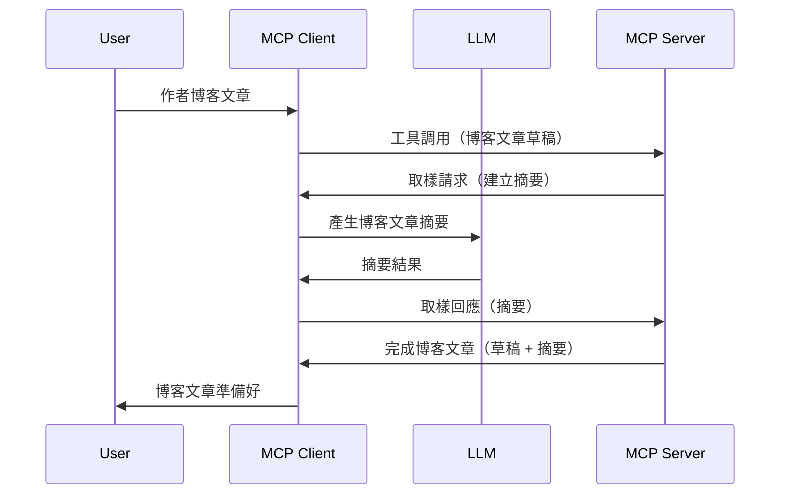

# 抽樣 - 將功能委派給客戶端

> **已棄用通知：** `2026-07-28` MCP 規範候選版本標記抽樣功能為已棄用，並建議直接整合 LLM 供應商 API。抽樣功能在 `2025-11-25` 版本中仍可使用，且在正式棄用後至少還能使用一年，因此本課程內容仍然有效 — 但新伺服器設計應考慮替代方案。詳見[2026-07-28 MCP 版本候選的變更內容](../../01-CoreConcepts/mcp-2026-07-28-release-candidate.md)。

有時候，您需要 MCP 客戶端與 MCP 伺服器協作來達成共同目標。可能有這樣的情況：伺服器需要客戶端上的 LLM 幫助。針對這種情形，您應該使用抽樣功能。

讓我們來探討幾個使用案例以及如何建構包含抽樣的解決方案。

## 概述

本課程專注於說明何時以及何地使用抽樣，以及如何配置抽樣。

## 學習目標

本章節中，我們將：

- 解釋抽樣是什麼以及何時使用。
- 展示如何在 MCP 中配置抽樣。
- 提供抽樣實際運作的範例。

## 什麼是抽樣及為何使用？

抽樣是一項進階功能，其運作方式如下：



### 抽樣請求

好，現在我們對一個合理場景有了宏觀認識，接下來談談伺服器發送給客戶端的抽樣請求。以下是此類請求的 JSON-RPC 格式範例：

```json
{
  "jsonrpc": "2.0",
  "id": 1,
  "method": "sampling/createMessage",
  "params": {
    "messages": [
      {
        "role": "user",
        "content": {
          "type": "text",
          "text": "Create a blog post summary of the following blog post: <BLOG POST>"
        }
      }
    ],
    "modelPreferences": {
      "hints": [
        {
          "name": "claude-3-sonnet"
        }
      ],
      "intelligencePriority": 0.8,
      "speedPriority": 0.5
    },
    "systemPrompt": "You are a helpful assistant.",
    "maxTokens": 100
  }
}
```

這裡有幾點值得說明：

- Prompt，在 content -> text 下，是我們給 LLM 的指示，要求它摘要部落格文章內容。

- **modelPreferences**。此部分就是使用偏好，一種對 LLM 建議的配置選項。使用者可選擇接受這些建議或自行更改。此範例中有關使用的模型、速度優先及智慧優先的推薦。
- **systemPrompt**，這是您的常規系統提示，為您的 LLM 設定個性及指導說明。
- **maxTokens**，另一個屬性，說明此任務建議使用的最大 token 數。

### 抽樣回應

這份回應是 MCP 客戶端最終回傳給 MCP 伺服器的內容，是客戶端調用 LLM，等待回應後構建的訊息。以下是其 JSON-RPC 格式範例：

```json
{
  "jsonrpc": "2.0",
  "id": 1,
  "result": {
    "role": "assistant",
    "content": {
      "type": "text",
      "text": "Here's your abstract <ABSTRACT>"
    },
    "model": "gpt-5",
    "stopReason": "endTurn"
  }
}
```

請注意回應內容正如我們要求，是部落格文章的摘要。此外也要注意回應中使用的 `model` 不是我們請求的，而是從 "claude-3-sonnet" 改為 "gpt-5"。這說明使用者可以自行改變使用模型，您的抽樣請求本質上是建議。

好了，既然我們了解主要流程以及這個「部落格文章創作＋摘要」實用任務，讓我們看看要如何啟用它。

### 訊息類型

抽樣訊息不限於文字，還可以傳送圖片及音訊。以下是 JSON-RPC 不同範例：

<strong>文字</strong>

```json
{
  "type": "text",
  "text": "The message content"
}
```

<strong>圖片內容</strong>

```json
{
  "type": "image",
  "data": "base64-encoded-image-data",
  "mimeType": "image/jpeg"
}
```

<strong>音訊內容</strong>

```json
{
  "type": "audio",
  "data": "base64-encoded-audio-data",
  "mimeType": "audio/wav"
}
```

> 注意：關於抽樣的更詳細資訊，請參考[官方文件](https://modelcontextprotocol.io/specification/2025-11-25/client/sampling)

## 如何在客戶端配置抽樣

> 注意：如果您只構建伺服器，這裡不需要做太多設定。

在客戶端，您需要如下指定此功能：

```json
{
  "capabilities": {
    "sampling": {}
  }
}
```

這會在選定的客戶端初始化與伺服器連線時被讀取。

## 抽樣實作範例 - 創建部落格文章

讓我們一同撰寫抽樣伺服器，我們需要做以下步驟：

1. 於伺服器建立一個工具。
1. 該工具應建立一個抽樣請求。
1. 工具須等待客戶端答覆該抽樣請求。
1. 之後產生工具結果。

逐步檢視程式碼：

### -1- 建立工具

**python**

```python
@mcp.tool()
async def create_blog(title: str, content: str, ctx: Context[ServerSession, None]) -> str:
    """Create a blog post and generate a summary"""

```

### -2- 建立抽樣請求

於您的工具中增加以下程式碼：

**python**

```python
post = BlogPost(
        id=len(posts) + 1,
        title=title,
        content=content,
        abstract=""
    )

prompt = f"Create an abstract of the following blog post: title: {title} and draft: {content} "

result = await ctx.session.create_message(
        messages=[
            SamplingMessage(
                role="user",
                content=TextContent(type="text", text=prompt),
            )
        ],
        max_tokens=100,
)

```

### -3- 等待回應並回傳

**python**

```python
post.abstract = result.content.text

posts.append(post)

# 返回完整的產品
return json.dumps({
    "id": post.title,
    "abstract": post.abstract
})
```

### -4- 完整程式碼

**python**

```python
from starlette.applications import Starlette
from starlette.routing import Mount, Host

from mcp.server.fastmcp import Context, FastMCP

from mcp.server.session import ServerSession
from mcp.types import SamplingMessage, TextContent

import json


from uuid import uuid4
from typing import List
from pydantic import BaseModel


mcp = FastMCP("Blog post generator")

# app = FastAPI()

posts = []

class BlogPost(BaseModel):
    id: int
    title: str
    content: str
    abstract: str

posts: List[BlogPost] = []

@mcp.tool()
async def create_blog(title: str, content: str, ctx: Context[ServerSession, None]) -> str:
    """Create a blog post and generate a summary"""

    post = BlogPost(
        id=len(posts) + 1,
        title=title,
        content=content,
        abstract=""
    )

    prompt = f"Create an abstract of the following blog post: title: {title} and draft: {content} "

    result = await ctx.session.create_message(
        messages=[
            SamplingMessage(
                role="user",
                content=TextContent(type="text", text=prompt),
            )
        ],
        max_tokens=100,
    )

    post.abstract = result.content.text

    posts.append(post)

    # 返回完整的博客文章
    return json.dumps({
        "id": post.title,
        "abstract": post.abstract
    })

if __name__ == "__main__":
    print("Starting server...")
    # mcp.run()
    mcp.run(transport="streamable-http")

# 使用以下命令運行應用程式：python server.py
```

### -5- 在 Visual Studio Code 中測試

在 Visual Studio Code 中測試，請進行：

1. 在終端機啟動伺服器
1. 將其加入 *mcp.json*（並確保啟動），範例如下：

   ```json
   "servers": {
      "blog-server": {
        "type": "http",
        "url": "http://localhost:8000/mcp"
      }
   }
   ```

1. 輸入提示詞：

   ```text
   create a blog post named "Where Python comes from", the content is "Python is actually named after Monty Python Flying Circus"
   ```

1. 允許抽樣執行。初次測試時，您會看到一個額外對話框需您同意，接著會出現詢問您是否執行工具的正常對話框。

1. 檢視結果。您將在 GitHub Copilot Chat 內看到渲染良好的結果，也可以查看原始 JSON 回應。

<strong>額外提示</strong>。Visual Studio Code 工具對抽樣有很好的支援。您可以在已安裝的伺服器上透過以下方式配置抽樣存取權限：

1. 前往擴充功能區域。
1. 在 "MCP SERVERS - INSTALLED" 部分點選您安裝的伺服器齒輪圖示。
1 選擇「配置模型存取權限」，在此您可選擇 GitHub Copilot 執行抽樣時可使用的模型。也可以透過「顯示抽樣請求」檢視近期所有抽樣請求。

## 作業

在此作業中，您將建構一個稍有不同的抽樣整合，支援生成產品描述。情境如下：

<strong>情境說明</strong>：電子商務後台人員需要協助，手動產生產品描述耗時過久。因此，您將建構一個解決方案，能呼叫名為 "create_product" 的工具，以 "title" 和 "keywords" 作為參數，該工具將產生完整產品內容，其中包含需由客戶端 LLM 填寫的 "description" 欄位。

建議：利用先前所學，透過抽樣請求構建此伺服器及其工具。

## 解決方案

[解決方案](./solution/README.md)

## 重要重點

抽樣是一個強大功能，當伺服器需要 LLM 協助時，能將任務委派給客戶端。

## 下一步

- [第四章 - 實際實作](../../04-PracticalImplementation/README.md)

---

<!-- CO-OP TRANSLATOR DISCLAIMER START -->
**免責聲明**：
本文件由 AI 翻譯服務 [Co-op Translator](https://github.com/Azure/co-op-translator) 翻譯而成。雖然我們致力於確保準確性，但請注意，機器自動翻譯可能包含錯誤或不準確之處。原始文件的母語版本應被視為權威來源。對於重要資訊，建議進行專業人工翻譯。我們不對因使用本翻譯而產生的任何誤解或誤釋承擔責任。
<!-- CO-OP TRANSLATOR DISCLAIMER END -->