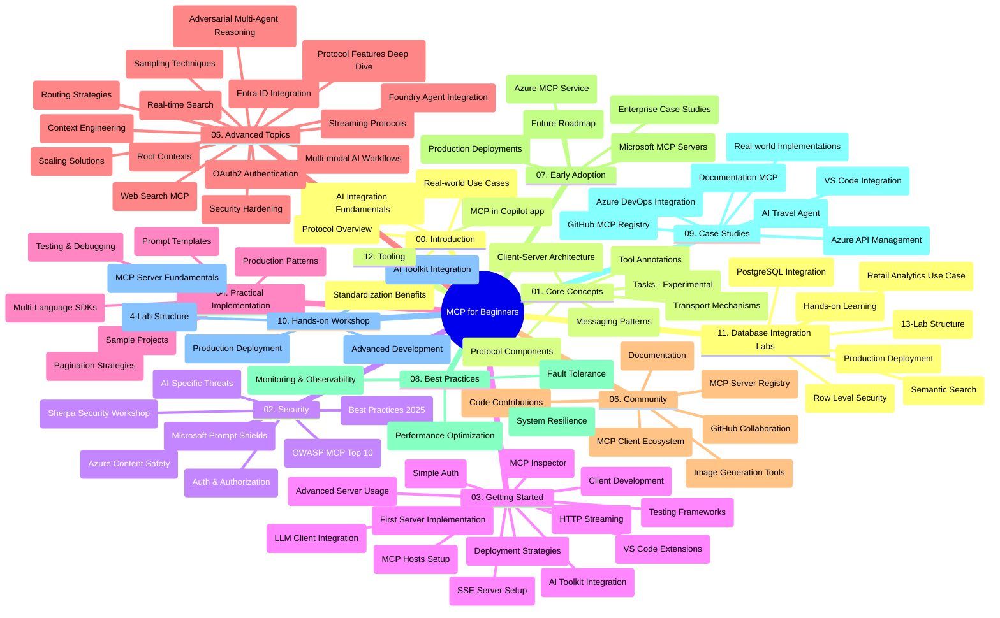

# Model Context Protocol (MCP) 初學者學習指南

本學習指南提供《Model Context Protocol (MCP) 初學者》課程的倉庫結構及內容概覽。使用本指南可有效導覽倉庫並充分利用現有資源。

## 倉庫概覽

Model Context Protocol (MCP) 是 AI 模型與客戶端應用之間互動的標準化框架。最初由 Anthropic 創建，現由更廣泛的 MCP 社群透過官方 GitHub 組織維護。本倉庫提供全面課程，並有 C#、Java、JavaScript、Python 和 TypeScript 的實作範例，針對 AI 開發者、系統架構師與軟件工程師設計。

## 視覺化課程地圖

## 倉庫結構

倉庫分為十二個主要章節，各自聚焦 MCP 的不同面向：

1. **簡介 (00-Introduction/)**
   - Model Context Protocol 概覽
   - 為何 AI 流程中標準化重要
   - 實際使用案例與效益

2. **核心概念 (01-CoreConcepts/)**
   - 用戶端-伺服器架構
   - 重要協議元件
   - MCP 中的訊息模式
   - 前瞻： [MCP 變革概覽：2026-07-28 發行版候選](./01-CoreConcepts/mcp-2026-07-28-release-candidate.md) —— 無狀態協議核心、擴充框架，以及下版規範預期棄用 Roots/Sampling/Logging

3. **安全性 (02-Security/)**
   - MCP 系統中的安全威脅
   - 保障實作的最佳實務
   - 認證與授權策略
   - <strong>全面安全文件</strong>：
     - MCP 安全最佳實務 2025
     - Azure 內容安全實作指南
     - MCP 安全控管與技術
     - MCP 最佳實務快速參考
   - <strong>重要安全議題</strong>：
     - 提示注入與工具毒化攻擊
     - 會話劫持與代理困惑問題
     - 令牌轉送漏洞
     - 過度權限與存取控制
     - AI 元件的供應鏈安全
     - 微軟提示防護整合

4. **入門指南 (03-GettingStarted/)**
   - 環境設定與配置
   - 建立基礎 MCP 伺服器與客戶端
   - 與現有應用整合
   - 包含章節：
     - 第一個伺服器實作
     - 客戶端開發
     - 大型語言模型 (LLM) 客戶端整合
     - VS Code 整合
     - Server-Sent Events (SSE) 伺服器
     - 進階伺服器使用
     - HTTP 串流
     - AI 工具組整合
     - 測試策略
     - 部署指南

5. **實作應用 (04-PracticalImplementation/)**
   - 多語言 SDK 使用
   - 除錯、測試與驗證技巧
   - 設計可重用提示模板與工作流程
   - 實作範例專案

6. **進階主題 (05-AdvancedTopics/)**
   - 上下文工程技術
   - Foundry 代理整合
   - 多模態 AI 工作流程
   - OAuth2 認證示範
   - 即時搜尋功能
   - 即時串流
   - Root 上下文實作
   - 路由策略
   - 採樣技術
   - 擴展方式
   - 安全考量
   - Entra ID 安全整合
   - 網頁搜尋整合
   - 對抗性多代理推理（辯論模式）

7. **社群貢獻 (06-CommunityContributions/)**
   - 如何貢獻程式碼與文件
   - 透過 GitHub 合作
   - 社群主導增強與反饋
   - 使用多款 MCP 客戶端（Claude Desktop、Cline、VSCode）
   - 使用熱門 MCP 伺服器（含圖像生成）

8. **早期採用經驗分享 (07-LessonsfromEarlyAdoption/)**
   - 實際案例與成功故事
   - MCP 解決方案構建與部署
   - 趨勢與未來路線圖
   - **微軟 MCP 伺服器指南**：涵蓋十款生產就緒微軟 MCP 伺服器：
     - Microsoft Learn Docs MCP 伺服器
     - Azure MCP 伺服器（15+ 專用連接器）
     - GitHub MCP 伺服器
     - Azure DevOps MCP 伺服器
     - MarkItDown MCP 伺服器
     - SQL Server MCP 伺服器
     - Playwright MCP 伺服器
     - Dev Box MCP 伺服器
     - Microsoft Foundry MCP 伺服器
     - Microsoft 365 Agents Toolkit MCP 伺服器

9. **最佳實務 (08-BestPractices/)**
   - 性能調優與優化
   - 設計容錯的 MCP 系統
   - 測試與韌性策略

10. **案例研究 (09-CaseStudy/)**
    - <strong>七個完整案例研究</strong>，展示 MCP 在多種情境下的多樣性應用：
    - **Azure AI 旅遊代理**：Azure OpenAI 與 AI 搜尋的多代理編排
    - **Azure DevOps 整合**：使用 YouTube 數據自動化工作流程
    - <strong>即時文件檢索</strong>：Python 控制台客戶端與 HTTP 串流
    - <strong>互動式學習計劃產生器</strong>：Chainlit 網頁應用與對話式 AI
    - <strong>編輯器內文件</strong>：VS Code 與 GitHub Copilot 工作流程整合
    - **Azure API 管理**：企業 API 整合與 MCP 伺服器建立
    - **GitHub MCP 登錄**：生態系開發與代理整合平台
    - 涵蓋企業整合、開發者生產力與生態系發展的實作範例

11. **實作工作坊 (10-StreamliningAIWorkflowsBuildingAnMCPServerWithAIToolkit/)**
    - 結合 MCP 與 AI 工具組的全面實作工作坊
    - 架構智能應用，連接 AI 模型與實際工具
    - 實務單元涵蓋基礎知識、自訂伺服器開發與生產部署策略
    - <strong>實驗室結構</strong>：
      - 實驗室 1：MCP 伺服器基礎
      - 實驗室 2：進階 MCP 伺服器開發
      - 實驗室 3：AI 工具組整合
      - 實驗室 4：生產部署與擴展
    - 透過逐步指示的實驗學習方式

12. **MCP 伺服器資料庫整合實驗室 (11-MCPServerHandsOnLabs/)**
    - **含 13 個實驗室的完整學習路徑**，用於建置生產就緒的 PostgreSQL 整合 MCP 伺服器
    - <strong>實戰零售分析</strong>，使用 Zava 零售案例
    - <strong>企業級模式</strong>，涵蓋行級安全 (RLS)、語意搜尋與多租戶資料存取
    - <strong>完整實驗室結構</strong>：
      - **實驗室 00-03：基礎** —— 簡介、架構、安全、環境設置
      - **實驗室 04-06：建置 MCP 伺服器** —— 資料庫設計、MCP 伺服器實作、工具開發
      - **實驗室 07-09：進階功能** —— 語意搜尋、測試與除錯、VS Code 整合
      - **實驗室 10-12：生產與最佳實務** —— 部署、監控、優化
    - <strong>涵蓋技術</strong>：FastMCP 框架、PostgreSQL、Azure OpenAI、Azure Container Apps、Application Insights
    - <strong>學習成果</strong>：生產就緒 MCP 伺服器、資料庫整合模式、AI 驅動分析、企業安全

13. **開發工具 (12-tooling/)**
    - 學習如何在 Copilot 應用及其他工具中使用 MCP

## 額外資源

倉庫包含輔助資源：

- **Images 資料夾**：存放課程中使用的圖表與插圖
- <strong>翻譯</strong>：多語言支援及自動化文件翻譯
- **官方 MCP 資源**：
  - [MCP 文件](https://modelcontextprotocol.io/)
  - [MCP 規範](https://spec.modelcontextprotocol.io/)
  - [MCP GitHub 倉庫](https://github.com/modelcontextprotocol)

## 如何使用此倉庫

1. <strong>循序漸進學習</strong>：依章節順序（00 至 11）學習，結構化進程。
2. <strong>語言專注</strong>：若專注於某程式語言，瀏覽 samples 目錄，尋找該語言的實作。
3. <strong>實作入門</strong>：從「入門指南」章節開始，設置環境並創建首個 MCP 伺服器與客戶端。
4. <strong>進階探索</strong>：熟悉基礎後，深入進階主題以擴展知識。
5. <strong>參與社群</strong>：透過 GitHub 討論與 Discord 頻道加入 MCP 社群，與專家及開發者交流。

## MCP 客戶端與工具

課程涵蓋多款 MCP 客戶端與工具：

1. <strong>官方客戶端</strong>：
   - Visual Studio Code
   - Visual Studio Code 中的 MCP
   - Claude Desktop
   - VSCode 中的 Claude
   - Claude API

2. <strong>社群客戶端</strong>：
   - 以終端機為基礎的 Cline
   - Cursor (程式碼編輯器)
   - ChatMCP
   - Windsurf

3. **MCP 管理工具**：
   - MCP CLI
   - MCP Manager
   - MCP Linker
   - MCP Router

## 熱門 MCP 伺服器

倉庫介紹多款 MCP 伺服器，包括：

1. **官方微軟 MCP 伺服器**：
   - Microsoft Learn Docs MCP 伺服器
   - Azure MCP 伺服器（15+ 專用連接器）
   - GitHub MCP 伺服器
   - Azure DevOps MCP 伺服器
   - MarkItDown MCP 伺服器
   - SQL Server MCP 伺服器
   - Playwright MCP 伺服器
   - Dev Box MCP 伺服器
   - Microsoft Foundry MCP 伺服器
   - Microsoft 365 Agents Toolkit MCP 伺服器

2. <strong>官方參考伺服器</strong>：
   - Filesystem
   - Fetch
   - Memory
   - Sequential Thinking

3. <strong>圖像生成</strong>：
   - Azure OpenAI DALL-E 3
   - Stable Diffusion WebUI
   - Replicate

4. <strong>開發工具</strong>：
   - Git MCP
   - Terminal Control
   - Code Assistant

5. <strong>專用伺服器</strong>：
   - Salesforce
   - Microsoft Teams
   - Jira & Confluence

## 貢獻指南

本倉庫歡迎社群貢獻。請參閱「社群貢獻」章節，了解如何有效為 MCP 生態系統貢獻。

----

*本學習指南最後更新於 2026 年 2 月 5 日，反映最新 MCP 規範 2025-11-25，並概述倉庫當日狀況。倉庫內容可能於此後更新。*

*附錄（2026 年 7 月 2 日）：新增一課關於 `2026-07-28` MCP 規範發行版候選至 [01-CoreConcepts](./01-CoreConcepts/mcp-2026-07-28-release-candidate.md)；課程基線維持於 2025-11-25，直至新規範發佈。*

---

<!-- CO-OP TRANSLATOR DISCLAIMER START -->
**免責聲明**：
本文件由 AI 翻譯服務 [Co-op Translator](https://github.com/Azure/co-op-translator) 翻譯而成。雖然我們致力於確保準確性，但請注意，機器自動翻譯可能包含錯誤或不準確之處。原始文件的母語版本應被視為權威來源。對於重要資訊，建議進行專業人工翻譯。我們不對因使用本翻譯而產生的任何誤解或誤釋承擔責任。
<!-- CO-OP TRANSLATOR DISCLAIMER END -->