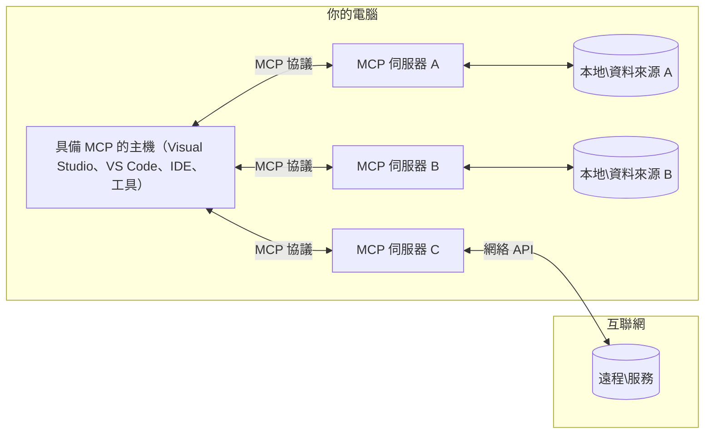

# MCP 核心概念：掌握用於 AI 集成的模型上下文協議

[](https://youtu.be/earDzWGtE84)

_(點擊上方圖片觀看本課程影片)_

[模型上下文協議（Model Context Protocol，MCP）](https://github.com/modelcontextprotocol) 是一個強大且標準化的框架，優化大型語言模型（LLMs）與外部工具、應用程式及數據來源之間的通訊。
本指南將引領你了解 MCP 的核心概念。你將學習其客戶端-伺服器架構、基本構件、通訊機制及實作最佳實踐。

- <strong>明確的用戶同意</strong>：所有數據存取及操作皆需獲得用戶明確同意後方可執行。用戶必須清楚了解將訪問哪些數據及執行何種操作，並且擁有細緻的權限及授權控制。

- <strong>數據隱私保護</strong>：用戶數據僅在明確同意下透露，並且必須通過強健的存取控管保障整個交互週期中的隱私。實作需防止未授權的數據傳輸並維持嚴格的隱私邊界。

- <strong>工具執行安全</strong>：每次工具調用需取得用戶明確同意，並讓用戶清楚瞭解工具功能、參數及潛在影響。堅固的安全邊界必須防止非預期、不安全或惡意的工具執行。

- <strong>傳輸層安全</strong>：所有通訊通道應使用適當的加密及身份驗證機制。遠端連線應實作安全傳輸協定及妥善的憑證管理。

#### 實作指引：

- <strong>權限管理</strong>：實作細粒度的權限系統，讓用戶能控制可訪問的伺服器、工具及資源
- <strong>身份驗證與授權</strong>：使用安全身份驗證方法（OAuth、API 金鑰）並妥善管理憑證及其過期
- <strong>輸入驗證</strong>：根據定義的結構驗證所有參數與資料，以防止注入攻擊
- <strong>審計日誌</strong>：維護全面的操作日誌以便安全監控與合規

## 概覽

本課程探討構成模型上下文協議（MCP）生態系統的基礎架構與元件。你將了解其客戶端-伺服器架構、主要元件及推動 MCP 交互的通訊機制。

## 主要學習目標

課程結束時，你將能：

- 理解 MCP 的客戶端-伺服器架構。
- 辨識 Hosts、Clients 及 Servers 的角色與責任。
- 分析 MCP 作為靈活整合層的核心特性。
- 學習 MCP 生態系統內資訊的流動方式。
- 透過 .NET、Java、Python 及 JavaScript 範例獲得實務洞見。

## MCP 架構：深入解析

MCP 生態系統建立於客戶端-伺服器模型。這種模組化結構讓 AI 應用能有效與工具、資料庫、API 及上下文資源互動。讓我們將此架構拆解為核心元件。

在核心，MCP 採用客戶端-伺服器架構，其中主機應用可連接多個伺服器：



- **MCP 主機 (Hosts)**：如 VSCode、Claude Desktop、IDE 或想透過 MCP 存取數據的 AI 工具
- **MCP 用戶端 (Clients)**：與伺服器保持一對一連結的協議用戶端
- **MCP 伺服器 (Servers)**：輕量化程式，透過標準化的模型上下文協議公開特定功能
- <strong>本地數據來源</strong>：你的電腦的檔案、資料庫和服務，MCP 伺服器可以安全存取
- <strong>遠端服務</strong>：透過 API 可由 MCP 伺服器連接的網路上外部系統

MCP 協議是一個持續演進的標準，使用基於日期的版本號（YYYY-MM-DD 格式）。當前協議版本為 **2025-11-25**。你可以查看最新的 [協議規範](https://modelcontextprotocol.io/specification/2025-11-25/)

> **展望未來：** 下一版本規範釋出候選版本 **2026-07-28** 已於 2026 年 5 月公告，預定於 2026 年 7 月 28 日釋出。該版本將使協議在傳輸層無狀態（移除 `initialize` 握手與會話 ID）、規範擴展框架，並棄用 Roots、Sampling 與 Logging，改用更新模式。詳見 [MCP 2026-07-28 釋出候選版本變更說明](./mcp-2026-07-28-release-candidate.md)。

### 1. 主機（Hosts）

在模型上下文協議（MCP）中，**主機（Hosts）** 是作為用戶與協議互動的主要介面的 AI 應用。Hosts 透過為每個伺服器連線建立專屬的 MCP 用戶端，協調並管理與多個 MCP 伺服器的連接。Hosts 範例包括：

- **AI 應用**：Claude Desktop、Visual Studio Code、Claude Code
- <strong>開發環境</strong>：含 MCP 整合的 IDE 和程式碼編輯器
- <strong>客製化應用</strong>：專門設計的 AI 代理及工具

**Hosts** 是協調 AI 模型互動的應用。它們：

- **協調 AI 模型**：執行或與 LLM 互動以產生回應並協調 AI 工作流程
- <strong>管理客戶端連線</strong>：為每個 MCP 伺服器連線建立並維護一個 MCP 用戶端
- <strong>控制用戶界面</strong>：處理對話流程、用戶互動及回應呈現
- <strong>執行安全管理</strong>：控制權限、安全限制及身份驗證
- <strong>管理用戶同意</strong>：管理用戶對數據分享與工具執行的批准


### 2. 用戶端（Clients）

**用戶端（Clients）** 是維持 Hosts 與 MCP 伺服器一對一專用連結的核心元件。每個 MCP 用戶端由 Host 啟動來連接特定 MCP 伺服器，確保組織良好且安全的通訊管道。多個用戶端讓 Host 可同時連接多個伺服器。

**Clients** 是宿主應用內的連接元件。它們：

- <strong>協議通訊</strong>：向伺服器發送帶有提示和指示的 JSON-RPC 2.0 請求
- <strong>能力協調</strong>：於初始化階段與伺服器協調支持的功能及協議版本
- <strong>工具執行</strong>：管理模型的工具執行請求並處理回應
- <strong>即時更新</strong>：處理伺服器的通知及即時更新
- <strong>回應處理</strong>：處理並格式化伺服器回應以呈現給使用者

### 3. 伺服器（Servers）

**伺服器（Servers）** 是向 MCP 用戶端提供上下文、工具及功能的程式。它們可在本機（與 Host 同一臺機器）或遠端（外部平台）執行，負責處理用戶端請求並提供結構化回應。伺服器透過標準化的模型上下文協議公開特定功能。

**Servers** 是提供上下文及功能的服務。它們：

- <strong>功能註冊</strong>：向用戶端註冊並公開可用的原語（資源、提示、工具）
- <strong>請求處理</strong>：接收並執行用戶端的工具調用、資源請求及提示請求
- <strong>上下文提供</strong>：提供上下文資訊及數據以強化模型回應
- <strong>狀態管理</strong>：維護會話狀態並在需要時處理有狀態交互
- <strong>即時通知</strong>：發送關於功能變更和更新的通知給連接用戶端

伺服器可由任何人開發，以專門功能擴充模型能力，並支援本地及遠端部署方案。

### 4. 伺服器原語（Server Primitives）

在模型上下文協議（MCP）中，伺服器提供三種核心 <strong>原語</strong>，這些是客戶端、主機以及語言模型之間進行豐富互動的基本構建模組。這些原語定義了協議可用的上下文資訊類型和行動。

MCP 伺服器可公開以下三種核心原語的任意組合：

#### 資源（Resources）

<strong>資源</strong> 是為 AI 應用提供上下文資訊的數據來源。它們代表可提升模型理解及決策的靜態或動態內容：

- <strong>上下文數據</strong>：供 AI 模型使用的結構化資訊與上下文
- <strong>知識庫</strong>：文件庫、文章、手冊及研究論文
- <strong>本地數據來源</strong>：檔案、資料庫及本地系統資訊
- <strong>外部數據</strong>：API 回應、網頁服務及遠端系統數據
- <strong>動態內容</strong>：根據外部條件即時更新的數據

資源以 URI 辨識，支援透過 `resources/list` 進行發現，並透過 `resources/read` 取得：

```text
file://documents/project-spec.md
database://production/users/schema
api://weather/current
```

#### 提示（Prompts）

<strong>提示</strong> 是幫助結構化與語言模型交互的可重用範本。它們提供標準化的互動模式和範本工作流程：

- <strong>基於範本的交互</strong>：預先結構化的訊息和對話起始
- <strong>工作流程範本</strong>：常見任務和互動的標準序列
- <strong>少量示例</strong>：用於模型指示的示例範本
- <strong>系統提示</strong>：定義模型行為和上下文的基礎提示
- <strong>動態範本</strong>：可依特定上下文調整的參數化提示

提示支援變數替換，可透過 `prompts/list` 發現，並使用 `prompts/get` 讀取：

```markdown
Generate a {{task_type}} for {{product}} targeting {{audience}} with the following requirements: {{requirements}}
```

#### 工具（Tools）

<strong>工具</strong> 是 AI 模型可調用以執行特定動作的可執行函式。它們代表 MCP 生態系統中的「動詞」，使模型得以與外部系統互動：

- <strong>可執行函式</strong>：模型可調用並帶有特定參數的獨立操作
- <strong>外部系統整合</strong>：API 調用、資料庫查詢、檔案操作、計算
- <strong>唯一辨識</strong>：每個工具有獨特名稱、描述及參數架構
- <strong>結構化輸入輸出</strong>：工具接受驗證參數並返回結構化、類型化回應
- <strong>行動能力</strong>：讓模型能執行實體操作並取得實時數據

工具用 JSON Schema 定義參數驗證，並透過 `tools/list` 發現，經 `tools/call` 執行。工具也可包含 <strong>圖示</strong> 作為更佳 UI 呈現的附加元資料。

<strong>工具註解</strong>：工具支援行為註解（如 `readOnlyHint`、`destructiveHint`），說明工具是否為唯讀或具破壞性，幫助用戶端在工具執行時做出明智決策。

工具範例定義：

```typescript
server.tool(
  "search_products", 
  {
    query: z.string().describe("Search query for products"),
    category: z.string().optional().describe("Product category filter"),
    max_results: z.number().default(10).describe("Maximum results to return")
  }, 
  async (params) => {
    // 執行搜尋並返回結構化結果
    return await productService.search(params);
  }
);
```

## 用戶端原語（Client Primitives）

在模型上下文協議（MCP）中，**用戶端（clients）** 可公開原語，使伺服器能向主機應用請求額外功能。這些用戶端端原語支持更豐富、更互動的伺服器實作，能存取 AI 模型能力及用戶互動。

### 取樣（Sampling）

> **棄用通知：** `2026-07-28` 釋出候選版本將標記取樣為棄用，改採直接整合 LLM 供應商 API。此功能在 `2025-11-25` 版本及至少淘汰後一年仍可使用，但新設計應優先使用替代模式。詳見 [MCP 2026-07-28 釋出候選版本變更說明](./mcp-2026-07-28-release-candidate.md)。

<strong>取樣</strong> 允許伺服器從用戶端的 AI 應用請求語言模型完成。此原語讓伺服器不需嵌入自己的模型依賴，即可存取 LLM 能力：

- <strong>模型獨立存取</strong>：伺服器可請求完成，無需包含 LLM SDK 或管理模型存取
- **伺服器主導 AI**：讓伺服器能使用用戶端 AI 模型自主產生內容
- **遞迴 LLM 互動**：支持伺服器需 AI 協助處理之複雜場景
- <strong>動態內容產生</strong>：讓伺服器使用主機模型創建上下文回應
- <strong>支援工具調用</strong>：伺服器可包含 `tools` 和 `toolChoice` 參數，使用戶端模型在取樣時調用工具

取樣透過 `sampling/complete` 方法啟動，伺服器將完整請求發送給用戶端。

### Roots

> **棄用通知：** `2026-07-28` 釋出候選版本將標記 Roots 為棄用，改以工具參數、資源 URI 或伺服器配置代替。此功能在 `2025-11-25` 版本及至少淘汰後一年仍可使用。詳見 [MCP 2026-07-28 釋出候選版本變更說明](./mcp-2026-07-28-release-candidate.md)。

**Roots** 提供客戶端向伺服器公開檔案系統邊界的標準化方式，協助伺服器理解它們可存取的目錄與檔案：

- <strong>檔案系統邊界</strong>：定義伺服器可在檔案系統內運作的範圍
- <strong>存取控制</strong>：幫助伺服器了解有哪些目錄及檔案的存取權限
- <strong>動態更新</strong>：Roots 清單變更時，用戶端可通知伺服器
- **URI 基礎辨識**：Roots 使用 `file://` URI 辨識可存取目錄及檔案

Roots 可透過 `roots/list` 方法發現，Roots 變更時用戶端會發送 `notifications/roots/list_changed`。

### 信息請求（Elicitation）  

<strong>信息請求</strong> 使伺服器能透過用戶端界面向用戶請求更多資訊或確認：

- <strong>用戶輸入請求</strong>：當工具執行需要時，伺服器可索取更多資訊
- <strong>確認對話</strong>：對敏感或重大操作請求用戶批准
- <strong>互動流程</strong>：使伺服器能創建逐步用戶互動
- <strong>動態參數收集</strong>：在工具執行過程中收集缺失或選擇性參數

信息請求透過 `elicitation/request` 方法進行，藉由用戶端界面收集用戶輸入。

<strong>網址模式信息請求</strong>：伺服器也可請求基於 URL 的用戶互動，讓用戶導向外部網頁進行身份驗證、確認或資料輸入。

### 紀錄（Logging）


> **棄用通知：** `2026-07-28` 版本候選標記 Logging 為棄用，建議改用 stdio 傳輸的 `stderr` 及結構化可觀測性的 OpenTelemetry。Logging 在 `2025-11-25` 版本及任何棄用後至少一年內仍可使用。詳見 [MCP 變更內容：2026-07-28 版本候選](./mcp-2026-07-28-release-candidate.md)。

**Logging** 允許伺服器向客戶端發送結構化日誌訊息，以利除錯、監控及營運可視化：

- <strong>除錯支援</strong>：啟用伺服器提供詳盡執行日誌以便疑難排解
- <strong>營運監控</strong>：向客戶端發送狀態更新及效能指標
- <strong>錯誤報告</strong>：提供詳細的錯誤上下文及診斷資訊
- <strong>稽核軌跡</strong>：建立伺服器操作及決策的完整日誌

Logging 訊息會發送給客戶端，提供伺服器操作的透明度並促進除錯。

## MCP 中的信息流

模型上下文協定（MCP）定義主機、客戶端、伺服器與模型之間結構化的信息流。了解此流程有助於釐清使用者請求如何被處理以及外部工具和資料如何被整合進模型的回應中。

- <strong>主機發起連線</strong>  
  主機應用程式（如 IDE 或聊天介面）與 MCP 伺服器建立連線，通常透過 STDIO、WebSocket 或其他支援的傳輸方式。

- <strong>能力協商</strong>  
  客戶端（內嵌於主機）與伺服器交換彼此支援的功能、工具、資源及協定版本資訊，確保雙方了解會話可用的能力。

- <strong>使用者請求</strong>  
  使用者與主機互動（例如輸入提示或指令）。主機收集此輸入並將其傳遞給客戶端處理。

- <strong>資源或工具使用</strong>  
  - 客戶端可能向伺服器請求額外上下文或資源（如檔案、資料庫條目或知識庫文章），以豐富模型的理解。
  - 若模型判定需要使用工具（例如提取資料、執行計算或呼叫 API），客戶端會向伺服器發送工具調用請求，指定工具名稱及參數。

- <strong>伺服器執行</strong>  
  伺服器接收資源或工具請求，執行必要操作（例如執行函式、查詢資料庫或讀取檔案），並以結構化格式返回結果給客戶端。

- <strong>回應生成</strong>  
  客戶端將伺服器的回應（資源資料、工具輸出等）整合進正進行的模型互動中。模型利用此資訊生成全面且具上下文相關性的回應。

- <strong>結果呈現</strong>  
  主機接收來自客戶端的最終輸出並呈現給使用者，通常包括模型產生的文字以及任何工具執行或資源查詢的結果。

此流程使 MCP 支援先進、互動式且具上下文意識的 AI 應用，順暢連結模型與外部工具及資料源。

## 協定架構與層次

MCP 包含兩個不同的架構層級，協同合作提供完整的通訊框架：

### 資料層

<strong>資料層</strong> 使用 **JSON-RPC 2.0** 為基礎實作 MCP 核心協定。此層定義訊息結構、語義及互動模式：

#### 核心元件：

- **JSON-RPC 2.0 協定**：所有通訊使用標準化 JSON-RPC 2.0 訊息格式進行方法呼叫、回應及通知
- <strong>生命週期管理</strong>：管理客戶端與伺服器間的連線初始化、能力協商及會話終止
- <strong>伺服器原語</strong>：使伺服器能透過工具、資源及提示提供核心功能
- <strong>客戶端原語</strong>：使伺服器能請求大型語言模型取樣、引導使用者輸入及發送日誌訊息
- <strong>即時通知</strong>：支援非同步通知以提供動態更新，無需輪詢

#### 主要特點：

- <strong>協定版本協商</strong>：使用以日期為基準的版本號（YYYY-MM-DD）確保相容性
- <strong>能力探索</strong>：初始化時，客戶端和伺服器交換支援的功能資訊
- <strong>狀態會話</strong>：跨多次互動維護連線狀態以持續上下文

### 傳輸層

<strong>傳輸層</strong> 管理 MCP 參與者間的通訊通道、訊息分框及認證：

#### 支援的傳輸機制：

1. **STDIO 傳輸**：
   - 使用標準輸入/輸出流直接進行程序通訊
   - 最適於同一臺機器上的本地程序，無網路負擔
   - 常用於本地 MCP 伺服器實作

2. **可串流 HTTP 傳輸**：
   - 使用 HTTP POST 傳送客戶端到伺服器訊息  
   - 支援非必需的伺服器發送事件（SSE）實現伺服器到客戶端串流
   - 支援跨網路的遠端伺服器通訊
   - 支援標準 HTTP 認證（承載令牌、API 金鑰、自訂標頭）
   - MCP 推薦使用 OAuth 以實現安全的令牌認證

#### 傳輸抽象化：

傳輸層將通訊細節從資料層抽象出來，使所有傳輸機制皆可使用相同 JSON-RPC 2.0 訊息格式。此抽象化允許應用程式順暢切換本地和遠端伺服器。

### 安全考量

MCP 實作必須遵守多項關鍵安全原則，以確保協定操作中的安全、可信與可靠互動：

- <strong>用戶同意與控制</strong>：在存取資料或執行操作前必須取得用戶明確同意。用戶應清楚掌控分享哪些資料與授權執行哪些行動，並由直覺式用戶介面支援審閱及批准流程。

- <strong>資料隱私</strong>：用戶資料僅能在明確同意下暴露，且必須受到適當存取控管。MCP 實作須防止未授權資料傳輸，並確保隱私於所有互動過程中皆得維護。

- <strong>工具安全</strong>：調用任何工具前必須取得用戶明確同意。用戶應清楚理解每項工具的功能，並施行嚴格安全邊界以防止非預期或不安全的工具執行。

採行這些安全原則，MCP 確保用戶信任、隱私及安全性於所有協定互動中受到維護，同時促成強大 AI 整合。

## 程式碼範例：核心元件

以下為多種流行程式語言的程式碼範例，展示如何實作 MCP 伺服器核心元件與工具。

### .NET 範例：建立簡易 MCP 伺服器及工具

這是一個實用的 .NET 程式碼範例，示範如何實作簡單的 MCP 伺服器並註冊自訂工具。範例展示工具的定義與註冊、請求處理，以及如何使用模型上下文協定連接伺服器。

```csharp
using System;
using System.Threading.Tasks;
using ModelContextProtocol.Server;
using ModelContextProtocol.Server.Transport;
using ModelContextProtocol.Server.Tools;

public class WeatherServer
{
    public static async Task Main(string[] args)
    {
        // Create an MCP server
        var server = new McpServer(
            name: "Weather MCP Server",
            version: "1.0.0"
        );
        
        // Register our custom weather tool
        server.AddTool<string, WeatherData>("weatherTool", 
            description: "Gets current weather for a location",
            execute: async (location) => {
                // Call weather API (simplified)
                var weatherData = await GetWeatherDataAsync(location);
                return weatherData;
            });
        
        // Connect the server using stdio transport
        var transport = new StdioServerTransport();
        await server.ConnectAsync(transport);
        
        Console.WriteLine("Weather MCP Server started");
        
        // Keep the server running until process is terminated
        await Task.Delay(-1);
    }
    
    private static async Task<WeatherData> GetWeatherDataAsync(string location)
    {
        // This would normally call a weather API
        // Simplified for demonstration
        await Task.Delay(100); // Simulate API call
        return new WeatherData { 
            Temperature = 72.5,
            Conditions = "Sunny",
            Location = location
        };
    }
}

public class WeatherData
{
    public double Temperature { get; set; }
    public string Conditions { get; set; }
    public string Location { get; set; }
}
```

### Java 範例：MCP 伺服器元件

此範例示範與上述 .NET 範例相同的 MCP 伺服器與工具註冊，但以 Java 實作。

```java
import io.modelcontextprotocol.server.McpServer;
import io.modelcontextprotocol.server.McpToolDefinition;
import io.modelcontextprotocol.server.transport.StdioServerTransport;
import io.modelcontextprotocol.server.tool.ToolExecutionContext;
import io.modelcontextprotocol.server.tool.ToolResponse;

public class WeatherMcpServer {
    public static void main(String[] args) throws Exception {
        // 建立一個 MCP 伺服器
        McpServer server = McpServer.builder()
            .name("Weather MCP Server")
            .version("1.0.0")
            .build();
            
        // 註冊一個天氣工具
        server.registerTool(McpToolDefinition.builder("weatherTool")
            .description("Gets current weather for a location")
            .parameter("location", String.class)
            .execute((ToolExecutionContext ctx) -> {
                String location = ctx.getParameter("location", String.class);
                
                // 取得天氣數據（簡化版）
                WeatherData data = getWeatherData(location);
                
                // 回傳格式化的回應
                return ToolResponse.content(
                    String.format("Temperature: %.1f°F, Conditions: %s, Location: %s", 
                    data.getTemperature(), 
                    data.getConditions(), 
                    data.getLocation())
                );
            })
            .build());
        
        // 使用 stdio 傳輸連接伺服器
        try (StdioServerTransport transport = new StdioServerTransport()) {
            server.connect(transport);
            System.out.println("Weather MCP Server started");
            // 保持伺服器運行直到程序終止
            Thread.currentThread().join();
        }
    }
    
    private static WeatherData getWeatherData(String location) {
        // 實作會調用天氣 API
        // 為示範目的簡化處理
        return new WeatherData(72.5, "Sunny", location);
    }
}

class WeatherData {
    private double temperature;
    private String conditions;
    private String location;
    
    public WeatherData(double temperature, String conditions, String location) {
        this.temperature = temperature;
        this.conditions = conditions;
        this.location = location;
    }
    
    public double getTemperature() {
        return temperature;
    }
    
    public String getConditions() {
        return conditions;
    }
    
    public String getLocation() {
        return location;
    }
}
```

### Python 範例：建構 MCP 伺服器

此範例使用 fastmcp，請先確保已安裝：

```python
pip install fastmcp
```
Code Sample:

```python
#!/usr/bin/env python3
import asyncio
from fastmcp import FastMCP
from fastmcp.transports.stdio import serve_stdio

# 建立一個 FastMCP 伺服器
mcp = FastMCP(
    name="Weather MCP Server",
    version="1.0.0"
)

@mcp.tool()
def get_weather(location: str) -> dict:
    """Gets current weather for a location."""
    return {
        "temperature": 72.5,
        "conditions": "Sunny",
        "location": location
    }

# 使用類別的另一種方法
class WeatherTools:
    @mcp.tool()
    def forecast(self, location: str, days: int = 1) -> dict:
        """Gets weather forecast for a location for the specified number of days."""
        return {
            "location": location,
            "forecast": [
                {"day": i+1, "temperature": 70 + i, "conditions": "Partly Cloudy"}
                for i in range(days)
            ]
        }

# 註冊類別工具
weather_tools = WeatherTools()

# 啟動伺服器
if __name__ == "__main__":
    asyncio.run(serve_stdio(mcp))
```

### JavaScript 範例：建立 MCP 伺服器

此範例展示如何在 JavaScript 中創建 MCP 伺服器並註冊兩個氣象相關工具。

```javascript
// 使用官方的模型上下文協議 SDK
import { McpServer } from "@modelcontextprotocol/sdk/server/mcp.js";
import { StdioServerTransport } from "@modelcontextprotocol/sdk/server/stdio.js";
import { z } from "zod"; // 用於參數驗證

// 創建 MCP 伺服器
const server = new McpServer({
  name: "Weather MCP Server",
  version: "1.0.0"
});

// 定義一個天氣工具
server.tool(
  "weatherTool",
  {
    location: z.string().describe("The location to get weather for")
  },
  async ({ location }) => {
    // 這通常會調用天氣 API
    // 為演示而簡化
    const weatherData = await getWeatherData(location);
    
    return {
      content: [
        { 
          type: "text", 
          text: `Temperature: ${weatherData.temperature}°F, Conditions: ${weatherData.conditions}, Location: ${weatherData.location}` 
        }
      ]
    };
  }
);

// 定義一個預報工具
server.tool(
  "forecastTool",
  {
    location: z.string(),
    days: z.number().default(3).describe("Number of days for forecast")
  },
  async ({ location, days }) => {
    // 這通常會調用天氣 API
    // 為演示而簡化
    const forecast = await getForecastData(location, days);
    
    return {
      content: [
        { 
          type: "text", 
          text: `${days}-day forecast for ${location}: ${JSON.stringify(forecast)}` 
        }
      ]
    };
  }
);

// 輔助函數
async function getWeatherData(location) {
  // 模擬 API 調用
  return {
    temperature: 72.5,
    conditions: "Sunny",
    location: location
  };
}

async function getForecastData(location, days) {
  // 模擬 API 調用
  return Array.from({ length: days }, (_, i) => ({
    day: i + 1,
    temperature: 70 + Math.floor(Math.random() * 10),
    conditions: i % 2 === 0 ? "Sunny" : "Partly Cloudy"
  }));
}

// 使用 stdio 傳輸連接伺服器
const transport = new StdioServerTransport();
server.connect(transport).catch(console.error);

console.log("Weather MCP Server started");
```

此 JavaScript 範例演示如何使用模型上下文協定 SDK 創建 MCP 伺服器。展示如何註冊兩個名為 `weatherTool` 和 `forecastTool` 的工具，並透過 `StdioServerTransport` 提供給 MCP 客戶端使用。

## 安全性與授權

MCP 內建多項管理安全性和授權的概念與機制：

1. <strong>工具許可控制</strong>：  
  客戶端可指定模型在會話中允許使用的工具，確保僅有明確授權的工具可被訪問，降低非預期或不安全操作風險。許可權可根據用戶偏好、組織政策或互動上下文動態配置。

2. <strong>身份驗證</strong>：  
  伺服器可要求認證，才能授權存取工具、資源或敏感操作。可能使用 API 金鑰、OAuth 令牌或其他認證方案。妥善的身份驗證確保只有可信的客户端與用戶能呼叫伺服器端功能。

3. <strong>驗證</strong>：  
  對所有工具調用強制執行參數驗證。每個工具定義其參數的預期類型、格式與限制，伺服器依此驗證進來的請求。此作法防止不正確或惡意輸入觸及工具實作，維護操作完整性。

4. <strong>速率限制</strong>：  
  為防止濫用並確保伺服器資源公平使用，MCP 伺服器可對工具呼叫和資源訪問實施速率限制。可依用戶、會話或全域設定，協助杜絕拒絕服務攻擊及過度資源消耗。

藉由結合這些機制，MCP 為語言模型與外部工具和資料源整合提供安全基礎，並給予用戶與開發者細緻掌控存取及使用權限。

## 協定訊息與通訊流程

MCP 通訊使用結構化 **JSON-RPC 2.0** 訊息，促進主機、客戶端與伺服器間明確且可靠的互動。協定定義不同操作類型的具體訊息模式：

### 核心訊息類型：

#### <strong>初始化訊息</strong>
- **`initialize` 請求**：建立連線並協商協定版本與功能
- **`initialize` 回應**：確認支援的功能及伺服器資訊  
- **`notifications/initialized`**：表示初始化完成，會話準備就緒

#### <strong>探索訊息</strong>
- **`tools/list` 請求**：探索伺服器可用工具
- **`resources/list` 請求**：列出可用資源（資料來源）
- **`prompts/list` 請求**：擷取可用提示範本

#### <strong>執行訊息</strong>  
- **`tools/call` 請求**：使用提供的參數執行特定工具
- **`resources/read` 請求**：自特定資源擷取內容
- **`prompts/get` 請求**：擷取帶有選用參數的提示範本

#### <strong>客戶端端訊息</strong>
- **`sampling/complete` 請求**：伺服器向客戶端請求語言模型完成結果
- **`elicitation/request`**：伺服器透過客戶端介面請求使用者輸入
- **Logging 訊息**：伺服器向客戶端發送結構化日誌訊息

#### <strong>通知訊息</strong>
- **`notifications/tools/list_changed`**：伺服器通知客戶端工具列表異動
- **`notifications/resources/list_changed`**：伺服器通知客戶端資源列表異動  
- **`notifications/prompts/list_changed`**：伺服器通知客戶端提示列表異動

### 訊息結構：

所有 MCP 訊息遵循 JSON-RPC 2.0 格式：
- <strong>請求訊息</strong>：包含 `id`、`method` 和選用的 `params`
- <strong>回應訊息</strong>：包含 `id` 及 `result` 或 `error`  
- <strong>通知訊息</strong>：包含 `method` 及選用 `params`（無 `id`，不需回應）

此結構化通訊確保可靠、可追蹤且可擴充的互動，支援即時更新、工具串接及強健錯誤處理等進階場景。

### 任務（實驗中）

> **展望未來：** `2026-07-28` 版本候選將任務從實驗核心規範獨立成立專屬擴充，提供重新設計的生命週期（`tasks/get`、`tasks/update`、`tasks/cancel`；`tasks/list` 被移除）。若您依照下述實驗性 API 開發，請規劃遷移。詳見 [MCP 變更內容：2026-07-28 版本候選](./mcp-2026-07-28-release-candidate.md)。

<strong>任務</strong> 是實驗性功能，提供持久執行包裝，支持 MCP 請求的延遲結果檢索與狀態追蹤：

- <strong>長時間執行操作</strong>：追蹤昂貴計算、工作流程自動化及批次處理
- <strong>延遲結果</strong>：輪詢任務狀態並在操作完成時擷取結果
- <strong>狀態追蹤</strong>：監控任務進度經過定義的生命週期狀態
- <strong>多步驟操作</strong>：支援跨多次互動的複雜工作流程

任務將標準 MCP 請求包裝起來，使操作得以非同步執行，適用於無法立即完成的流程。

## 重要摘要

- <strong>架構</strong>：MCP 採用客戶端-伺服器架構，主機管理多個客戶端連線至伺服器
- <strong>參與者</strong>：生態系涵蓋主機（AI 應用）、客戶端（協定連接器）與伺服器（功能供應者）
- <strong>傳輸機制</strong>：通訊支援 STDIO（本地）及可串流 HTTP，並可選擇 SSE（遠端）
- <strong>核心原語</strong>：伺服器曝光工具（可執行函數）、資源（資料來源）及提示（範本）
- <strong>客戶端原語</strong>：伺服器能請求取樣（支援工具調用的 LLM 補全）、引導（包括 URL 模式的用戶輸入）、根目錄（檔案系統邊界）及日誌
- <strong>實驗性功能</strong>：任務為長時執行操作提供持久執行包裝
- <strong>協定基礎</strong>：以 JSON-RPC 2.0 為基礎，採用日期版本控制（目前版本：2025-11-25）
- <strong>即時能力</strong>：支援通知提供動態更新與即時同步
- <strong>安全優先</strong>：明確用戶同意、資料隱私保護與安全傳輸為核心要求

## 練習

設計一個在您領域中會有用的簡單 MCP 工具。定義：
1. 此工具將命名為何
2. 接受什麼參數
3. 返回什麼輸出
4. 模型如何利用此工具解決使用者問題


---

## 接下來

下一章：[第 2 章：安全](../02-Security/README.md)


好奇2025-11-25之後會有咩？請閱讀 [MCP變更內容：2026-07-28 釋出候選版本](./mcp-2026-07-28-release-candidate.md)。

---

<!-- CO-OP TRANSLATOR DISCLAIMER START -->
**免責聲明**：
本文件使用 AI 翻譯服務 [Co-op Translator](https://github.com/Azure/co-op-translator) 進行翻譯。雖然我們力求準確，但請注意，自動翻譯可能包含錯誤或不準確之處。原始文件的母語版本應被視為權威來源。對於重要資訊，建議尋求專業人工翻譯。我們不對因使用本翻譯而引起的任何誤解或曲解承擔責任。
<!-- CO-OP TRANSLATOR DISCLAIMER END -->