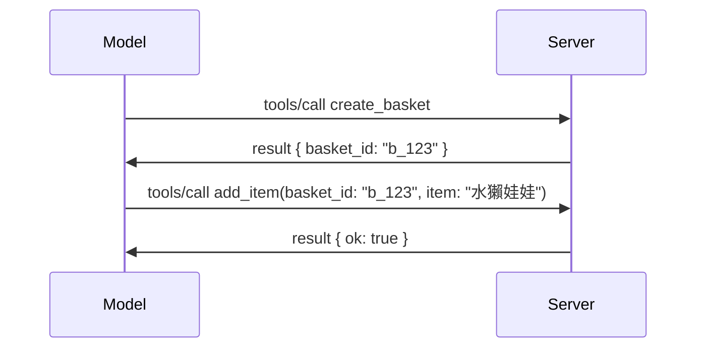

# MCP 有哪些變動：2026-07-28 釋出候選版本

> **狀態：** 釋出候選版本。撰寫本文時，`2026-07-28` 規範尚未最終定案。該版本於 2026 年 5 月 21 日公告，預計於 2026 年 7 月 28 日發佈。本課程中描述的內容均針對釋出候選版本；請在依此規範開發前，查閱[草案規範](https://modelcontextprotocol.io/specification/draft)及其[changelog](https://modelcontextprotocol.io/specification/draft/changelog)以了解最新狀況。本課程的其他部分則是針對目前穩定版本 **MCP Specification 2025-11-25** 撰寫，`2026-07-28` 版本發佈後將予以更新。

## 概覽

`2026-07-28` 是自 MCP 推出以來最大規模的修訂。六個規範增強提案（SEP）移除協定層級的會話，使 MCP 在傳輸層維持無狀態，擴充功能成為一等公民並版本化，並將你早先在本課程中學到的幾項功能（Roots、Sampling、Logging）在新的生命週期政策下標記為棄用。本課程總結這些變更內容、重要性，以及對你先前依 `2025-11-25` 寫的程式碼所代表的意義。

資料來源：[The 2026-07-28 MCP Specification Release Candidate](https://blog.modelcontextprotocol.io/posts/2026-07-28-release-candidate/)（Model Context Protocol 部落格，David Soria Parra 與 Den Delimarsky）。

## 學習目標

本課程結束時，你將能夠：

- 解釋為何 MCP 轉向無狀態協定核心，以及該變更如何解決橫向擴展部署的問題。
- 描述 `initialize` / `initialized` 握手程序與 `Mcp-Session-Id` 標頭的替代方案。
- 辨識新的 `Mcp-Method` 與 `Mcp-Name` 標頭及 `ttlMs` / `cacheScope` 緩存元資料。
- 了解擴充框架（Extensions）以及本版本隨附的兩個擴充：MCP Apps 與 Tasks。
- 列出六個強化 OAuth 2.0 / OIDC 對齊的授權相關 SEP。
- 辨識哪些核心功能（Roots、Sampling、Logging）現已棄用，以及這在實務上意味著什麼。
- 解釋 Full JSON Schema 2020-12 對工具 `inputSchema` / `outputSchema` 的更動。

## 無狀態的協定

最重要的變更：MCP 在協定層變成無狀態（stateless）。

### 變更前（2025-11-25）：會話綁定於特定伺服器實例

透過 Streamable HTTP 呼叫工具開始於 `initialize` 握手。伺服器回應帶有 `Mcp-Session-Id` 標頭，後續所有請求都必須攜帶此標頭：

```http
POST /mcp HTTP/1.1
Mcp-Session-Id: 1868a90c-3a3f-4f5b
Content-Type: application/json

{"jsonrpc":"2.0","id":2,"method":"tools/call",
 "params":{"name":"search","arguments":{"q":"otters"}}}
```

因為會話綁定於發出該會話的伺服器實例，橫向擴展部署需要在負載平衡器進行 <strong>黏性路由</strong>，並在實例間提供 <strong>共用會話儲存</strong>。

### 變更後（2026-07-28）：每個請求均為自包含

```http
POST /mcp HTTP/1.1
MCP-Protocol-Version: 2026-07-28
Mcp-Method: tools/call
Mcp-Name: search
Content-Type: application/json

{"jsonrpc":"2.0","id":1,"method":"tools/call",
 "params":{"name":"search","arguments":{"q":"otters"},
           "_meta":{"io.modelcontextprotocol/clientInfo":{"name":"my-app","version":"1.0"}}}}
```

任何伺服器實例都可以處理此請求。主要變更如下：

- **移除 `initialize` / `initialized` 握手程序**（[SEP-2575](https://github.com/modelcontextprotocol/modelcontextprotocol/pull/2575)）。協定版本、客戶端資訊與功能轉移到每個請求的 `_meta` 字段中。新增 `server/discover` 方法讓客戶端在需要時先取得伺服器能力。
- **移除 `Mcp-Session-Id` 標頭及協定層會話**（[SEP-2567](https://github.com/modelcontextprotocol/modelcontextprotocol/pull/2567)）。負載平衡器不再需黏性路由，且不需共用會話儲存。

### 無狀態協定，狀態應用

移除協定層會話不代表你的伺服器不能是有狀態的。建議模式與 HTTP API 一致：從一次工具呼叫鑄造一個明確的 handle（如 `basket_id`, `browser_id`），並在後續呼叫中由模型將此 handle 當成普通參數傳回。



這讓狀態對模型而言是可見且合理的，而非隱藏在傳輸元資料中，並且允許任一伺服器實例處理任意呼叫。

### 伺服器對客戶端請求，架構重整

無狀態協定仍需要伺服器在呼叫中途向客戶端請求資料（例如，誘導提示）的機制：

- <strong>伺服器主動發起的請求只能於伺服器正在處理客戶端請求時發出</strong>（[SEP-2260](https://github.com/modelcontextprotocol/modelcontextprotocol/pull/2260)）——先前是建議，現成為必須。使用者不會無故收到提示。
- <strong>多輪往返請求</strong>（[SEP-2322](https://github.com/modelcontextprotocol/modelcontextprotocol/pull/2322)）取代持續打開的 SSE stream。伺服器回傳 `InputRequiredResult`：

  ```json
  {
    "resultType": "inputRequired",
    "inputRequests": {
      "confirm": {
        "type": "elicitation",
        "message": "Delete 3 files?",
        "schema": { "type": "boolean" }
      }
    },
    "requestState": "eyJzdGVwIjoxLCJmaWxlcyI6WyJhIiwiYiIsImMiXX0="
  }
  ```

  客戶端收集回覆，並帶著 `inputResponses` 和呼應的 `requestState` 重新發出原始呼叫。任意伺服器實例皆可接續該重試，因所需資訊皆在負載中。

### 可路由、可緩存、可追蹤

三項較小變更讓無狀態流量更易操作：

- **Streamable HTTP 請求必須帶有 `Mcp-Method` 與 `Mcp-Name` 標頭**（[SEP-2243](https://github.com/modelcontextprotocol/modelcontextprotocol/pull/2243)），讓負載平衡器、閘道器與速率限制器可基於操作路由，而無需解析 JSON 主體。伺服器會拒絕標頭與主體不匹配的請求。
- **`tools/list` 及資源讀取結果攜帶 `ttlMs` 與 `cacheScope`**（[SEP-2549](https://github.com/modelcontextprotocol/modelcontextprotocol/pull/2549)），模仿 HTTP `Cache-Control`，客戶端可得知列表結果的新鮮期限及是否可跨用戶共享，無需長時間開啟 SSE stream 以接收變更。
- **`_meta` 中的 W3C Trace Context 傳播得到文件化**（[SEP-414](https://github.com/modelcontextprotocol/modelcontextprotocol/pull/414)），修正了 `traceparent`、`tracestate` 和 `baggage` 鍵名，讓分散式追蹤可跨客戶端 SDK、MCP 伺服器及下游系統，在相容 OpenTelemetry 的後端跟蹤呼叫。

## 擴充功能成為一等公民

擴充功能在 `2025-11-25` 是非正式存在的。[SEP-2133](https://github.com/modelcontextprotocol/modelcontextprotocol/pull/2133) 正式化它們：

- 擴充透過反向 DNS 的 ID 辨識。
- 透過客戶端與伺服器能力中 `extensions` 地圖進行協商。
- 它們存在自己的 `ext-*` 儲存庫，由受委託維護者管理，版本與核心規範獨立。
- SEP 流程新增擴充軌道，讓擴充有實驗到正式釋出的晉升路徑。

本次釋出附帶兩個官方擴充。

### MCP Apps：伺服器渲染使用者介面

[MCP Apps](https://blog.modelcontextprotocol.io/posts/2026-01-26-mcp-apps/)（[SEP-1865](https://github.com/modelcontextprotocol/modelcontextprotocol/pull/1865)）讓伺服器發送互動式 HTML 介面，由主機於沙盒 iframe 中渲染。工具事先宣告它們的 UI 模板，讓主機可以預取、緩存並進行安全審查以後才執行。你已在 [Lesson 15: MCP Apps](../03-GettingStarted/15-mcp-apps/README.md) 學過基礎知識——在擴充框架下，MCP Apps 現在正式成為擴充而非實驗性核心功能。

### Tasks 升級為擴充

Tasks 在 `2025-11-25` 作為實驗性核心功能推出。生產使用中呈現足夠重設需求，適合放在擴充中：[Tasks 擴充](https://github.com/modelcontextprotocol/modelcontextprotocol/pull/2663)圍繞無狀態模型重塑生命週期——伺服器可以任務 handle 回應 `tools/call`，客戶端用 `tasks/get`、`tasks/update` 和 `tasks/cancel` 推動進行。任務建立由伺服器決定：客戶端宣告支持擴充，伺服器決定何時呼叫作為任務執行。`tasks/list` 完全移除，因為無法在無會話的條件下安全範疇化。

> **遷移提醒：** 如果你已實作實驗版的 `2025-11-25` Tasks API，需遷移至新的擴充生命週期——新老版本不相容。

## 授權加強

六個 SEP 加強[授權規範](https://modelcontextprotocol.io/specification/draft/basic/authorization)以更符合真實世界的 OAuth 2.0 / OpenID Connect 部署：

| SEP | 變更內容 |
|---|---|
| [SEP-2468](https://github.com/modelcontextprotocol/modelcontextprotocol/pull/2468) | 客戶端據 [RFC 9207](https://www.rfc-editor.org/rfc/rfc9207) 必須驗證授權回應的 `iss` 參數，緩解 MCP 單客戶端多伺服器模式常見的混淆攻擊。未來版本將要求拒絕缺少 `iss` 的回應。 |
| [SEP-837](https://github.com/modelcontextprotocol/modelcontextprotocol/pull/837) | 客戶端在動態註冊時宣告其 OpenID Connect `application_type`，避免授權伺服器將桌面/CLI 客戶端預設為 `"web"` 並拒絕其 localhost 重定向 URI。 |
| [SEP-2352](https://github.com/modelcontextprotocol/modelcontextprotocol/pull/2352) | 客戶端將註冊憑證綁定到發行授權伺服器的 `issuer`，並在資源遷移授權伺服器時重新註冊。 |
| [SEP-2207](https://github.com/modelcontextprotocol/modelcontextprotocol/pull/2207) | 說明如何從類 OpenID Connect 授權伺服器請求刷新令牌。 |
| [SEP-2350](https://github.com/modelcontextprotocol/modelcontextprotocol/pull/2350) | 澄清權限提升（step-up authorization）期間的範圍累積。 |
| [SEP-2351](https://github.com/modelcontextprotocol/modelcontextprotocol/pull/2351) | 澄清 `.well-known` 發現後綴。 |

如果你今天在為 MCP 建立授權伺服器，請開始在授權回應中提供 `iss`——詳情請參閱目前授權指南 [02-Security](../02-Security/README.md)。

## Roots、Sampling 和 Logging 均被棄用

根據新的[功能生命週期政策](https://github.com/modelcontextprotocol/modelcontextprotocol/pull/2577)（[SEP-2577](https://github.com/modelcontextprotocol/modelcontextprotocol/pull/2577)），你在[核心概念](./README.md#roots)中學到的三個核心客戶端原語變為 <strong>棄用</strong> 狀態：

| 功能 | 推薦替代方案 |
|---|---|
| Roots | 工具參數、資源 URI 或伺服器設定 |
| Sampling | 直接整合 LLM 供應商 API |
| Logging | stdio 傳輸使用 `stderr`；結構化可觀察性使用 OpenTelemetry |

這些為 <strong>僅註解棄用</strong>：方法、類型與能力旗標在本版本及隨後一年內發佈的所有規範版本中依然可用。全面移除將須依生命週期政策另行提出 SEP——因此你的現有[Sampling](../03-GettingStarted/14-sampling/README.md) 範例依然不會破壞，但新伺服器應優先採用上述替代模式。

## 工具使用完整 JSON Schema 2020-12

工具的 `inputSchema` 與 `outputSchema` 升級為完整的 [JSON Schema 2020-12](https://json-schema.org/draft/2020-12)標準（[SEP-2106](https://github.com/modelcontextprotocol/modelcontextprotocol/pull/2106)）：

- 輸入架構保留 `type: "object"` 根限制，但現在允許組合（`oneOf`、`anyOf`、`allOf`）、條件、與參照（`$ref`、`$defs`）。
- 輸出架構沒有限制，`structuredContent` 現可是任意 JSON 值，不僅限物件。
- 實作不得自動解除外部 `$ref` URI，且應限制架構深度與驗證時間（考量伺服器端驗證時的服務阻斷風險）。

另，缺少資源的錯誤碼從 MCP 自訂的 `-32002` 改成 JSON-RPC 標準的 `-32602`（Invalid Params）（[SEP-2164](https://github.com/modelcontextprotocol/modelcontextprotocol/pull/2164)）。如果你的客戶端匹配字面值 `-32002`，需更新。

## 協定後續演進

此次釋出包含重大破壞性變更，MCP 維護者不打算未來常態化此情況。三個治理 SEP 旨在避免重蹈覆轍：

- <strong>功能生命週期政策</strong>為每項功能設計一條 Active → Deprecated → Removed 的路徑，且棄用與最早移除間至少有十二個月的緩衝。
- <strong>擴充框架</strong>允許新功能以選用擴充方式釋出，並在穩定後（如果有）才納入核心規範。

- 一個標準軌道 SEP 不再能達到最終狀態，直到一個相符的場景登陸於 [conformance suite](https://github.com/modelcontextprotocol/conformance) ([SEP-2484](https://github.com/modelcontextprotocol/modelcontextprotocol/pull/2484)) —— 這也是 [SDK 層級系統](https://github.com/modelcontextprotocol/modelcontextprotocol/pull/1777) 評分官方 SDK 的相同測試套件。

## 發行時間表與驗證

- 發行候選版本於 2026 年 5 月 21 日鎖定。
- 最終規範預計於 2026 年 7 月 28 日發布。
- 兩者之間的十週時間讓 SDK 維護者與客戶端實作人員針對真實工作負載驗證變更；根據 [SDK 層級系統](https://modelcontextprotocol.io/docs/sdk)，預期 Tier 1 SDK 會在此期間內發佈支援。
- 請追蹤 [草案規範](https://modelcontextprotocol.io/specification/draft) 及其 [變更紀錄](https://modelcontextprotocol.io/specification/draft/changelog) 中的完整變更集。

## 這對本課程的意義

你至今學到的一切都針對 **2025-11-25** 版本，該版本將保持穩定規範直到 `2026-07-28` 發佈。具體來說：

- **Sessions 和 `initialize` 握手**（在 [核心概念](./README.md) 和 [第 6 課：HTTP 串流](../03-GettingStarted/06-http-streaming/README.md) 有涵蓋）依舊如今日文檔所述運作，但升級至與 `2026-07-28` 相容的 SDK 後，將期待它們被上述無狀態請求模型取代。
- **Sampling 和 Roots**（亦涵蓋於 [核心概念](./README.md)）仍完全可用，但已棄用 — 新設計應優先採用上文列出的替代模式。
- **實驗性的 Tasks 功能**，如果你有使用過，將需要遷移至 Tasks 擴充的全新生命週期。
- **MCP 應用程式**（[第 15 課](../03-GettingStarted/15-mcp-apps/README.md)）實務上不受影響；僅是移入正式的擴展框架下。

## 額外資源

- [2026-07-28 MCP 規範發行候選版本（部落格文章）](https://blog.modelcontextprotocol.io/posts/2026-07-28-release-candidate/)
- [MCP 傳輸的未來](https://blog.modelcontextprotocol.io/posts/2025-12-19-mcp-transport-future/)
- [MCP 草案規範](https://modelcontextprotocol.io/specification/draft)
- [MCP 草案變更紀錄](https://modelcontextprotocol.io/specification/draft/changelog)
- [SEP 指南](https://modelcontextprotocol.io/community/sep-guidelines)
- [MCP SDK 層級系統](https://modelcontextprotocol.io/docs/sdk)

## 下一步

返回至 [核心概念](./README.md) 或繼續至 [安全性](../02-Security/README.md) 了解今日的 `2025-11-25` 指導如何對應即將來臨的變化。

---

<!-- CO-OP TRANSLATOR DISCLAIMER START -->
**免責聲明**：
本文件使用 AI 翻譯服務 [Co-op Translator](https://github.com/Azure/co-op-translator) 進行翻譯。雖然我們力求準確，但請注意，自動翻譯可能包含錯誤或不準確之處。原始文件的母語版本應被視為權威來源。對於重要資訊，建議尋求專業人工翻譯。我們不對因使用本翻譯而引起的任何誤解或曲解承擔責任。
<!-- CO-OP TRANSLATOR DISCLAIMER END -->