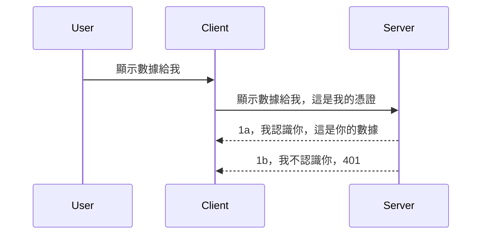

# 簡易認證

MCP SDK 支援使用 OAuth 2.1，這說實話是一個相當複雜的過程，涉及認證伺服器、資源伺服器、發送憑證、獲取代碼、交換代碼以換取令牌，直到最終能獲取資源資料。如果你不熟悉 OAuth（這是個很棒的實作方法），建議先從基本認證開始，再逐步提升安全性。這就是本章存在的意義，幫助你逐步提升至更進階的認證。

## 認證，我們指的是什麼？

認證（Auth）是認證（authentication）與授權（authorization）的總稱。其概念是我們需要做兩件事：

- **認證（Authentication）**，即判斷是否允許某人進入我們的系統，確認他們有權「出現在這裡」，也就是能存取我們的資源伺服器，MCP 伺服器功能所在之地。
- **授權（Authorization）**，是判斷一個使用者是否應當獲得他請求的特定資源存取權，例如這些訂單或這些產品，或者他們是否只能讀取內容而不能刪除，以此為例。

## 憑證：如何告訴系統我們是誰

大多數網頁開發者會想到給服務器提供一個憑證，通常是一個秘密，表明他們是否獲得「認證」。這個憑證通常是將使用者名稱和密碼做 base64 編碼的結果，或者是一個能唯一標識特定用戶的 API 金鑰。

這涉及通過名為 "Authorization" 的 HTTP 標頭傳送，格式如下：

```json
{ "Authorization": "secret123" }
```

通常被稱為基本認證。整個流程接著如下進行：



既然我們了解了流程，該如何實作呢？大多數網絡伺服器都有一個稱為中介軟件的概念，它是一段隨請求執行的程式碼，可以驗證憑證，如果憑證有效，則允許請求通過。若請求中沒有有效憑證，則回傳認證錯誤。以下展示如何實作：

**Python**

```python
class AuthMiddleware(BaseHTTPMiddleware):
    async def dispatch(self, request, call_next):

        has_header = request.headers.get("Authorization")
        if not has_header:
            print("-> Missing Authorization header!")
            return Response(status_code=401, content="Unauthorized")

        if not valid_token(has_header):
            print("-> Invalid token!")
            return Response(status_code=403, content="Forbidden")

        print("Valid token, proceeding...")
       
        response = await call_next(request)
        # 在回應中添加任何客戶端標頭或以某種方式更改
        return response


starlette_app.add_middleware(CustomHeaderMiddleware)
```

這裡我們：

- 建立了一個名為 `AuthMiddleware` 的中介軟件，其 `dispatch` 方法由網絡伺服器調用。
- 將中介軟件加入網絡伺服器：

    ```python
    starlette_app.add_middleware(AuthMiddleware)
    ```

- 撰寫檢查 Authorization 標頭是否存在及密鑰是否有效的驗證邏輯：

    ```python
    has_header = request.headers.get("Authorization")
    if not has_header:
        print("-> Missing Authorization header!")
        return Response(status_code=401, content="Unauthorized")

    if not valid_token(has_header):
        print("-> Invalid token!")
        return Response(status_code=403, content="Forbidden")
    ```

    如果密鑰存在且有效，我們透過呼叫 `call_next` 讓請求通過並回傳回應。

    ```python
    response = await call_next(request)
    # 添加任何客戶標頭或者以某種方式更改回應內容
    return response
    ```

工作原理是，當有網路請求送至伺服器時，中介軟件會被調用，根據其實現，會讓請求通過或返回表示客戶端無權繼續的錯誤。

**TypeScript**

這裡我們使用流行框架 Express 建立了一個中介軟件，攔截抵達 MCP 伺服器的請求。程式碼如下：

```typescript
function isValid(secret) {
    return secret === "secret123";
}

app.use((req, res, next) => {
    // 1. 授權標頭存在嗎？
    if(!req.headers["Authorization"]) {
        res.status(401).send('Unauthorized');
    }
    
    let token = req.headers["Authorization"];

    // 2. 檢查有效性。
    if(!isValid(token)) {
        res.status(403).send('Forbidden');
    }

   
    console.log('Middleware executed');
    // 3. 將請求傳遞到請求流程中的下一步。
    next();
});
```

程式碼執行了以下工作：

1. 檢查 Authorization 標頭是否存在，若否，回傳 401 錯誤。
2. 驗證憑證／令牌是否有效，若無效，回傳 403 錯誤。
3. 最後將請求傳遞至下游處理並回傳所需資源。

## 練習：實作認證功能

讓我們動手試試。計劃如下：

伺服器端

- 建立網頁伺服器與 MCP 實例。
- 實作伺服器端中介軟件。

用戶端

- 透過標頭帶憑證發送網路請求。

### -1- 建立網頁伺服器與 MCP 實例

> **前瞻:** 下方 TypeScript 範例在 `transports` 映射中以 `mcp-session-id` 做為鍵追蹤 HTTP 傳輸，符合 **MCP 規範 2025-11-25**。`2026-07-28` 版本候選移除了 `initialize` 握手與 session ID，因此這種每 session 的傳輸映射將被取代，改為無狀態、自包含的請求。詳見 [MCP 變更：2026-07-28 版本候選](../../01-CoreConcepts/mcp-2026-07-28-release-candidate.md)。

第一步，我們需要建立網頁伺服器實例以及 MCP 伺服器。

**Python**

這裡我們建立 MCP 伺服器實例，建立 starlette 網頁應用並使用 uvicorn 服務它。

```python
# 建立 MCP 伺服器

app = FastMCP(
    name="MCP Resource Server",
    instructions="Resource Server that validates tokens via Authorization Server introspection",
    host=settings["host"],
    port=settings["port"],
    debug=True
)

# 建立 starlette 網頁應用程式
starlette_app = app.streamable_http_app()

# 透過 uvicorn 提供應用程式服務
async def run(starlette_app):
    import uvicorn
    config = uvicorn.Config(
            starlette_app,
            host=app.settings.host,
            port=app.settings.port,
            log_level=app.settings.log_level.lower(),
        )
    server = uvicorn.Server(config)
    await server.serve()

run(starlette_app)
```

這段程式碼中，我們：

- 建立 MCP 伺服器。
- 從 MCP Server 建構 starlette 網頁應用，`app.streamable_http_app()`。
- 使用 uvicorn 啟動並服務網頁應用 `server.serve()`。

**TypeScript**

這裡我們建立 MCP 伺服器實例。

```typescript
const server = new McpServer({
      name: "example-server",
      version: "1.0.0"
    });

    // ... 設置伺服器資源、工具及提示 ...
```

此 MCP 伺服器的建立應放在 POST /mcp 路由定義中，因此我們將上述程式碼移動如下：

```typescript
import express from "express";
import { randomUUID } from "node:crypto";
import { McpServer } from "@modelcontextprotocol/sdk/server/mcp.js";
import { StreamableHTTPServerTransport } from "@modelcontextprotocol/sdk/server/streamableHttp.js";
import { isInitializeRequest } from "@modelcontextprotocol/sdk/types.js"

const app = express();
app.use(express.json());

// 用於按會話 ID 儲存傳輸的映射
const transports: { [sessionId: string]: StreamableHTTPServerTransport } = {};

// 處理用戶端到服務器的 POST 請求
app.post('/mcp', async (req, res) => {
  // 檢查是否存在會話 ID
  const sessionId = req.headers['mcp-session-id'] as string | undefined;
  let transport: StreamableHTTPServerTransport;

  if (sessionId && transports[sessionId]) {
    // 重用現有的傳輸
    transport = transports[sessionId];
  } else if (!sessionId && isInitializeRequest(req.body)) {
    // 新的初始化請求
    transport = new StreamableHTTPServerTransport({
      sessionIdGenerator: () => randomUUID(),
      onsessioninitialized: (sessionId) => {
        // 按會話 ID 儲存傳輸
        transports[sessionId] = transport;
      },
      // DNS 重新綁定保護默認被禁用，以保證向後兼容性。如果你在本地運行這個服務器
      // 請確保設置：
      // enableDnsRebindingProtection: true,
      // allowedHosts: ['127.0.0.1'],
    });

    // 傳輸關閉時清理資源
    transport.onclose = () => {
      if (transport.sessionId) {
        delete transports[transport.sessionId];
      }
    };
    const server = new McpServer({
      name: "example-server",
      version: "1.0.0"
    });

    // … 設置服務器資源、工具和提示 …

    // 連接到 MCP 服務器
    await server.connect(transport);
  } else {
    // 無效的請求
    res.status(400).json({
      jsonrpc: '2.0',
      error: {
        code: -32000,
        message: 'Bad Request: No valid session ID provided',
      },
      id: null,
    });
    return;
  }

  // 處理請求
  await transport.handleRequest(req, res, req.body);
});

// GET 和 DELETE 請求可重用的處理器
const handleSessionRequest = async (req: express.Request, res: express.Response) => {
  const sessionId = req.headers['mcp-session-id'] as string | undefined;
  if (!sessionId || !transports[sessionId]) {
    res.status(400).send('Invalid or missing session ID');
    return;
  }
  
  const transport = transports[sessionId];
  await transport.handleRequest(req, res);
};

// 處理伺服器到客戶端透過 SSE 的 GET 通知請求
app.get('/mcp', handleSessionRequest);

// 處理 DELETE 請求以終止會話
app.delete('/mcp', handleSessionRequest);

app.listen(3000);
```

現在你可看出 MCP 伺服器被移到 `app.post("/mcp")` 裡。

接著做下一步建立中介軟件以驗證進來的憑證。

### -2- 實作伺服器中介軟件

接下來是中介軟件部分。我們將建立一個中介軟件，從 `Authorization` 標頭尋找憑證並驗證。如果可接受，請求就會繼續執行需要的行為（如列出工具、讀取資源或 MCP 客戶端要求的其他功能）。

**Python**

建立中介軟件需繼承 `BaseHTTPMiddleware` 類別，有兩個值得關注的部份：

- 請求物件 `request`，用來讀取標頭資訊。
- `call_next` 回呼，在接受憑證後需呼叫它。

首先，我們需處理缺少 `Authorization` 標頭的情況：

```python
has_header = request.headers.get("Authorization")

# 無標頭，回應 401 錯誤，否則繼續。
if not has_header:
    print("-> Missing Authorization header!")
    return Response(status_code=401, content="Unauthorized")
```

這裡我們傳回 401 未授權訊息，因為客戶端認證失敗。

接著，如果送出了憑證，我們要驗證它的有效性：

```python
 if not valid_token(has_header):
    print("-> Invalid token!")
    return Response(status_code=403, content="Forbidden")
```

上方回傳 403 禁止訊息。以下為完整中介軟件實作：

```python
class AuthMiddleware(BaseHTTPMiddleware):
    async def dispatch(self, request, call_next):

        has_header = request.headers.get("Authorization")
        if not has_header:
            print("-> Missing Authorization header!")
            return Response(status_code=401, content="Unauthorized")

        if not valid_token(has_header):
            print("-> Invalid token!")
            return Response(status_code=403, content="Forbidden")

        print("Valid token, proceeding...")
        print(f"-> Received {request.method} {request.url}")
        response = await call_next(request)
        response.headers['Custom'] = 'Example'
        return response

```

很好，但 `valid_token` 函式怎麼寫？請看下面：

```python
# 不要用於生產環境 - 請改進！！
def valid_token(token: str) -> bool:
    # 移除 "Bearer " 前綴
    if token.startswith("Bearer "):
        token = token[7:]
        return token == "secret-token"
    return False
```

這裡當然可繼續改進。

重要提醒：絕對不要將秘密關鍵寫死在程式碼中。理想作法是從資料來源或身份服務提供者（IDP）取得比對用的值，甚至讓 IDP 負責驗證。

**TypeScript**

在 Express 中實作，需要呼叫 `use` 方法加入中介軟件函式。

我們要：

- 操作請求物件，檢查 `Authorization` 屬性的憑證。
- 驗證憑證有效性，若通過，讓請求繼續執行 MCP 功能（如列出工具、讀取資源等）。

這裡先檢查是否有 `Authorization` 標頭，若無則停止請求：

```typescript
if(!req.headers["authorization"]) {
    res.status(401).send('Unauthorized');
    return;
}
```

若完全沒送標頭，收到 401。

接著檢查憑證有效性，若無效，停止請求並回應不同訊息：

```typescript
if(!isValid(token)) {
    res.status(403).send('Forbidden');
    return;
} 
```

可看到回傳 403 錯誤。

以下是完整程式碼：

```typescript
app.use((req, res, next) => {
    console.log('Request received:', req.method, req.url, req.headers);
    console.log('Headers:', req.headers["authorization"]);
    if(!req.headers["authorization"]) {
        res.status(401).send('Unauthorized');
        return;
    }
    
    let token = req.headers["authorization"];

    if(!isValid(token)) {
        res.status(403).send('Forbidden');
        return;
    }  

    console.log('Middleware executed');
    next();
});
```

我們已在網頁伺服器設定中介軟件以驗證客戶端的憑證。那麼用戶端如何實作？

### -3- 透過標頭傳送含憑證的網路請求

我們需確保用戶端經由標頭傳送憑證。由於會使用 MCP 客戶端，我們要知道怎麼做。

**Python**

用戶端的部份，我們要像下面這樣帶入標頭與憑證：

```python
# 唔好硬編碼呢個數值，最少要放喺環境變量或者更安全嘅儲存位置
token = "secret-token"

async with streamablehttp_client(
        url = f"http://localhost:{port}/mcp",
        headers = {"Authorization": f"Bearer {token}"}
    ) as (
        read_stream,
        write_stream,
        session_callback,
    ):
        async with ClientSession(
            read_stream,
            write_stream
        ) as session:
            await session.initialize()
      
            # 待完成，你想喺客戶端做啲乜，例如列出工具、調用工具等等
```

注意我們是這樣給 `headers` 屬性：` headers = {"Authorization": f"Bearer {token}"}`。

**TypeScript**

我們分兩步解決：

1. 用憑證填充設定物件。
2. 將設定物件傳給傳輸層。

```typescript

// 唔好似呢度咁硬編碼個數值。最少要用環境變數，喺開發模式下用啲好似 dotenv 嘅工具。
let token = "secret123"

// 定義一個 client 傳輸選項嘅物件
let options: StreamableHTTPClientTransportOptions = {
  sessionId: sessionId,
  requestInit: {
    headers: {
      "Authorization": "secret123"
    }
  }
};

// 把選項物件傳畀傳輸層
async function main() {
   const transport = new StreamableHTTPClientTransport(
      new URL(serverUrl),
      options
   );
```

這裡可以看到，我們先建立一個 `options` 物件，標頭放在 `requestInit` 屬性下。

重要提醒：如何改進呢？目前實作存在一些風險。首先，除非使用 HTTPS，這樣的憑證傳送方式頗為危險。即使有 HTTPS，憑證依然可能被竊取，因此需要系統支持快速撤銷令牌，並增加附加檢查：請求來源位置、是否頻繁請求（類似機器人行為）等，總之有一系列考量。

不過對於非常簡單的 API，如果你不想任何人未認證就能調用你的 API，以上已經是不錯的起點。

既然如此，讓我們嘗試使用標準格式如 JSON Web Token（JWT 或稱作 JOT）來加強認證安全。

## JSON Web 令牌，JWT

我們正嘗試從很簡單的憑證進階。採用 JWT 立即帶來哪些改進？

- <strong>安全性提升</strong>。基本認證中，會一再傳送使用者名稱和密碼的 base64 編碼（或 API 金鑰），風險相對較高。JWT 則是先送出使用者名稱與密碼獲取令牌，且令牌設有過期時間。JWT 亦方便使用角色、範圍及權限進行精細授權管理。
- <strong>無狀態化與可擴展性</strong>。JWT 是自包含的，攜帶所有使用者息，免除伺服器側的會話存儲，令牌也能在本地驗證。
- <strong>互操作性與聯邦身份認證</strong>。JWT 是 Open ID Connect 核心，被知名身份供應商如 Entra ID、Google Identity 和 Auth0 廣泛使用。它們也支持單點登入等等，達到企業級別。
- <strong>模組化與彈性</strong>。JWT 也可用於 Azure API 管理、NGINX 等 API 網關，支持使用者認證場景、服務間通訊，包括假扮與委派等情境。
- <strong>效能與快取</strong>。JWT 解碼後可快取，減少解析次數。對高流量應用尤其有用，提高吞吐量並減輕基礎建設負擔。
- <strong>進階功能</strong>。支援訊息內省（檢查伺服器端有效性）與撤銷（使令牌失效）。

有了這些好處，我們看看如何把實作提升至新層次。

## 將基本認證轉為 JWT

總的來說，我們需做的變更是：

- **學會建構 JWT 令牌**，準備將它從用戶端傳到服務端。
- **驗證 JWT 令牌**，如有效，授予用戶端資源存取。
- <strong>安全存放令牌</strong>。令牌如何安全存放。
- <strong>保護路徑</strong>。我們必須保護路由，也就是 MCP 功能所用路由。
- <strong>新增刷新令牌</strong>。確保令牌時效較短，但有長效刷新令牌可用於交換新令牌，並實現刷新端點和令牌輪替策略。

### -1- 建立 JWT 令牌

首先，JWT 令牌由以下幾部分組成：

- **標頭（header）**，用來描述演算法與令牌類型。
- **有效載荷（payload）**，即聲明，如 sub（令牌代表的用戶或實體，典型是使用者 ID）、exp（過期時間）、role（角色）。
- **簽名（signature）**，用秘密或私鑰簽名。

我們需建構標頭、有效載荷和編碼後的令牌。

**Python**

```python

import jwt
import jwt
from jwt.exceptions import ExpiredSignatureError, InvalidTokenError
import datetime

# 用於簽署 JWT 的密鑰
secret_key = 'your-secret-key'

header = {
    "alg": "HS256",
    "typ": "JWT"
}

# 使用者資訊及其聲明和過期時間
payload = {
    "sub": "1234567890",               # 主題（用戶 ID）
    "name": "User Userson",                # 自訂聲明
    "admin": True,                     # 自訂聲明
    "iat": datetime.datetime.utcnow(),# 發行時間
    "exp": datetime.datetime.utcnow() + datetime.timedelta(hours=1)  # 過期時間
}

# 編碼它
encoded_jwt = jwt.encode(payload, secret_key, algorithm="HS256", headers=header)
```

在上面程式碼中，我們：

- 使用 HS256 演算法，並將類型設為 JWT 的標頭。
- 建構含主體（使用者 ID）、使用者名稱、角色、簽發時間及過期時間的有效載荷，實現了前述的時間限制功能。

**TypeScript**

這裡我們需要一些依賴庫以協助建構 JWT 令牌。

依賴

```sh

npm install jsonwebtoken
npm install --save-dev @types/jsonwebtoken
```

有了這些，我們建立標頭、有效載荷，並透過它們建立編碼令牌。

```typescript
import jwt from 'jsonwebtoken';

const secretKey = 'your-secret-key'; // 在生產環境使用環境變數

// 定義負載
const payload = {
  sub: '1234567890',
  name: 'User usersson',
  admin: true,
  iat: Math.floor(Date.now() / 1000), // 簽發時間
  exp: Math.floor(Date.now() / 1000) + 60 * 60 // 1小時後過期
};

// 定義標頭（可選，jsonwebtoken 設置預設值）
const header = {
  alg: 'HS256',
  typ: 'JWT'
};

// 創建令牌
const token = jwt.sign(payload, secretKey, {
  algorithm: 'HS256',
  header: header
});

console.log('JWT:', token);
```

此令牌內容：

使用 HS256 簽名
有效期限為 1 小時
包含下列聲明：sub、name、admin、iat、exp。

### -2- 驗證令牌

我們還需驗證令牌，這最好在伺服器端進行，以確保客戶端送來的資料確實有效。應執行多項檢查，從結構到有效性。建議額外確認用戶是否存在等。

驗證令牌需先解碼以讀取其內容，再開始檢查有效性：

**Python**

```python

# 解碼並驗證 JWT
try:
    decoded = jwt.decode(token, secret_key, algorithms=["HS256"])
    print("✅ Token is valid.")
    print("Decoded claims:")
    for key, value in decoded.items():
        print(f"  {key}: {value}")
except ExpiredSignatureError:
    print("❌ Token has expired.")
except InvalidTokenError as e:
    print(f"❌ Invalid token: {e}")

```


在這段程式碼中，我們呼叫 `jwt.decode`，輸入包括令牌、密鑰和選擇的演算法。注意我們使用 try-catch 結構，因為驗證失敗會導致錯誤拋出。

**TypeScript**

這裡我們需要呼叫 `jwt.verify` 來取得令牌的解碼版本，以便進一步分析。如果此呼叫失敗，表示令牌結構不正確或不再有效。

```typescript

try {
  const decoded = jwt.verify(token, secretKey);
  console.log('Decoded Payload:', decoded);
} catch (err) {
  console.error('Token verification failed:', err);
}
```

注意：如前所述，我們應當執行額外檢查，確保此令牌對應系統中的使用者，並確認該使用者擁有它宣稱的權限。

接下來，我們來探討基於角色的存取控制，也稱為 RBAC。

## 新增基於角色的存取控制

我們的想法是不同角色擁有不同權限。例如，我們假設管理員可執行所有操作，普通使用者可執行讀寫操作，訪客只能讀取。因此，這裡列出一些可能的權限層級：

- Admin.Write 
- User.Read
- Guest.Read

讓我們看看如何用中介軟體來實作這種控制。中介軟體可針對單一路由添加，也可針對所有路由添加。

**Python**

```python
from starlette.middleware.base import BaseHTTPMiddleware
from starlette.responses import JSONResponse
import jwt

# 不要將密碼寫在程式碼中，這只是示範用途。請從安全的地方讀取。
SECRET_KEY = "your-secret-key" # 將此放在環境變數中
REQUIRED_PERMISSION = "User.Read"

class JWTPermissionMiddleware(BaseHTTPMiddleware):
    async def dispatch(self, request, call_next):
        auth_header = request.headers.get("Authorization")
        if not auth_header or not auth_header.startswith("Bearer "):
            return JSONResponse({"error": "Missing or invalid Authorization header"}, status_code=401)

        token = auth_header.split(" ")[1]
        try:
            decoded = jwt.decode(token, SECRET_KEY, algorithms=["HS256"])
        except jwt.ExpiredSignatureError:
            return JSONResponse({"error": "Token expired"}, status_code=401)
        except jwt.InvalidTokenError:
            return JSONResponse({"error": "Invalid token"}, status_code=401)

        permissions = decoded.get("permissions", [])
        if REQUIRED_PERMISSION not in permissions:
            return JSONResponse({"error": "Permission denied"}, status_code=403)

        request.state.user = decoded
        return await call_next(request)


```

有幾種不同方式添加中介軟體，如下：

```python

# 選項 1：在構建 starlette 應用時添加中介軟件
middleware = [
    Middleware(JWTPermissionMiddleware)
]

app = Starlette(routes=routes, middleware=middleware)

# 選項 2：在 starlette 應用已構建後添加中介軟件
starlette_app.add_middleware(JWTPermissionMiddleware)

# 選項 3：為每條路由添加中介軟件
routes = [
    Route(
        "/mcp",
        endpoint=..., # 處理程序
        middleware=[Middleware(JWTPermissionMiddleware)]
    )
]
```

**TypeScript**

我們可以使用 `app.use`，並搭配會在所有請求執行的中介軟體。

```typescript
app.use((req, res, next) => {
    console.log('Request received:', req.method, req.url, req.headers);
    console.log('Headers:', req.headers["authorization"]);

    // 1. 檢查是否已發送授權標頭

    if(!req.headers["authorization"]) {
        res.status(401).send('Unauthorized');
        return;
    }
    
    let token = req.headers["authorization"];

    // 2. 檢查令牌是否有效
    if(!isValid(token)) {
        res.status(403).send('Forbidden');
        return;
    }  

    // 3. 檢查令牌用戶是否存在於我們的系統中
    if(!isExistingUser(token)) {
        res.status(403).send('Forbidden');
        console.log("User does not exist");
        return;
    }
    console.log("User exists");

    // 4. 驗證令牌是否具有正確的權限
    if(!hasScopes(token, ["User.Read"])){
        res.status(403).send('Forbidden - insufficient scopes');
    }

    console.log("User has required scopes");

    console.log('Middleware executed');
    next();
});

```

我們可以讓中介軟體執行多項工作，且中介軟體應該做的事情包括：

1. 檢查授權標頭是否存在
2. 檢查令牌是否有效，我們呼叫 `isValid`，這是一個我們撰寫的方法，檢查 JWT 令牌的完整性和有效性。
3. 驗證使用者是否存在於系統中，我們應該執行這個檢查。

   ```typescript
    // 數據庫中的用戶
   const users = [
     "user1",
     "User usersson",
   ]

   function isExistingUser(token) {
     let decodedToken = verifyToken(token);

     // 待辦事項，檢查用戶是否存在於數據庫
     return users.includes(decodedToken?.name || "");
   }
   ```

   如上，我們建立了一個非常簡單的 `users` 清單，顯然這應該放在資料庫中。

4. 另外，我們還應該檢查令牌是否擁有適當權限。

   ```typescript
   if(!hasScopes(token, ["User.Read"])){
        res.status(403).send('Forbidden - insufficient scopes');
   }
   ```

   上面中介軟體程式碼中，我們檢查令牌是否包含 User.Read 權限，若無則回傳 403 錯誤。以下是 `hasScopes` 助手方法。

   ```typescript
   function hasScopes(scope: string, requiredScopes: string[]) {
     let decodedToken = verifyToken(scope);
    return requiredScopes.every(scope => decodedToken?.scopes.includes(scope));
  }
   ```

Have a think which additional checks you should be doing, but these are the absolute minimum of checks you should be doing.

Using Express as a web framework is a common choice. There are helpers library when you use JWT so you can write less code.

- `express-jwt`, helper library that provides a middleware that helps decode your token.
- `express-jwt-permissions`, this provides a middleware `guard` that helps check if a certain permission is on the token.

Here's what these libraries can look like when used:

```typescript
const express = require('express');
const jwt = require('express-jwt');
const guard = require('express-jwt-permissions')();

const app = express();
const secretKey = 'your-secret-key'; // put this in env variable

// Decode JWT and attach to req.user
app.use(jwt({ secret: secretKey, algorithms: ['HS256'] }));

// Check for User.Read permission
app.use(guard.check('User.Read'));

// multiple permissions
// app.use(guard.check(['User.Read', 'Admin.Access']));

app.get('/protected', (req, res) => {
  res.json({ message: `Welcome ${req.user.name}` });
});

// Error handler
app.use((err, req, res, next) => {
  if (err.code === 'permission_denied') {
    return res.status(403).send('Forbidden');
  }
  next(err);
});

```

現在你已了解中介軟體如何用於身份驗證和授權，那 MCP 呢？它會改變我們的驗證方式嗎？讓我們在下一章節來發掘。

### -3- 將 RBAC 新增至 MCP

到目前為止你已見識如何通過中介軟體新增 RBAC，但對 MCP 而言，沒有簡單方法來新增針對每個 MCP 功能的 RBAC，那要怎麼做？我們只好新增類似以下的程式碼，檢查該客戶端是否有呼叫特定工具的權限：

你有多種方法可實現每項功能的 RBAC，以下列出幾項：

- 為每個工具、資源、提示新增權限層級檢查。

   **python**

   ```python
   @tool()
   def delete_product(id: int):
      try:
          check_permissions(role="Admin.Write", request)
      catch:
        pass # 客戶端授權失敗，引發授權錯誤
   ```

   **typescript**

   ```typescript
   server.registerTool(
    "delete-product",
    {
      title: Delete a product",
      description: "Deletes a product",
      inputSchema: { id: z.number() }
    },
    async ({ id }) => {
      
      try {
        checkPermissions("Admin.Write", request);
        // 待辦，將ID發送到productService和遠程入口
      } catch(Exception e) {
        console.log("Authorization error, you're not allowed");  
      }

      return {
        content: [{ type: "text", text: `Deletected product with id ${id}` }]
      };
    }
   );
   ```


- 使用進階伺服器方法和請求處理器，以減少需要檢查的地方數量。

   **Python**

   ```python
   
   tool_permission = {
      "create_product": ["User.Write", "Admin.Write"],
      "delete_product": ["Admin.Write"]
   }

   def has_permission(user_permissions, required_permissions) -> bool:
      # user_permissions: 使用者擁有的權限列表
      # required_permissions: 工具所需的權限列表
      return any(perm in user_permissions for perm in required_permissions)

   @server.call_tool()
   async def handle_call_tool(
     name: str, arguments: dict[str, str] | None
   ) -> list[types.TextContent]:
    # 假設 request.user.permissions 是使用者的權限列表
     user_permissions = request.user.permissions
     required_permissions = tool_permission.get(name, [])
     if not has_permission(user_permissions, required_permissions):
        # 引發錯誤 "你沒有權限呼叫工具 {name}"
        raise Exception(f"You don't have permission to call tool {name}")
     # 繼續並呼叫工具
     # ...
   ```   
   

   **TypeScript**

   ```typescript
   function hasPermission(userPermissions: string[], requiredPermissions: string[]): boolean {
       if (!Array.isArray(userPermissions) || !Array.isArray(requiredPermissions)) return false;
       // 如果用戶至少擁有一項所需權限，返回 true
       
       return requiredPermissions.some(perm => userPermissions.includes(perm));
   }
  
   server.setRequestHandler(CallToolRequestSchema, async (request) => {
      const { params: { name } } = request;
  
      let permissions = request.user.permissions;
  
      if (!hasPermission(permissions, toolPermissions[name])) {
         return new Error(`You don't have permission to call ${name}`);
      }
  
      // 繼續..
   });
   ```

   注意，你需要確保中介軟體會將解碼後的令牌賦值給請求的 user 屬性，使上述程式碼易於撰寫。

### 總結

現在我們已經討論如何添加 RBAC 支援，特別是對 MCP，現在是時候自行實作安全機制，以確保你理解提供給你的概念。

## 任務 1：使用基本身份驗證構建 MCP 伺服器及 MCP 用戶端

這裡你將應用在標頭中傳送憑證的學習內容。

## 解答 1

[解答 1](./code/basic/README.md)

## 任務 2：將任務 1 的解決方案升級為使用 JWT

使用第一個解決方案，但這次我們來改進它。

不再使用基本認證，轉而使用 JWT。

## 解答 2

[解答 2](./solution/jwt-solution/README.md)

## 挑戰

新增我們在「新增 RBAC 至 MCP」章節中描述的每工具 RBAC。

## 摘要

希望你在本章學習了很多，從完全沒有安全機制、基本安全，到 JWT 以及如何新增到 MCP。

我們已建立穩固的自訂 JWT 基礎，但隨著規模擴大，我們正朝向標準化身分模型邁進。採用像 Entra 或 Keycloak 的 IdP，能讓我們將令牌的發行、驗證和生命週期管理交由可信平台處理，釋放我們的心力專注於應用邏輯和用戶體驗。

為此，我們有更[深入的 Entra 章節](../../05-AdvancedTopics/mcp-security-entra/README.md)

## 下一步

- 下一步：[設定 MCP 主機](../12-mcp-hosts/README.md)

---

<!-- CO-OP TRANSLATOR DISCLAIMER START -->
**免責聲明**：
本文件使用 AI 翻譯服務 [Co-op Translator](https://github.com/Azure/co-op-translator) 進行翻譯。雖然我們力求準確，但請注意，自動翻譯可能包含錯誤或不準確之處。原始文件的母語版本應被視為權威來源。對於重要資訊，建議尋求專業人工翻譯。我們不對因使用本翻譯而引起的任何誤解或曲解承擔責任。
<!-- CO-OP TRANSLATOR DISCLAIMER END -->