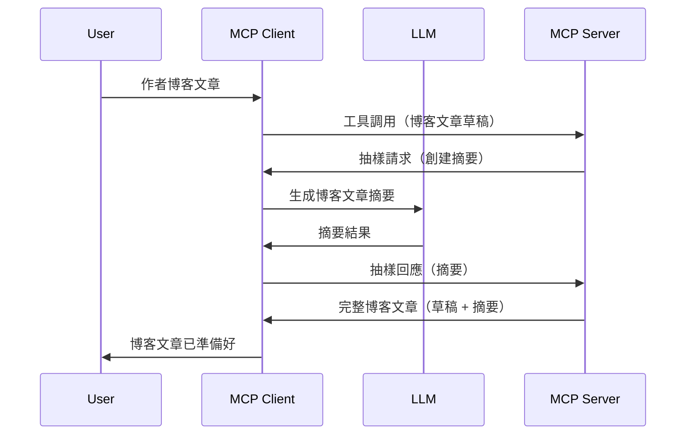

# 抽樣 - 將功能委派給客戶端

> **棄用通知：** `2026-07-28` MCP 規範發佈候選版本標記抽樣為棄用，推薦直接整合到大型語言模型提供者的 API。抽樣在 `2025-11-25` 版本及任何正式棄用後至少一年內仍有效，因此本課程內容依然有效 — 但新的伺服器設計應評估替代方案。詳見[ MCP 中的變更：2026-07-28 發佈候選版本](../../01-CoreConcepts/mcp-2026-07-28-release-candidate.md)。

有時，您需要 MCP 客戶端與 MCP 伺服器合作以達到共同目標。可能會有這種情形：伺服器需要客戶端上大型語言模型的協助。對於這種情況，您應該使用抽樣。

讓我們探討一些使用案例以及如何構建涉及抽樣的解決方案。

## 概述

在本課程中，我們重點解釋何時及在哪裡使用抽樣，以及如何配置它。

## 學習目標

本章將涵蓋：

- 解釋什麼是抽樣及何時使用它。
- 展示如何在 MCP 中配置抽樣。
- 提供抽樣實際操作的範例。

## 什麼是抽樣及為什麼使用它？

抽樣是一項進階功能，其運作方式如下：



### 抽樣請求

好了，現在我們對一個合理場景有了高層次的了解，讓我們來談談伺服器回傳給客戶端的抽樣請求。下面是該請求的 JSON-RPC 格式範例：

```json
{
  "jsonrpc": "2.0",
  "id": 1,
  "method": "sampling/createMessage",
  "params": {
    "messages": [
      {
        "role": "user",
        "content": {
          "type": "text",
          "text": "Create a blog post summary of the following blog post: <BLOG POST>"
        }
      }
    ],
    "modelPreferences": {
      "hints": [
        {
          "name": "claude-3-sonnet"
        }
      ],
      "intelligencePriority": 0.8,
      "speedPriority": 0.5
    },
    "systemPrompt": "You are a helpful assistant.",
    "maxTokens": 100
  }
}
```

有幾件值得說明的：

- 提示（prompt）在 content -> text 下，是給大型語言模型指示去摘要部落格文章內容。

- **modelPreferences**，此區段僅為偏好，推薦給大型語言模型使用的配置。使用者可選擇接受或修改這些建議。此例中推薦模型、速度和智能優先順序。
- **systemPrompt**，這是標準系統提示，賦予大型語言模型人格並包含指導指令。
- **maxTokens**，此屬性表示建議用於此任務的最大代幣數量。

### 抽樣回應

該回應是 MCP 客戶端最終回傳給 MCP 伺服器的結果，是客戶端呼叫大型語言模型、等待回應後構建的訊息。以下為 JSON-RPC 格式範例：

```json
{
  "jsonrpc": "2.0",
  "id": 1,
  "result": {
    "role": "assistant",
    "content": {
      "type": "text",
      "text": "Here's your abstract <ABSTRACT>"
    },
    "model": "gpt-5",
    "stopReason": "endTurn"
  }
}
```

請注意回應是部落格文章的摘要，正如我們所要求。另請注意所使用的 `model` 並非原本要求的，而是由 "claude-3-sonnet" 改為 "gpt-5"。此為示例說明使用者可改變所用模型，抽樣請求僅為建議。

好了，既然我們了解了主要流程，以及適用於「部落格文章創作 + 摘要」的實用任務，讓我們看看要如何實作它。

### 訊息類型

抽樣訊息不限於文字，也可傳送圖片和音訊。下面展示 JSON-RPC 的差異：

<strong>文字</strong>

```json
{
  "type": "text",
  "text": "The message content"
}
```

<strong>圖片內容</strong>

```json
{
  "type": "image",
  "data": "base64-encoded-image-data",
  "mimeType": "image/jpeg"
}
```

<strong>音訊內容</strong>

```json
{
  "type": "audio",
  "data": "base64-encoded-audio-data",
  "mimeType": "audio/wav"
}
```

> 注意：欲瞭解更多抽樣詳情，請參考[官方文件](https://modelcontextprotocol.io/specification/2025-11-25/client/sampling)

## 如何在客戶端配置抽樣

> 注意：如果您只在建置伺服器，這裡不需要太多操作。

在客戶端，您需要如此指定以下功能：

```json
{
  "capabilities": {
    "sampling": {}
  }
}
```

此功能會在所選客戶端與伺服器初始化時被採用。

## 抽樣實作範例 - 創建部落格文章

讓我們一起編寫一個抽樣伺服器，我們需要執行以下步驟：

1. 在伺服器上建立一個工具。
1. 該工具應建立一個抽樣請求。
1. 工具應等待客戶端的抽樣請求回覆。
1. 然後產生工具結果。

讓我們逐步看看程式碼：

### -1- 建立工具

**python**

```python
@mcp.tool()
async def create_blog(title: str, content: str, ctx: Context[ServerSession, None]) -> str:
    """Create a blog post and generate a summary"""

```

### -2- 建立抽樣請求

使用以下程式碼擴充您的工具：

**python**

```python
post = BlogPost(
        id=len(posts) + 1,
        title=title,
        content=content,
        abstract=""
    )

prompt = f"Create an abstract of the following blog post: title: {title} and draft: {content} "

result = await ctx.session.create_message(
        messages=[
            SamplingMessage(
                role="user",
                content=TextContent(type="text", text=prompt),
            )
        ],
        max_tokens=100,
)

```

### -3- 等待回應並回傳回應

**python**

```python
post.abstract = result.content.text

posts.append(post)

# 返回完整產品
return json.dumps({
    "id": post.title,
    "abstract": post.abstract
})
```

### -4- 完整程式碼

**python**

```python
from starlette.applications import Starlette
from starlette.routing import Mount, Host

from mcp.server.fastmcp import Context, FastMCP

from mcp.server.session import ServerSession
from mcp.types import SamplingMessage, TextContent

import json


from uuid import uuid4
from typing import List
from pydantic import BaseModel


mcp = FastMCP("Blog post generator")

# app = FastAPI()

posts = []

class BlogPost(BaseModel):
    id: int
    title: str
    content: str
    abstract: str

posts: List[BlogPost] = []

@mcp.tool()
async def create_blog(title: str, content: str, ctx: Context[ServerSession, None]) -> str:
    """Create a blog post and generate a summary"""

    post = BlogPost(
        id=len(posts) + 1,
        title=title,
        content=content,
        abstract=""
    )

    prompt = f"Create an abstract of the following blog post: title: {title} and draft: {content} "

    result = await ctx.session.create_message(
        messages=[
            SamplingMessage(
                role="user",
                content=TextContent(type="text", text=prompt),
            )
        ],
        max_tokens=100,
    )

    post.abstract = result.content.text

    posts.append(post)

    # 返回完整的博客文章
    return json.dumps({
        "id": post.title,
        "abstract": post.abstract
    })

if __name__ == "__main__":
    print("Starting server...")
    # mcp.run()
    mcp.run(transport="streamable-http")

# 使用以下命令執行應用程式：python server.py
```

### -5- 在 Visual Studio Code 測試

在 Visual Studio Code 中測試，請執行：

1. 在終端機啟動伺服器
1. 將其新增至 *mcp.json*（並確保已啟動），範例如下：

   ```json
   "servers": {
      "blog-server": {
        "type": "http",
        "url": "http://localhost:8000/mcp"
      }
   }
   ```

1. 輸入提示：

   ```text
   create a blog post named "Where Python comes from", the content is "Python is actually named after Monty Python Flying Circus"
   ```

1. 允許執行抽樣。首次測試時會跳出額外對話框請求您同意，之後會顯示通常詢問是否執行工具的對話框。

1. 檢查結果。您會在 GitHub Copilot 聊天視窗看到整齊呈現結果，也可以檢查原始 JSON 回應。

<strong>額外提示</strong>。Visual Studio Code 工具對抽樣支援良好。您可在已安裝伺服器的設定中啟用抽樣存取，方法如下：

1. 前往擴充功能區。
1. 在「MCP SERVERS - INSTALLED」區段選擇已安裝伺服器的齒輪圖示。
1 選擇「Configure Model Access」，您可以設定 GitHub Copilot 在進行抽樣時被允許使用的模型。也可透過選擇「Show Sampling requests」查看近期所有抽樣請求。

## 作業

本作業為構建稍有不同的抽樣，即支持生成產品描述的抽樣整合。以下是您的場景：

<strong>場景</strong>：電商後台工作人員需協助，因產生產品描述耗時太長。您應建構一個解決方案，可以呼叫工具 "create_product" 並傳入 "title" 與 "keywords" 作為參數，並完成產生包含 "description" 欄位之完整產品描述，此描述將由客戶端大型語言模型填充。

提示：利用先前所學構建此伺服器及其工具，使用抽樣請求。

## 解決方案

[解決方案](./solution/README.md)

## 主要重點

抽樣是一個強大的功能，允許伺服器在需要大型語言模型協助時，將任務委派給客戶端。

## 下一步

- [第四章 - 實務實作](../../04-PracticalImplementation/README.md)

---

<!-- CO-OP TRANSLATOR DISCLAIMER START -->
**免責聲明**：
本文件使用 AI 翻譯服務 [Co-op Translator](https://github.com/Azure/co-op-translator) 進行翻譯。雖然我們力求準確，但請注意，自動翻譯可能包含錯誤或不準確之處。原始文件的母語版本應被視為權威來源。對於重要資訊，建議尋求專業人工翻譯。我們不對因使用本翻譯而引起的任何誤解或曲解承擔責任。
<!-- CO-OP TRANSLATOR DISCLAIMER END -->