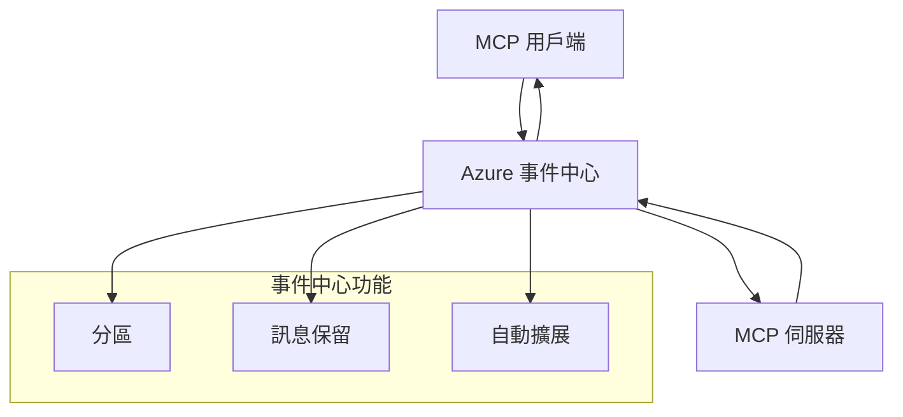

# MCP 自訂傳輸 - 進階實作指南

Model Context Protocol (MCP) 提供傳輸機制的彈性，允許為專門的企業環境實作自訂方案。本進階指南透過使用 Azure Event Grid 和 Azure Event Hubs 的實際範例來探討自訂傳輸的實作，以建立可擴充的雲端原生 MCP 解決方案。

> <strong>展望未來：</strong>本指南依據 **MCP 規範 2025-11-25** 撰寫，其中必須於每個會話中保留會話排序（請參閱下方的訊息協議）。`2026-07-28` 發行候選版本將完全移除協議層的會話機制，並需要 `Mcp-Method`/`Mcp-Name` 標頭，便於閘道及自訂傳輸進行依請求而非依會話的路由。請參閱 [MCP 變更：2026-07-28 發行候選版本](../../01-CoreConcepts/mcp-2026-07-28-release-candidate.md)。

## 介紹

MCP 的標準傳輸（stdio 與 HTTP 串流）可滿足大多數使用情境，但企業環境往往需要專門的傳輸機制以提升可擴充性、可靠度，並與現有雲端基礎架構整合。自訂傳輸讓 MCP 能夠運用雲端原生的訊息服務來支援非同步通訊、事件驅動架構和分散式處理。

本課程將探討基於最新 MCP 規範 (2025-11-25)、Azure 訊息服務及既有企業整合模式的進階傳輸實作。

### **MCP 傳輸架構**

**摘自 MCP 規範 (2025-11-25)：**

- <strong>標準傳輸</strong>：stdio（建議使用）、HTTP 串流（遠端場景用）
- <strong>自訂傳輸</strong>：任何實作 MCP 訊息交換協議的傳輸
- <strong>訊息格式</strong>：JSON-RPC 2.0 且擴充 MCP 專屬欄位
- <strong>雙向通訊</strong>：必須支援全雙工通訊以應對通知與回應

## 學習目標

完成本進階課程後，您將能夠：

- <strong>理解自訂傳輸要求</strong>：於任意傳輸層實作 MCP 協議且保持合規
- **構建 Azure Event Grid 傳輸**：使用 Azure Event Grid 實現無伺服器可擴展的事件驅動 MCP 伺服器
- **實作 Azure Event Hubs 傳輸**：利用 Azure Event Hubs 設計高吞吐量的 MCP 即時串流解決方案
- <strong>應用企業模式</strong>：與既有 Azure 基礎設施及安全模型整合自訂傳輸
- <strong>處理傳輸可靠度</strong>：實作訊息持久性、排序及錯誤處理以應付企業情境
- <strong>優化效能</strong>：設計符合規模、延遲及吞吐率需求的傳輸方案

## <strong>傳輸要求</strong>

### **來自 MCP 規範 (2025-11-25) 的核心要求：**

```yaml
Message Protocol:
  format: "JSON-RPC 2.0 with MCP extensions"
  bidirectional: "Full duplex communication required"
  ordering: "Message ordering must be preserved per session"
  
Transport Layer:
  reliability: "Transport MUST handle connection failures gracefully"
  security: "Transport MUST support secure communication"
  identification: "Each session MUST have unique identifier"
  
Custom Transport:
  compliance: "MUST implement complete MCP message exchange"
  extensibility: "MAY add transport-specific features"
  interoperability: "MUST maintain protocol compatibility"
```

## **Azure Event Grid 傳輸實作**

Azure Event Grid 提供無伺服器事件路由服務，非常適合事件驅動型 MCP 架構。本實作示範如何構建可擴展且鬆耦合的 MCP 系統。

### <strong>架構概述</strong>

```mermaid
graph TB
    Client[MCP 用戶端] --> EG[Azure 事件網格]
    EG --> Server[MCP 伺服器功能]
    Server --> EG
    EG --> Client
    
    subgraph 「Azure 服務」
        EG
        Server
        KV[金鑰保管庫]
        Monitor[應用程式洞察]
    end
```

### **C# 實作 - Event Grid 傳輸**

```csharp
using Azure.Messaging.EventGrid;
using Microsoft.Extensions.Azure;
using System.Text.Json;

public class EventGridMcpTransport : IMcpTransport
{
    private readonly EventGridPublisherClient _publisher;
    private readonly string _topicEndpoint;
    private readonly string _clientId;
    
    public EventGridMcpTransport(string topicEndpoint, string accessKey, string clientId)
    {
        _publisher = new EventGridPublisherClient(
            new Uri(topicEndpoint), 
            new AzureKeyCredential(accessKey));
        _topicEndpoint = topicEndpoint;
        _clientId = clientId;
    }
    
    public async Task SendMessageAsync(McpMessage message)
    {
        var eventGridEvent = new EventGridEvent(
            subject: $"mcp/{_clientId}",
            eventType: "MCP.MessageReceived",
            dataVersion: "1.0",
            data: JsonSerializer.Serialize(message))
        {
            Id = Guid.NewGuid().ToString(),
            EventTime = DateTimeOffset.UtcNow
        };
        
        await _publisher.SendEventAsync(eventGridEvent);
    }
    
    public async Task<McpMessage> ReceiveMessageAsync(CancellationToken cancellationToken)
    {
        // Event Grid is push-based, so implement webhook receiver
        // This would typically be handled by Azure Functions trigger
        throw new NotImplementedException("Use EventGridTrigger in Azure Functions");
    }
}

// Azure Function for receiving Event Grid events
[FunctionName("McpEventGridReceiver")]
public async Task<IActionResult> HandleEventGridMessage(
    [EventGridTrigger] EventGridEvent eventGridEvent,
    ILogger log)
{
    try
    {
        var mcpMessage = JsonSerializer.Deserialize<McpMessage>(
            eventGridEvent.Data.ToString());
        
        // Process MCP message
        var response = await _mcpServer.ProcessMessageAsync(mcpMessage);
        
        // Send response back via Event Grid
        await _transport.SendMessageAsync(response);
        
        return new OkResult();
    }
    catch (Exception ex)
    {
        log.LogError(ex, "Error processing Event Grid MCP message");
        return new BadRequestResult();
    }
}
```

### **TypeScript 實作 - Event Grid 傳輸**

```typescript
import { EventGridPublisherClient, AzureKeyCredential } from "@azure/eventgrid";
import { McpTransport, McpMessage } from "./mcp-types";

export class EventGridMcpTransport implements McpTransport {
    private publisher: EventGridPublisherClient;
    private clientId: string;
    
    constructor(
        private topicEndpoint: string,
        private accessKey: string,
        clientId: string
    ) {
        this.publisher = new EventGridPublisherClient(
            topicEndpoint,
            new AzureKeyCredential(accessKey)
        );
        this.clientId = clientId;
    }
    
    async sendMessage(message: McpMessage): Promise<void> {
        const event = {
            id: crypto.randomUUID(),
            source: `mcp-client-${this.clientId}`,
            type: "MCP.MessageReceived",
            time: new Date(),
            data: message
        };
        
        await this.publisher.sendEvents([event]);
    }
    
    // 透過 Azure Functions 的事件驅動接收
    onMessage(handler: (message: McpMessage) => Promise<void>): void {
        // 實作將使用 Azure Functions Event Grid 觸發器
        // 這是一個 webhook 接收器的概念介面
    }
}

// Azure Functions 的實作
import { app, InvocationContext, EventGridEvent } from "@azure/functions";

app.eventGrid("mcpEventGridHandler", {
    handler: async (event: EventGridEvent, context: InvocationContext) => {
        try {
            const mcpMessage = event.data as McpMessage;
            
            // 處理 MCP 訊息
            const response = await mcpServer.processMessage(mcpMessage);
            
            // 透過 Event Grid 發送回應
            await transport.sendMessage(response);
            
        } catch (error) {
            context.error("Error processing MCP message:", error);
            throw error;
        }
    }
});
```

### **Python 實作 - Event Grid 傳輸**

```python
from azure.eventgrid import EventGridPublisherClient, EventGridEvent
from azure.core.credentials import AzureKeyCredential
import asyncio
import json
from typing import Callable, Optional
import uuid
from datetime import datetime

class EventGridMcpTransport:
    def __init__(self, topic_endpoint: str, access_key: str, client_id: str):
        self.client = EventGridPublisherClient(
            topic_endpoint, 
            AzureKeyCredential(access_key)
        )
        self.client_id = client_id
        self.message_handler: Optional[Callable] = None
    
    async def send_message(self, message: dict) -> None:
        """Send MCP message via Event Grid"""
        event = EventGridEvent(
            data=message,
            subject=f"mcp/{self.client_id}",
            event_type="MCP.MessageReceived",
            data_version="1.0"
        )
        
        await self.client.send(event)
    
    def on_message(self, handler: Callable[[dict], None]) -> None:
        """Register message handler for incoming events"""
        self.message_handler = handler

# Azure Functions 實作
import azure.functions as func
import logging

def main(event: func.EventGridEvent) -> None:
    """Azure Functions Event Grid trigger for MCP messages"""
    try:
        # 從 Event Grid 事件解析 MCP 訊息
        mcp_message = json.loads(event.get_body().decode('utf-8'))
        
        # 處理 MCP 訊息
        response = process_mcp_message(mcp_message)
        
        # 透過 Event Grid 發送回應
        # （實作會建立新的 Event Grid 用戶端）
        
    except Exception as e:
        logging.error(f"Error processing MCP Event Grid message: {e}")
        raise
```

## **Azure Event Hubs 傳輸實作**

Azure Event Hubs 提供高吞吐量的即時串流功能，適用於低延遲、高訊息量的 MCP 場景。

### <strong>架構概述</strong>



### **C# 實作 - Event Hubs 傳輸**

```csharp
using Azure.Messaging.EventHubs;
using Azure.Messaging.EventHubs.Producer;
using Azure.Messaging.EventHubs.Consumer;
using System.Text;

public class EventHubsMcpTransport : IMcpTransport, IDisposable
{
    private readonly EventHubProducerClient _producer;
    private readonly EventHubConsumerClient _consumer;
    private readonly string _consumerGroup;
    private readonly CancellationTokenSource _cancellationTokenSource;
    
    public EventHubsMcpTransport(
        string connectionString, 
        string eventHubName,
        string consumerGroup = "$Default")
    {
        _producer = new EventHubProducerClient(connectionString, eventHubName);
        _consumer = new EventHubConsumerClient(
            consumerGroup, 
            connectionString, 
            eventHubName);
        _consumerGroup = consumerGroup;
        _cancellationTokenSource = new CancellationTokenSource();
    }
    
    public async Task SendMessageAsync(McpMessage message)
    {
        var messageBody = JsonSerializer.Serialize(message);
        var eventData = new EventData(Encoding.UTF8.GetBytes(messageBody));
        
        // Add MCP-specific properties
        eventData.Properties.Add("MessageType", message.Method ?? "response");
        eventData.Properties.Add("MessageId", message.Id);
        eventData.Properties.Add("Timestamp", DateTimeOffset.UtcNow);
        
        await _producer.SendAsync(new[] { eventData });
    }
    
    public async Task StartReceivingAsync(
        Func<McpMessage, Task> messageHandler)
    {
        await foreach (PartitionEvent partitionEvent in _consumer.ReadEventsAsync(
            _cancellationTokenSource.Token))
        {
            try
            {
                var messageBody = Encoding.UTF8.GetString(
                    partitionEvent.Data.EventBody.ToArray());
                var mcpMessage = JsonSerializer.Deserialize<McpMessage>(messageBody);
                
                await messageHandler(mcpMessage);
            }
            catch (Exception ex)
            {
                // Handle deserialization or processing errors
                Console.WriteLine($"Error processing message: {ex.Message}");
            }
        }
    }
    
    public void Dispose()
    {
        _cancellationTokenSource?.Cancel();
        _producer?.DisposeAsync().AsTask().Wait();
        _consumer?.DisposeAsync().AsTask().Wait();
        _cancellationTokenSource?.Dispose();
    }
}
```

### **TypeScript 實作 - Event Hubs 傳輸**

```typescript
import { 
    EventHubProducerClient, 
    EventHubConsumerClient, 
    EventData 
} from "@azure/event-hubs";

export class EventHubsMcpTransport implements McpTransport {
    private producer: EventHubProducerClient;
    private consumer: EventHubConsumerClient;
    private isReceiving = false;
    
    constructor(
        private connectionString: string,
        private eventHubName: string,
        private consumerGroup: string = "$Default"
    ) {
        this.producer = new EventHubProducerClient(
            connectionString, 
            eventHubName
        );
        this.consumer = new EventHubConsumerClient(
            consumerGroup,
            connectionString,
            eventHubName
        );
    }
    
    async sendMessage(message: McpMessage): Promise<void> {
        const eventData: EventData = {
            body: JSON.stringify(message),
            properties: {
                messageType: message.method || "response",
                messageId: message.id,
                timestamp: new Date().toISOString()
            }
        };
        
        await this.producer.sendBatch([eventData]);
    }
    
    async startReceiving(
        messageHandler: (message: McpMessage) => Promise<void>
    ): Promise<void> {
        if (this.isReceiving) return;
        
        this.isReceiving = true;
        
        const subscription = this.consumer.subscribe({
            processEvents: async (events, context) => {
                for (const event of events) {
                    try {
                        const messageBody = event.body as string;
                        const mcpMessage: McpMessage = JSON.parse(messageBody);
                        
                        await messageHandler(mcpMessage);
                        
                        // 更新檢查點以確保至少一次傳遞
                        await context.updateCheckpoint(event);
                    } catch (error) {
                        console.error("Error processing Event Hubs message:", error);
                    }
                }
            },
            processError: async (err, context) => {
                console.error("Event Hubs error:", err);
            }
        });
    }
    
    async close(): Promise<void> {
        this.isReceiving = false;
        await this.producer.close();
        await this.consumer.close();
    }
}
```

### **Python 實作 - Event Hubs 傳輸**

```python
from azure.eventhub import EventHubProducerClient, EventHubConsumerClient
from azure.eventhub import EventData
import json
import asyncio
from typing import Callable, Dict, Any
import logging

class EventHubsMcpTransport:
    def __init__(
        self, 
        connection_string: str, 
        eventhub_name: str,
        consumer_group: str = "$Default"
    ):
        self.producer = EventHubProducerClient.from_connection_string(
            connection_string, 
            eventhub_name=eventhub_name
        )
        self.consumer = EventHubConsumerClient.from_connection_string(
            connection_string,
            consumer_group=consumer_group,
            eventhub_name=eventhub_name
        )
        self.is_receiving = False
    
    async def send_message(self, message: Dict[str, Any]) -> None:
        """Send MCP message via Event Hubs"""
        event_data = EventData(json.dumps(message))
        
        # 加入 MCP 專用屬性
        event_data.properties = {
            "messageType": message.get("method", "response"),
            "messageId": message.get("id"),
            "timestamp": "2025-01-14T10:30:00Z"  # 使用實際時間戳記
        }
        
        async with self.producer:
            event_data_batch = await self.producer.create_batch()
            event_data_batch.add(event_data)
            await self.producer.send_batch(event_data_batch)
    
    async def start_receiving(
        self, 
        message_handler: Callable[[Dict[str, Any]], None]
    ) -> None:
        """Start receiving MCP messages from Event Hubs"""
        if self.is_receiving:
            return
        
        self.is_receiving = True
        
        async with self.consumer:
            await self.consumer.receive(
                on_event=self._on_event_received(message_handler),
                starting_position="-1"  # 從頭開始
            )
    
    def _on_event_received(self, handler: Callable):
        """Internal event handler wrapper"""
        async def handle_event(partition_context, event):
            try:
                # 從事件中心事件解析 MCP 訊息
                message_body = event.body_as_str(encoding='UTF-8')
                mcp_message = json.loads(message_body)
                
                # 處理 MCP 訊息
                await handler(mcp_message)
                
                # 更新檢查點以確保至少一次投遞
                await partition_context.update_checkpoint(event)
                
            except Exception as e:
                logging.error(f"Error processing Event Hubs message: {e}")
        
        return handle_event
    
    async def close(self) -> None:
        """Clean up transport resources"""
        self.is_receiving = False
        await self.producer.close()
        await self.consumer.close()
```

## <strong>進階傳輸模式</strong>

### <strong>訊息持久性與可靠度</strong>

```csharp
// Implementing message durability with retry logic
public class ReliableTransportWrapper : IMcpTransport
{
    private readonly IMcpTransport _innerTransport;
    private readonly RetryPolicy _retryPolicy;
    
    public async Task SendMessageAsync(McpMessage message)
    {
        await _retryPolicy.ExecuteAsync(async () =>
        {
            try
            {
                await _innerTransport.SendMessageAsync(message);
            }
            catch (TransportException ex) when (ex.IsRetryable)
            {
                // Log and retry
                throw;
            }
        });
    }
}
```

### <strong>傳輸安全整合</strong>

```csharp
// Integrating Azure Key Vault for transport security
public class SecureTransportFactory
{
    private readonly SecretClient _keyVaultClient;
    
    public async Task<IMcpTransport> CreateEventGridTransportAsync()
    {
        var accessKey = await _keyVaultClient.GetSecretAsync("EventGridAccessKey");
        var topicEndpoint = await _keyVaultClient.GetSecretAsync("EventGridTopic");
        
        return new EventGridMcpTransport(
            topicEndpoint.Value.Value,
            accessKey.Value.Value,
            Environment.MachineName
        );
    }
}
```

### <strong>傳輸監控與可觀察性</strong>

```csharp
// Adding telemetry to custom transports
public class ObservableTransport : IMcpTransport
{
    private readonly IMcpTransport _transport;
    private readonly ILogger _logger;
    private readonly TelemetryClient _telemetryClient;
    
    public async Task SendMessageAsync(McpMessage message)
    {
        using var activity = Activity.StartActivity("MCP.Transport.Send");
        activity?.SetTag("transport.type", "EventGrid");
        activity?.SetTag("message.method", message.Method);
        
        var stopwatch = Stopwatch.StartNew();
        
        try
        {
            await _transport.SendMessageAsync(message);
            
            _telemetryClient.TrackDependency(
                "EventGrid",
                "SendMessage",
                DateTime.UtcNow.Subtract(stopwatch.Elapsed),
                stopwatch.Elapsed,
                true
            );
        }
        catch (Exception ex)
        {
            _telemetryClient.TrackException(ex);
            throw;
        }
    }
}
```

## <strong>企業整合情境</strong>

### **情境 1：分散式 MCP 處理**

使用 Azure Event Grid 在多個處理節點間分散 MCP 請求：

```yaml
Architecture:
  - MCP Client sends requests to Event Grid topic
  - Multiple Azure Functions subscribe to process different tool types
  - Results aggregated and returned via separate response topic
  
Benefits:
  - Horizontal scaling based on message volume
  - Fault tolerance through redundant processors
  - Cost optimization with serverless compute
```

### **情境 2：即時 MCP 串流**

利用 Azure Event Hubs 支持高頻率 MCP 互動：

```yaml
Architecture:
  - MCP Client streams continuous requests via Event Hubs
  - Stream Analytics processes and routes messages
  - Multiple consumers handle different aspect of processing
  
Benefits:
  - Low latency for real-time scenarios
  - High throughput for batch processing
  - Built-in partitioning for parallel processing
```

### **情境 3：混合傳輸架構**

結合多種傳輸以滿足不同使用案例：

```csharp
public class HybridMcpTransport : IMcpTransport
{
    private readonly IMcpTransport _realtimeTransport; // Event Hubs
    private readonly IMcpTransport _batchTransport;    // Event Grid
    private readonly IMcpTransport _fallbackTransport; // HTTP Streaming
    
    public async Task SendMessageAsync(McpMessage message)
    {
        // Route based on message characteristics
        var transport = message.Method switch
        {
            "tools/call" when IsRealtime(message) => _realtimeTransport,
            "resources/read" when IsBatch(message) => _batchTransport,
            _ => _fallbackTransport
        };
        
        await transport.SendMessageAsync(message);
    }
}
```

## <strong>效能優化</strong>

### **Event Grid 的訊息批次處理**

```csharp
public class BatchingEventGridTransport : IMcpTransport
{
    private readonly List<McpMessage> _messageBuffer = new();
    private readonly Timer _flushTimer;
    private const int MaxBatchSize = 100;
    
    public async Task SendMessageAsync(McpMessage message)
    {
        lock (_messageBuffer)
        {
            _messageBuffer.Add(message);
            
            if (_messageBuffer.Count >= MaxBatchSize)
            {
                _ = Task.Run(FlushMessages);
            }
        }
    }
    
    private async Task FlushMessages()
    {
        List<McpMessage> toSend;
        lock (_messageBuffer)
        {
            toSend = new List<McpMessage>(_messageBuffer);
            _messageBuffer.Clear();
        }
        
        if (toSend.Any())
        {
            var events = toSend.Select(CreateEventGridEvent);
            await _publisher.SendEventsAsync(events);
        }
    }
}
```

### **Event Hubs 的分區策略**

```csharp
public class PartitionedEventHubsTransport : IMcpTransport
{
    public async Task SendMessageAsync(McpMessage message)
    {
        // Partition by client ID for session affinity
        var partitionKey = ExtractClientId(message);
        
        var eventData = new EventData(JsonSerializer.SerializeToUtf8Bytes(message))
        {
            PartitionKey = partitionKey
        };
        
        await _producer.SendAsync(new[] { eventData });
    }
}
```

## <strong>自訂傳輸測試</strong>

### <strong>使用測試替身進行單元測試</strong>

```csharp
[Test]
public async Task EventGridTransport_SendMessage_PublishesCorrectEvent()
{
    // Arrange
    var mockPublisher = new Mock<EventGridPublisherClient>();
    var transport = new EventGridMcpTransport(mockPublisher.Object);
    var message = new McpMessage { Method = "tools/list", Id = "test-123" };
    
    // Act
    await transport.SendMessageAsync(message);
    
    // Assert
    mockPublisher.Verify(
        x => x.SendEventAsync(
            It.Is<EventGridEvent>(e => 
                e.EventType == "MCP.MessageReceived" &&
                e.Subject == "mcp/test-client"
            )
        ),
        Times.Once
    );
}
```

### **使用 Azure 測試容器進行整合測試**

```csharp
[Test]
public async Task EventHubsTransport_IntegrationTest()
{
    // Using Testcontainers for integration testing
    var eventHubsContainer = new EventHubsContainer()
        .WithEventHub("test-hub");
    
    await eventHubsContainer.StartAsync();
    
    var transport = new EventHubsMcpTransport(
        eventHubsContainer.GetConnectionString(),
        "test-hub"
    );
    
    // Test message round-trip
    var sentMessage = new McpMessage { Method = "test", Id = "123" };
    McpMessage receivedMessage = null;
    
    await transport.StartReceivingAsync(msg => {
        receivedMessage = msg;
        return Task.CompletedTask;
    });
    
    await transport.SendMessageAsync(sentMessage);
    await Task.Delay(1000); // Allow for message processing
    
    Assert.That(receivedMessage?.Id, Is.EqualTo("123"));
}
```

## <strong>最佳實務與指引</strong>

### <strong>傳輸設計原則</strong>

1. <strong>冪等性</strong>：確保訊息處理具有冪等性以處理重複訊息
2. <strong>錯誤處理</strong>：實作全面錯誤處理及死信佇列
3. <strong>監控</strong>：加入詳細的遙測與健康檢查
4. <strong>安全性</strong>：使用管理身分與最少權限存取
5. <strong>效能</strong>：根據特定延遲與吞吐需求設計

### **Azure 相關建議**

1. <strong>使用管理身分</strong>：避免在生產環境使用連線字串
2. <strong>實作斷路器</strong>：防範 Azure 服務中斷
3. <strong>監控成本</strong>：追蹤訊息量與處理成本
4. <strong>提早規劃擴充</strong>：設計分區與擴展策略
5. <strong>全面測試</strong>：使用 Azure DevTest Labs 進行測試

## <strong>結論</strong>

自訂 MCP 傳輸可利用 Azure 的訊息服務實現強大的企業應用情境。透過實作 Event Grid 或 Event Hubs 傳輸，您能建立可擴展且可靠的 MCP 解決方案，且能與現有 Azure 基礎設施無縫整合。

範例示範了維持 MCP 協議合規並符合 Azure 最佳實務的生產等級自訂傳輸實作模式。

## <strong>額外資源</strong>

- [MCP 規範 2025-11-25](https://modelcontextprotocol.io/specification/2025-11-25/)
- [Azure Event Grid 文件](https://docs.microsoft.com/azure/event-grid/)
- [Azure Event Hubs 文件](https://docs.microsoft.com/azure/event-hubs/)
- [Azure Functions Event Grid 觸發器](https://docs.microsoft.com/azure/azure-functions/functions-bindings-event-grid)
- [Azure .NET SDK](https://github.com/Azure/azure-sdk-for-net)
- [Azure TypeScript SDK](https://github.com/Azure/azure-sdk-for-js)
- [Azure Python SDK](https://github.com/Azure/azure-sdk-for-python)

---

> *本指南專注於生產等級 MCP 系統的實作模式，請務必根據您的具體需求及 Azure 服務限制驗證傳輸實作。*
> <strong>現行標準</strong>：本指南反映 [MCP 規範 2025-11-25](https://modelcontextprotocol.io/specification/2025-11-25/) 的傳輸要求及企業環境的進階傳輸模式。


## 下一步
- [6. 社群貢獻](../../06-CommunityContributions/README.md)

---

<!-- CO-OP TRANSLATOR DISCLAIMER START -->
**免責聲明**：
本文件使用 AI 翻譯服務 [Co-op Translator](https://github.com/Azure/co-op-translator) 進行翻譯。雖然我們力求準確，但請注意，自動翻譯可能包含錯誤或不準確之處。原始文件的母語版本應被視為權威來源。對於重要資訊，建議尋求專業人工翻譯。我們不對因使用本翻譯而引起的任何誤解或曲解承擔責任。
<!-- CO-OP TRANSLATOR DISCLAIMER END -->