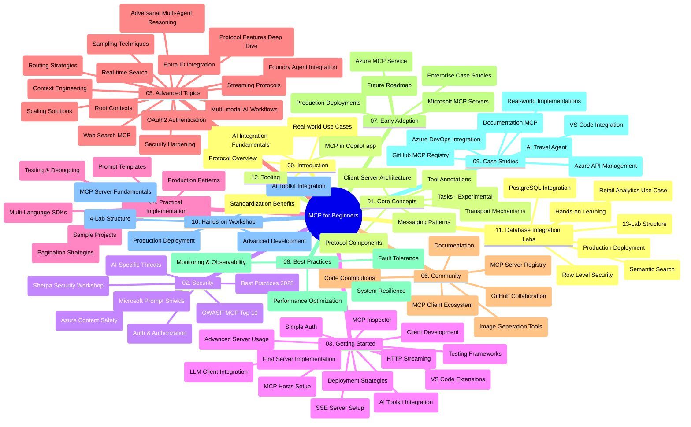

# 初學者模型上下文協議（MCP）- 學習指南

本學習指南概述了「初學者模型上下文協議（MCP）」課程的儲存庫結構與內容。使用本指南有效導航儲存庫，充分利用可用資源。

## 儲存庫概覽

模型上下文協議（MCP）是一個 AI 模型與客戶應用間交互的標準化框架。最初由 Anthropic 創建，現由更廣泛的 MCP 社群透過官方 GitHub 組織維護。本儲存庫提供涵蓋 C#、Java、JavaScript、Python 和 TypeScript 的全面課程以及實作範例，適合 AI 開發人員、系統架構師及軟體工程師。

## 視覺化課程地圖

## 儲存庫結構

儲存庫分為十二大部分，分別聚焦 MCP 的不同面向：

1. **簡介（00-Introduction/）**
   - 模型上下文協議概述
   - 為何 AI 流程中的標準化重要
   - 實際案例與效益

2. **核心概念（01-CoreConcepts/）**
   - 客戶端-伺服器架構
   - 主要協議元件
   - MCP 中的通訊模式
   - 展望未來：[MCP 變更：2026-07-28 發行候選版](./01-CoreConcepts/mcp-2026-07-28-release-candidate.md) — 無狀態協議核心、擴充框架，以及下版規範預期廢止的根文上下文／取樣／日誌功能

3. **安全（02-Security/）**
   - MCP 系統中的安全威脅
   - 實作安全性的最佳實務
   - 認證與授權策略
   - <strong>完整安全文件</strong>：
     - MCP 2025 安全最佳實務
     - Azure 內容安全實作指南
     - MCP 安全控制與技術
     - MCP 最佳實務快速參考
   - <strong>重要安全議題</strong>：
     - 提示注入與工具中毒攻擊
     - 會話劫持與代理混淆問題
     - 令牌直通漏洞
     - 過度權限與存取控制
     - AI 元件供應鏈安全
     - 微軟提示防護整合

4. **入門（03-GettingStarted/）**
   - 環境設定與配置
   - 建立基本 MCP 伺服器與客戶端
   - 與現有應用整合
   - 包含章節：
     - 第一個伺服器實作
     - 客戶端開發
     - LLM 客戶端整合
     - VS Code 整合
     - Server-Sent Events (SSE) 伺服器
     - 進階伺服器用法
     - HTTP 串流
     - AI 工具組整合
     - 測試策略
     - 部署指南

5. **實務實作（04-PracticalImplementation/）**
   - 使用多種程式語言的 SDK
   - 偵錯、測試與驗證技巧
   - 設計可重複使用的提示模板與工作流程
   - 範例專案實作示例

6. **進階主題（05-AdvancedTopics/）**
   - 上下文工程技巧
   - Foundry 代理整合
   - 多模態 AI 工作流程
   - OAuth2 認證實作示範
   - 即時搜尋功能
   - 即時串流
   - 根上下文實作
   - 路由策略
   - 取樣技術
   - 擴展方案
   - 安全考量
   - Entra ID 安全整合
   - 網路搜尋整合
   - 對抗式多代理推理（辯論模式）

7. **社群貢獻（06-CommunityContributions/）**
   - 如何貢獻程式碼與文件
   - 透過 GitHub 協作
   - 社群驅動的增強與回饋
   - 使用多種 MCP 客戶端（Claude 桌面版、Cline、VSCode）
   - 使用包含影像生成的熱門 MCP 伺服器

8. **早期採用經驗教訓（07-LessonsfromEarlyAdoption/）**
   - 實際應用與成功案例
   - 建構與部署 MCP 解決方案
   - 趨勢與未來路線圖
   - **微軟 MCP 伺服器指南**：涵蓋 10 個生產就緒的微軟 MCP 伺服器，包括：
     - Microsoft Learn 文件 MCP 伺服器
     - Azure MCP 伺服器（15+ 專業連接器）
     - GitHub MCP 伺服器
     - Azure DevOps MCP 伺服器
     - MarkItDown MCP 伺服器
     - SQL Server MCP 伺服器
     - Playwright MCP 伺服器
     - Dev Box MCP 伺服器
     - Microsoft Foundry MCP 伺服器
     - Microsoft 365 Agents Toolkit MCP 伺服器

9. **最佳實務（08-BestPractices/）**
   - 效能調校與優化
   - 設計容錯 MCP 系統
   - 測試與韌性策略

10. **案例研究（09-CaseStudy/）**
    - <strong>七個全面案例研究</strong>展示 MCP 在多樣場景的靈活性：
    - **Azure AI 旅行代理人**：利用 Azure OpenAI 與 AI 搜尋的多代理協作
    - **Azure DevOps 整合**：以 YouTube 資料更新自動化工作流程
    - <strong>即時文件檢索</strong>：Python 主控台客戶端及串流 HTTP
    - <strong>互動式學習計畫產生器</strong>：Chainlit 網頁應用與會話 AI
    - <strong>編輯器內文件</strong>：VS Code 與 GitHub Copilot 工作流程整合
    - **Azure API 管理**：企業 API 整合與 MCP 伺服器打造
    - **GitHub MCP 登記處**：生態系開發與代理整合平台
    - 實作範例涵蓋企業整合、開發者生產力與生態系發展

11. **實作工作坊（10-StreamliningAIWorkflowsBuildingAnMCPServerWithAIToolkit/）**
    - 綜合手把手工作坊，結合 MCP 與 AI 工具組
    - 建構連結 AI 模型與實務工具的智慧應用
    - 實用模組涵蓋基礎、客製伺服器開發與生產部署策略
    - <strong>實驗室結構</strong>：
      - 實驗室一：MCP 伺服器基礎
      - 實驗室二：進階 MCP 伺服器開發
      - 實驗室三：AI 工具組整合
      - 實驗室四：生產部署與擴展
    - 以實驗室為導向的漸進教學

12. **MCP 伺服器資料庫整合實作（11-MCPServerHandsOnLabs/）**
    - **完整 13 個實驗室學習路徑**，打造生產就緒的 MCP 伺服器並整合 PostgreSQL
    - <strong>實際零售分析案例</strong>：使用 Zava Retail 使用案例
    - <strong>企業級模式</strong>，包括列級安全（RLS）、語義搜尋與多租戶資料存取
    - <strong>完整實驗室結構</strong>：
      - **實驗室 00-03：基礎** — 簡介、架構、安全、環境建置
      - **實驗室 04-06：構建 MCP 伺服器** — 資料庫設計、MCP 伺服器實作、工具開發
      - **實驗室 07-09：進階功能** — 語義搜尋、測試與除錯、VS Code 整合
      - **實驗室 10-12：生產與最佳實務** — 部署、監控、優化
    - <strong>涵蓋技術</strong>：FastMCP 框架、PostgreSQL、Azure OpenAI、Azure Container Apps、Application Insights
    - <strong>學習成果</strong>：生產就緒 MCP 伺服器、資料庫整合模式、AI 驅動分析、企業安全

13. **工具（12-tooling/）**
    - 學習在 Copilot 應用及其他工具中使用 MCP

## 附加資源

儲存庫包括輔助資源：

- <strong>圖片資料夾</strong>：課程中使用的圖表與示意圖
- <strong>翻譯</strong>：多語言支援與文件自動翻譯
- **官方 MCP 資源**：
  - [MCP 文件](https://modelcontextprotocol.io/)
  - [MCP 規範](https://spec.modelcontextprotocol.io/)
  - [MCP GitHub 儲存庫](https://github.com/modelcontextprotocol)

## 如何使用本儲存庫

1. <strong>循序學習</strong>：依章節順序（00 至 11）學習，體驗有系統的學習流程。
2. <strong>語言重點</strong>：若偏好特定程式語言，可瀏覽 samples 目錄中該語言的實作範例。
3. <strong>實務實作</strong>：從「入門」章節開始，設置環境並創建第一個 MCP 伺服器及客戶端。
4. <strong>進階探索</strong>：熟悉基礎後，深入進階主題擴展知識。
5. <strong>社群互動</strong>：加入 MCP 社群，透過 GitHub 討論與 Discord 頻道與專家及同好交流。

## MCP 客戶端與工具

課程涵蓋多種 MCP 客戶端與工具：

1. <strong>官方客戶端</strong>：
   - Visual Studio Code
   - Visual Studio Code 內的 MCP
   - Claude 桌面版
   - VSCode 內的 Claude
   - Claude API

2. <strong>社群客戶端</strong>：
   - Cline（終端機版）
   - Cursor（程式碼編輯器）
   - ChatMCP
   - Windsurf

3. **MCP 管理工具**：
   - MCP CLI
   - MCP 管理員
   - MCP Linker
   - MCP 路由器

## 熱門 MCP 伺服器

本儲存庫介紹多種 MCP 伺服器，包括：

1. **官方微軟 MCP 伺服器**：
   - Microsoft Learn 文件 MCP 伺服器
   - Azure MCP 伺服器（15+ 專業連接器）
   - GitHub MCP 伺服器
   - Azure DevOps MCP 伺服器
   - MarkItDown MCP 伺服器
   - SQL Server MCP 伺服器
   - Playwright MCP 伺服器
   - Dev Box MCP 伺服器
   - Microsoft Foundry MCP 伺服器
   - Microsoft 365 Agents Toolkit MCP 伺服器

2. <strong>官方參考伺服器</strong>：
   - 檔案系統
   - 取回
   - 記憶體
   - 連續思考

3. <strong>影像生成</strong>：
   - Azure OpenAI DALL-E 3
   - Stable Diffusion WebUI
   - Replicate

4. <strong>開發工具</strong>：
   - Git MCP
   - 終端機控制
   - 程式助手

5. <strong>專業伺服器</strong>：
   - Salesforce
   - Microsoft Teams
   - Jira 與 Confluence

## 貢獻

本儲存庫歡迎社群貢獻。詳見社群貢獻章節，了解有效貢獻 MCP 生態系的指引。

----

*本學習指南最後更新於 2026 年 2 月 5 日，反映最新 MCP 規範 2025-11-25，並提供該日期儲存庫摘要。儲存庫內容可能於此日期之後更新。*

*附錄（2026 年 7 月 2 日）：於 [01-CoreConcepts](./01-CoreConcepts/mcp-2026-07-28-release-candidate.md) 新增「2026-07-28」MCP 規範發行候選版課程；課程基線持續為 2025-11-25，直至新規範正式發布。*

---

<!-- CO-OP TRANSLATOR DISCLAIMER START -->
**免責聲明**：
本文件使用 AI 翻譯服務 [Co-op Translator](https://github.com/Azure/co-op-translator) 進行翻譯。雖然我們力求準確，但請注意，自動翻譯可能包含錯誤或不準確之處。原始文件的母語版本應被視為權威來源。對於重要資訊，建議尋求專業人工翻譯。我們不對因使用本翻譯而引起的任何誤解或曲解承擔責任。
<!-- CO-OP TRANSLATOR DISCLAIMER END -->