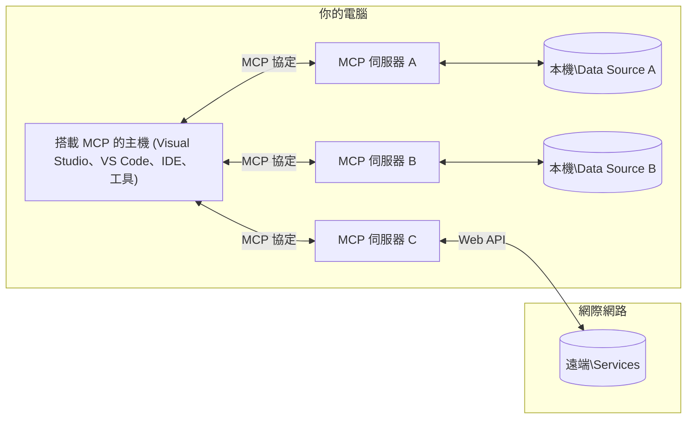

# MCP 核心概念：精通 AI 整合的模型上下文協議

[](https://youtu.be/earDzWGtE84)

_(點擊上方圖片觀看本課程影片)_

[模型上下文協議（Model Context Protocol，MCP）](https://github.com/modelcontextprotocol) 是一個強大且標準化的框架，可優化大型語言模型（LLM）與外部工具、應用程式和資料來源之間的通訊。 
本指南將引導您了解 MCP 的核心概念。您將學習其客戶端-伺服器架構、主要組件、通信機制與實作最佳實踐。

- <strong>明確用戶同意</strong>：所有資料存取和操作皆需事先獲得用戶明確同意。用戶必須清楚了解將存取哪些資料及執行哪些操作，並可細緻控制權限和授權。

- <strong>資料隱私保護</strong>：用戶資料僅在明確同意下才會暴露，並必須透過強健的存取控制保護整個互動生命週期。實作必須防止未授權資料傳輸，並維護嚴格的隱私界限。

- <strong>工具執行安全</strong>：每次工具調用均需用戶明確同意，並清楚了解工具功能、參數與潛在影響。必須透過嚴密安全邊界防止非預期、不安全或惡意工具執行。

- <strong>傳輸層安全性</strong>：所有通訊管道應採用適當的加密和身份驗證機制。遠端連線應實施安全傳輸協定及妥善的憑證管理。

#### 實作指引：

- <strong>權限管理</strong>：實作細緻的權限系統，允許用戶控制可存取的伺服器、工具及資源
- <strong>身份驗證與授權</strong>：使用安全的身份驗證方式（OAuth、API 金鑰），並妥善管理令牌和過期時間  
- <strong>輸入驗證</strong>：根據定義架構驗證所有參數和資料輸入，防止注入攻擊
- <strong>稽核日誌</strong>：維護所有操作的完整日誌，用於安全監控和合規

## 概述

本課程探討組成模型上下文協議（MCP）生態系統的基本架構與組件。您將學習 MCP 交互所基於的客戶端-伺服器架構、關鍵組件與通訊機制。

## 主要學習目標

本課程結束時，您將能夠：

- 理解 MCP 的客戶端-伺服器架構。
- 辨識主機、客戶端與伺服器的角色與責任。
- 分析使 MCP 成為靈活整合層的核心特性。
- 學習 MCP 生態系統中資訊的流動方式。
- 透過 .NET、Java、Python 與 JavaScript 的程式碼範例獲得實務見解。

## MCP 架構：深入解析

MCP 生態系統建立於客戶端-伺服器模式。此模組化結構使 AI 應用能有效與工具、資料庫、API 和上下文資源互動。我們將拆解此架構的核心組件。

MCP 核心遵循客戶端-伺服器架構，一個主機應用可連接多個伺服器：



- **MCP 主機（Hosts）**：像是 VSCode、Claude Desktop、IDE 或希望透過 MCP 存取資料的 AI 工具
- **MCP 客戶端（Clients）**：與伺服器維護一對一連接的協議客戶端
- **MCP 伺服器（Servers）**：輕量級程式，每個透過標準化模型上下文協議暴露特定功能
- <strong>本地資料來源</strong>：電腦的檔案、資料庫與 MCP 伺服器可安全存取的服務
- <strong>遠端服務</strong>：MCP 伺服器能透過 API 連接的互聯網外部系統

MCP 協議是一個不斷演進的標準，採用以日期為基礎的版本控制（格式為 YYYY-MM-DD）。目前的協議版本為 **2025-11-25**。您可查看[協議規範最新更新](https://modelcontextprotocol.io/specification/2025-11-25/)。

> **展望未來：** 下一版本規範釋出候選版本 **2026-07-28** 於 2026 年 5 月宣布，計劃於 2026 年 7 月 28 日正式發佈。該版本將使協議在傳輸層無狀態（移除 `initialize` 握手及會話 ID）、正式化擴展框架，並棄用舊有根（Roots）、採樣（Sampling）與日誌（Logging）機制，改採新模式。詳情請參閱 [MCP 2026-07-28 釋出候選版本更新說明](./mcp-2026-07-28-release-candidate.md)。

### 1. 主機（Hosts）

在模型上下文協議（MCP）中，<strong>主機</strong>是作為用戶與協議主要互動介面的 AI 應用。主機通過為每個伺服器連線創建專用 MCP 客戶端，協調並管理與多個 MCP 伺服器的連線。主機範例包括：

- **AI 應用**：Claude Desktop、Visual Studio Code、Claude Code
- <strong>開發環境</strong>：整合 MCP 的 IDE 與程式碼編輯器  
- <strong>自訂應用</strong>：專門打造的 AI 代理與工具

<strong>主機</strong>負責協調 AI 模型互動。他們：

- **協調 AI 模型**：執行或互動 LLM 以生成回應並協調 AI 工作流程
- <strong>管理客戶端連結</strong>：為每個 MCP 伺服器連線建立並維護一個 MCP 客戶端
- <strong>控制使用者介面</strong>：處理對話流程、用戶互動及回應展示  
- <strong>執行安全機制</strong>：控制權限、安全限制與身份驗證
- <strong>處理用戶同意</strong>：管理用戶對資料共享與工具執行的批准


### 2. 客戶端（Clients）

<strong>客戶端</strong>是與主機和 MCP 伺服器間保持一對一專用連線的關鍵組件。每個 MCP 客戶端由主機實例化，連接到特定 MCP 伺服器，確保通訊通道有序且安全。多個客戶端允許主機同時連接多個伺服器。

<strong>客戶端</strong>是主機應用中的連接組件。他們：

- <strong>協議通信</strong>：以 JSON-RPC 2.0 向伺服器發送提示與指令請求
- <strong>能力協商</strong>：在初始化時與伺服器協商支援的功能與協議版本
- <strong>工具執行</strong>：管理模型的工具執行請求及處理回應
- <strong>即時更新</strong>：處理來自伺服器的通知與即時更新
- <strong>回應處理</strong>：處理並格式化伺服器回應供用戶展示

### 3. 伺服器（Servers）

<strong>伺服器</strong>是為 MCP 客戶端提供上下文、工具和能力的程式。它們可以在本地（與主機同機器）或遠端（外部平台）執行，負責處理客戶端請求並提供結構化回應。伺服器透過標準化的模型上下文協議暴露特定功能。

<strong>伺服器</strong>是提供上下文和能力的服務。他們：

- <strong>功能註冊</strong>：登記並向客戶端公開可用原語（資源、提示、工具）
- <strong>請求處理</strong>：接收並執行客戶端的工具調用、資源請求和提示請求
- <strong>上下文提供</strong>：提供上下文資訊與資料，以提升模型回應品質
- <strong>狀態管理</strong>：維護會話狀態與必要的有狀態互動
- <strong>即時通知</strong>：向已連接的客戶端發送能力變更與更新通知

伺服器可由任何人開發，以專門化功能擴展模型能力，且支援本地及遠端部署情境。

### 4. 伺服器原語（Server Primitives）

MCP 中的伺服器提供三種核心<strong>原語</strong>，定義客戶端、主機與語言模型之間豐富互動的基本構件。這些原語規範了透過協議可用的上下文資訊類型與動作。

MCP 伺服器可暴露下列三種核心原語的任意組合：

#### 資源（Resources）

<strong>資源</strong>是為 AI 應用提供上下文資訊的資料來源。它們代表靜態或動態內容，可增強模型的理解與決策能力：

- <strong>上下文資料</strong>：結構化資訊與上下文供 AI 模型使用
- <strong>知識庫</strong>：文件庫、文章、手冊與研究論文
- <strong>本地資料來源</strong>：檔案、資料庫與本地系統資訊  
- <strong>外部資料</strong>：API 回應、網路服務與遠端系統資料
- <strong>動態內容</strong>：基於外部條件更新的即時資料

資源以 URI 辨識，並支援透過 `resources/list` 進行發現與 `resources/read` 進行存取：

```text
file://documents/project-spec.md
database://production/users/schema
api://weather/current
```

#### 提示（Prompts）

<strong>提示</strong>是可重用的模板，用以結構化與語言模型的互動。它們提供標準化的互動模式與流程模板：

- <strong>基於模板的互動</strong>：預備結構化的訊息與對話啟始語
- <strong>工作流程模板</strong>：常見任務和互動的標準序列
- <strong>少量範例</strong>：示例基礎的模型指令模板
- <strong>系統提示</strong>：定義模型行為與上下文的基礎提示
- <strong>動態模板</strong>：可參數化、適應特定上下文的提示

提示支援變數替換，可透過 `prompts/list` 發現，並可透過 `prompts/get` 取得：

```markdown
Generate a {{task_type}} for {{product}} targeting {{audience}} with the following requirements: {{requirements}}
```

#### 工具（Tools）

<strong>工具</strong>是 AI 模型可調用以執行特定動作的可執行函式。它們是 MCP 生態系的「動詞」，使模型能與外部系統互動：

- <strong>可執行函式</strong>：模型可利用特定參數調用的離散操作
- <strong>外部系統整合</strong>：API 調用、資料庫查詢、檔案操作、計算
- <strong>獨特身份</strong>：每個工具皆有獨特名稱、說明和參數架構
- **結構化輸入/輸出**：工具接受經驗證參數並回傳結構化且型別化的回應
- <strong>行動能力</strong>：允許模型執行現實世界動作並取得即時資料

工具以 JSON Schema 定義參數驗證，支援透過 `tools/list` 發現並以 `tools/call` 執行。工具還可包含<strong>圖示</strong>作為額外元資料，提升使用者介面展現。

<strong>工具註解</strong>：工具支援行為註解（例如 `readOnlyHint`、`destructiveHint`），描述該工具是否僅讀或破壞性，協助客戶端作出明智的工具執行決策。

工具範例定義：

```typescript
server.tool(
  "search_products", 
  {
    query: z.string().describe("Search query for products"),
    category: z.string().optional().describe("Product category filter"),
    max_results: z.number().default(10).describe("Maximum results to return")
  }, 
  async (params) => {
    // 執行搜尋並返回結構化結果
    return await productService.search(params);
  }
);
```

## 客戶端原語（Client Primitives）

在模型上下文協議（MCP）中，<strong>客戶端</strong>可暴露原語，使伺服器得以向主機應用請求額外能力。這些客戶端端原語允許伺服器實作更豐富與互動性強的功能，能存取 AI 模型能力與用戶互動。

### 採樣（Sampling）

> **棄用通知：** `2026-07-28` 釋出候選版本標示採樣功能棄用，轉向直接整合 LLM 供應商 API。該功能於 `2025-11-25` 版本仍有效，且棄用後至少一年內可繼續使用，但新設計應優先採用替代模式。詳見 [MCP 2026-07-28 釋出候選版本更新說明](./mcp-2026-07-28-release-candidate.md)。

<strong>採樣</strong>允許伺服器從客戶端 AI 應用請求語言模型的補全。此原語使伺服器能在不嵌入自身模型依賴的情況下存取 LLM 能力：

- <strong>獨立模型訪問</strong>：伺服器可請求補全，無需包含 LLM SDK 或管理模型存取
- **伺服器主動 AI**：使伺服器能自主利用客戶端的 AI 模型生成內容
- **遞迴 LLM 互動**：支援伺服器在多層處理中需要 AI 協助的複雜場景
- <strong>動態內容生成</strong>：允許伺服器使用主機模型創造上下文回應
- <strong>工具調用支援</strong>：伺服器可包含 `tools` 與 `toolChoice` 參數，讓客戶端模型在採樣中調用工具

採樣透過 `sampling/complete` 方法啟動，由伺服器向客戶端發送補全請求。

### 根目錄（Roots）

> **棄用通知：** `2026-07-28` 釋出候選版本標示根目錄功能棄用，改以工具參數、資源 URI 或伺服器設定替代。該功能於 `2025-11-25` 版本仍有效，且棄用後至少一年內可繼續使用。詳見 [MCP 2026-07-28 釋出候選版本更新說明](./mcp-2026-07-28-release-candidate.md)。

<strong>根目錄</strong>提供標準化方式，讓客戶端向伺服器揭露檔案系統邊界，幫助伺服器理解其可存取的目錄與檔案範圍：

- <strong>檔案系統邊界</strong>：定義伺服器可作用的檔案系統範圍
- <strong>存取控制</strong>：協助伺服器了解可存取的目錄和檔案權限
- <strong>動態更新</strong>：根目錄清單變更時，客戶端可通知伺服器
- **基於 URI 的辨識**：根目錄以 `file://` URI 辨識可存取的目錄及檔案

根目錄透過 `roots/list` 方法發現，且根目錄變化時客戶端會發送 `notifications/roots/list_changed`。

### 問詢（Elicitation）  

<strong>問詢</strong>允許伺服器透過客戶端介面向用戶請求額外資訊或確認：

- <strong>用戶輸入請求</strong>：當工具執行需補充資訊時，伺服器可提出請求
- <strong>確認對話框</strong>：針對敏感或具影響力操作請求用戶批准
- <strong>互動式工作流程</strong>：使伺服器能建立逐步引導的用戶互動
- <strong>動態參數收集</strong>：在工具執行中收集缺少或選用參數

問詢請求透過 `elicitation/request` 方法發出，由客戶端介面收集用戶輸入。

**URL 模式問詢**：伺服器也可請求基於 URL 的用戶互動，讓用戶導向外部網頁進行身份驗證、確認或資料輸入。

### 記錄（Logging）


> **停用公告：** `2026-07-28` 版本候選標記記錄功能已被標記為停用，改用 `stderr` 作為 stdio 傳輸的日誌方案，以及使用 OpenTelemetry 進行結構化可觀察性。在 `2025-11-25` 版本及任何停用後至少一年內仍將繼續運作。請參閱 [MCP 變更內容：2026-07-28 版本候選](./mcp-2026-07-28-release-candidate.md)。

<strong>記錄功能</strong>允許伺服器向客戶端發送結構化日誌訊息，以利除錯、監控和操作能見度：

- <strong>除錯支援</strong>：讓伺服器提供詳細的執行日誌以進行故障排除
- <strong>操作監控</strong>：向客戶端傳送狀態更新和性能指標
- <strong>錯誤報告</strong>：提供詳細的錯誤上下文和診斷資訊
- <strong>稽核追蹤</strong>：建立完整的伺服器操作和決策日誌

記錄訊息會發送給客戶端，以提供伺服器操作的透明度並協助除錯。

## MCP 中的信息流程

模型上下文協議 (MCP) 定義了主機、客戶端、伺服器與模型之間的結構化資訊流。理解此流程有助於說明使用者請求如何處理以及外部工具和資料如何整合進模型的回應中。

- <strong>主機發起連線</strong>  
  主機應用程式（如 IDE 或聊天介面）透過 STDIO、WebSocket 或其他支援的傳輸方式，建立與 MCP 伺服器的連線。

- <strong>能力協商</strong>  
  客戶端（嵌入於主機中）與伺服器交換有關支援功能、工具、資源和協議版本的資訊，確保雙方了解會話可用的能力。

- <strong>使用者請求</strong>  
  使用者與主機互動（例如輸入提示或指令）。主機收集此輸入並傳遞給客戶端以處理。

- <strong>資源或工具使用</strong>  
  - 客戶端可能會從伺服器請求額外的上下文或資源（例如檔案、資料庫條目或知識庫文章），以豐富模型的理解。
  - 如果模型判定需要使用工具（例如擷取資料、執行計算或呼叫 API），客戶端會向伺服器發送工具調用請求，指定工具名稱和參數。

- <strong>伺服器執行</strong>  
  伺服器接收資源或工具請求，執行必要的操作（如執行函式、查詢資料庫或擷取檔案），並以結構化格式回傳結果給客戶端。

- <strong>回應生成</strong>  
  客戶端整合伺服器的回應（資源資料、工具輸出等）進入正在進行的模型互動中。模型使用此資訊產生完整且具上下文相關性的回應。

- <strong>結果呈現</strong>  
  主機接收來自客戶端的最終輸出並呈現給使用者，通常包含模型產生的文字以及來自工具執行或資源查詢的結果。

這套流程使 MCP 能夠支援先進、互動式且具上下文感知的 AI 應用，透過無縫連結模型與外部工具及資料來源。

## 協議架構與層級

MCP 由兩個相互協作的獨立架構層組成，提供完整的通訊框架：

### 資料層

<strong>資料層</strong>使用 **JSON-RPC 2.0** 作為基礎，實作 MCP 的核心協議。此層定義訊息結構、語意及互動模式：

#### 核心元件：

- **JSON-RPC 2.0 協議**：所有通訊均使用標準化的 JSON-RPC 2.0 訊息格式，涵蓋方法調用、回應和通知
- <strong>生命週期管理</strong>：處理客戶端與伺服器間的連線初始化、能力協商與會話終止
- <strong>伺服器原語</strong>：使伺服器能透過工具、資源與提示提供核心功能
- <strong>客戶端原語</strong>：使伺服器能請求大型語言模型取樣、引導使用者輸入並傳送日誌訊息
- <strong>即時通知</strong>：支援非同步通知以動態更新，無需輪詢

#### 主要特點：

- <strong>協議版本協商</strong>：使用以日期為基礎的版本管理（YYYY-MM-DD）確保相容性
- <strong>能力探索</strong>：客戶端與伺服器於初始化時交換支援功能資訊
- <strong>有狀態會話</strong>：維持多次互動間的連線狀態以保持上下文連續性

### 傳輸層

<strong>傳輸層</strong>負責 MCP 參與者間的通訊管道、訊息分段和驗證：

#### 支援的傳輸機制：

1. **STDIO 傳輸**：
   - 使用標準輸入/輸出流進行直接進程間通訊
   - 最適合於同機器上的本地進程，無網路開銷
   - 常用於本地 MCP 伺服器實作

2. **可串流 HTTP 傳輸**：
   - 使用 HTTP POST 傳送客戶端到伺服器的訊息  
   - 選用的伺服器傳送事件 (SSE) 用於伺服器到客戶端的串流
   - 支援跨網路的遠端伺服器通訊
   - 支援標準 HTTP 驗證（攜帶者令牌、API 密鑰、自訂標頭）
   - MCP 推薦使用 OAuth 以確保安全的令牌驗證

#### 傳輸抽象：

傳輸層將通訊細節抽象化，使資料層可在所有傳輸機制上使用相同的 JSON-RPC 2.0 訊息格式。此抽象化允許應用程式在本地與遠端伺服器間無縫切換。

### 安全性考量

MCP 實作必須遵循多項重要安全原則，以確保所有協議操作中的安全、可信賴與安全互動：

- <strong>使用者同意與控制</strong>：使用者必須明確同意才能存取資料或執行操作，並且應清楚控制資料的分享範圍及授權的行動，輔以直覺的使用者介面以審核與核准活動。

- <strong>資料隱私</strong>：使用者資料只有在明確同意下才會被暴露，並須受適當存取控制保護。MCP 實作必須防止未授權資料傳輸，確保所有互動過程中維護隱私。

- <strong>工具安全</strong>：調用任何工具前必須取得明確使用者同意。使用者應清楚了解每項工具功能，且須強制執行嚴格的安全邊界，防止意外或不安全的工具執行。

遵循這些安全原則，MCP 確保協議互動中使用者信任、隱私與安全得以維護，同時啟用強大的 AI 整合能力。

## 程式碼範例：關鍵元件

以下為數個熱門程式語言的範例程式碼，說明如何實作關鍵 MCP 伺服器元件與工具。

### .NET 範例：建立簡單 MCP 伺服器及工具

以下為 .NET 實作範例，展示如何建構一個具備自訂工具的簡易 MCP 伺服器。此範例展示了如何定義與註冊工具、處理請求以及使用模型上下文協議連接伺服器。

```csharp
using System;
using System.Threading.Tasks;
using ModelContextProtocol.Server;
using ModelContextProtocol.Server.Transport;
using ModelContextProtocol.Server.Tools;

public class WeatherServer
{
    public static async Task Main(string[] args)
    {
        // Create an MCP server
        var server = new McpServer(
            name: "Weather MCP Server",
            version: "1.0.0"
        );
        
        // Register our custom weather tool
        server.AddTool<string, WeatherData>("weatherTool", 
            description: "Gets current weather for a location",
            execute: async (location) => {
                // Call weather API (simplified)
                var weatherData = await GetWeatherDataAsync(location);
                return weatherData;
            });
        
        // Connect the server using stdio transport
        var transport = new StdioServerTransport();
        await server.ConnectAsync(transport);
        
        Console.WriteLine("Weather MCP Server started");
        
        // Keep the server running until process is terminated
        await Task.Delay(-1);
    }
    
    private static async Task<WeatherData> GetWeatherDataAsync(string location)
    {
        // This would normally call a weather API
        // Simplified for demonstration
        await Task.Delay(100); // Simulate API call
        return new WeatherData { 
            Temperature = 72.5,
            Conditions = "Sunny",
            Location = location
        };
    }
}

public class WeatherData
{
    public double Temperature { get; set; }
    public string Conditions { get; set; }
    public string Location { get; set; }
}
```

### Java 範例：MCP 伺服器元件

本範例展示與上述 .NET 範例相同的 MCP 伺服器與工具註冊，但以 Java 實現。

```java
import io.modelcontextprotocol.server.McpServer;
import io.modelcontextprotocol.server.McpToolDefinition;
import io.modelcontextprotocol.server.transport.StdioServerTransport;
import io.modelcontextprotocol.server.tool.ToolExecutionContext;
import io.modelcontextprotocol.server.tool.ToolResponse;

public class WeatherMcpServer {
    public static void main(String[] args) throws Exception {
        // 建立一個 MCP 伺服器
        McpServer server = McpServer.builder()
            .name("Weather MCP Server")
            .version("1.0.0")
            .build();
            
        // 註冊一個天氣工具
        server.registerTool(McpToolDefinition.builder("weatherTool")
            .description("Gets current weather for a location")
            .parameter("location", String.class)
            .execute((ToolExecutionContext ctx) -> {
                String location = ctx.getParameter("location", String.class);
                
                // 取得天氣資料（簡化版）
                WeatherData data = getWeatherData(location);
                
                // 回傳格式化的回應
                return ToolResponse.content(
                    String.format("Temperature: %.1f°F, Conditions: %s, Location: %s", 
                    data.getTemperature(), 
                    data.getConditions(), 
                    data.getLocation())
                );
            })
            .build());
        
        // 使用 stdio 傳輸連接伺服器
        try (StdioServerTransport transport = new StdioServerTransport()) {
            server.connect(transport);
            System.out.println("Weather MCP Server started");
            // 保持伺服器運行直到程序終止
            Thread.currentThread().join();
        }
    }
    
    private static WeatherData getWeatherData(String location) {
        // 實作會呼叫天氣 API
        // 為範例目的簡化處理
        return new WeatherData(72.5, "Sunny", location);
    }
}

class WeatherData {
    private double temperature;
    private String conditions;
    private String location;
    
    public WeatherData(double temperature, String conditions, String location) {
        this.temperature = temperature;
        this.conditions = conditions;
        this.location = location;
    }
    
    public double getTemperature() {
        return temperature;
    }
    
    public String getConditions() {
        return conditions;
    }
    
    public String getLocation() {
        return location;
    }
}
```

### Python 範例：建立 MCP 伺服器

此範例使用 fastmcp，請先確保安裝：

```python
pip install fastmcp
```
 程式碼示例：

```python
#!/usr/bin/env python3
import asyncio
from fastmcp import FastMCP
from fastmcp.transports.stdio import serve_stdio

# 建立一個 FastMCP 伺服器
mcp = FastMCP(
    name="Weather MCP Server",
    version="1.0.0"
)

@mcp.tool()
def get_weather(location: str) -> dict:
    """Gets current weather for a location."""
    return {
        "temperature": 72.5,
        "conditions": "Sunny",
        "location": location
    }

# 使用類別的替代方法
class WeatherTools:
    @mcp.tool()
    def forecast(self, location: str, days: int = 1) -> dict:
        """Gets weather forecast for a location for the specified number of days."""
        return {
            "location": location,
            "forecast": [
                {"day": i+1, "temperature": 70 + i, "conditions": "Partly Cloudy"}
                for i in range(days)
            ]
        }

# 註冊類別工具
weather_tools = WeatherTools()

# 啟動伺服器
if __name__ == "__main__":
    asyncio.run(serve_stdio(mcp))
```

### JavaScript 範例：建立 MCP 伺服器

本範例展示如何用 JavaScript 建立 MCP 伺服器，並註冊兩個與天氣相關的工具。

```javascript
// 使用官方的模型上下文協定 SDK
import { McpServer } from "@modelcontextprotocol/sdk/server/mcp.js";
import { StdioServerTransport } from "@modelcontextprotocol/sdk/server/stdio.js";
import { z } from "zod"; // 用於參數驗證

// 建立一個 MCP 伺服器
const server = new McpServer({
  name: "Weather MCP Server",
  version: "1.0.0"
});

// 定義一個天氣工具
server.tool(
  "weatherTool",
  {
    location: z.string().describe("The location to get weather for")
  },
  async ({ location }) => {
    // 這通常會呼叫天氣 API
    // 為示範簡化
    const weatherData = await getWeatherData(location);
    
    return {
      content: [
        { 
          type: "text", 
          text: `Temperature: ${weatherData.temperature}°F, Conditions: ${weatherData.conditions}, Location: ${weatherData.location}` 
        }
      ]
    };
  }
);

// 定義一個預報工具
server.tool(
  "forecastTool",
  {
    location: z.string(),
    days: z.number().default(3).describe("Number of days for forecast")
  },
  async ({ location, days }) => {
    // 這通常會呼叫天氣 API
    // 為示範簡化
    const forecast = await getForecastData(location, days);
    
    return {
      content: [
        { 
          type: "text", 
          text: `${days}-day forecast for ${location}: ${JSON.stringify(forecast)}` 
        }
      ]
    };
  }
);

// 輔助函式
async function getWeatherData(location) {
  // 模擬 API 呼叫
  return {
    temperature: 72.5,
    conditions: "Sunny",
    location: location
  };
}

async function getForecastData(location, days) {
  // 模擬 API 呼叫
  return Array.from({ length: days }, (_, i) => ({
    day: i + 1,
    temperature: 70 + Math.floor(Math.random() * 10),
    conditions: i % 2 === 0 ? "Sunny" : "Partly Cloudy"
  }));
}

// 使用 stdio 傳輸連接伺服器
const transport = new StdioServerTransport();
server.connect(transport).catch(console.error);

console.log("Weather MCP Server started");
```

此 JavaScript 範例示範如何使用模型上下文協議 SDK 建立 MCP 伺服器。顯示如何註冊兩個名稱為 `weatherTool` 和 `forecastTool` 的工具，並透過 `StdioServerTransport` 讓 MCP 客戶端使用。

## 安全性與授權

MCP 包含多項內建概念和機制，以管理協議中的安全性與授權：

1. <strong>工具使用權限控制</strong>：  
  客戶端在會話期間可指定模型被允許使用的工具，確保僅能存取明確授權的工具，降低非預期或不安全操作的風險。權限可依使用者偏好、組織政策或互動上下文動態配置。

2. <strong>驗證</strong>：  
  伺服器可要求驗證後，才授權工具、資源或敏感操作的存取。可能使用 API 密鑰、OAuth 代幣或其他驗證方案。適當的驗證確保只有受信任的客戶端與使用者能調用伺服器端能力。

3. <strong>參數驗證</strong>：  
  對所有工具調用執行參數驗證。各工具會定義其參數的預期類型、格式和限制，伺服器會相應驗證傳入請求。這可阻止格式錯誤或惡意輸入進入工具實作，維護操作完整性。

4. <strong>速率限制</strong>：  
  為防止濫用並確保伺服器資源公平使用，MCP 伺服器可對工具呼叫和資源存取實施速率限制。速率限制可依使用者、會話或全域設定，有助防止拒絕服務攻擊或過度資源消耗。

藉由結合上述機制，MCP 為語言模型與外部工具及資料來源整合提供安全基礎，並賦予使用者與開發者細粒度的存取與使用控制。

## 協議訊息與通訊流程

MCP 通訊使用結構化的 **JSON-RPC 2.0** 訊息，以促進主機、客戶端與伺服器間清晰可靠的互動。協議定義針對不同操作類型的特定訊息模式：

### 核心訊息類型：

#### <strong>初始化訊息</strong>
- **`initialize` 請求**：建立連線並協商協議版本與能力
- **`initialize` 回應**：確認支援的特性與伺服器資訊  
- **`notifications/initialized`**：訊號初始化完成，會話準備就緒

#### <strong>探索訊息</strong>
- **`tools/list` 請求**：探索伺服器可用工具
- **`resources/list` 請求**：列出可用資源（資料來源）
- **`prompts/list` 請求**：取得可用提示範本

#### <strong>執行訊息</strong>  
- **`tools/call` 請求**：使用指定參數執行特定工具
- **`resources/read` 請求**：擷取特定資源內容
- **`prompts/get` 請求**：取得提示範本，可帶選用參數

#### <strong>客戶端訊息</strong>
- **`sampling/complete` 請求**：伺服器請求客戶端提供大型語言模型完成
- **`elicitation/request`**：伺服器透過客戶端介面請求使用者輸入
- <strong>記錄訊息</strong>：伺服器向客戶端發送結構化日誌訊息

#### <strong>通知訊息</strong>
- **`notifications/tools/list_changed`**：伺服器通知客戶端工具列表變更
- **`notifications/resources/list_changed`**：伺服器通知客戶端資源列表變更  
- **`notifications/prompts/list_changed`**：伺服器通知客戶端提示列表變更

### 訊息結構：

所有 MCP 訊息均依照 JSON-RPC 2.0 格式：
- <strong>請求訊息</strong>：含 `id`、`method` 及選用的 `params`
- <strong>回應訊息</strong>：含 `id` 與 `result` 或 `error`  
- <strong>通知訊息</strong>：含 `method` 及選用的 `params`（無 `id`，不需回應）

此結構化通訊確保互動可被可靠追蹤且具擴充性，支持如即時更新、工具串接與強健錯誤處理等進階場景。

### 任務 (實驗性)

> **展望未來：** `2026-07-28` 版本候選將任務從實驗核心規範中分出，放入專屬任務擴展，並重新設計生命週期（含 `tasks/get`、`tasks/update`、`tasks/cancel`，移除 `tasks/list`）。如果您使用下述實驗性 API，請計劃遷移。詳見 [MCP 變更內容：2026-07-28 版本候選](./mcp-2026-07-28-release-candidate.md)。

<strong>任務</strong>為實驗功能，提供耐久執行包裝，啟用延遲結果檢索與狀態追蹤的 MCP 請求：

- <strong>長時間執行操作</strong>：追蹤昂貴計算、工作流程自動化與批次處理
- <strong>延遲結果</strong>：輪詢任務狀態並於操作完成時取得結果
- <strong>狀態追蹤</strong>：透過定義的生命週期狀態監控任務進度
- <strong>多階段操作</strong>：支援跨多次互動的複雜工作流程

任務將標準 MCP 請求包裝起來，啟用非同步執行模式，適用於無法立即完成的操作。

## 主要摘要

- <strong>架構</strong>：MCP 採用客戶端-伺服器架構，主機管理多個客戶端與伺服器連線
- <strong>參與者</strong>：生態系包括主機（AI 應用）、客戶端（協議連接器）及伺服器（能力提供者）
- <strong>傳輸機制</strong>：通訊支援 STDIO（本地）與可串流 HTTP（具選用 SSE，遠端）
- <strong>核心原語</strong>：伺服器開放工具（可執行函數）、資源（資料來源）與提示模板
- <strong>客戶端原語</strong>：伺服器可請求取樣（支援工具呼叫的大型語言模型完成）、引導（包含 URL 模式的使用者輸入）、根目錄（檔案系統邊界）及日誌
- <strong>實驗功能</strong>：任務為長時間操作提供耐久執行包裝
- <strong>協議基礎</strong>：建構於 JSON-RPC 2.0，使用基於日期的版本控制（目前為 2025-11-25）
- <strong>即時能力</strong>：支援通知以動態更新與即時同步
- <strong>重視安全</strong>：明確的使用者同意、資料隱私保護及安全傳輸為核心要求

## 練習

設計一個在您領域中有用的簡單 MCP 工具。定義：
1. 工具名稱為何
2. 接受哪些參數
3. 會回傳什麼輸出
4. 模型如何使用該工具來解決使用者問題


---

## 接下來

下一章節：[第 2 章：安全性](../02-Security/README.md)


好奇 `2025-11-25` 之後會發生什麼嗎？請閱讀 [MCP 的變更：2026-07-28 候選版本](./mcp-2026-07-28-release-candidate.md)。

---

<!-- CO-OP TRANSLATOR DISCLAIMER START -->
**免責聲明**：
此文件已使用 AI 翻譯服務 [Co-op Translator](https://github.com/Azure/co-op-translator) 進行翻譯。雖然我們努力追求準確性，但請注意自動翻譯可能包含錯誤或不準確之處。原始文件的母語版本應視為權威來源。對於關鍵資訊，建議採用專業人工翻譯。我們不對因使用此翻譯所產生的任何誤解或誤譯承擔責任。
<!-- CO-OP TRANSLATOR DISCLAIMER END -->