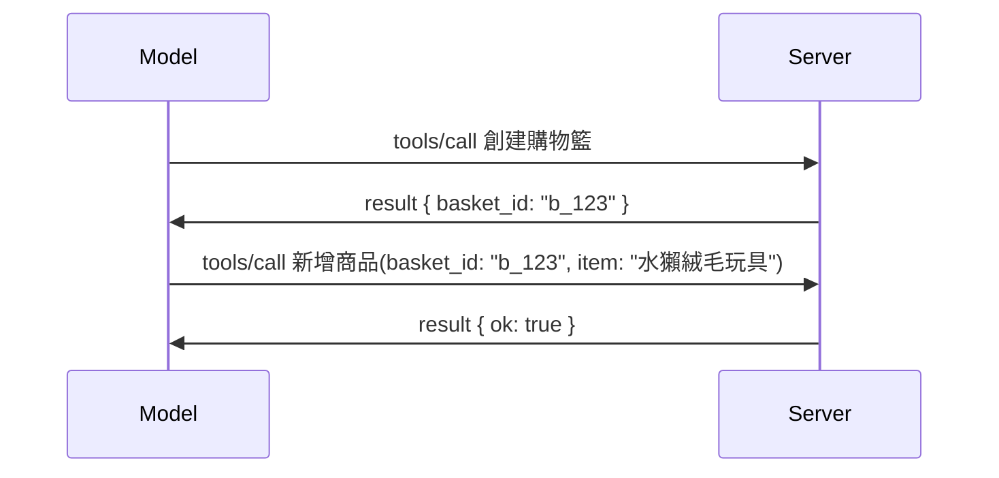

# MCP 中的變更：2026-07-28 發行候選版

> **狀態：** 發行候選版。撰寫本文時，`2026-07-28` 規範尚未定案。它於 2026 年 5 月 21 日宣布，預定於 2026 年 7 月 28 日發佈。本課程中所述內容均是關於發行候選版本；在開始建立時，請查閱[草稿規範](https://modelcontextprotocol.io/specification/draft)及其[變更日誌](https://modelcontextprotocol.io/specification/draft/changelog)以獲得最新狀態。本課程其餘部分是基於當前穩定版本 **MCP 規範 2025-11-25** 撰寫，且將於 `2026-07-28` 發佈後加以更新。

## 概述

`2026-07-28` 是自 MCP 啟動以來最大規模的修訂。六項規範增強提案（SEP）移除協議層的會話，使 MCP 在傳輸層保持無狀態，擴充功能成為一階級且有版本機制，且你在本課程先前學過的幾項功能（Roots、Sampling、Logging）根據新生命週期政策被標記為過時。本課程總結了有哪些變更、其重要性，以及對你已針對 `2025-11-25` 撰寫的代碼有何意義。

資料來源：[The 2026-07-28 MCP Specification Release Candidate](https://blog.modelcontextprotocol.io/posts/2026-07-28-release-candidate/)（Model Context Protocol 部落格，由 David Soria Parra 與 Den Delimarsky 撰寫）。

## 學習目標

完成本課程後，你將能夠：

- 解釋 MCP 為何轉向無狀態協議核心及其解決橫向擴展部署的問題。
- 描述如何替換 `initialize`/`initialized` 握手及 `Mcp-Session-Id` 標頭。
- 辨識新的 `Mcp-Method` 與 `Mcp-Name` 標頭，以及 `ttlMs`/`cacheScope` 快取元資料。
- 熟悉擴充功能框架及本次發行帶來的兩個擴充功能：MCP Apps 與 Tasks。
- 列出加強 OAuth 2.0 / OIDC 對齊的六項授權 SEP。
- 辨識哪些核心功能（Roots、Sampling、Logging）現已過時，以及實務上的意涵。
- 解釋工具 `inputSchema`/`outputSchema` 採用完整 JSON Schema 2020-12 的變化。

## 無狀態協議

主要變更重點：MCP 在協議層改為無狀態。

### 以前（2025-11-25）：會話將你鎖定到某個服務器實例

透過 Streamable HTTP 呼叫工具始於 `initialize` 握手。服務器回應 `Mcp-Session-Id` 標頭，隨後的每個請求必須攜帶此標頭：

```http
POST /mcp HTTP/1.1
Mcp-Session-Id: 1868a90c-3a3f-4f5b
Content-Type: application/json

{"jsonrpc":"2.0","id":2,"method":"tools/call",
 "params":{"name":"search","arguments":{"q":"otters"}}}
```

由於會話綁定至發行它的伺服器實例，橫向擴展部署需要在負載平衡器使用 <strong>黏性路由</strong>，並且在各實例間共享會話存儲。

### 之後（2026-07-28）：每個請求都是自包含的

```http
POST /mcp HTTP/1.1
MCP-Protocol-Version: 2026-07-28
Mcp-Method: tools/call
Mcp-Name: search
Content-Type: application/json

{"jsonrpc":"2.0","id":1,"method":"tools/call",
 "params":{"name":"search","arguments":{"q":"otters"},
           "_meta":{"io.modelcontextprotocol/clientInfo":{"name":"my-app","version":"1.0"}}}}
```

任何服務器實例都可以處理該請求。主要變化：

- **移除 `initialize`/`initialized` 握手**（[SEP-2575](https://github.com/modelcontextprotocol/modelcontextprotocol/pull/2575)）。協議版本、客戶端資訊與客戶端功能移入每個請求的 `_meta`。新增的 `server/discover` 方法讓客戶端在需要時預先取得服務器功能。
- **移除 `Mcp-Session-Id` 標頭與協議層會話**（[SEP-2567](https://github.com/modelcontextprotocol/modelcontextprotocol/pull/2567)）。黏性路由與共用會話存儲不再為協議層必要。

### 無狀態協議，帶狀態應用

移除協議層會話不代表你的服務器不能有狀態。建議模式與 HTTP API 一致：從一個工具呼叫中產生明確句柄（如 `basket_id`、`browser_id`），後續呼叫讓模型以普通參數方式回傳該句柄。



這使狀態對模型可見且合理，而非隱藏於傳輸元資料中，且能讓任一伺服器實例處理任何呼叫。

### 服務器到客戶端的請求，重構後

無狀態協議仍需讓服務器在呼叫中途向客戶端請求資料（例如，誘導性提示）：

- <strong>服務器主動發起的請求只能在服務器正在處理客戶端請求時發出</strong>（[SEP-2260](https://github.com/modelcontextprotocol/modelcontextprotocol/pull/2260)）— 之前僅為建議，現在成為必須。使用者不會無故被提示。
- <strong>多回合往返請求</strong>（[SEP-2322](https://github.com/modelcontextprotocol/modelcontextprotocol/pull/2322)）取代持續打開的 SSE 串流。服務器將返回 `InputRequiredResult`：

  ```json
  {
    "resultType": "inputRequired",
    "inputRequests": {
      "confirm": {
        "type": "elicitation",
        "message": "Delete 3 files?",
        "schema": { "type": "boolean" }
      }
    },
    "requestState": "eyJzdGVwIjoxLCJmaWxlcyI6WyJhIiwiYiIsImMiXX0="
  }
  ```

  客戶端收集回答，並帶著 `inputResponses` 及回顯的 `requestState` 重新發出原始呼叫。任何服務器實例都可接手重試，因為所需資訊都包含在有效載荷中。

### 路由性、快取性、可追蹤

三項較小變更讓無狀態流量更易操作：

- **在 Streamable HTTP 上要求設定 `Mcp-Method` 與 `Mcp-Name` 標頭**（[SEP-2243](https://github.com/modelcontextprotocol/modelcontextprotocol/pull/2243)），負載平衡器、閘道與速率限制器可以根據操作路由，無需檢查 JSON 主體。標頭與主體不符的請求將被拒絕。
- **`tools/list` 和資源讀取結果包含 `ttlMs` 及 `cacheScope`**（[SEP-2549](https://github.com/modelcontextprotocol/modelcontextprotocol/pull/2549)），類似 HTTP 的 `Cache-Control`。客戶端可以知道列表結果的新鮮度及是否可在多用戶間共享，無需持久開啟 SSE 串流監聽變更。
- **文件記錄 W3C Trace Context 在 `_meta` 的傳播方式**（[SEP-414](https://github.com/modelcontextprotocol/modelcontextprotocol/pull/414)），調整 `traceparent`、`tracestate` 與 `baggage` 鍵名，以利分散式追蹤能跨客戶端 SDK、MCP 伺服器及下游系統在 [OpenTelemetry](https://opentelemetry.io/) 相容後端中串接呼叫。

## 擴充功能成為一階級

擴充功能在 `2025-11-25` 之前尚屬非正式。[SEP-2133](https://github.com/modelcontextprotocol/modelcontextprotocol/pull/2133) 將其正式化：

- 擴充功能以反向 DNS ID 為識別標記。
- 透過客戶端和服務器功能上的 `extensions` 映射進行協商。
- 它們存在獨立的 `ext-*` 倉庫，由委派維護者管理，並獨立於核心規範版本控制。
- SEP 流程中新加入「擴充功能通道」，讓它們有路徑由實驗階段晉升到正式功能。

本次釋出兩個正式擴充功能。

### MCP Apps：由服務器呈現的使用者介面

[MCP Apps](https://blog.modelcontextprotocol.io/posts/2026-01-26-mcp-apps/)（[SEP-1865](https://github.com/modelcontextprotocol/modelcontextprotocol/pull/1865)）讓服務器交付互動式 HTML 介面，由主機於沙盒 iframe 中渲染。工具事前宣告其 UI 模板，使主機可預取、快取並進行安全審查後方可執行。你在[課程 15：MCP Apps](../03-GettingStarted/15-mcp-apps/README.md) 中已學過基本原理 — 在擴充框架下，MCP Apps 現正式成為擴充功能，而非實驗性核心功能。

### Tasks 正式成為擴充功能

Tasks 在 `2025-11-25` 以實驗性核心功能釋出。實際生產中出現了許多重設計，正確的歸屬是擴充功能：[Tasks 擴充功能](https://github.com/modelcontextprotocol/modelcontextprotocol/pull/2663) 依據無狀態模型重塑生命週期 — 服務器可以用任務句柄回答 `tools/call`，客戶端透過 `tasks/get`、`tasks/update` 與 `tasks/cancel` 推動任務。任務創建由服務器主導：客戶端宣告擴充功能，服務器決定何時將呼叫作為任務執行。`tasks/list` 因無法在無會話下安全作用域而被完全移除。

> **遷移注意：** 如果你實作了實驗性的 `2025-11-25` Tasks API，需遷移至新版擴充生命週期 — 舊版不相容。

## 授權強化

六項 SEP 加強[授權規範](https://modelcontextprotocol.io/specification/draft/basic/authorization)，使其更貼近現實世界 OAuth 2.0 / OpenID Connect 部署：

| SEP | 變更內容 |
|---|---|
| [SEP-2468](https://github.com/modelcontextprotocol/modelcontextprotocol/pull/2468) | 客戶端必須按照 [RFC 9207](https://www.rfc-editor.org/rfc/rfc9207) 驗證授權回應中的 `iss` 參數，減少 MCP 單客戶端多服務器模式下常見的混淆攻擊。未來版本將要求拒絕缺少 `iss` 的回應。 |
| [SEP-837](https://github.com/modelcontextprotocol/modelcontextprotocol/pull/837) | 客戶端在動態用戶端註冊時宣告其 OpenID Connect `application_type`，避免授權服務器將桌面/CLI 客戶端預設為 `"web"` 且拒絕其 localhost 重新導向 URI。 |
| [SEP-2352](https://github.com/modelcontextprotocol/modelcontextprotocol/pull/2352) | 客戶端將註冊的認證繫結到發行授權服務器的 `issuer`，並在資源在授權服務器間遷移時重新註冊。 |
| [SEP-2207](https://github.com/modelcontextprotocol/modelcontextprotocol/pull/2207) | 說明如何向 OpenID Connect 類型的授權服務器請求刷新令牌。 |
| [SEP-2350](https://github.com/modelcontextprotocol/modelcontextprotocol/pull/2350) | 明確提升階授權過程中範圍的累積。 |
| [SEP-2351](https://github.com/modelcontextprotocol/modelcontextprotocol/pull/2351) | 澄清 `.well-known` 探索後綴名。 |

如果你今天正在建立 MCP 授權服務器，請立即開始在授權回應中提供 `iss` — 請參考[02-Security](../02-Security/README.md) 中的現行授權指引以作為依據。

## Roots、Sampling 與 Logging 被標記為過時

根據新的[功能生命週期政策](https://github.com/modelcontextprotocol/modelcontextprotocol/pull/2577)（[SEP-2577](https://github.com/modelcontextprotocol/modelcontextprotocol/pull/2577)），你在[核心概念](./README.md#roots)中學到的三個核心客戶端原語轉為 <strong>過時</strong> 狀態：

| 功能 | 建議替代方案 |
|---|---|
| Roots | 工具參數、資源 URI 或服務器配置 |
| Sampling | 直接整合大型語言模型供應商 API |
| Logging | stdio 傳輸使用 `stderr`；結構化觀察使用 OpenTelemetry |

這些為 <strong>僅帶有註解的過時標註</strong>：這些方法、類型與功能標記在本次釋出及一年內所有版本繼續有效。實際移除將依生命週期政策另行發行 SEP — 因此，現有[Sampling 範例](../03-GettingStarted/14-sampling/README.md) 目前不會中斷，但新伺服器應優先採用替代方案。

## 工具使用完整 JSON Schema 2020-12

工具的 `inputSchema` 和 `outputSchema` 升級至完整 [JSON Schema 2020-12](https://json-schema.org/draft/2020-12)（[SEP-2106](https://github.com/modelcontextprotocol/modelcontextprotocol/pull/2106)）：

- 輸入結構保持 `type: "object"` 根約束，並支援組合 (`oneOf`、`anyOf`、`allOf`)、條件判斷及參考 (`$ref`、`$defs`)。
- 輸出結構不受限制，`structuredContent` 現可為任意 JSON 值，不限於物件。
- 實作時不得自動解參照外部 `$ref` URI，且應限制結構深度與驗證時間（後者為防止服務端驗證時的拒絕服務攻擊）。

另外，缺少資源的錯誤碼從 MCP 自訂的 `-32002` 改為 JSON-RPC 標準的 `-32602`（參數無效）（[SEP-2164](https://github.com/modelcontextprotocol/modelcontextprotocol/pull/2164)）。如你的客戶端直接匹配文本 `-32002`，需更新。

## 協議未來演進方向

本次發行包含破壞性變更，MCP 維護團隊不打算日後頻繁如此。三項治理 SEP 旨在避免重演：

- <strong>功能生命週期政策</strong>提供每項功能從啟用到過時再到移除的路徑，且過時與移除至少間隔十二個月。
- <strong>擴充功能框架</strong>讓新能力以選擇性擴充形式出現，且在移入核心規範前（如果有此階段）先穩定於擴充功能中。

- 一個標準流程 SEP 無法達到最終狀態，直到匹配的場景進入 [符合套件](https://github.com/modelcontextprotocol/conformance) （[SEP-2484](https://github.com/modelcontextprotocol/modelcontextprotocol/pull/2484)）— 同一套用於衡量官方 SDK 的 [SDK 分級系統](https://github.com/modelcontextprotocol/modelcontextprotocol/pull/1777)。

## 發佈時間表與驗證

- 候選發佈版本已於 2026 年 5 月 21 日鎖定。
- 最終規範預計於 2026 年 7 月 28 日發佈。
- 兩者之間的十週期間讓 SDK 維護者與客戶端開發者能針對真實工作負載驗證變更；根據 [SDK 分級系統](https://modelcontextprotocol.io/docs/sdk)，等級 1 SDK 預期會在此期間支持新的功能。
- 可在 [草案規範](https://modelcontextprotocol.io/specification/draft) 及相關 [更新記錄](https://modelcontextprotocol.io/specification/draft/changelog) 中追蹤全部變更。

## 本課程的影響

到目前為止你在此課程所學一切皆以 **2025-11-25** 為標的，該版本將持續是穩定規範直到 `2026-07-28` 發佈。具體來說：

- **Sessions 與 `initialize` 握手**（在 [核心概念](./README.md) 和 [第六課：HTTP 流](../03-GettingStarted/06-http-streaming/README.md) 中介紹）如今日文件所述仍然有效，但升級到相容 `2026-07-28` SDK 時，預計它們將被上述無狀態請求模型取代。
- **采樣與 Roots**（同樣在 [核心概念](./README.md) 中涵蓋）仍可正常運作，但已被標記為棄用—新設計應偏好上述的替代模式。
- <strong>實驗性的任務功能</strong>，如果你曾使用過，將需要遷移至 Tasks 擴展模組的新生命週期。
- **MCP 應用程式**（[第15課](../03-GettingStarted/15-mcp-apps/README.md)）實際上不受影響；它只是被正式納入擴展框架中。

## 額外資源

- [2026-07-28 MCP 規範候選版本（部落格文章）](https://blog.modelcontextprotocol.io/posts/2026-07-28-release-candidate/)
- [MCP 傳輸未來展望](https://blog.modelcontextprotocol.io/posts/2025-12-19-mcp-transport-future/)
- [MCP 草案規範](https://modelcontextprotocol.io/specification/draft)
- [MCP 草案更新記錄](https://modelcontextprotocol.io/specification/draft/changelog)
- [SEP 指南](https://modelcontextprotocol.io/community/sep-guidelines)
- [MCP SDK 分級系統](https://modelcontextprotocol.io/docs/sdk)

## 下一步

回到 [核心概念](./README.md) 或繼續閱讀 [安全性](../02-Security/README.md)，瞭解今日的 `2025-11-25` 指導如何對應即將到來的改變。

---

<!-- CO-OP TRANSLATOR DISCLAIMER START -->
**免責聲明**：
此文件已使用 AI 翻譯服務 [Co-op Translator](https://github.com/Azure/co-op-translator) 進行翻譯。雖然我們努力追求準確性，但請注意自動翻譯可能包含錯誤或不準確之處。原始文件的母語版本應視為權威來源。對於關鍵資訊，建議採用專業人工翻譯。我們不對因使用此翻譯所產生的任何誤解或誤譯承擔責任。
<!-- CO-OP TRANSLATOR DISCLAIMER END -->