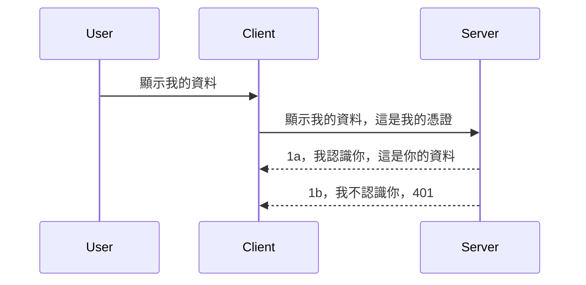

# 簡單認證

MCP SDK 支援使用 OAuth 2.1，說實話這是一個相當複雜的過程，包含認證伺服器、資源伺服器、發送憑證、取得代碼、用代碼交換持票人令牌，直到最終你可以取得資源資料。如果你不熟悉 OAuth（這是實作上非常棒的事情），建議先從一些基本的認證層級開始，逐步建立更好更安全的認證方式。這也是本章存在的原因，幫助你建立更進階的認證知識。

## 認證，我們指的是什麼？

認證是 authentication 和 authorization 的縮寫。意思是我們需要做兩件事：

- **身份驗證（Authentication）**，判斷是否允許一個人進入我們的家，確認他有權利「在這裡」也就是有存取我們的資源伺服器（即我們 MCP 伺服器功能所在）；
- **授權（Authorization）**，判斷用戶是否應該有權限存取他所請求的特定資源，例如：這些訂單、這些產品，或者是否只能閱讀內容但不能刪除等。

## 憑證：我們如何告訴系統我們是誰

大多數網頁開發人員會從提供給伺服器的憑證著手，通常是一個祕密，表明他們是否被允許在這裡的「身份驗證」。這個憑證通常是一個 base64 編碼過的使用者名稱和密碼，或者是一個唯一辨識特定使用者的 API 金鑰。

這通常是透過一個叫做 "Authorization" 的標題傳送，如下：

```json
{ "Authorization": "secret123" }
```

這通常稱為基本認證。整體流程運作方式如下：



了解整體流程之後，我們要怎麼實作呢？大多數網頁伺服器都有一個叫做中介軟體（middleware）的概念，這段代碼會隨請求執行，可以驗證憑證，如果憑證有效就讓請求通過，若無效則返回認證錯誤。下面看一下怎麼實現：

**Python**

```python
class AuthMiddleware(BaseHTTPMiddleware):
    async def dispatch(self, request, call_next):

        has_header = request.headers.get("Authorization")
        if not has_header:
            print("-> Missing Authorization header!")
            return Response(status_code=401, content="Unauthorized")

        if not valid_token(has_header):
            print("-> Invalid token!")
            return Response(status_code=403, content="Forbidden")

        print("Valid token, proceeding...")
       
        response = await call_next(request)
        # 在回應中新增任何客戶標頭或以某種方式更改回應
        return response


starlette_app.add_middleware(CustomHeaderMiddleware)
```

這裡我們有：

- 建立了一個名為 `AuthMiddleware` 的中介軟體，其 `dispatch` 方法會被網頁伺服器呼叫。
- 把中介軟體加入到網頁伺服器：

    ```python
    starlette_app.add_middleware(AuthMiddleware)
    ```

- 編寫了驗證邏輯，檢查是否有 Authorization 標題且函送的祕密是否有效：

    ```python
    has_header = request.headers.get("Authorization")
    if not has_header:
        print("-> Missing Authorization header!")
        return Response(status_code=401, content="Unauthorized")

    if not valid_token(has_header):
        print("-> Invalid token!")
        return Response(status_code=403, content="Forbidden")
    ```

    若祕密存在且有效，我們便透過调用 `call_next` 讓請求繼續並回傳回應。

    ```python
    response = await call_next(request)
    # 添加任何客戶端標頭或以某種方式更改回應內容
    return response
    ```

運作方式是當有網路請求進入伺服器，中介軟體將執行，依其實作邏輯允許請求繼續通過或回傳錯誤告知客戶端不被允許繼續。

**TypeScript**

這裡我們用熱門框架 Express 創建了中介軟體，在請求抵達 MCP 伺服器前截取請求。程式碼如下：

```typescript
function isValid(secret) {
    return secret === "secret123";
}

app.use((req, res, next) => {
    // 1. 是否存在授權標頭？
    if(!req.headers["Authorization"]) {
        res.status(401).send('Unauthorized');
    }
    
    let token = req.headers["Authorization"];

    // 2. 檢查有效性。
    if(!isValid(token)) {
        res.status(403).send('Forbidden');
    }

   
    console.log('Middleware executed');
    // 3. 將請求傳遞到請求處理管線中的下一步。
    next();
});
```

這段代碼中我們：

1. 檢查是否有 Authorization 標題，沒有則回傳 401 錯誤。
2. 確認憑證／令牌是否有效，無效則回傳 403 錯誤。
3. 最後將請求傳遞到請求管線並回傳所要求的資源。

## 練習：實作認證

讓我們用所學試著實作。計畫如下：

伺服器端

- 建立網頁伺服器和 MCP 實例。
- 為伺服器實作中介軟體。

客戶端

- 透過標頭帶著憑證發送網頁請求。

### -1- 建立網頁伺服器和 MCP 實例

> **向前看:** 下面的 TypeScript 範例依據 **MCP Specification 2025-11-25**，在一個 `transports` 映射中以 `mcp-session-id` 做鍵值以追蹤 HTTP 傳輸。`2026-07-28` 發行候選版取消了 `initialize` 握手和 session ID，因此這個每會話傳輸映射不再需要，改為無狀態、自包含請求。見 [MCP 有什麼改變：2026-07-28 發行候選版](../../01-CoreConcepts/mcp-2026-07-28-release-candidate.md)。

在第一步，我們需要建立網頁伺服器實例和 MCP 伺服器。

**Python**

這裡我們建立 MCP 伺服器實例，建立 starlette 網頁應用，並用 uvicorn 主機部署。

```python
# 建立 MCP 伺服器

app = FastMCP(
    name="MCP Resource Server",
    instructions="Resource Server that validates tokens via Authorization Server introspection",
    host=settings["host"],
    port=settings["port"],
    debug=True
)

# 建立 starlette 網頁應用程式
starlette_app = app.streamable_http_app()

# 透過 uvicorn 提供應用程式服務
async def run(starlette_app):
    import uvicorn
    config = uvicorn.Config(
            starlette_app,
            host=app.settings.host,
            port=app.settings.port,
            log_level=app.settings.log_level.lower(),
        )
    server = uvicorn.Server(config)
    await server.serve()

run(starlette_app)
```

這段程式碼，我們：

- 建立 MCP 伺服器。
- 從 MCP 伺服器建構 starlette 網頁應用，`app.streamable_http_app()`。
- 使用 uvicorn 主機服務 `server.serve()`。

**TypeScript**

這裡建立 MCP 伺服器實例。

```typescript
const server = new McpServer({
      name: "example-server",
      version: "1.0.0"
    });

    // ... 設定伺服器資源、工具和提示 ...
```

這 MCP 伺服器的建立需放在我們的 POST /mcp 路由定義中，所以把上述程式碼移動如下：

```typescript
import express from "express";
import { randomUUID } from "node:crypto";
import { McpServer } from "@modelcontextprotocol/sdk/server/mcp.js";
import { StreamableHTTPServerTransport } from "@modelcontextprotocol/sdk/server/streamableHttp.js";
import { isInitializeRequest } from "@modelcontextprotocol/sdk/types.js"

const app = express();
app.use(express.json());

// 傳輸映射，依據會話 ID 儲存
const transports: { [sessionId: string]: StreamableHTTPServerTransport } = {};

// 處理用戶端對伺服器的 POST 請求
app.post('/mcp', async (req, res) => {
  // 檢查是否已有存在的會話 ID
  const sessionId = req.headers['mcp-session-id'] as string | undefined;
  let transport: StreamableHTTPServerTransport;

  if (sessionId && transports[sessionId]) {
    // 重複使用已存在的傳輸
    transport = transports[sessionId];
  } else if (!sessionId && isInitializeRequest(req.body)) {
    // 新的初始化請求
    transport = new StreamableHTTPServerTransport({
      sessionIdGenerator: () => randomUUID(),
      onsessioninitialized: (sessionId) => {
        // 根據會話 ID 儲存傳輸
        transports[sessionId] = transport;
      },
      // 預設關閉 DNS 重綁定保護以維持向後相容性。如果您在本地執行此伺服器
      // 請確保設定：
      // enableDnsRebindingProtection: true,
      // allowedHosts: ['127.0.0.1'],
    });

    // 傳輸關閉時清理資源
    transport.onclose = () => {
      if (transport.sessionId) {
        delete transports[transport.sessionId];
      }
    };
    const server = new McpServer({
      name: "example-server",
      version: "1.0.0"
    });

    // ... 設置伺服器資源、工具和提示 ...

    // 連接到 MCP 伺服器
    await server.connect(transport);
  } else {
    // 請求無效
    res.status(400).json({
      jsonrpc: '2.0',
      error: {
        code: -32000,
        message: 'Bad Request: No valid session ID provided',
      },
      id: null,
    });
    return;
  }

  // 處理請求
  await transport.handleRequest(req, res, req.body);
});

// 可重用的 GET 和 DELETE 請求處理器
const handleSessionRequest = async (req: express.Request, res: express.Response) => {
  const sessionId = req.headers['mcp-session-id'] as string | undefined;
  if (!sessionId || !transports[sessionId]) {
    res.status(400).send('Invalid or missing session ID');
    return;
  }
  
  const transport = transports[sessionId];
  await transport.handleRequest(req, res);
};

// 處理透過 SSE 進行的伺服器對用戶端通知的 GET 請求
app.get('/mcp', handleSessionRequest);

// 處理會話終止的 DELETE 請求
app.delete('/mcp', handleSessionRequest);

app.listen(3000);
```

現在你看到 MCP 伺服器建立已移到 `app.post("/mcp")`。

接下來進入下一步，建立中介軟體以驗證接收到的憑證。

### -2- 為伺服器實作中介軟體

接著看中介軟體部分。我們會建立一個中介軟體去尋找 `Authorization` 標頭中的憑證並驗證它。如果合法，請求就會繼續執行後續操作（例如列出工具、讀取資源或其他 MCP 功能）。

**Python**

建立中介軟體需要建立繼承自 `BaseHTTPMiddleware` 的類別。有兩個有趣的部分：

- `request` 請求物件，我們從中讀取標頭資訊。
- `call_next` 回調函式，如果客戶端提供的憑證被接受，就會呼叫它。

首先，我們要處理缺少 `Authorization` 標頭的情況：

```python
has_header = request.headers.get("Authorization")

# 無標頭，回應 401 失敗，否則繼續。
if not has_header:
    print("-> Missing Authorization header!")
    return Response(status_code=401, content="Unauthorized")
```

這裡我們回傳 401 未授權訊息表示客戶端認證失敗。

接著，如果有送出憑證，我們要驗證它：

```python
 if not valid_token(has_header):
    print("-> Invalid token!")
    return Response(status_code=403, content="Forbidden")
```

注意上面我們回傳 403 禁止訊息。下面是實現上述功能的完整中介軟體：

```python
class AuthMiddleware(BaseHTTPMiddleware):
    async def dispatch(self, request, call_next):

        has_header = request.headers.get("Authorization")
        if not has_header:
            print("-> Missing Authorization header!")
            return Response(status_code=401, content="Unauthorized")

        if not valid_token(has_header):
            print("-> Invalid token!")
            return Response(status_code=403, content="Forbidden")

        print("Valid token, proceeding...")
        print(f"-> Received {request.method} {request.url}")
        response = await call_next(request)
        response.headers['Custom'] = 'Example'
        return response

```

很好，那 `valid_token` 函式呢？如下：

```python
# 不要用於生產環境 - 請改進它！！
def valid_token(token: str) -> bool:
    # 移除 "Bearer " 前綴
    if token.startswith("Bearer "):
        token = token[7:]
        return token == "secret-token"
    return False
```

當然這部分應該再改進。

重要提示：絕對不要將這類祕密寫死在程式碼中。理想上應從資料來源或 IDP（身份服務提供者）取得要比對的值，甚至更好讓 IDP 直接驗證。

**TypeScript**

使用 Express 實作時，需要呼叫 `use` 方法來註冊中介軟體函式。

需要：

- 存取請求變數，檢查位於 `Authorization` 屬性的憑證。
- 驗證憑證，如透過則讓請求繼續完成客戶端 MCP 請求（例如列出工具、讀取資源或其他 MCP 相關）。

這裡我們先檢查有無 `Authorization` 標頭，若無，立即停止請求：

```typescript
if(!req.headers["authorization"]) {
    res.status(401).send('Unauthorized');
    return;
}
```

如果標頭本來沒送出，會收到 401。

接著檢查憑證是否有效，無效也停止請求，但訊息略有不同：

```typescript
if(!isValid(token)) {
    res.status(403).send('Forbidden');
    return;
} 
```

你會收到 403 錯誤。

完整程式碼如下：

```typescript
app.use((req, res, next) => {
    console.log('Request received:', req.method, req.url, req.headers);
    console.log('Headers:', req.headers["authorization"]);
    if(!req.headers["authorization"]) {
        res.status(401).send('Unauthorized');
        return;
    }
    
    let token = req.headers["authorization"];

    if(!isValid(token)) {
        res.status(403).send('Forbidden');
        return;
    }  

    console.log('Middleware executed');
    next();
});
```

我們設定了網頁伺服器接受中介軟體，檢查客戶端希望傳送來的憑證。那客戶端本身呢？

### -3- 透過標頭送憑證的網頁請求

需要確保客戶端透過標頭送出憑證。因我們用 MCP 客戶端，需要搞懂怎麼做。

**Python**

對於客戶端，需帶著憑證設定標頭，如下：

```python
# 不要硬編碼該值，至少要放在環境變數或更安全的存儲方式中
token = "secret-token"

async with streamablehttp_client(
        url = f"http://localhost:{port}/mcp",
        headers = {"Authorization": f"Bearer {token}"}
    ) as (
        read_stream,
        write_stream,
        session_callback,
    ):
        async with ClientSession(
            read_stream,
            write_stream
        ) as session:
            await session.initialize()
      
            # 待完成，你想在客戶端完成的功能，例如列出工具、呼叫工具等。
```

注意我們如何填充 `headers` 屬性，寫成 ` headers = {"Authorization": f"Bearer {token}"}`。

**TypeScript**

我們可以分兩步解決：

1. 用憑證填充設定物件。
2. 把設定物件給 transport。

```typescript

// 不要像這裡示範的那樣硬編碼數值。至少要把它設為環境變數，並在開發模式中使用像 dotenv 這樣的工具。
let token = "secret123"

// 定義一個用戶端傳輸選項物件
let options: StreamableHTTPClientTransportOptions = {
  sessionId: sessionId,
  requestInit: {
    headers: {
      "Authorization": "secret123"
    }
  }
};

// 將選項物件傳給傳輸層
async function main() {
   const transport = new StreamableHTTPClientTransport(
      new URL(serverUrl),
      options
   );
```

你可以看到我們先建立一個 `options` 物件，並把標頭放在 `requestInit` 屬性下。

重要提示：怎麼改進呢？目前的實作有些問題。首先，這種傳送憑證的方式相當危險，除非你至少使用 HTTPS，否則憑證可能被偷走，因此你需要一套機制可以輕鬆撤銷令牌、加上額外檢查，例如請求來源位置、發生頻次是否過高（機器人行為）等，總之有很多安全考量。

話雖如此，對非常簡單的 API，只要你不希望任何人未經認證就呼叫你的 API，現有實作已經是一個良好的起點。

這樣說，我們用一個標準化格式 JSON Web Token，也就是 JWT 或稱 JOT 令牌，來稍微加強安全。

## JSON Web 令牌，JWT

我們試著從很簡單的憑證開始改善，採用 JWT 有什麼立即的好處？

- <strong>安全性提升</strong>。基本認證中反覆傳送使用者名稱和密碼的 base64 編碼（或 API 金鑰）增加風險。使用 JWT，會先送使用者名稱和密碼換取令牌，且令牌有期限會過期。JWT 也容易實作細粒度存取控制（角色、範圍與權限）。
- <strong>無狀態和擴展性</strong>。JWT 是自包含的，帶有所有使用者資訊，免除伺服器端的 session 存储需求，可以本地驗證令牌。
- <strong>互通性與聯邦認證</strong>。JWT 是 Open ID Connect 的核心，也被已知身分識別提供者如 Entra ID、Google Identity 和 Auth0 採用。它們支援單點登入等功能，使其達到企業等級。
- <strong>模組化與彈性</strong>。JWT 也能與如 Azure API Management、NGINX 等 API 門戶搭配，用於用戶認證場景與主機間通訊（含模擬和委派場景）。
- <strong>效能與快取</strong>。JWT 解碼後可快取，減少頻繁解析，使高流量應用吞吐更佳，並減輕基礎建設負擔。
- <strong>進階功能</strong>。它支持 introspection（伺服器驗證有效性）和撤銷（使令牌失效）。

有了這些好處，我們來看看怎麼提升我們的實作。

## 把基本認證改成 JWT

大致的改動方向是：

- **學會構建 JWT 令牌**，讓它準備好從客戶端傳到伺服器。
- **驗證 JWT 令牌**，通過驗證即可讓客戶端取得資源。
- <strong>安全存儲令牌</strong>。我們要考慮怎麼存放令牌。
- <strong>保護路由</strong>。需要保護路由，針對本案是 MCP 的路由和特定功能。
- <strong>增加刷新令牌</strong>。製造短期有效令牌及長期刷新令牌，過期時利用刷新令牌取得新令牌，並有刷新端點與輪替策略。

### -1- 构造 JWT 令牌

JWT 令牌有以下幾部分：

- **標頭（header）**，包含用於簽名的演算法和令牌類型。
- **有效載荷（payload）**，即宣告（claims），例如 sub（令牌代表的使用者或實體，在認證場景通常是 userid）、exp（過期時間）、role（角色）
- **簽名（signature）**，用秘密或私鑰簽署。

要做到這點，我們會構建標頭、有效載荷並將其編碼成令牌。

**Python**

```python

import jwt
import jwt
from jwt.exceptions import ExpiredSignatureError, InvalidTokenError
import datetime

# 用於簽署 JWT 的密鑰
secret_key = 'your-secret-key'

header = {
    "alg": "HS256",
    "typ": "JWT"
}

# 使用者資訊及其請求聲明和過期時間
payload = {
    "sub": "1234567890",               # 主體（使用者 ID）
    "name": "User Userson",                # 自訂聲明
    "admin": True,                     # 自訂聲明
    "iat": datetime.datetime.utcnow(),# 簽發時間
    "exp": datetime.datetime.utcnow() + datetime.timedelta(hours=1)  # 過期時間
}

# 編碼它
encoded_jwt = jwt.encode(payload, secret_key, algorithm="HS256", headers=header)
```

上述程式碼中，我們：

- 定義標頭，使用 HS256 演算法，令牌類型為 JWT。
- 建立負載包含主題（subject，在此即用戶 ID）、用戶名、角色、發行時間與過期時間，以實現之前提到的時間限制。

**TypeScript**

我們需要一些依賴包來協助構造 JWT 令牌。

依賴

```sh

npm install jsonwebtoken
npm install --save-dev @types/jsonwebtoken
```

有了這些依賴後，我們來建立標頭、載荷並透過這些構造編碼令牌。

```typescript
import jwt from 'jsonwebtoken';

const secretKey = 'your-secret-key'; // 在生產環境使用環境變數

// 定義有效負載
const payload = {
  sub: '1234567890',
  name: 'User usersson',
  admin: true,
  iat: Math.floor(Date.now() / 1000), // 簽發時間
  exp: Math.floor(Date.now() / 1000) + 60 * 60 // 1 小時後過期
};

// 定義標頭（可選，jsonwebtoken 會設置默認值）
const header = {
  alg: 'HS256',
  typ: 'JWT'
};

// 創建令牌
const token = jwt.sign(payload, secretKey, {
  algorithm: 'HS256',
  header: header
});

console.log('JWT:', token);
```

這個令牌：

使用 HS256 簽名
有效期為 1 小時
包含 sub、name、admin、iat 和 exp 等宣告。

### -2- 驗證令牌

我們也需要驗證令牌，這通常在伺服器上進行，以確保客戶端送過來的內容確實有效。需檢查令牌結構和有效性，也鼓勵加入其他檢查，例如使用者是否在系統內等。

驗證令牌時，需要先解碼讀取，接著開始檢驗其有效性：

**Python**

```python

# 解碼並驗證 JWT
try:
    decoded = jwt.decode(token, secret_key, algorithms=["HS256"])
    print("✅ Token is valid.")
    print("Decoded claims:")
    for key, value in decoded.items():
        print(f"  {key}: {value}")
except ExpiredSignatureError:
    print("❌ Token has expired.")
except InvalidTokenError as e:
    print(f"❌ Invalid token: {e}")

```


在這段程式碼中，我們使用 token、密鑰以及所選演算法來呼叫 `jwt.decode`。請注意，我們使用 try-catch 結構，因為驗證失敗會引發錯誤。

**TypeScript**

這裡我們需要呼叫 `jwt.verify` 來取得解碼後的 token 版本，以便進一步分析。如果此呼叫失敗，表示 token 結構不正確或已經無效。

```typescript

try {
  const decoded = jwt.verify(token, secretKey);
  console.log('Decoded Payload:', decoded);
} catch (err) {
  console.error('Token verification failed:', err);
}
```

注意：如前所述，我們應該進行額外檢查，確保此 token 指向我們系統中的使用者，並確保該使用者具有其聲稱的權限。

接下來，我們來看看基於角色的存取控制，也稱為 RBAC。

## 新增基於角色的存取控制

這個想法是，我們想表達不同角色擁有不同權限。例如，我們假設管理員可以做所有事情，普通使用者可以讀寫，訪客只能讀取。因此，這裡有一些可能的權限級別：

- Admin.Write 
- User.Read
- Guest.Read

讓我們看看如何使用 middleware 實作這種控制。middleware 可以依路由添加，也可以全局添加。

**Python**

```python
from starlette.middleware.base import BaseHTTPMiddleware
from starlette.responses import JSONResponse
import jwt

# 不要將秘密寫在程式碼中，這僅用於示範目的。請從安全的地方讀取它。
SECRET_KEY = "your-secret-key" # 將此放入環境變數中
REQUIRED_PERMISSION = "User.Read"

class JWTPermissionMiddleware(BaseHTTPMiddleware):
    async def dispatch(self, request, call_next):
        auth_header = request.headers.get("Authorization")
        if not auth_header or not auth_header.startswith("Bearer "):
            return JSONResponse({"error": "Missing or invalid Authorization header"}, status_code=401)

        token = auth_header.split(" ")[1]
        try:
            decoded = jwt.decode(token, SECRET_KEY, algorithms=["HS256"])
        except jwt.ExpiredSignatureError:
            return JSONResponse({"error": "Token expired"}, status_code=401)
        except jwt.InvalidTokenError:
            return JSONResponse({"error": "Invalid token"}, status_code=401)

        permissions = decoded.get("permissions", [])
        if REQUIRED_PERMISSION not in permissions:
            return JSONResponse({"error": "Permission denied"}, status_code=403)

        request.state.user = decoded
        return await call_next(request)


```

有幾種不同方式如下添加 middleware：

```python

# 替代方案 1：在構建 starlette 應用程序時添加中介軟體
middleware = [
    Middleware(JWTPermissionMiddleware)
]

app = Starlette(routes=routes, middleware=middleware)

# 替代方案 2：在 starlette 應用程序已構建後添加中介軟體
starlette_app.add_middleware(JWTPermissionMiddleware)

# 替代方案 3：針對每個路由添加中介軟體
routes = [
    Route(
        "/mcp",
        endpoint=..., # 處理程序
        middleware=[Middleware(JWTPermissionMiddleware)]
    )
]
```

**TypeScript**

我們可以使用 `app.use` 以及會對所有請求執行的 middleware。

```typescript
app.use((req, res, next) => {
    console.log('Request received:', req.method, req.url, req.headers);
    console.log('Headers:', req.headers["authorization"]);

    // 1. 檢查是否已發送授權標頭

    if(!req.headers["authorization"]) {
        res.status(401).send('Unauthorized');
        return;
    }
    
    let token = req.headers["authorization"];

    // 2. 檢查令牌是否有效
    if(!isValid(token)) {
        res.status(403).send('Forbidden');
        return;
    }  

    // 3. 檢查令牌使用者是否存在於我們的系統中
    if(!isExistingUser(token)) {
        res.status(403).send('Forbidden');
        console.log("User does not exist");
        return;
    }
    console.log("User exists");

    // 4. 驗證令牌是否具有正確的權限
    if(!hasScopes(token, ["User.Read"])){
        res.status(403).send('Forbidden - insufficient scopes');
    }

    console.log("User has required scopes");

    console.log('Middleware executed');
    next();
});

```

有很多事情我們可以讓 middleware 做，而且 middleware 應該做的，主要是：

1. 檢查是否存在授權標頭
2. 檢查 token 是否有效，我們呼叫 `isValid`，這是我們寫的方法，檢查 JWT token 的完整性與有效性。
3. 驗證使用者是否存在於我們系統中，我們應該執行此檢查。

   ```typescript
    // 資料庫中的使用者
   const users = [
     "user1",
     "User usersson",
   ]

   function isExistingUser(token) {
     let decodedToken = verifyToken(token);

     // 待辦事項，檢查使用者是否存在於資料庫中
     return users.includes(decodedToken?.name || "");
   }
   ```

   上方，我們建立了一個非常簡單的 `users` 列表，但它理應在資料庫中。

4. 此外，我們還應該檢查 token 是否具有正確的權限。

   ```typescript
   if(!hasScopes(token, ["User.Read"])){
        res.status(403).send('Forbidden - insufficient scopes');
   }
   ```

   在上述 middleware 程式碼中，我們檢查 token 是否包含 User.Read 權限，若否則回傳 403 錯誤。下面是 `hasScopes` 輔助方法。

   ```typescript
   function hasScopes(scope: string, requiredScopes: string[]) {
     let decodedToken = verifyToken(scope);
    return requiredScopes.every(scope => decodedToken?.scopes.includes(scope));
  }
   ```

Have a think which additional checks you should be doing, but these are the absolute minimum of checks you should be doing.

Using Express as a web framework is a common choice. There are helpers library when you use JWT so you can write less code.

- `express-jwt`, helper library that provides a middleware that helps decode your token.
- `express-jwt-permissions`, this provides a middleware `guard` that helps check if a certain permission is on the token.

Here's what these libraries can look like when used:

```typescript
const express = require('express');
const jwt = require('express-jwt');
const guard = require('express-jwt-permissions')();

const app = express();
const secretKey = 'your-secret-key'; // put this in env variable

// Decode JWT and attach to req.user
app.use(jwt({ secret: secretKey, algorithms: ['HS256'] }));

// Check for User.Read permission
app.use(guard.check('User.Read'));

// multiple permissions
// app.use(guard.check(['User.Read', 'Admin.Access']));

app.get('/protected', (req, res) => {
  res.json({ message: `Welcome ${req.user.name}` });
});

// Error handler
app.use((err, req, res, next) => {
  if (err.code === 'permission_denied') {
    return res.status(403).send('Forbidden');
  }
  next(err);
});

```

現在你已經看到 middleware 如何用於身份驗證與授權，那 MCP 呢？它是否改變我們的認證方式？讓我們在下一節中找出答案。

### -3- 將 RBAC 新增至 MCP

你已經看到如何通過 middleware 新增 RBAC，但對於 MCP，沒有簡單方法能為每個 MCP 功能新增 RBAC，那麼該怎麼辦？我們只好新增如下代碼，在此情況下，檢查客戶端是否有調用特定工具的權限：

你有幾種不同選擇來實作每功能的 RBAC，以下是一些：

- 為每個工具、資源、提示新增權限等級的檢查。

   **python**

   ```python
   @tool()
   def delete_product(id: int):
      try:
          check_permissions(role="Admin.Write", request)
      catch:
        pass # 用戶端授權失敗，觸發授權錯誤
   ```

   **typescript**

   ```typescript
   server.registerTool(
    "delete-product",
    {
      title: Delete a product",
      description: "Deletes a product",
      inputSchema: { id: z.number() }
    },
    async ({ id }) => {
      
      try {
        checkPermissions("Admin.Write", request);
        // 待辦，將 id 傳送到 productService 和遠端入口
      } catch(Exception e) {
        console.log("Authorization error, you're not allowed");  
      }

      return {
        content: [{ type: "text", text: `Deletected product with id ${id}` }]
      };
    }
   );
   ```


- 使用進階的伺服器方法和請求處理器，以最小化需要檢查的次數。

   **Python**

   ```python
   
   tool_permission = {
      "create_product": ["User.Write", "Admin.Write"],
      "delete_product": ["Admin.Write"]
   }

   def has_permission(user_permissions, required_permissions) -> bool:
      # user_permissions: 使用者擁有的權限列表
      # required_permissions: 工具所需的權限列表
      return any(perm in user_permissions for perm in required_permissions)

   @server.call_tool()
   async def handle_call_tool(
     name: str, arguments: dict[str, str] | None
   ) -> list[types.TextContent]:
    # 假設 request.user.permissions 是使用者的權限列表
     user_permissions = request.user.permissions
     required_permissions = tool_permission.get(name, [])
     if not has_permission(user_permissions, required_permissions):
        # 拋出錯誤「您沒有權限呼叫工具 {name}」
        raise Exception(f"You don't have permission to call tool {name}")
     # 繼續執行並呼叫工具
     # ...
   ```   
   

   **TypeScript**

   ```typescript
   function hasPermission(userPermissions: string[], requiredPermissions: string[]): boolean {
       if (!Array.isArray(userPermissions) || !Array.isArray(requiredPermissions)) return false;
       // 如果使用者擁有至少一項必要權限，則返回 true
       
       return requiredPermissions.some(perm => userPermissions.includes(perm));
   }
  
   server.setRequestHandler(CallToolRequestSchema, async (request) => {
      const { params: { name } } = request;
  
      let permissions = request.user.permissions;
  
      if (!hasPermission(permissions, toolPermissions[name])) {
         return new Error(`You don't have permission to call ${name}`);
      }
  
      // 繼續..
   });
   ```

   注意，你需要確保 middleware 將解碼過的 token 指派給請求的 user 屬性，這樣上述程式碼才容易實作。

### 小結

現在我們已經討論如何新增 RBAC 支援，尤其是針對 MCP，該是自己嘗試實作安全性以確保你了解所介紹的概念的時候了。

## 作業 1：使用基本身份驗證建立 MCP 伺服器與 MCP 客戶端

這裡你將運用之前所學，將憑證從標頭傳送。

## 解答 1

[解答 1](./code/basic/README.md)

## 作業 2：將作業 1 的解決方案升級為使用 JWT

採用第一個解決方案，但這次讓我們改進它。

不再使用基本身份驗證，改用 JWT。

## 解答 2

[解答 2](./solution/jwt-solution/README.md)

## 挑戰

新增我們在「將 RBAC 新增至 MCP」章節中描述的每工具 RBAC。

## 總結

希望你在此章節中學到了很多東西，從無安全到基本安全，再到 JWT 以及如何將其新增至 MCP。

我們已利用自訂 JWT 建立了堅實基礎，但隨著規模擴大，我們正朝向基於標準的身份驗證模型邁進。採用像 Entra 或 Keycloak 這樣的身份提供者，讓我們能將令牌簽發、驗證與生命週期管理交由值得信賴的平台，釋放我們專注於應用邏輯與使用者體驗。

對此，我們有更[進階的 Entra 章節](../../05-AdvancedTopics/mcp-security-entra/README.md)

## 下一步

- 下一步: [設定 MCP 主機](../12-mcp-hosts/README.md)

---

<!-- CO-OP TRANSLATOR DISCLAIMER START -->
**免責聲明**：
此文件已使用 AI 翻譯服務 [Co-op Translator](https://github.com/Azure/co-op-translator) 進行翻譯。雖然我們努力追求準確性，但請注意自動翻譯可能包含錯誤或不準確之處。原始文件的母語版本應視為權威來源。對於關鍵資訊，建議採用專業人工翻譯。我們不對因使用此翻譯所產生的任何誤解或誤譯承擔責任。
<!-- CO-OP TRANSLATOR DISCLAIMER END -->