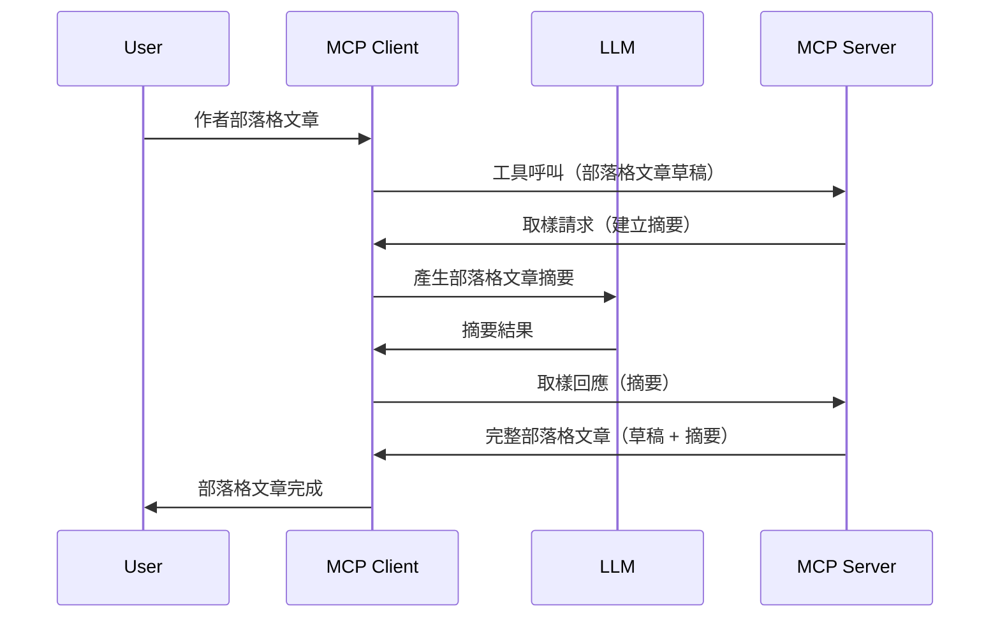

# 取樣 - 將功能委派給 Client

> **停用通知：** `2026-07-28` MCP 規格候選版本標記取樣為棄用，建議改為直接整合 LLM 供應商 API。取樣在 `2025-11-25` 版本及任何正式棄用後至少一年內仍然可用，因此本課程內容仍有效 — 但新的伺服器設計應評估替代方案。詳見 [MCP 的變更內容：2026-07-28 發行候選版本](../../01-CoreConcepts/mcp-2026-07-28-release-candidate.md)。

有時候，你需要 MCP Client 與 MCP Server 協作以達成共同目標。你可能會遇到伺服器需要遍及在客戶端的 LLM 幫助的情況。這時，取樣是你應該使用的功能。

讓我們來探討一些使用案例，以及如何建立一個包含取樣的解決方案。

## 概述

在本課程中，我們將重點說明何時何地使用取樣，以及如何配置它。

## 學習目標

在本章中，我們將：

- 解釋什麼是取樣以及何時使用它。
- 示範如何在 MCP 中配置取樣。
- 提供取樣應用的範例。

## 什麼是取樣及為何使用它？

取樣是一個進階功能，其運作方式如下：



### 取樣請求

好的，現在我們對一個可信的場景有了高層次的了解，接下來談談伺服器發送回客戶端的取樣請求。以下是此類請求的 JSON-RPC 格式示例：

```json
{
  "jsonrpc": "2.0",
  "id": 1,
  "method": "sampling/createMessage",
  "params": {
    "messages": [
      {
        "role": "user",
        "content": {
          "type": "text",
          "text": "Create a blog post summary of the following blog post: <BLOG POST>"
        }
      }
    ],
    "modelPreferences": {
      "hints": [
        {
          "name": "claude-3-sonnet"
        }
      ],
      "intelligencePriority": 0.8,
      "speedPriority": 0.5
    },
    "systemPrompt": "You are a helpful assistant.",
    "maxTokens": 100
  }
}
```

這裡有幾點值得說明：

- 在 content -> text 底下的 Prompt，就是我們給 LLM 的指令，讓它來摘要部落格文章內容。

- **modelPreferences**。此部分就是偏好設定，是對該 LLM 應使用何種配置的建議。用戶可選擇接受這些建議或修改它們。本例中對應使用的模型、速度以及智能優先順序都有建議。
- **systemPrompt**，這是你的正常系統提示，賦予 LLM 個性並包含指導指令。
- **maxTokens**，這是另一個屬性，用來指明這個任務建議使用多少令牌數。

### 取樣回應

此回應是 MCP Client 最終發送回 MCP Server 的訊息，為客戶端呼叫 LLM、等待回應後組成。以下是其 JSON-RPC 格式示例：

```json
{
  "jsonrpc": "2.0",
  "id": 1,
  "result": {
    "role": "assistant",
    "content": {
      "type": "text",
      "text": "Here's your abstract <ABSTRACT>"
    },
    "model": "gpt-5",
    "stopReason": "endTurn"
  }
}
```

請注意，回應是我們要求的部落格文章摘要。另外注意，實際使用的 `model` 不是我們請求的，而是 "gpt-5" 取代了 "claude-3-sonnet"。這說明用戶可以改變使用的模型，代表取樣請求只是建議。

好的，既然了解主要流程及有用的任務場景：「部落格文章創作 + 摘要」，接下來看看如何實作它。

### 訊息類型

取樣訊息不僅限於文字，也能傳送圖片和音訊。以下是 JSON-RPC 格式的差異示例：

<strong>文字</strong>

```json
{
  "type": "text",
  "text": "The message content"
}
```

<strong>圖片內容</strong>

```json
{
  "type": "image",
  "data": "base64-encoded-image-data",
  "mimeType": "image/jpeg"
}
```

<strong>音訊內容</strong>

```json
{
  "type": "audio",
  "data": "base64-encoded-audio-data",
  "mimeType": "audio/wav"
}
```

> 注意：更多取樣詳細資訊請參考[官方文件](https://modelcontextprotocol.io/specification/2025-11-25/client/sampling)

## 如何在 Client 配置取樣

> 注意：如果你僅在建構伺服器，這部分不需做太多設定。

在 Client 端，你需要如此指定此功能：

```json
{
  "capabilities": {
    "sampling": {}
  }
}
```

在你選擇的 Client 初始化與伺服器連線時，它就會被接收。

## 取樣實作範例 - 創作一篇部落格文章

我們一起來編寫一個取樣伺服器，需完成以下步驟：

1. 在伺服器端建立一個工具。
1. 該工具應建立取樣請求。
1. 工具應等待客戶端對取樣請求的回應。
1. 然後產生工具結果。

我們逐步看以下程式碼：

### -1- 建立工具

**python**

```python
@mcp.tool()
async def create_blog(title: str, content: str, ctx: Context[ServerSession, None]) -> str:
    """Create a blog post and generate a summary"""

```

### -2- 建立取樣請求

在你的工具中追加如下程式碼：

**python**

```python
post = BlogPost(
        id=len(posts) + 1,
        title=title,
        content=content,
        abstract=""
    )

prompt = f"Create an abstract of the following blog post: title: {title} and draft: {content} "

result = await ctx.session.create_message(
        messages=[
            SamplingMessage(
                role="user",
                content=TextContent(type="text", text=prompt),
            )
        ],
        max_tokens=100,
)

```

### -3- 等待回應並返回結果

**python**

```python
post.abstract = result.content.text

posts.append(post)

# 返回完整的產品
return json.dumps({
    "id": post.title,
    "abstract": post.abstract
})
```

### -4- 完整程式碼

**python**

```python
from starlette.applications import Starlette
from starlette.routing import Mount, Host

from mcp.server.fastmcp import Context, FastMCP

from mcp.server.session import ServerSession
from mcp.types import SamplingMessage, TextContent

import json


from uuid import uuid4
from typing import List
from pydantic import BaseModel


mcp = FastMCP("Blog post generator")

# app = FastAPI()

posts = []

class BlogPost(BaseModel):
    id: int
    title: str
    content: str
    abstract: str

posts: List[BlogPost] = []

@mcp.tool()
async def create_blog(title: str, content: str, ctx: Context[ServerSession, None]) -> str:
    """Create a blog post and generate a summary"""

    post = BlogPost(
        id=len(posts) + 1,
        title=title,
        content=content,
        abstract=""
    )

    prompt = f"Create an abstract of the following blog post: title: {title} and draft: {content} "

    result = await ctx.session.create_message(
        messages=[
            SamplingMessage(
                role="user",
                content=TextContent(type="text", text=prompt),
            )
        ],
        max_tokens=100,
    )

    post.abstract = result.content.text

    posts.append(post)

    # 回傳完整的部落格文章
    return json.dumps({
        "id": post.title,
        "abstract": post.abstract
    })

if __name__ == "__main__":
    print("Starting server...")
    # mcp.run()
    mcp.run(transport="streamable-http")

# 使用以下指令執行應用程式: python server.py
```

### -5- 在 Visual Studio Code 中測試

要在 Visual Studio Code 中進行測試，請執行以下步驟：

1. 在終端機啟動伺服器
1. 把它加到 *mcp.json* （並確保已啟動），例如這樣：

   ```json
   "servers": {
      "blog-server": {
        "type": "http",
        "url": "http://localhost:8000/mcp"
      }
   }
   ```

1. 輸入提示語：

   ```text
   create a blog post named "Where Python comes from", the content is "Python is actually named after Monty Python Flying Circus"
   ```

1. 允許取樣執行。第一次測試會出現一個額外對話框，你需要接受，然後會看到正常的要求執行工具對話框。

1. 檢視結果。你會在 GitHub Copilot Chat 以漂亮版面看到結果，也可以查看原始 JSON 回應。

<strong>額外資訊</strong>。Visual Studio Code 工具有很好的取樣支援。你可以透過以下步驟在已安裝的伺服器中配置取樣存取：

1. 進入擴充功能區。
1. 在「MCP SERVERS - INSTALLED」區段中，選擇已安裝伺服器的齒輪圖示。
1 選擇「Configure Model Access」，在此可設定 GitHub Copilot 在執行取樣時允許使用哪些模型。也可以透過「Show Sampling requests」查看最近所有取樣請求。

## 作業

在此作業中，你將建構一個略有不同的取樣整合，支援生成產品描述。以下是你的情境：

<strong>情境</strong>：電商後台工作人員需要幫助，生成產品描述耗費太多時間。因此，你將建立一套解決方案，可呼叫名為 "create_product" 的工具，帶入 "title" 和 "keywords" 作為參數，並應由客戶端 LLM 填充完整產品，包括 "description" 欄位。

提示：利用之前學到的內容，使用取樣請求構建此伺服器及其工具。

## 解答

[解答](./solution/README.md)

## 主要重點

取樣是功能強大的特性，可讓伺服器在需要 LLM 協助時，委派任務給客戶端。

## 下一步

- [第四章 - 實作練習](../../04-PracticalImplementation/README.md)

---

<!-- CO-OP TRANSLATOR DISCLAIMER START -->
**免責聲明**：
此文件已使用 AI 翻譯服務 [Co-op Translator](https://github.com/Azure/co-op-translator) 進行翻譯。雖然我們努力追求準確性，但請注意自動翻譯可能包含錯誤或不準確之處。原始文件的母語版本應視為權威來源。對於關鍵資訊，建議採用專業人工翻譯。我們不對因使用此翻譯所產生的任何誤解或誤譯承擔責任。
<!-- CO-OP TRANSLATOR DISCLAIMER END -->