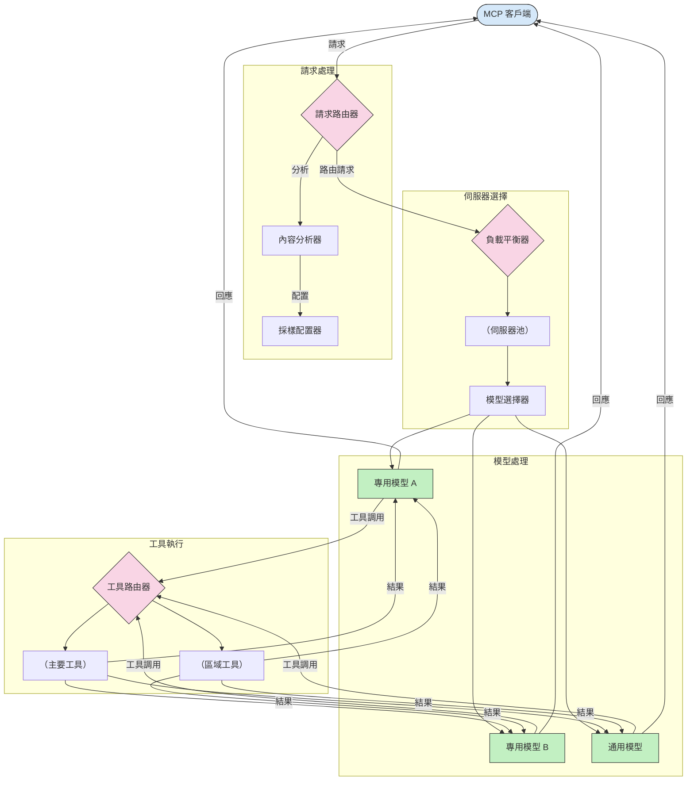

# 模型上下文協議中的路由

路由對於在MCP生態系統內將請求導向適當的模型、工具或服務至關重要。

## 介紹

模型上下文協議（MCP）中的路由涉及根據內容類型、使用者上下文和系統負載等各種標準，將請求導向最合適的模型或服務。這確保了高效的處理和最佳的資源利用。

## 學習目標

完成本課程後，您將能夠：

- 理解MCP中路由的原則。
- 實作基於內容的路由以將請求導向專門服務。
- 應用智慧負載均衡策略以優化資源使用。
- 根據請求上下文實作動態工具路由。

## 基於內容的路由

基於內容的路由會根據請求內容，將請求導向專門的服務。例如，與程式碼生成相關的請求可以路由至專門的程式碼模型，而創意寫作請求則可以寄送到創意寫作模型。

我們來看在不同程式語言中的範例實作。

<details>
<summary>.NET</summary>

```csharp
// .NET Example: Content-based routing in MCP
public class ContentBasedRouter
{
    private readonly Dictionary<string, McpClient> _specializedClients;
    private readonly RoutingClassifier _classifier;
    
    public ContentBasedRouter()
    {
        // Initialize specialized clients for different domains
        _specializedClients = new Dictionary<string, McpClient>
        {
            ["code"] = new McpClient("https://code-specialized-mcp.com"),
            ["creative"] = new McpClient("https://creative-specialized-mcp.com"),
            ["scientific"] = new McpClient("https://scientific-specialized-mcp.com"),
            ["general"] = new McpClient("https://general-mcp.com")
        };
        
        // Initialize content classifier
        _classifier = new RoutingClassifier();
    }
    
    public async Task<McpResponse> RouteAndProcessAsync(string prompt, IDictionary<string, object> parameters = null)
    {
        // Classify the prompt to determine the best specialized service
        string category = await _classifier.ClassifyPromptAsync(prompt);
        
        // Get the appropriate client or fall back to general
        var client = _specializedClients.ContainsKey(category) 
            ? _specializedClients[category] 
            : _specializedClients["general"];
            
        Console.WriteLine($"Routing request to {category} specialized service");
        
        // Send request to the selected service
        return await client.SendPromptAsync(prompt, parameters);
    }
    
    // Simple classifier for routing decisions
    private class RoutingClassifier
    {
        public Task<string> ClassifyPromptAsync(string prompt)
        {
            prompt = prompt.ToLowerInvariant();
            
            if (prompt.Contains("code") || prompt.Contains("function") || 
                prompt.Contains("program") || prompt.Contains("algorithm"))
            {
                return Task.FromResult("code");
            }
            
            if (prompt.Contains("story") || prompt.Contains("creative") || 
                prompt.Contains("imagine") || prompt.Contains("design"))
            {
                return Task.FromResult("creative");
            }
            
            if (prompt.Contains("science") || prompt.Contains("research") || 
                prompt.Contains("analyze") || prompt.Contains("study"))
            {
                return Task.FromResult("scientific");
            }
            
            return Task.FromResult("general");
        }
    }
}
```

在上述代碼中，我們：

- 建立了一個 `ContentBasedRouter` 類別，根據提示的內容路由請求。
- 初始化了不同領域（程式碼、創意、科學、通用）的專門用戶端。
- 實作了一個簡單的分類器，用於判斷提示的類別並將其路由到相應的專門服務。
- 使用了回退機制，當沒有專門服務可用時，將請求路由到通用服務。
- 實作非同步處理以有效處理請求。
- 使用字典將內容類別映射到專門的MCP用戶端。
- 實作簡單分類器分析提示並返回相應類別。
- 使用專門用戶端發送請求並接收回應。
- 處理提示不符合任何專門類別的情況，將其路由到通用服務。

</details>

## 智慧負載均衡

負載均衡優化資源利用，確保MCP服務的高可用性。負載均衡可透過多種方式實作，如輪詢、加權回應時間或基於內容的策略。

以下範例實作採用了以下策略：

- <strong>輪詢</strong>：均勻分配請求至可用伺服器。
- <strong>加權回應時間</strong>：根據伺服器平均回應時間路由請求。
- <strong>內容感知</strong>：根據請求內容路由至專門伺服器。

<details>
<summary>Java</summary>

```java
// Java 範例：MCP 伺服器的智能負載均衡
public class McpLoadBalancer {
    private final List<McpServerNode> serverNodes;
    private final LoadBalancingStrategy strategy;
    
    public McpLoadBalancer(List<McpServerNode> nodes, LoadBalancingStrategy strategy) {
        this.serverNodes = new ArrayList<>(nodes);
        this.strategy = strategy;
    }
    
    public McpResponse processRequest(McpRequest request) {
        // 根據策略選擇最佳伺服器
        McpServerNode selectedNode = strategy.selectNode(serverNodes, request);
        
        try {
            // 將請求路由到選定的節點
            return selectedNode.processRequest(request);
        } catch (Exception e) {
            // 處理失敗 - 實現重試或備援邏輯
            System.err.println("Error processing request on node " + selectedNode.getId() + ": " + e.getMessage());
            
            // 標記節點為可能不健康
            selectedNode.recordFailure();
            
            // 嘗試下一個最佳節點作為備援
            List<McpServerNode> remainingNodes = new ArrayList<>(serverNodes);
            remainingNodes.remove(selectedNode);
            
            if (!remainingNodes.isEmpty()) {
                McpServerNode fallbackNode = strategy.selectNode(remainingNodes, request);
                return fallbackNode.processRequest(request);
            } else {
                throw new RuntimeException("All MCP server nodes failed to process the request");
            }
        }
    }
    
    // 節點健康檢查任務
    public void startHealthChecks(Duration interval) {
        ScheduledExecutorService scheduler = Executors.newScheduledThreadPool(1);
        scheduler.scheduleAtFixedRate(() -> {
            for (McpServerNode node : serverNodes) {
                try {
                    boolean isHealthy = node.checkHealth();
                    System.out.println("Node " + node.getId() + " health status: " + 
                                      (isHealthy ? "HEALTHY" : "UNHEALTHY"));
                } catch (Exception e) {
                    System.err.println("Health check failed for node " + node.getId());
                    node.setHealthy(false);
                }
            }
        }, 0, interval.toMillis(), TimeUnit.MILLISECONDS);
    }
    
    // 負載均衡策略介面
    public interface LoadBalancingStrategy {
        McpServerNode selectNode(List<McpServerNode> nodes, McpRequest request);
    }
    
    // 輪詢策略
    public static class RoundRobinStrategy implements LoadBalancingStrategy {
        private AtomicInteger counter = new AtomicInteger(0);
        
        @Override
        public McpServerNode selectNode(List<McpServerNode> nodes, McpRequest request) {
            List<McpServerNode> healthyNodes = nodes.stream()
                .filter(McpServerNode::isHealthy)
                .collect(Collectors.toList());
            
            if (healthyNodes.isEmpty()) {
                throw new RuntimeException("No healthy nodes available");
            }
            
            int index = counter.getAndIncrement() % healthyNodes.size();
            return healthyNodes.get(index);
        }
    }
    
    // 加權響應時間策略
    public static class ResponseTimeStrategy implements LoadBalancingStrategy {
        @Override
        public McpServerNode selectNode(List<McpServerNode> nodes, McpRequest request) {
            return nodes.stream()
                .filter(McpServerNode::isHealthy)
                .min(Comparator.comparing(McpServerNode::getAverageResponseTime))
                .orElseThrow(() -> new RuntimeException("No healthy nodes available"));
        }
    }
    
    // 內容感知策略
    public static class ContentAwareStrategy implements LoadBalancingStrategy {
        @Override
        public McpServerNode selectNode(List<McpServerNode> nodes, McpRequest request) {
            // 判斷請求特性
            boolean isCodeRequest = request.getPrompt().contains("code") || 
                                   request.getAllowedTools().contains("codeInterpreter");
            
            boolean isCreativeRequest = request.getPrompt().contains("creative") || 
                                       request.getPrompt().contains("story");
            
            // 尋找專用節點
            Optional<McpServerNode> specializedNode = nodes.stream()
                .filter(McpServerNode::isHealthy)
                .filter(node -> {
                    if (isCodeRequest && node.getSpecialization().equals("code")) {
                        return true;
                    }
                    if (isCreativeRequest && node.getSpecialization().equals("creative")) {
                        return true;
                    }
                    return false;
                })
                .findFirst();
            
            // 返回專用節點或負載最小節點
            return specializedNode.orElse(
                nodes.stream()
                    .filter(McpServerNode::isHealthy)
                    .min(Comparator.comparing(McpServerNode::getCurrentLoad))
                    .orElseThrow(() -> new RuntimeException("No healthy nodes available"))
            );
        }
    }
}
```

在上述代碼中，我們：

- 建立一個 `McpLoadBalancer` 類別，管理MCP伺服器節點列表並根據所選負載均衡策略路由請求。
- 實作不同的負載均衡策略：`RoundRobinStrategy`、`ResponseTimeStrategy` 和 `ContentAwareStrategy`。
- 使用 `ScheduledExecutorService` 週期性地檢查伺服器節點健康狀態。
- 實作健康檢查機制，根據節點對健康檢查的回應標記節點為健康或不健康。
- 處理請求並搭配錯誤處理及回退邏輯以確保高可用性。
- 使用 `McpServerNode` 類別表示個別MCP伺服器節點，包括健康狀態、平均回應時間及當前負載。
- 實作 `McpRequest` 類別封裝請求細節，如提示和允許使用的工具。
- 使用Java Streams過濾並選擇基於健康狀態和專門化的節點。

</details>

## 動態工具路由

工具路由確保工具呼叫根據上下文導向最合適的服務。例如，天氣工具的呼叫可能需要根據使用者所在地區路由到區域端點，或者計算器工具可能需要使用特定版本的API。

我們來看一個基於請求分析、區域端點和版本支援示範動態工具路由的實作範例。

<details>
<summary>Python</summary>

```python
# Python 範例：基於請求分析的動態工具路由
class McpToolRouter:
    def __init__(self):
        # 註冊可用的工具端點
        self.tool_endpoints = {
            "weatherTool": "https://weather-service.example.com/api",
            "calculatorTool": "https://calculator-service.example.com/compute",
            "databaseTool": "https://database-service.example.com/query",
            "searchTool": "https://search-service.example.com/search"
        }
        
        # 全球分佈的區域端點
        self.regional_endpoints = {
            "us": {
                "weatherTool": "https://us-west.weather-service.example.com/api",
                "searchTool": "https://us.search-service.example.com/search"
            },
            "europe": {
                "weatherTool": "https://eu.weather-service.example.com/api",
                "searchTool": "https://eu.search-service.example.com/search"
            },
            "asia": {
                "weatherTool": "https://asia.weather-service.example.com/api",
                "searchTool": "https://asia.search-service.example.com/search"
            }
        }
        
        # 工具版本支援
        self.tool_versions = {
            "weatherTool": {
                "default": "v2",
                "v1": "https://weather-service.example.com/api/v1",
                "v2": "https://weather-service.example.com/api/v2",
                "beta": "https://weather-service.example.com/api/beta"
            }
        }
    
    async def route_tool_request(self, tool_name, parameters, user_context=None):
        """Route a tool request to the appropriate endpoint based on context"""
        endpoint = self._select_endpoint(tool_name, parameters, user_context)
        
        if not endpoint:
            raise ValueError(f"No endpoint available for tool: {tool_name}")
        
        # 執行對選定端點的實際請求
        return await self._execute_tool_request(endpoint, tool_name, parameters)
    
    def _select_endpoint(self, tool_name, parameters, user_context=None):
        """Select the most appropriate endpoint based on context"""
        # 來自註冊表的基礎端點
        if tool_name not in self.tool_endpoints:
            return None
            
        base_endpoint = self.tool_endpoints[tool_name]
        
        # 檢查是否需要使用特定的工具版本
        if tool_name in self.tool_versions:
            version_info = self.tool_versions[tool_name]
            
            # 使用指定版本或預設版本
            requested_version = parameters.get("_version", version_info["default"])
            if requested_version in version_info:
                base_endpoint = version_info[requested_version]
        
        # 如果已知使用者區域，檢查區域路由
        if user_context and "region" in user_context:
            user_region = user_context["region"]
            
            if user_region in self.regional_endpoints:
                regional_tools = self.regional_endpoints[user_region]
                
                if tool_name in regional_tools:
                    # 使用區域特定端點
                    return regional_tools[tool_name]
        
        # 檢查資料駐留要求
        if user_context and "data_residency" in user_context:
            # 此處會實作確保資料留在指定司法管轄區的邏輯
            pass
        
        # 檢查基於延遲的路由
        if user_context and "latency_sensitive" in user_context and user_context["latency_sensitive"]:
            # 此處會實作選擇最低延遲端點的邏輯
            pass
            
        return base_endpoint
        
    async def _execute_tool_request(self, endpoint, tool_name, parameters):
        """Execute the actual tool request to the selected endpoint"""
        try:
            async with aiohttp.ClientSession() as session:
                async with session.post(
                    endpoint,
                    json={"toolName": tool_name, "parameters": parameters},
                    headers={"Content-Type": "application/json"}
                ) as response:
                    if response.status == 200:
                        result = await response.json()
                        return result
                    else:
                        error_text = await response.text()
                        raise Exception(f"Tool execution failed: {error_text}")
        except Exception as e:
            # 實作重試邏輯或備援策略
            print(f"Error executing tool {tool_name} at {endpoint}: {str(e)}")
            raise
```

在上述代碼中，我們：

- 建立 `McpToolRouter` 類別，根據請求分析、區域端點和版本支援管理工具路由。
- 註冊可用的工具端點與全球分佈的區域端點。
- 實作動態路由邏輯，根據使用者上下文（如區域和資料所在地要求）選擇合適端點。
- 實作工具版本支援，允許使用者指定想使用的工具版本。
- 使用非同步HTTP請求執行工具呼叫並處理回應。

</details>

## MCP中的抽樣與路由架構

抽樣是模型上下文協議（MCP）中的關鍵元件，允許高效處理和路由請求。它涉及分析進入的請求，以根據內容類型、使用者上下文及系統負載等多種標準，決定最適合的模型或服務來處理。

抽樣與路由可以結合形成穩健的架構，優化資源利用並確保高可用性。抽樣過程用於分類請求，而路由則將請求導向適當的模型或服務。

下圖說明了抽樣與路由如何在完整的MCP架構中協同作業：



## 接下來的內容

- [5.6 抽樣](../mcp-sampling/README.md)

---

<!-- CO-OP TRANSLATOR DISCLAIMER START -->
**免責聲明**：
此文件已使用 AI 翻譯服務 [Co-op Translator](https://github.com/Azure/co-op-translator) 進行翻譯。雖然我們努力追求準確性，但請注意自動翻譯可能包含錯誤或不準確之處。原始文件的母語版本應視為權威來源。對於關鍵資訊，建議採用專業人工翻譯。我們不對因使用此翻譯所產生的任何誤解或誤譯承擔責任。
<!-- CO-OP TRANSLATOR DISCLAIMER END -->