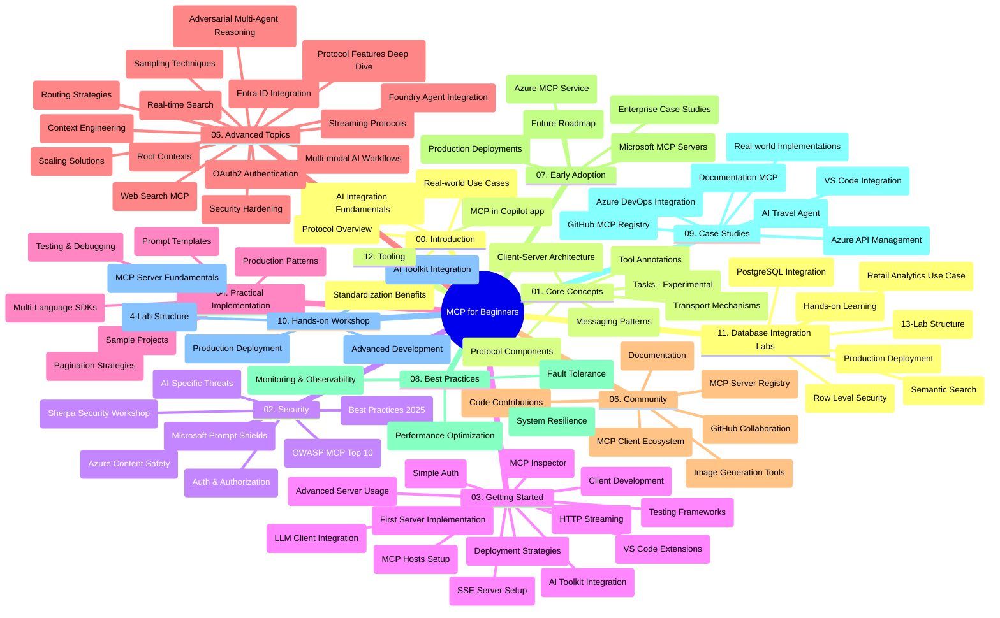

# 初學者使用的模型上下文協議（MCP）- 學習指南

本學習指南概述了「模型上下文協議（MCP）初學者課程」的程式庫結構及內容。請使用此指南有效導覽程式庫，充分利用可用資源。

## 程式庫總覽

模型上下文協議（MCP）是 AI 模型與客戶端應用的互動標準化框架。最初由 Anthropic 建立，現由更廣泛的 MCP 社群透過官方 GitHub 組織維護。本程式庫提供完整課程，包含 C#、Java、JavaScript、Python 和 TypeScript 的實作範例，適合 AI 開發者、系統架構師及軟體工程師。

## 課程視覺導圖

## 程式庫結構

程式庫分為十二大部分，分別聚焦 MCP 的不同面向：

1. **簡介 (00-Introduction/)**
   - 模型上下文協議概述
   - AI 管線中標準化的重要性
   - 實際應用場景與效益

2. **核心概念 (01-CoreConcepts/)**
   - 客戶端-伺服器架構
   - 關鍵協議元件
   - MCP 中的訊息模式
   - 前瞻性內容：[MCP 的變更：2026-07-28 發行候選版](./01-CoreConcepts/mcp-2026-07-28-release-candidate.md) — 無狀態協議核心、擴展框架、以及預計於下一版規範中移除的根/採樣/日誌功能

3. **安全性 (02-Security/)**
   - MCP 系統的安全威脅
   - 安全實踐最佳方法
   - 身份驗證與授權策略
   - <strong>完整安全文件</strong>：
     - MCP 安全最佳實務 2025
     - Azure 內容安全實作指南
     - MCP 安全控管與技術
     - MCP 最佳實務速查
   - <strong>重要安全議題</strong>：
     - 提示注入與工具中毒攻擊
     - 會話劫持與受困代理問題
     - 令牌通過漏洞
     - 過度權限與存取控制
     - AI 元件供應鏈安全
     - Microsoft 提示防護整合

4. **入門指南 (03-GettingStarted/)**
   - 環境設定與配置
   - 建立基礎 MCP 伺服器與客戶端
   - 與現有應用整合
   - 包含以下章節：
     - 第一個伺服器實作
     - 客戶端開發
     - 大型語言模型客戶端整合
     - VS Code 整合
     - 伺服器推送事件 (SSE) 伺服器
     - 進階伺服器使用
     - HTTP 串流
     - AI 工具箱整合
     - 測試策略
     - 部署指南

5. **實作指南 (04-PracticalImplementation/)**
   - 跨程式語言 SDK 使用
   - 偵錯、測試與驗證技巧
   - 設計可重複使用的提示範本與工作流程
   - 實作範例專案

6. **進階主題 (05-AdvancedTopics/)**
   - 上下文工程技術
   - Foundry 代理整合
   - 多模態 AI 工作流程
   - OAuth2 驗證展示
   - 即時搜尋功能
   - 即時串流
   - 根上下文實作
   - 路由策略
   - 採樣技巧
   - 擴展方法
   - 安全性考量
   - Entra ID 安全整合
   - 網頁搜尋整合
   - 逆向多代理推理（辯論模式）

7. **社群貢獻 (06-CommunityContributions/)**
   - 如何貢獻程式碼與文件
   - 透過 GitHub 協作
   - 社群驅動的強化與回饋
   - 使用多種 MCP 客戶端（Claude 桌面版、Cline、VSCode）
   - 搭配熱門 MCP 伺服器，包括影像生成

8. **早期採用經驗分享 (07-LessonsfromEarlyAdoption/)**
   - 實務案例與成功故事
   - MCP 解決方案建置與部署
   - 趨勢與未來路線圖
   - **Microsoft MCP 伺服器指南**：包含 10 個生產級 Microsoft MCP 伺服器的完整指南：
     - Microsoft Learn Docs MCP 伺服器
     - Azure MCP 伺服器（超過 15 個專門連接器）
     - GitHub MCP 伺服器
     - Azure DevOps MCP 伺服器
     - MarkItDown MCP 伺服器
     - SQL Server MCP 伺服器
     - Playwright MCP 伺服器
     - Dev Box MCP 伺服器
     - Microsoft Foundry MCP 伺服器
     - Microsoft 365 Agents Toolkit MCP 伺服器

9. **最佳實務 (08-BestPractices/)**
   - 效能調校與優化
   - 設計容錯 MCP 系統
   - 測試與韌性策略

10. **案例研究 (09-CaseStudy/)**
    - <strong>七個完整案例研究</strong> 展示 MCP 在多元場景的應用彈性：
    - **Azure AI 旅遊代理人**：使用 Azure OpenAI 與 AI 搜尋的多代理協作
    - **Azure DevOps 整合**：利用 YouTube 數據更新自動化工作流程
    - <strong>即時文件檢索</strong>：使用 Python 主控台客戶端與串流 HTTP
    - <strong>互動式學習計畫產生器</strong>：Chainlit 網頁應用結合對話式 AI
    - <strong>程式碼編輯器內文件</strong>：VS Code 與 GitHub Copilot 工作流程整合
    - **Azure API 管理**：企業 API 整合與 MCP 伺服器建置
    - **GitHub MCP 登錄中心**：生態系統開發與代理人整合平台
    - 實作範例涵蓋企業整合、開發者生產力與生態系統發展

11. **實作工作坊 (10-StreamliningAIWorkflowsBuildingAnMCPServerWithAIToolkit/)**
    - 結合 MCP 與 AI 工具箱的完整實作工作坊
    - 建構連結 AI 模型與實務工具的智慧應用
    - 實用模組涵蓋基礎、自訂伺服器開發與生產部署策略
    - <strong>實驗室結構</strong>：
      - 實驗室 1：MCP 伺服器基礎
      - 實驗室 2：進階 MCP 伺服器開發
      - 實驗室 3：AI 工具箱整合
      - 實驗室 4：生產部署與擴展
    - 實驗室導向的學習方式，逐步指導

12. **MCP 伺服器資料庫整合實驗室 (11-MCPServerHandsOnLabs/)**
    - **包含 13 個實驗室的全面學習路徑**，針對整合 PostgreSQL 建置生產級 MCP 伺服器
    - <strong>真實零售分析案例</strong>，使用 Zava Retail 使用案例
    - <strong>企業級模式</strong> 包括行級安全（RLS）、語意搜尋與多租戶資料存取
    - <strong>完整實驗室架構</strong>：
      - **實驗室 00-03：基礎** - 簡介、架構、安全、環境建置
      - **實驗室 04-06：MCP 伺服器建置** - 資料庫設計、MCP 伺服器實作、工具開發
      - **實驗室 07-09：進階功能** - 語意搜尋、測試與除錯、VS Code 整合
      - **實驗室 10-12：生產與最佳實務** - 部署、監控、優化
    - <strong>涵蓋技術</strong>：FastMCP 框架、PostgreSQL、Azure OpenAI、Azure Container Apps、Application Insights
    - <strong>學習成果</strong>：生產級 MCP 伺服器、資料庫整合模式、AI 助力分析、企業安全

13. **工具 (12-tooling/)**
    - 學習如何在 Copilot 應用程式與其他工具中使用 MCP

## 額外資源

程式庫包含輔助資源：

- **Images 資料夾**：包含課程中使用的圖表與插圖
- <strong>翻譯</strong>：多語言支援，包含文件的自動翻譯
- **官方 MCP 資源**：
  - [MCP 文件](https://modelcontextprotocol.io/)
  - [MCP 規範](https://spec.modelcontextprotocol.io/)
  - [MCP GitHub 程式庫](https://github.com/modelcontextprotocol)

## 如何使用此程式庫

1. <strong>循序學習</strong>：依序閱讀章節（00 至 11），以結構化方式學習。
2. <strong>語言專注</strong>：若對特定程式語言有興趣，請探索相應範例目錄中的實作。
3. <strong>實務入門</strong>：從「入門指南」開始，設定開發環境並建置第一個 MCP 伺服器與客戶端。
4. <strong>進階探索</strong>：熟悉基礎後，深入進階主題擴展知識。
5. <strong>社群參與</strong>：透過 GitHub 討論與 Discord 頻道加入 MCP 社群，連結專家與開發者。

## MCP 客戶端與工具

課程涵蓋多種 MCP 客戶端與工具：

1. <strong>官方客戶端</strong>：
   - Visual Studio Code
   - Visual Studio Code 中的 MCP
   - Claude 桌面版
   - VSCode 中的 Claude
   - Claude API

2. <strong>社群客戶端</strong>：
   - Cline（終端機式）
   - Cursor（程式碼編輯器）
   - ChatMCP
   - Windsurf

3. **MCP 管理工具**：
   - MCP CLI
   - MCP Manager
   - MCP Linker
   - MCP Router

## 受歡迎的 MCP 伺服器

程式庫介紹多種 MCP 伺服器，包括：

1. **微軟官方 MCP 伺服器**：
   - Microsoft Learn Docs MCP 伺服器
   - Azure MCP 伺服器（超過 15 個專門連接器）
   - GitHub MCP 伺服器
   - Azure DevOps MCP 伺服器
   - MarkItDown MCP 伺服器
   - SQL Server MCP 伺服器
   - Playwright MCP 伺服器
   - Dev Box MCP 伺服器
   - Microsoft Foundry MCP 伺服器
   - Microsoft 365 Agents Toolkit MCP 伺服器

2. <strong>官方參考伺服器</strong>：
   - 檔案系統
   - 抓取
   - 記憶體
   - 順序思考

3. <strong>影像生成</strong>：
   - Azure OpenAI DALL-E 3
   - Stable Diffusion WebUI
   - Replicate

4. <strong>開發工具</strong>：
   - Git MCP
   - 終端機控制
   - 程式碼助理

5. <strong>專門伺服器</strong>：
   - Salesforce
   - Microsoft Teams
   - Jira 與 Confluence

## 貢獻

本程式庫歡迎社群貢獻。請參閱社群貢獻章節，了解如何有效參與 MCP 生態系。

----

*本學習指南最後更新於 2026 年 2 月 5 日，反映最新 MCP 規範 2025-11-25，並概述該日期的程式庫內容。後續內容可能持續更新。*

*附錄（2026 年 7 月 2 日）：新增一堂關於 `2026-07-28` MCP 規範發行候選版本的課程，位於 [01-CoreConcepts](./01-CoreConcepts/mcp-2026-07-28-release-candidate.md)；課程基準仍維持在 2025-11-25 規範，直到新規範正式發布。*

---

<!-- CO-OP TRANSLATOR DISCLAIMER START -->
**免責聲明**：
此文件已使用 AI 翻譯服務 [Co-op Translator](https://github.com/Azure/co-op-translator) 進行翻譯。雖然我們努力追求準確性，但請注意自動翻譯可能包含錯誤或不準確之處。原始文件的母語版本應視為權威來源。對於關鍵資訊，建議採用專業人工翻譯。我們不對因使用此翻譯所產生的任何誤解或誤譯承擔責任。
<!-- CO-OP TRANSLATOR DISCLAIMER END -->